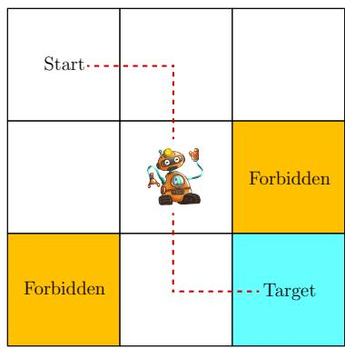
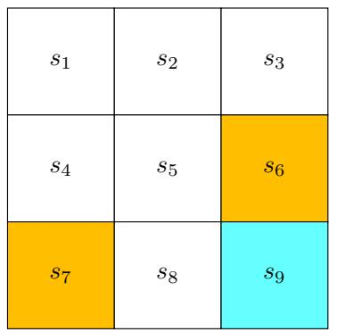
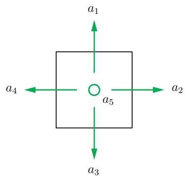
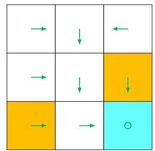
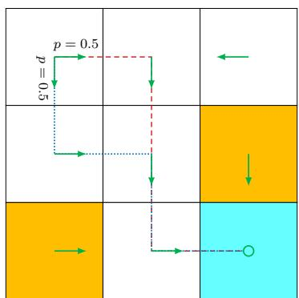
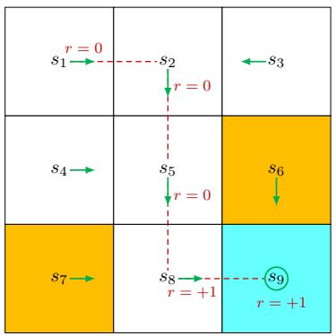
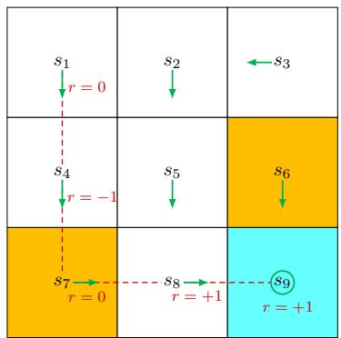
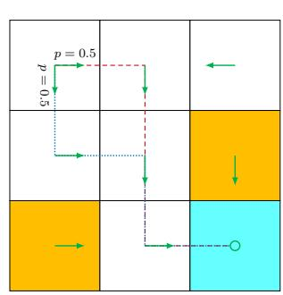

# 第 1 章 基本概念（Basic Concepts）— 初学者详解

> 原书 p14–26 · 学习日期 2026-05-29 · 涵盖 1.1–1.9

## 本章在全书的位置（先读这段）

这一章**不解任何问题、不讲任何算法**。它唯一的任务是：把"强化学习"这件模糊的事，
翻译成一套**精确、无歧义的数学语言**。打个比方——后面九章是用这套语言写的"文章"，
这一章就是"字母表 + 语法"。所以本章的学习目标不是"学会做题"，而是**把符号记牢、
把每个符号背后的直觉建立起来**。九章里反复出现的 $s,a,r,\pi,p,\gamma$ 全在这里定义。

全章用同一个玩具例子贯穿：**网格世界（grid world）**。所有抽象概念都先在这个小例子上
"摸得见"，再上升成一般定义。

本章有两条**暗线**，看懂它们就抓住了精髓：

1. **「表格 → 条件概率」的升级**：转移、奖励、策略，一开始都先用直观的表格描述，
   然后立刻指出"表格只能表达确定性情形，一般情况必须用条件概率"。这个升级动作出现了三次。
2. **「即时奖励 ≠ 长期回报」**：强化学习追求的是长远的总回报，不是眼前一步的奖励。
   这是它区别于"贪心选最大奖励"的根本，第 1.5、1.6 节反复强调。

---

## 1.1 网格世界：先把舞台和目标说清楚

想象一个 3×3 的格子世界，一个机器人（叫**智能体 agent**）在里面走，每个时刻只能待在
一个格子里。格子分三类：白色可走、橙色是**禁区（forbidden）**、还有一个**目标格（target）**。



> **原书图 1.2**：网格世界示例，全书反复用它。白格可走、橙格是禁区、绿格是目标。

九个格子按"从左到右、从上到下"编号（这个排法不是我猜的，是从后面 1.3 的状态转移表反推出来的：
表里 $s_1$ 向下走到 $s_4$、$s_4$ 向下走到 $s_7$，说明是一行一行往下排）：

```
s1  s2  s3
s4  s5  s6
s7  s8  s9
```

而具体哪些是禁区、哪个是目标，可以从 1.5 的奖励表（Table 1.3）严格读出来：凡是"走进某格"
会拿到"禁区惩罚"的，那格就是禁区；拿到"目标奖励"的就是目标。结论是本章这一版的配置为：

```
s1   s2   s3
s4   s5   s6(禁区)
s7(禁区) s8  s9(目标)
```

**智能体的终极目标**：找一个"好"的**策略（policy）**，使它从**任意**起点出发都能到达目标格，
而且一路上不撞墙、不进禁区、不绕远路。

⚠️ **这一节最关键的一句话**（决定了为什么需要强化学习）：
如果智能体**事先知道整张地图**，这就退化成一个普通的"路径规划"问题，平平无奇。
强化学习真正的设定是——**智能体一开始对环境一无所知**，只能靠一次次"试错（trial and error）"
去和环境交互，慢慢摸索出好策略。正因为"不知道地图"，后面那一整套概念（值函数、贝尔曼方程……）
才有存在的必要。把这个前提记死，后面很多设计就不会觉得"多此一举"。

---

## 1.2 状态与动作：描述"我在哪、我能干什么"

**状态（state）**：描述智能体相对于环境的处境。在网格世界里，状态就是它所在的位置。
九个格子对应九个状态 $s_1,\dots,s_9$。所有状态凑成的集合叫**状态空间（state space）**：

$$\mathcal{S} = \{s_1, s_2, \ldots, s_9\}.$$

**动作（action）**：智能体在某状态下能采取的操作。这里每个格子都有五个动作——
上、右、下、左、原地不动，记作 $a_1,a_2,a_3,a_4,a_5$。所有动作凑成**动作空间（action space）**：

$$\mathcal{A}(s) = \{a_1, \ldots, a_5\}.$$




> **原书图 1.3**：(a) 九个状态 $\{s_1,\dots,s_9\}$；(b) 每个状态有五个动作 $\{a_1,\dots,a_5\}$（上/右/下/左/不动）。

⚠️ **第一个记号陷阱**：动作空间写成 $\mathcal{A}(s)$，**带括号、依赖于状态 $s$**。
这是故意的——原则上不同状态可以有不同的可选动作。比如在角落 $s_1$ 向上（$a_1$）会撞墙，
本来可以把它从可选动作里删掉，写成 $\mathcal{A}(s_1)=\{a_2,a_3,a_5\}$。
但本书为了讨论统一，**规定所有状态共用同一套五个动作**：对每个 $i$ 都有
$\mathcal{A}(s_i)=\mathcal{A}=\{a_1,\dots,a_5\}$。撞墙不是"不能选"，而是"选了会被罚"（见 1.5）。

---

## 1.3 状态转移：描述"环境怎么动"

执行一个动作后，智能体从一个状态挪到另一个状态，这个过程叫**状态转移（state transition）**。
记法很形象，箭头上标动作：

$$s_1 \xrightarrow{a_2} s_2.$$

读作"在 $s_1$ 执行 $a_2$（向右），到达 $s_2$"。有两个**边界情形**初学者必须想清楚：

- **撞墙**：在 $s_1$ 向上（$a_1$）会怎样？答案是被弹回原地，因为不可能走出格子世界，
  即 $s_1 \xrightarrow{a_1} s_1$。
- **进禁区**：在 $s_5$ 向右（$a_2$）进入禁区 $s_6$ 会怎样？原书讨论了两种设定：
  禁区"可进入但挨罚"，或"被墙挡住弹回"。**本书一律采用前者**——禁区可以踏进去，
  只是会吃一个负奖励，即 $s_5 \xrightarrow{a_2} s_6$。这个设定更一般、更有意思。

**本节的核心升级——从表格到条件概率**（暗线①第一次出现）：

确定性的转移可以用一张表（Table 1.1，行是状态、列是动作、格子里填"下一个状态"）完整描述。
但表格**只能表达确定性转移**。一般情况下，转移可能是**随机的**，这时必须用
**条件概率（conditional probability）** $p(s'\mid s,a)$ 来描述。例如在 $s_1$ 执行 $a_2$：

$$p(s_2 \mid s_1, a_2) = 1, \qquad p(s_j \mid s_1, a_2) = 0 \ \ (j \neq 2).$$

逐项读：「在 $s_1$ 执行 $a_2$，转移到 $s_2$ 的概率是 1，转移到其它任何状态的概率是 0」。
这其实就是确定性转移的一个特例（概率全压在一个结果上）。如果环境有随机性——比如格子里
刮阵风，可能把机器人从 $s_1$ 吹到 $s_5$ 而不是 $s_2$——那就会出现 $p(s_5\mid s_1,a_2)>0$。

⚠️ **为什么非要用概率？** 因为现实世界的动态几乎都是随机的，而条件概率是能同时覆盖
"确定"和"随机"两种情形的**通用语言**。记住这个"表格是特例、概率是通用"的思路，
因为下一节奖励、再下一节策略，会用**一模一样**的套路再升级两次。
本书的网格世界为简单起见只用确定性转移，但记号一律按概率写。

---

## 1.4 策略：描述"我该怎么决策"

**策略（policy）** 告诉智能体在每个状态该采取什么动作。最直观的画法，就是在每个格子里
画一个箭头（原书图 1.4a）。沿着这些箭头从某个起点走，就会画出一条**轨迹（trajectory）**。

数学上，策略也用**条件概率分布** $\pi(a\mid s)$ 来描述。注意它和转移概率长得很像，但含义完全不同。



> **原书图 1.4**：策略用箭头表示，沿箭头从不同起点出发就得到不同轨迹。

**确定性策略**例子（在 $s_1$ 必定向右）：

$$\pi(a_2\mid s_1)=1, \qquad \pi(a_i\mid s_1)=0 \ \ (i\neq 2).$$

读法：「在 $s_1$ 选 $a_2$ 的概率是 1，选其它动作的概率都是 0」——也就是"铁定向右"。

**随机策略（stochastic policy）**例子（原书图 1.5，在 $s_1$ 各一半概率向右或向下）：

$$\pi(a_2\mid s_1)=0.5, \qquad \pi(a_3\mid s_1)=0.5, \qquad \text{其余}=0.$$

读法：「在 $s_1$ 有 50% 向右、50% 向下，其它不可能」。随机策略意味着同一个状态下，
智能体可能这次这么走、下次那么走。



> **原书图 1.5**：随机策略示例。在 $s_1$，智能体以各 0.5 的概率向右或向下。

⚠️ **第二个、也是最重要的记号陷阱**：注意区分这两个条件概率——

| 记号 | 名字 | 谁决定它 | 含义 |
|------|------|----------|------|
| $p(s'\mid s,a)$ | 状态转移概率 | **环境**（客观物理规律） | 我做了动作，环境把我送到哪 |
| $\pi(a\mid s)$ | 策略 | **智能体**（我们要学的东西） | 在某状态，我**选**哪个动作 |

它们形式都是"条件概率"，但一个是环境强加给你的、不能改；另一个是你自己的决策、正是
强化学习要优化的对象。初学者极容易把这两个混在一起，务必分清。

策略同样可以存成表格（原书 Table 1.2，行是状态、列是动作、格子里填"选该动作的概率"）。
这种"查表式"表示叫**表格表示（tabular representation）**。到第 8 章会换成另一种表示——
用带参数的函数来近似策略（这就是从"表格"走向"深度强化学习"的关键一步）。

---

## 1.5 奖励：描述"好坏反馈"，也是你和智能体沟通的接口

**奖励（reward）** 是强化学习里最独特的概念。智能体在某状态执行某动作后，环境会反馈一个数 $r$，
它是状态和动作的函数，记作 $r(s,a)$。它可以是正、负或零：

- **正奖励** = 鼓励智能体多做这个动作；
- **负奖励** = 惩罚、不希望它这么做。

本章网格世界的奖励设计是：

$$r_{\text{boundary}}=-1 \ (\text{撞墙}), \quad r_{\text{forbidden}}=-1 \ (\text{进禁区}),$$
$$r_{\text{target}}=+1 \ (\text{到目标}), \quad r_{\text{other}}=0 \ (\text{其它}).$$

⚠️ **关于目标格 $s_9$ 的细节**：到了目标格**奖励过程不一定终止**。如果在 $s_9$ 选"不动"（$a_5$），
下一状态还是 $s_9$、奖励又是 $+1$；如果在 $s_9$ 选向右（$a_2$）撞墙，下一状态仍是 $s_9$、
但奖励变成 $-1$。也就是说"在目标格"不等于"游戏结束"，这点在 1.6 讲无限长轨迹时很关键。

**奖励是一个"人机接口"**：你想让智能体怎么表现，就通过设计奖励来"告诉"它。
比如上面的设计就会让智能体倾向于避开边界和禁区。设计合适的奖励本身是门学问（reward design），
对复杂任务往往不容易。

⚠️ **本节最重要的直觉陷阱**（暗线②的核心）：
初学者常问——"既然有了奖励表，那我每一步都选即时奖励最大的动作，不就得到好策略了吗？"
**答案是不行**。因为奖励表给的是**即时奖励（immediate reward）**，即走一步当下拿到的反馈。
而要判断一个策略好不好，必须看**长远累积的总回报**（见下一节）。
**一个当下奖励最大的动作，可能导致长期总回报很差。** 这正是强化学习区别于"贪心"的根本，
也是为什么需要"回报"这个概念。

最后，奖励同样走"表格 → 条件概率"的升级（暗线①第三次出现）：表格（Table 1.3）只能表达
确定性奖励，一般情况用 $p(r\mid s,a)$。例如 $p(r=-1\mid s_1,a_1)=1$ 表示"在 $s_1$ 向上撞墙，
必定拿 $-1$"。现实中奖励也可以是随机的（比如"努力学习"会有正回报，但具体分数不确定）。

---

## 1.6 轨迹、回报、回合：把"一步反馈"累积成"长期好坏"

这是第一章信息量最大的一节，请慢慢读。它要把"即时奖励"攒成一个能评价整个策略的数。




> **原书图 1.6**：两个策略各自生成的轨迹（红色虚线）。左边那条直奔目标，右边那条穿过了禁区——下面用回报把这个"谁更好"算出来。

### 轨迹（trajectory）与回报（return）

**轨迹**就是一条"状态—动作—奖励"的链子。比如沿原书图 1.6(a) 的策略从 $s_1$ 出发：

$$s_1 \xrightarrow[r=0]{a_2} s_2 \xrightarrow[r=0]{a_3} s_5 \xrightarrow[r=0]{a_3} s_8 \xrightarrow[r=1]{a_2} s_9.$$

箭头上方是动作、下方是这一步拿到的奖励。

**回报（return）** 定义为这条轨迹上所有奖励之和（也叫 total reward / 累积奖励）：

$$\text{return} = 0+0+0+1 = 1. \tag{1.1}$$

### 回报可以用来"比较两个策略谁更好"

这是回报的核心用途。原书图 1.6 给了两个策略：
- 左策略（图 1.6a）：从 $s_1$ 出发，return = 1（如上）。
- 右策略（图 1.6b）：路线会穿过禁区 $s_7$——

$$s_1 \xrightarrow[r=0]{a_3} s_4 \xrightarrow[r=-1]{a_3} s_7 \xrightarrow[r=0]{a_2} s_8 \xrightarrow[r=+1]{a_2} s_9, \qquad \text{return}=0-1+0+1=0. \tag{1.2}$$

左 return = 1 > 右 return = 0，所以**左策略更好**。注意这个"数学结论"和我们的**直觉**
（右策略更差，因为它踩了禁区）完全一致——这就证明了"用回报评价策略"是靠谱的。

⚠️ **关键洞察**（呼应暗线②）：回报 = **即时奖励** + **未来奖励**。第一步的即时奖励
可能是负的，但后面的未来奖励可能很正。所以"该选哪个动作"必须由**整条轨迹的回报**决定，
而不是只看眼前一步，否则就会做出"短视（short-sighted）"的决策。

### 为什么需要折扣回报（discounted return）

前面的轨迹是**有限长**的。但很多情况下轨迹是**无限长**的。比如到了 $s_9$ 之后并不停下，
而是一直待在 $s_9$（每步都拿 $+1$）：

$$s_1 \xrightarrow[r=0]{a_2} s_2 \to \cdots \to s_9 \xrightarrow[r=1]{a_5} s_9 \xrightarrow[r=1]{a_5} s_9 \to \cdots$$

如果还按"直接求和"算回报：

$$\text{return} = 0+0+0+1+1+1+\cdots = \infty,$$

**发散了**！一个等于无穷的数没法用来比较策略好坏。解决办法是引入**折扣率（discount rate）**
$\gamma\in(0,1)$，定义**折扣回报**——离现在越远的奖励，乘的折扣越狠：

$$\text{discounted return} = 0 + \gamma\cdot 0 + \gamma^2\cdot 0 + \gamma^3\cdot 1 + \gamma^4\cdot 1 + \gamma^5\cdot 1 + \cdots \tag{1.3}$$

**这个无穷和怎么算出有限值？** 用等比级数（这一步要会，后面贝尔曼方程也用）：
从 $\gamma^3$ 开始提取公因子，括号里是首项 1、公比 $\gamma$ 的无穷等比级数，其和为 $\frac{1}{1-\gamma}$：

$$\text{discounted return} = \gamma^3(1 + \gamma + \gamma^2 + \cdots) = \gamma^3 \cdot \frac{1}{1-\gamma}.$$

因为 $0<\gamma<1$，这个值是**有限**的，发散问题解决。

**折扣率 $\gamma$ 的两个作用**（务必理解，不只是"防发散"）：

1. **让无限长轨迹的回报收敛**——去掉了"必须设终止条件"的麻烦。
2. **调节"看多远"**：
   - $\gamma \to 0$：几乎只在乎眼前一两步的奖励 → 学出来的策略**短视（near-sighted）**。
   - $\gamma \to 1$：很看重遥远未来的奖励 → 策略**远视（far-sighted）**，
     甚至愿意忍受近期的负奖励去换取长远收益。

（$\gamma$ 怎样具体影响最优策略，留到第 3.5 节细讲。）

### 回合（episode）与"两类任务的统一"

**回合（episode，也叫 trial）**：智能体按策略和环境交互，最终停在某个**终止状态**，
这样得到的一条（通常有限长的）轨迹就是一个回合。

由此分出两类任务：
- **回合制任务（episodic task）**：有终止状态，会停。
- **持续任务（continuing task）**：没有终止状态，永远交互下去。

⚠️ **本节一个重要的"统一技巧"**：我们希望用一套数学同时处理这两类任务，做法是把
**回合制任务转化成持续任务**——即规定"到达终止状态之后还怎么走"。有两种规定方式：

1. **吸收状态（absorbing state）**：把终止状态 $s_9$ 当特殊状态，进去就出不来。
   比如令 $\mathcal{A}(s_9)=\{a_5\}$，或者让 $p(s_9\mid s_9,a_i)=1$ 对所有动作成立——
   即"无论做什么都停在 $s_9$"。
2. **把终止状态当普通状态**（**本书采用这种**）：$s_9$ 的动作空间和别的状态一样，
   智能体可以离开、也可以再回来。由于每次回到 $s_9$ 都能拿 $+1$，智能体最终会学到
   "干脆永远赖在 $s_9$ 多拿奖励"。**注意**：这时轨迹无限长、且持续拿正奖励，
   所以**必须用折扣回报**（否则又发散了）——这就是为什么前面要先讲折扣。

---

## 1.7 马尔可夫决策过程（MDP）：把前面所有概念装进一个框架

前面几节用例子把概念讲清楚了，这一节把它们**正式形式化**，统一收进
**马尔可夫决策过程（Markov Decision Process, MDP）**。MDP 是描述随机动态系统的通用框架。
你可以把它理解成"强化学习问题的标准说明书"，由三组东西构成：

**① 三个集合（Sets）**
- 状态空间 $\mathcal{S}$：所有状态的集合。
- 动作空间 $\mathcal{A}(s)$：每个状态 $s$ 配一组可选动作。
- 奖励集 $\mathcal{R}(s,a)$：每个"状态-动作对" $(s,a)$ 可能拿到的奖励集合。

**② 模型 / 动态（Model / dynamics）**——描述环境怎么运转
- 状态转移概率 $p(s'\mid s,a)$，且对任意 $(s,a)$ 有
  $$\sum_{s'\in\mathcal{S}} p(s'\mid s,a) = 1.$$
  （读：从某状态做某动作，转移到所有可能下一状态的概率加起来等于 1——必然会到某个状态。）
- 奖励概率 $p(r\mid s,a)$，且对任意 $(s,a)$ 有
  $$\sum_{r\in\mathcal{R}(s,a)} p(r\mid s,a) = 1.$$

**③ 策略（Policy）**——描述智能体怎么决策
$$\pi(a\mid s), \qquad \sum_{a\in\mathcal{A}(s)} \pi(a\mid s) = 1 \ \ (\forall s\in\mathcal{S}).$$

⚠️ 把 $p(s'|s,a)$、$p(r|s,a)$ 合起来称为**模型（model）或动态（dynamics）**。
强化学习"知不知道模型"是一条重要分界线：知道 → 可以直接算（第 2–4 章）；
不知道 → 必须靠采样试错来学（第 5 章往后）。

### 马尔可夫性质（Markov property）——MDP 里的那个"M"

这是 MDP 的灵魂，也是下一章的地基。它说的是这个随机过程**没有记忆**——
未来只取决于"现在"，与"怎么走到现在的"无关：

$$p(s_{t+1}\mid s_t,a_t,\,s_{t-1},a_{t-1},\dots,s_0,a_0) = p(s_{t+1}\mid s_t,a_t),$$
$$p(r_{t+1}\mid s_t,a_t,\,s_{t-1},a_{t-1},\dots,s_0,a_0) = p(r_{t+1}\mid s_t,a_t). \tag{1.4}$$

逐项读：左边把从头到尾的整段历史都作为条件，右边只留下**当前**的 $(s_t,a_t)$。
等式说"加上那一长串历史，并不会改变对下一步的预测"——也就是**当前状态已经包含了
决定未来所需的全部信息**。

⚠️ **为什么重要**：正是因为有马尔可夫性质，第 2 章才能把"长期回报"写成一个
**只依赖当前状态和它邻居**的递归方程（即贝尔曼方程 Bellman equation）。
没有这条性质，递归就建立不起来。把这个伏笔记住。

### MDP 和马尔可夫过程（MP）的区别

⚠️ **一句话**：**MDP 一旦把策略 $\pi$ 固定下来，就退化成马尔可夫过程（Markov Process, MP）**。
原因很直白：MDP 里还有"决策"这个自由度（要选动作），一旦策略定死，每个状态做什么动作
就不再是变量，系统只剩"状态按固定概率往下跳"，这正是马尔可夫过程（离散时间、有限状态时
也叫**马尔可夫链 Markov chain**）。原书图 1.7 就是把固定策略下的网格世界画成了一张
"状态 + 转移箭头"的链图。

本书主要研究**有限 MDP（finite MDP）**（状态、动作数目都有限）且模型**平稳（stationary，
不随时间变）**——这是最简单、最该先吃透的情形。



> **原书图 1.7**：固定策略后，网格世界被抽象成一个马尔可夫过程——圆圈是状态，带箭头的连线是状态转移。

### 智能体—环境交互闭环

最后给个全景图：强化学习 = **智能体（agent）与环境（environment）的交互闭环**。
智能体能感知状态、维护策略、执行动作；动作经由"执行器"作用于环境，使状态改变并产生奖励；
智能体再通过"解读器"理解新状态和奖励——如此形成闭环，循环往复。网格世界里，
机器人是智能体，格子世界是环境。

---

## 1.8 小结

本章用直观的网格世界引入了贯穿全书的基本概念（状态、动作、转移、策略、奖励、回报），
最后把它们统一形式化进 **MDP 框架**。一句话串起来：

> 在**网格世界**（1.1）里，用**状态/动作**（1.2）描述"我在哪、能干啥"，
> 用**状态转移**（1.3）描述"环境怎么动"，用**策略**（1.4）描述"我怎么决策"，
> 用**奖励**（1.5）描述"好坏反馈"，再用**回报/折扣回报**（1.6）把一步步的反馈
> 累积成"长期好坏"，最终全部装进 **MDP**（1.7）。其中的**马尔可夫性质**，
> 就是下一章**贝尔曼方程**的地基。

---

## 1.9 答疑（Q&A）— 两个初学者高频好问题

**Q1：奖励可以全设成负的、或全设成正的吗？**

可以。关键在于：决定"鼓励还是惩罚"的是奖励的**相对大小**，不是绝对正负。
本章用的是 $r_{\text{boundary}}=-1,\ r_{\text{forbidden}}=-1,\ r_{\text{target}}=+1,\ r_{\text{other}}=0$。
如果给所有奖励**统一加上同一个常数**（比如都加 $-2$），变成
$-3,-3,-1,-2$——全是负数了，但**最优策略不变**。
原因是：**最优策略对奖励的仿射变换（affine transformation）是不变的**（详证见第 3.5 节）。
直觉上，整体平移所有奖励，并不改变"哪条路相对更好"。

**Q2：奖励到底是不是"下一个状态 $s'$"的函数？**

这是个很自然的困惑：很多时候明明是"走到了目标格"才给正奖励，看起来奖励该依赖 $s'$ 才对，
为什么记号只写 $p(r\mid s,a)$、不写 $s'$？

答案：奖励**确实**和 $s,a,s'$ 都有关。但由于 $s'$ 本身是由 $(s,a)$ 经转移概率产生的，
我们可以把 $s'$ **边缘化（积掉）**，等价地只写成 $(s,a)$ 的函数：

$$p(r\mid s,a) = \sum_{s'} p(r\mid s,a,s')\,p(s'\mid s,a).$$

逐项读：对所有可能的下一状态 $s'$，把"在该 $s'$ 下拿到 $r$ 的概率"乘上"转移到该 $s'$ 的概率"，
再加总。这样就把对 $s'$ 的依赖吸收进去了。正因为能这么写，第 2 章的贝尔曼方程才能简洁地建立。


## 证明过程

要从数学角度证明该等式，我们需要使用概率论中的**全概率公式（Law of Total Probability）**和**条件概率的乘法法则**。

在强化学习的马尔可夫决策过程（MDP）中，当智能体在状态 $s$ 采取行动 $a$ 后，下一个状态 $s'$ 和回报 $r$ 是联合随机变量。我们将通过对所有可能的下一状态 $s'$ 进行边缘化（Marginalization）来证明该公式。


**1. 引入联合条件概率**

首先，根据全概率公式，我们可以通过对所有可能的下一状态 $s'$ 求和，将左侧的条件概率 $p(r \mid s, a)$ 展开为包含 $s'$ 的联合条件概率：

$$p(r \mid s, a) = \sum_{s'} p(r, s' \mid s, a)$$

**2. 运用条件概率的乘法法则（链式法则）**

对于任意三个事件或随机变量 $A, B, C$，其条件联合概率可以分解为：

$$P(A, B \mid C) = P(A \mid B, C) P(B \mid C)$$

我们将此法则应用到上式的各项中，令 $A = r$, $B = s'$, $C = (s, a)$：

$$p(r, s' \mid s, a) = p(r \mid s', s, a) \cdot p(s' \mid s, a)$$

为了与原等式的书写顺序保持一致，调整条件项的排列（$s', s, a$ 写作 $s, a, s'$）：

$$p(r, s' \mid s, a) = p(r \mid s, a, s') p(s' \mid s, a)$$

**3. 代回求和公式**

将步骤 2 的分解结果代回步骤 1 的求和式中，即可得到：

$$p(r \mid s, a) = \sum_{s'} p(r \mid s, a, s') p(s' \mid s, a)$$

**证毕。**

### 💡 直观的物理意义理解

这个等式实际上是将“在当前状态行动后获得某种回报的概率”拆解成了两步：

1. **$p(s' \mid s, a)$**：在状态 $s$ 采取行动 $a$ 后，环境转移到某一个特定下一状态 $s'$ 的概率。
    
2. **$p(r \mid s, a, s')$**：已知当前在 $s$、采取了 $a$ 且环境已经成功转移到 $s'$ 的情况下，获得回报 $r$ 的概率。
    
3. **$\sum_{s'}$**：因为去往哪个下一状态 $s'$ 是互斥且完备的事件集合，所以把所有走向不同 $s'$ 并拿到回报 $r$ 的路径概率相加，就是总概率。