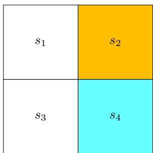
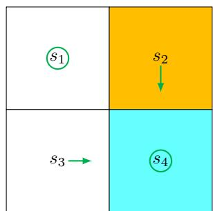
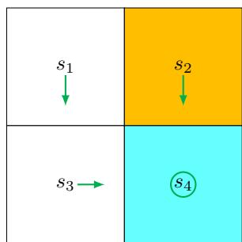
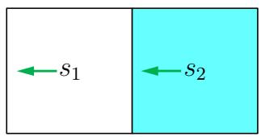
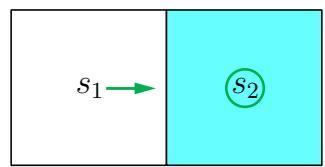
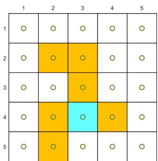
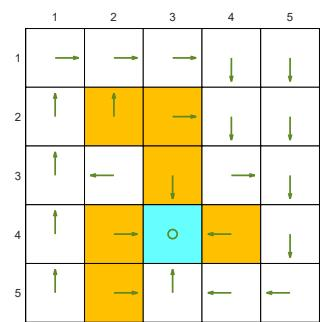
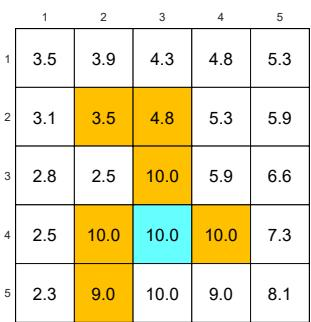
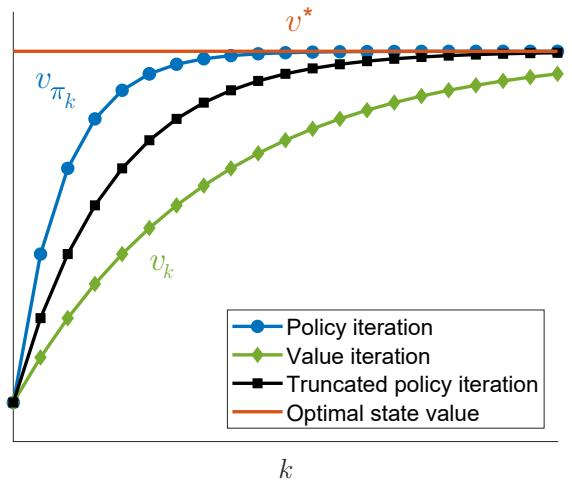

# 第 4 章 值迭代与策略迭代（Value Iteration and Policy Iteration）— 从 4.1 开始

> 原书 p69–87 · 学习日期 2026-06-03 · 当前涵盖 4.1–4.5（第 4 章完）

## 本章在全书的位置（先读这段）

第 3 章已经把“最优”翻译成了 **Bellman optimality equation 贝尔曼最优方程**：

$$
v=\max_{\pi\in\Pi}(r_\pi+\gamma P_\pi v).
$$

而且定理 3.3 告诉我们，右边这个 Bellman optimality operator 贝尔曼最优算子是压缩映射，所以从任意初值
开始反复迭代，都会收敛到唯一的最优状态值 $v^*$。第 4 章就把这个理论真正变成算法：

> **4.1 值迭代：直接按压缩映射定理迭代 BOE → 4.2 策略迭代：评价策略再改进策略
> → 4.3 截断策略迭代：把前两者统一起来。**

这一章最重要的主线是：**value update 价值更新** 和 **policy update 策略更新** 总是交替出现。
后面很多强化学习算法，都可以看成这种“值和策略互相推动”的 generalized policy iteration 广义策略迭代。

补充对照例子见：[第 4 章补充：同一个例子对比值迭代与策略迭代](/Users/qshf/Downloads/强化学习的数学原理/_tutor/notes/04_supplement-value-iteration-vs-policy-iteration.md)。

---

## 4.1 值迭代（Value Iteration）

**要解决的问题**：第 3 章证明了贝尔曼最优方程可以通过压缩映射迭代求解；本节要把这个迭代写成可实现的算法，也就是 **value iteration 值迭代**。

### 4.1 的核心想法

值迭代就是照着第 3 章的贝尔曼最优方程反复做：

$$
v_{k+1}
= \max_{\pi\in\Pi}(r_\pi+\gamma P_\pi v_k),
\quad k=0,1,2,\ldots
$$

读法：第 $k$ 轮手里有一个当前估计 $v_k$，把它代入 BOE 右边，在所有策略中选出能让
“即时奖励 + 折扣未来值”最大的策略，然后得到新的估计 $v_{k+1}$。

用第 3 章的符号看，值迭代就是：

$$
v_{k+1}=f(v_k),
$$

其中

$$
f(v)\doteq \max_{\pi\in\Pi}(r_\pi+\gamma P_\pi v).
$$

定理 3.3 已经保证 $f$ 是压缩映射，所以：

$$
v_k\to v^*,\qquad \pi_k\to \pi^*
\quad (k\to\infty).
$$

这里的 $\pi_k$ 是每一轮由 $v_k$ 贪心选出来的策略；$v^*$ 是 optimal state value 最优状态值；
$\pi^*$ 是 optimal policy 最优策略。

### 两个步骤：把一次 max 拆成“选动作 + 取最大值”

原书把每一轮拆成两步。

**第一步：policy update 策略更新**

$$
\pi_{k+1}
= \arg\max_\pi(r_\pi+\gamma P_\pi v_k).
$$

读法：固定上一轮的 $v_k$，寻找一个策略 $\pi_{k+1}$，让右边的“一步展望值”最大。
这里不是在解 $v_{\pi_{k+1}}$，而只是问：**如果未来价值暂时按 $v_k$ 估计，现在每个状态该选什么动作？**

**第二步：value update 价值更新**

$$
v_{k+1}
= r_{\pi_{k+1}}+\gamma P_{\pi_{k+1}}v_k. \tag{4.1}
$$

读法：实现时仍然是枚举每个动作、计算每个候选值、再取最大值。若把“取到最大值的动作”记成
$\pi_{k+1}$，那么最大值就可以写成
$r_{\pi_{k+1}}+\gamma P_{\pi_{k+1}}v_k$。这里的 $r_{\pi_{k+1}}$ 不是新的奖励函数，而是从固定奖励表
$r(s,a)$ 里，挑出本轮贪心动作对应的奖励组成的向量。

（我：注意这里的下表。取k=0， 意味着是用初始值$v_0$ 和（以枚举过后的最优动作 $\pi_1$）计算的 v1 ）

把两步合起来看：

$$
v_k
\xrightarrow{\text{greedy policy update}}
\pi_{k+1}
\xrightarrow{\text{one-step value update}}
v_{k+1}.
$$

⚠️ **值迭代不是“先保存一个策略，再在下一轮沿用它”。** 下一轮从 $v_{k+1}$ 出发时，会重新枚举所有动作、重新取 max。
式 (4.1) 只是把本轮 max 的胜出动作记成 $\pi_{k+1}$ 后得到的等价写法。它也不是“完整评价新策略”，因为只做了一步：

$$
v_{k+1}=r_{\pi_{k+1}}+\gamma P_{\pi_{k+1}}v_k.
$$

它没有求解

$$
v_{\pi_{k+1}}=r_{\pi_{k+1}}+\gamma P_{\pi_{k+1}}v_{\pi_{k+1}}.
$$

后一件事是 4.2 policy iteration 策略迭代里的 policy evaluation 策略评价。

### 逐元素形式：算法真正怎么写

矩阵形式很干净，但实现时要逐状态、逐动作算。固定一轮 $k$ 和一个状态 $s$。

先定义当前轮的“临时动作值”：

$$
q_k(s,a)
\doteq
\underbrace{\sum_r p(r|s,a)r}_{\text{执行 }a\text{ 的平均即时奖励}}
+\gamma
\underbrace{\sum_{s'}p(s'|s,a)v_k(s')}_{\text{按 }v_k\text{ 估计下一状态未来值}}.
$$

读法：在状态 $s$ 先执行动作 $a$，得到平均即时奖励；然后转移到 $s'$，把下一状态的当前估计
$v_k(s')$ 折扣后加回来。

于是策略更新的逐元素形式是：

$$
\pi_{k+1}(s)
=\arg\max_\pi
\sum_a\pi(a|s)q_k(s,a).
$$

第 3.3.1 已经证明过：对一组固定数字 $q_k(s,a)$ 做概率加权平均，最大值一定可以由确定性策略取得，
也就是把全部概率放在最大动作上。因此：

$$
\pi_{k+1}(a|s)
=
\begin{cases}
1, & a=a_k^*(s),\\
0, & a\ne a_k^*(s),
\end{cases}
\tag{4.2}
$$

其中

$$
a_k^*(s)=\arg\max_a q_k(s,a).
$$

如果最大动作不唯一，任选一个最大动作即可，不影响收敛。这样的策略叫 **greedy policy 贪心策略**：
它总是在当前估计 $v_k$ 下，选 $q_k(s,a)$ 最大的动作。

再看价值更新：

$$
v_{k+1}(s)
=
\sum_a \pi_{k+1}(a|s)q_k(s,a).
$$

把 (4.2) 代入，就只剩最大动作那一项：

$$
v_{k+1}(s)=\max_a q_k(s,a).
$$

所以值迭代在每个状态上的实现链条是：

$$
v_k(s)
\rightarrow
q_k(s,a)
\rightarrow
\text{new greedy policy }\pi_{k+1}(s)
\rightarrow
\text{new value }v_{k+1}(s)=\max_a q_k(s,a).
$$

这句话是 4.1 的操作版核心：**先用旧的 $v_k$ 算所有动作的 $q_k$，再取最大动作，同时把最大值作为新的 $v_{k+1}$。**

### Algorithm 4.1：值迭代算法

输入：

- 已知模型 $p(r|s,a)$ 和 $p(s'|s,a)$；
- 任意初始猜测 $v_0$；
- 一个很小的收敛阈值，比如 $\epsilon$。

目标：求解贝尔曼最优方程，得到最优状态值 $v^*$ 和一个最优策略 $\pi^*$。

每一轮 $k$：

1. 对每个状态 $s\in\mathcal S$。
2. 对每个动作 $a\in\mathcal A(s)$，计算

   $$
   q_k(s,a)
   =
   \sum_r p(r|s,a)r
   +\gamma\sum_{s'}p(s'|s,a)v_k(s').
   $$

3. 选最大动作：

   $$
   a_k^*(s)=\arg\max_a q_k(s,a).
   $$

4. 更新策略：

   $$
   \pi_{k+1}(a|s)=1\quad\text{if }a=a_k^*(s),
   $$

   其它动作概率为 0。

5. 更新价值：

   $$
   v_{k+1}(s)=\max_a q_k(s,a).
   $$

6. 如果 $\|v_{k+1}-v_k\|$ 小于预设阈值，就停止；否则进入下一轮。

⚠️ **停止条件的下标**：原书文字里说 “while $v_k$ has not converged in the sense that
$\|v_k-v_{k-1}\|$ is greater than threshold”。实现时常写成算完 $v_{k+1}$ 后检查
$\|v_{k+1}-v_k\|$。两种写法只是循环位置不同，意思一样。

### 关键易错点：$v_k$ 不是状态值，$q_k$ 也不是动作值

这一段非常重要。虽然 $v_k$ 最后会收敛到最优状态值 $v^*$，但在收敛之前，$v_k$ 一般不是任何策略的
state value 状态值。

为什么？一个向量要叫某个策略 $\pi$ 的状态值，必须满足该策略的贝尔曼方程：

$$
v_\pi=r_\pi+\gamma P_\pi v_\pi.
$$

但值迭代里的 $v_k$ 通常不满足：

$$
v_k=r_{\pi_{k+1}}+\gamma P_{\pi_{k+1}}v_k,
$$

也通常不满足：

$$
v_k=r_{\pi_k}+\gamma P_{\pi_k}v_k.
$$

它只是算法生成的中间估计。相应地，

$$
q_k(s,a)
=
\sum_r p(r|s,a)r
+\gamma\sum_{s'}p(s'|s,a)v_k(s')
$$

也不是严格意义上的 action value 动作值 $q_\pi(s,a)$。真正的 $q_\pi(s,a)$ 后面接的是
$v_\pi(s')$；这里接的是尚未收敛的 $v_k(s')$。

可以把它理解成：

> $v_k$ 是“当前对最优价值的估计”；$q_k$ 是“基于这个估计做一步展望得到的临时动作分数”。

这个区分会在 4.2 特别关键：策略迭代里的 $v_{\pi_k}$ 是真正的状态值，而值迭代里的 $v_k$ 只是估计。

### 原书例子：2×2 网格手算值迭代

原书用一个 2×2 网格演示值迭代。橙色 $s_2$ 是 forbidden area 禁止区，蓝色 $s_4$ 是 target 目标区。
奖励设定：

$$
r_{\mathrm{boundary}}=-1,\qquad
r_{\mathrm{forbidden}}=-1,\qquad
r_{\mathrm{target}}=1,
$$

折扣率：

$$
\gamma=0.9.
$$

> **原书图 4.2**：左图是环境；中图是 $k=0$ 后的一次贪心策略；右图是 $k=1$ 后得到的最优策略。

动作约定仍是：

- $a_1$：上；
- $a_2$：右；
- $a_3$：下；
- $a_4$：左；
- $a_5$：原地不动。

因为本例是确定性环境，每个 $q(s,a)$ 都是“即时奖励 + $\gamma$ 倍下一格的 $v$”。原书 Table 4.1
给出了通用表达式：

| 状态 | $a_1$ | $a_2$ | $a_3$ | $a_4$ | $a_5$ |
| --- | --- | --- | --- | --- | --- |
| $s_1$ | $-1+\gamma v(s_1)$ | $-1+\gamma v(s_2)$ | $0+\gamma v(s_3)$ | $-1+\gamma v(s_1)$ | $0+\gamma v(s_1)$ |
| $s_2$ | $-1+\gamma v(s_2)$ | $-1+\gamma v(s_2)$ | $1+\gamma v(s_4)$ | $0+\gamma v(s_1)$ | $-1+\gamma v(s_2)$ |
| $s_3$ | $0+\gamma v(s_1)$ | $1+\gamma v(s_4)$ | $-1+\gamma v(s_3)$ | $-1+\gamma v(s_3)$ | $0+\gamma v(s_3)$ |
| $s_4$ | $-1+\gamma v(s_2)$ | $-1+\gamma v(s_4)$ | $-1+\gamma v(s_4)$ | $0+\gamma v(s_3)$ | $1+\gamma v(s_4)$ |

#### 第 0 轮：从 $v_0=0$ 开始

初始值：

$$
v_0(s_1)=v_0(s_2)=v_0(s_3)=v_0(s_4)=0.
$$

代入上表，得到：

| 状态 | $a_1$ | $a_2$ | $a_3$ | $a_4$ | $a_5$ | 最大动作 |
| --- | ---: | ---: | ---: | ---: | ---: | --- |
| $s_1$ | -1 | -1 | 0 | -1 | 0 | $a_3$ 或 $a_5$ |
| $s_2$ | -1 | -1 | 1 | 0 | -1 | $a_3$ |
| $s_3$ | 0 | 1 | -1 | -1 | 0 | $a_2$ |
| $s_4$ | -1 | -1 | -1 | 0 | 1 | $a_5$ |

原书在并列时选择了：

$$
\pi_1(a_5|s_1)=1,\quad
\pi_1(a_3|s_2)=1,\quad
\pi_1(a_2|s_3)=1,\quad
\pi_1(a_5|s_4)=1.
$$

所以新的价值是每行最大值：

$$
v_1(s_1)=0,\quad
v_1(s_2)=1,\quad
v_1(s_3)=1,\quad
v_1(s_4)=1.
$$

⚠️ **为什么中图的策略还不是最优？** 因为在 $s_1$，$a_3$ 和 $a_5$ 的 $q$ 值同为 0。
原书随机选了 $a_5$，也就是原地不动；这不会破坏算法收敛，但这一次显示出来的策略还不是最优策略。

#### 第 1 轮：把 $v_1=(0,1,1,1)$ 代入

代入 Table 4.1，且 $\gamma=0.9$：

| 状态 | $a_1$ | $a_2$ | $a_3$ | $a_4$ | $a_5$ | 最大动作 |
| --- | ---: | ---: | ---: | ---: | ---: | --- |
| $s_1$ | $-1+0.9\cdot0=-1$ | $-1+0.9\cdot1=-0.1$ | $0+0.9\cdot1=0.9$ | $-1+0.9\cdot0=-1$ | $0+0.9\cdot0=0$ | $a_3$ |
| $s_2$ | $-1+0.9\cdot1=-0.1$ | $-1+0.9\cdot1=-0.1$ | $1+0.9\cdot1=1.9$ | $0+0.9\cdot0=0$ | $-1+0.9\cdot1=-0.1$ | $a_3$ |
| $s_3$ | $0+0.9\cdot0=0$ | $1+0.9\cdot1=1.9$ | $-1+0.9\cdot1=-0.1$ | $-1+0.9\cdot1=-0.1$ | $0+0.9\cdot1=0.9$ | $a_2$ |
| $s_4$ | $-1+0.9\cdot1=-0.1$ | $-1+0.9\cdot1=-0.1$ | $-1+0.9\cdot1=-0.1$ | $0+0.9\cdot1=0.9$ | $1+0.9\cdot1=1.9$ | $a_5$ |

于是策略更新为：

$$
\pi_2(a_3|s_1)=1,\quad
\pi_2(a_3|s_2)=1,\quad
\pi_2(a_2|s_3)=1,\quad
\pi_2(a_5|s_4)=1.
$$

价值更新为：

$$
v_2(s_1)=\gamma\cdot1=0.9,
$$

$$
v_2(s_2)=1+\gamma\cdot1=1.9,\quad
v_2(s_3)=1+\gamma\cdot1=1.9,\quad
v_2(s_4)=1+\gamma\cdot1=1.9.
$$

这一轮的策略已经是最优策略：$s_1$ 向下绕开禁区，$s_2$ 向下进目标，$s_3$ 向右进目标，
$s_4$ 留在目标区持续拿奖励。

#### 后续轮次：策略已优，值还会继续收敛

原书强调：这个简单例子里，两轮就能得到最优策略；更复杂的例子需要跑到 $v_k$ 收敛。

注意一个细节：**策略先稳定，不代表价值已经完全收敛。** 在本例中，$s_4$ 处最优策略是原地不动且每步拿
$+1$，所以真实最优值应满足：

$$
v^*(s_4)=1+\gamma v^*(s_4)
\quad\Rightarrow\quad
v^*(s_4)=\frac{1}{1-\gamma}=10.
$$

但第 2 轮只有 $v_2(s_4)=1.9$。如果继续用同一最优策略备份，$s_4$ 的值会按等比级数往 10 传播：

| 轮次 | $v_k(s_4)$ | 读法 |
| --- | ---: | --- |
| $0$ | $0$ | 初始猜测 |
| $1$ | $1$ | 看到一步目标奖励 |
| $2$ | $1+0.9=1.9$ | 看到两步目标奖励 |
| $3$ | $1+0.9+0.9^2=2.71$ | 看到三步目标奖励 |
| $\infty$ | $\frac{1}{1-0.9}=10$ | 无限期留在目标区 |

所以值迭代的收敛有两层直觉：

- **策略传播**：哪个动作更好，会从目标附近一层层传到远处状态；
- **价值传播**：长期回报会通过 Bellman backup 一轮轮累积进 $v_k$。

### 本节和前后的关系

4.1 是第 3 章定理 3.3 的算法化版本：压缩映射定理说“反复应用 $f$ 会收敛”，值迭代就直接做
$v_{k+1}=f(v_k)$。

4.2 会讲 **policy iteration 策略迭代**。它不直接迭代贝尔曼最优方程，而是每轮先把当前策略
完整评价出来，再基于真实的 $v_{\pi_k}$ 改进策略。对比这两节时，要盯住这一区别：

$$
\text{值迭代：}v_k\text{ 是中间估计，只做一步价值更新;}
$$

$$
\text{策略迭代：}v_{\pi_k}\text{ 是当前策略的真实状态值，要解贝尔曼方程。}
$$

---

## 4.2 策略迭代（Policy Iteration）

**要解决的问题**：4.1 的值迭代每轮只做“一步价值更新”；本节要介绍另一种算法：先把当前策略完整评价出来，再用评价结果贪心改进策略，这就是 **policy iteration 策略迭代**。

### 4.2 的核心想法

策略迭代每一轮有两个步骤：

$$
\pi_k
\xrightarrow{\text{policy evaluation}}
v_{\pi_k}
\xrightarrow{\text{policy improvement}}
\pi_{k+1}.
$$

也就是说，它不是从一个临时值 $v_k$ 直接走到 $v_{k+1}$，而是始终围绕“一个真实策略 $\pi_k$”
展开。

**第一步：policy evaluation 策略评价**

给定上一轮策略 $\pi_k$，求它的真实状态值 $v_{\pi_k}$。这就是解普通贝尔曼方程：

$$
v_{\pi_k}
=
r_{\pi_k}+\gamma P_{\pi_k}v_{\pi_k}. \tag{4.3}
$$

读法：在策略 $\pi_k$ 下，每个状态的值等于平均即时奖励，加上折扣后的下一状态值。

如果写成闭式解，就是：

$$
v_{\pi_k}=(I-\gamma P_{\pi_k})^{-1}r_{\pi_k}.
$$

但实际计算矩阵逆通常不划算，所以更常用第 2 章讲过的迭代法：

$$
v_{\pi_k}^{(j+1)}
=
r_{\pi_k}+\gamma P_{\pi_k}v_{\pi_k}^{(j)},
\quad j=0,1,2,\dots \tag{4.4}
$$

读法：为了评价同一个策略 $\pi_k$，内部还要跑一个小迭代。$j$ 是“策略评价内部”的迭代编号；
$k$ 是“外层策略迭代”的编号。这个双下标很容易让人晕，要分开看。

⚠️ **两个迭代层级不要混**：

- $k$：第几轮策略迭代，策略从 $\pi_k$ 变成 $\pi_{k+1}$；
- $j$：在固定 $\pi_k$ 后，为了算 $v_{\pi_k}$，贝尔曼方程内部迭代了几次。

理论上，要让

$$
v_{\pi_k}^{(j)}\to v_{\pi_k}
$$

需要 $j\to\infty$。现实里不可能真跑无限步，所以通常用阈值停下来，比如：

$$
\left\|v_{\pi_k}^{(j+1)}-v_{\pi_k}^{(j)}\right\|<\epsilon.
$$

原书在这里留下一个伏笔：如果策略评价没有跑到完全精确，会不会出问题？答案在 4.3 的
**truncated policy iteration 截断策略迭代** 中解释。

**第二步：policy improvement 策略改进**

一旦有了真实状态值 $v_{\pi_k}$，就用它来选更好的策略：

$$
\pi_{k+1}
=
\arg\max_\pi(r_\pi+\gamma P_\pi v_{\pi_k}).
$$

读法：拿当前策略的真实价值 $v_{\pi_k}$ 做一步展望，在每个状态选使
“即时奖励 + 折扣后的 $v_{\pi_k}$”最大的动作。

这里和 4.1 很像，但关键区别是：

$$
\text{值迭代用 }v_k,\qquad
\text{策略迭代用 }v_{\pi_k}.
$$

$v_k$ 只是算法中间估计；$v_{\pi_k}$ 是当前策略真正满足贝尔曼方程的状态值。

### 为什么策略改进一定不变差：Lemma 4.1

原书的 Lemma 4.1 是本节的理论核心：

> 如果
> $$
> \pi_{k+1}=\arg\max_\pi(r_\pi+\gamma P_\pi v_{\pi_k}),
> $$
> 那么
> $$
> v_{\pi_{k+1}}\ge v_{\pi_k}.
> $$

这里的不等号是逐状态的：

$$
v_{\pi_{k+1}}(s)\ge v_{\pi_k}(s),
\quad \forall s\in\mathcal S.
$$

人话版本：**用 $v_{\pi_k}$ 贪心改进出来的新策略，在每个状态上都不比旧策略差。**

#### 证明思路逐步拆开

因为 $v_{\pi_k}$ 和 $v_{\pi_{k+1}}$ 都是真实状态值，所以它们分别满足贝尔曼方程：

$$
v_{\pi_k}
=
r_{\pi_k}+\gamma P_{\pi_k}v_{\pi_k},
$$

$$
v_{\pi_{k+1}}
=
r_{\pi_{k+1}}+\gamma P_{\pi_{k+1}}v_{\pi_{k+1}}.
$$

又因为 $\pi_{k+1}$ 是用 $v_{\pi_k}$ 贪心选出来的，所以：

$$
r_{\pi_{k+1}}+\gamma P_{\pi_{k+1}}v_{\pi_k}
\ge
r_{\pi_k}+\gamma P_{\pi_k}v_{\pi_k}.
$$

右边正好等于 $v_{\pi_k}$，所以可读成：

$$
\text{用新策略做一步展望，至少不差于旧策略的真实值。}
$$

接着比较两个真实值的差：

$$
\begin{aligned}
v_{\pi_k}-v_{\pi_{k+1}}
&=
\left(r_{\pi_k}+\gamma P_{\pi_k}v_{\pi_k}\right)
-
\left(r_{\pi_{k+1}}+\gamma P_{\pi_{k+1}}v_{\pi_{k+1}}\right)\\
&\le
\left(r_{\pi_{k+1}}+\gamma P_{\pi_{k+1}}v_{\pi_k}\right)
-
\left(r_{\pi_{k+1}}+\gamma P_{\pi_{k+1}}v_{\pi_{k+1}}\right)\\
&=
\gamma P_{\pi_{k+1}}(v_{\pi_k}-v_{\pi_{k+1}}).
\end{aligned}
$$

读法：旧策略和新策略的价值差，最多等于“折扣后、按新策略转移一次的价值差”。

继续把这个不等式递推下去：

$$
v_{\pi_k}-v_{\pi_{k+1}}
\le
\gamma^n P_{\pi_{k+1}}^n
(v_{\pi_k}-v_{\pi_{k+1}}).
$$

当 $n\to\infty$ 时，$\gamma^n\to0$；而 $P_{\pi_{k+1}}^n$ 仍是 stochastic matrix 随机矩阵，
每行非负且行和为 1，不会把有限向量放大到无穷。因此右边趋于 0：

$$
v_{\pi_k}-v_{\pi_{k+1}}\le0.
$$

于是得到：

$$
v_{\pi_{k+1}}\ge v_{\pi_k}.
$$

⚠️ **这个证明最容易漏的点**：$P_{\pi_{k+1}}$ 是非负随机矩阵，所以如果 $x\ge0$，就有
$P_{\pi_{k+1}}x\ge0$。矩阵乘向量不会把逐元素非负的向量变成负的。这是比较不等式能成立的基础。

### 为什么策略迭代最终能找到最优策略

策略迭代会生成两条序列：

$$
\{\pi_0,\pi_1,\ldots,\pi_k,\ldots\},
$$

以及

$$
\{v_{\pi_0},v_{\pi_1},\ldots,v_{\pi_k},\ldots\}.
$$

由 Lemma 4.1，每次策略改进都不变差：

$$
v_{\pi_0}\le v_{\pi_1}\le v_{\pi_2}\le\cdots\le v_{\pi_k}\le\cdots.
$$

另一方面，任何策略的状态值都不可能超过最优状态值：

$$
v_{\pi_k}\le v^*.
$$

所以这是一条“单调上升且有上界”的价值序列：

$$
v_{\pi_0}
\le
v_{\pi_1}
\le
v_{\pi_2}
\le
\cdots
\le
v^*.
$$

原书用 monotone convergence theorem 单调收敛定理说明它会收敛到某个极限 $v_\infty$。Theorem 4.1
进一步说明这个极限不是别的，正是最优状态值：

$$
v_{\pi_k}\to v^*.
$$

因此策略序列也会收敛到一个最优策略。

#### Box 4.2 的关键直觉：策略迭代比值迭代“走得更远”

原书用值迭代序列作对照：

$$
v_{k+1}
=
f(v_k)
=
\max_\pi(r_\pi+\gamma P_\pi v_k).
$$

这就是 4.1 的值迭代。Box 4.2 的证明想说明，在合适初值下：

$$
v_k\le v_{\pi_k}\le v^*.
$$

也就是说，同样走到第 $k$ 轮，策略迭代的真实策略值 $v_{\pi_k}$ 不低于值迭代的中间估计 $v_k$。
直觉上，这是因为策略迭代每次改进策略之后，会把这个策略评价到收敛；而值迭代只做一次 Bellman backup。

可以把两者的节奏写成：

$$
\text{值迭代：}
v_k \rightarrow \pi_{k+1} \rightarrow v_{k+1}
\quad(\text{只备份一步});
$$

$$
\text{策略迭代：}
\pi_k \rightarrow v_{\pi_k} \rightarrow \pi_{k+1}
\quad(\text{把当前策略评价完整}).
$$

这也是 4.3 要统一两者的入口：如果策略评价只做 1 步，就是值迭代；如果做到无穷步，就是策略迭代。

### 逐元素形式与 Algorithm 4.2

实现策略迭代时，也要把矩阵形式写成逐状态形式。

#### 策略评价的逐元素形式

固定策略 $\pi_k$，内部迭代为：

$$
v_{\pi_k}^{(j+1)}(s)
=
\sum_a\pi_k(a|s)
\left[
\sum_r p(r|s,a)r
+\gamma\sum_{s'}p(s'|s,a)v_{\pi_k}^{(j)}(s')
\right],
\quad s\in\mathcal S.
$$

读法：在状态 $s$，按当前策略 $\pi_k$ 对所有动作加权平均；每个动作贡献“平均即时奖励 + 折扣后的下一状态估计”。

这个公式就是普通贝尔曼方程的迭代解法，和第 2.7 的思路一致。

#### 策略改进的逐元素形式

有了 $v_{\pi_k}$ 后，先算真实动作值：

$$
q_{\pi_k}(s,a)
=
\sum_r p(r|s,a)r
+\gamma\sum_{s'}p(s'|s,a)v_{\pi_k}(s').
$$

这里的 $q_{\pi_k}$ 是真正的 action value 动作值，因为后面接的是当前策略的真实状态值 $v_{\pi_k}$。

然后选最大动作：

$$
a_k^*(s)=\arg\max_a q_{\pi_k}(s,a),
$$

并把策略改成确定性贪心策略：

$$
\pi_{k+1}(a|s)
=
\begin{cases}
1, & a=a_k^*(s),\\
0, & a\ne a_k^*(s).
\end{cases}
$$

Algorithm 4.2 可以概括成：

1. 初始化一个任意策略 $\pi_0$。
2. 对第 $k$ 轮：
3. 固定 $\pi_k$，用贝尔曼方程迭代求 $v_{\pi_k}$。
4. 用 $v_{\pi_k}$ 计算每个 $q_{\pi_k}(s,a)$。
5. 在每个状态取最大动作，得到 $\pi_{k+1}$。
6. 如果策略或价值已经收敛，就停止；否则继续。

⚠️ **策略迭代的输入是初始策略，不是初始价值。** 值迭代从 $v_0$ 开始；策略迭代从 $\pi_0$ 开始。
当然，策略评价的内部迭代还需要一个临时初值 $v_{\pi_k}^{(0)}$，但那只是内部求解器的初值。

### 原书例子一：两个状态手算策略迭代

图 4.3 是一个两状态小例子。动作集是：

$$
\mathcal A=\{a_\ell,a_0,a_r\},
$$

分别表示向左、原地不动、向右。奖励设定为：

$$
r_{\mathrm{boundary}}=-1,\qquad r_{\mathrm{target}}=1,\qquad \gamma=0.9.
$$

> **原书图 4.3**：左图初始策略是两个状态都向左；右图改进后，$s_1$ 向右进入目标区 $s_2$，$s_2$ 原地不动。

初始策略 $\pi_0$ 如图 4.3(a)：$s_1$ 向左、$s_2$ 向左。这个策略很差：

- 在 $s_1$ 向左会撞边界，奖励 $-1$，还留在 $s_1$；
- 在 $s_2$ 向左会回到 $s_1$，奖励 $0$。

#### 第一步：策略评价

写出 $\pi_0$ 下的贝尔曼方程：

$$
v_{\pi_0}(s_1)
=
-1+\gamma v_{\pi_0}(s_1),
$$

$$
v_{\pi_0}(s_2)
=
0+\gamma v_{\pi_0}(s_1).
$$

先解第一行：

$$
v_{\pi_0}(s_1)
=
-1+0.9v_{\pi_0}(s_1)
$$

移项：

$$
0.1v_{\pi_0}(s_1)=-1
\quad\Rightarrow\quad
v_{\pi_0}(s_1)=-10.
$$

再代入第二行：

$$
v_{\pi_0}(s_2)=0+0.9(-10)=-9.
$$

所以：

$$
v_{\pi_0}(s_1)=-10,\qquad v_{\pi_0}(s_2)=-9.
$$

这也可以用迭代法逼近。若从 $v_{\pi_0}^{(0)}(s_1)=v_{\pi_0}^{(0)}(s_2)=0$ 开始：

| 内部迭代 $j$ | $v_{\pi_0}^{(j)}(s_1)$ | $v_{\pi_0}^{(j)}(s_2)$ |
| --- | ---: | ---: |
| 0 | 0 | 0 |
| 1 | $-1$ | $0$ |
| 2 | $-1.9$ | $-0.9$ |
| 3 | $-2.71$ | $-1.71$ |
| $\infty$ | $-10$ | $-9$ |

读法：$s_1$ 会一直向左撞边界，所以累积回报趋向

$$
-1-0.9-0.9^2-\cdots=-\frac{1}{1-0.9}=-10.
$$

#### 第二步：策略改进

用 $v_{\pi_0}(s_1)=-10,\ v_{\pi_0}(s_2)=-9$ 计算动作值。原书 Table 4.4 的表达式是：

| 状态 | $a_\ell$ | $a_0$ | $a_r$ |
| --- | --- | --- | --- |
| $s_1$ | $-1+\gamma v_{\pi_k}(s_1)$ | $0+\gamma v_{\pi_k}(s_1)$ | $1+\gamma v_{\pi_k}(s_2)$ |
| $s_2$ | $0+\gamma v_{\pi_k}(s_1)$ | $1+\gamma v_{\pi_k}(s_2)$ | $-1+\gamma v_{\pi_k}(s_2)$ |

代入数字：

| 状态 | $a_\ell$ | $a_0$ | $a_r$ | 最大动作 |
| --- | ---: | ---: | ---: | --- |
| $s_1$ | $-1+0.9(-10)=-10$ | $0+0.9(-10)=-9$ | $1+0.9(-9)=-7.1$ | $a_r$ |
| $s_2$ | $0+0.9(-10)=-9$ | $1+0.9(-9)=-7.1$ | $-1+0.9(-9)=-9.1$ | $a_0$ |

所以改进策略为：

$$
\pi_1(a_r|s_1)=1,\qquad \pi_1(a_0|s_2)=1.
$$

这就是图 4.3(b)：$s_1$ 向右进入目标，$s_2$ 在目标区原地不动。这个简单例子里，一轮策略迭代就找到了最优策略。

### 原书例子二：复杂网格中的策略和值如何传播

图 4.4 展示了一个更大的网格。奖励设定为：

$$
r_{\mathrm{boundary}}=-1,\qquad
r_{\mathrm{forbidden}}=-10,\qquad
r_{\mathrm{target}}=1,\qquad
\gamma=0.9.
$$

为了不让笔记被十几张中间图淹没，这里放初始状态、最终策略和最终价值图：

> **原书图 4.4**：从随机初始策略出发，策略迭代逐步收敛到最优策略；最终状态值呈现出围绕目标区的空间梯度。

原书指出两个现象。

**现象一：离目标近的状态更早找到最优动作。**

这和 Bellman backup 的传播方向有关。目标附近的状态一步就能看到 $+1$，因此最早知道“往目标走是好事”；
远处状态要等近处状态的价值先变高，才会发现“通向那些近处状态的动作”也是好动作。

可以把它想成价值信号从目标区一圈圈向外扩散。

**现象二：越靠近目标区，状态值通常越大。**

原因是折扣因子 $\gamma<1$。距离目标越远，拿到正奖励之前要走的步数越多，奖励被折扣得越厉害。
例如，如果某状态需要 3 步才到目标，那么第一次目标奖励大约贡献 $\gamma^2$ 或 $\gamma^3$ 量级；
离目标 1 步的状态则几乎马上能拿到正奖励。

⚠️ **价值高不只看几何距离，也看路上风险和惩罚。** 禁止区、边界惩罚、可行动作都会改变最优路径。
所以“离目标近价值高”是这个例子里的主要趋势，不是脱离环境结构的绝对定律。

### 4.2 小结：策略迭代和 4.1 的对照

值迭代和策略迭代都在交替更新“值”和“策略”，但它们的力度不同：

| 对比项 | 值迭代 Value iteration | 策略迭代 Policy iteration |
| --- | --- | --- |
| 初始对象 | 任意 $v_0$ | 任意 $\pi_0$ |
| 每轮的值 | $v_k$，中间估计 | $v_{\pi_k}$，当前策略真实状态值 |
| 价值更新 | 只做一步 Bellman backup | 策略评价做到收敛 |
| 策略更新 | 对 $v_k$ 贪心 | 对 $v_{\pi_k}$ 贪心 |
| 直觉 | 单步推进，便宜但可能慢 | 每轮更扎实，单轮更贵但通常收敛快 |

⚠️ **停止条件不要混**：策略迭代通常在 $\pi_{k+1}=\pi_k$ 时停止，因为“用当前真实价值
$v_{\pi_k}$ 贪心改进还改不动”说明已经满足贝尔曼最优方程；值迭代通常看
$\|v_{k+1}-v_k\|<\epsilon$，因为 $v_k$ 只是中间估计，策略短暂不变不一定代表价值已经收敛。
补充文档里用同一个两状态例子专门验证了这一点。

本节和前后闭环如下：

- 第 2 章：教会我们给定策略怎么求 $v_\pi$；
- 第 3 章：证明用动作值贪心可以导向最优；
- 4.1：直接迭代贝尔曼最优方程；
- 4.2：先完整评价当前策略，再贪心改进；
- 4.3：把“评价一步”和“评价到无穷步”统一成截断策略迭代。

---

## 4.3 截断策略迭代（Truncated Policy Iteration）

**要解决的问题**：4.1 的 value iteration 值迭代每轮只做一步价值更新，4.2 的 policy iteration 策略迭代每轮把策略评价做到收敛；本节要说明二者其实是一条连续谱的两个端点，中间版本就是 **truncated policy iteration 截断策略迭代**。

### 先把 4.1 和 4.2 摆在同一张桌上

策略迭代每一轮是：

$$
\pi_0
\xrightarrow{\text{PE}}
v_{\pi_0}
\xrightarrow{\text{PI}}
\pi_1
\xrightarrow{\text{PE}}
v_{\pi_1}
\xrightarrow{\text{PI}}
\pi_2
\xrightarrow{\text{PE}}\cdots
$$

这里 **PE policy evaluation 策略评价** 是完整求解：

$$
v_{\pi_k}=r_{\pi_k}+\gamma P_{\pi_k}v_{\pi_k}.
$$

读法：固定当前策略 $\pi_k$，一直算到得到这个策略真实的 state value 状态值 $v_{\pi_k}$。

策略改进是：

$$
\pi_{k+1}
=
\arg\max_\pi
\left(r_\pi+\gamma P_\pi v_{\pi_k}\right).
$$

读法：拿当前策略的真实价值 $v_{\pi_k}$ 做一步展望，在所有策略里选一个更贪心的策略。

值迭代每一轮则是：

$$
v_0
\xrightarrow{\text{PU}}
\pi_1'
\xrightarrow{\text{VU}}
v_1
\xrightarrow{\text{PU}}
\pi_2'
\xrightarrow{\text{VU}}
v_2
\xrightarrow{\text{PU}}\cdots
$$

这里 **PU policy update 策略更新** 是：

$$
\pi_{k+1}
=
\arg\max_\pi
\left(r_\pi+\gamma P_\pi v_k\right),
$$

**VU value update 价值更新** 是：

$$
v_{k+1}
=
r_{\pi_{k+1}}
+\gamma P_{\pi_{k+1}}v_k.
$$

读法：这张展开图不是把值迭代改写成“先找一个已经可靠的策略，再评价这个策略”。它只是对

$$
v_{k+1}=\max_\pi(r_\pi+\gamma P_\pi v_k)
$$

中的 $\max/\arg\max$ 做一个记号展开。实际计算时，仍然是用当前 $v_k$ 枚举所有动作并取最大值；$\pi_{k+1}$ 只是“本轮哪个动作取到了最大值”的记录。
然后 $v_{k+1}=r_{\pi_{k+1}}+\gamma P_{\pi_{k+1}}v_k$ 表示把这个最大动作对应的奖励和转移取出来，做本轮这一次备份。

⚠️ **这个图容易误读**：值迭代的下一轮输入是 $v_{k+1}$，不是 $\pi_{k+1}$。也就是说，
$\pi_1'$ 不会被拿去继续评价成 $v_2$；从 $v_1$ 到 $v_2$ 时会重新枚举动作，得到新的 $\pi_2'$。
和策略迭代、截断策略迭代放在一起比较时，可以说差别体现在“策略评价做几步”：值迭代只做当前这 1 步；
策略迭代做到 $\infty$ 步；截断策略迭代做一个有限步数 $j_{\mathrm{truncated}}$。

例如 4.1 的 2×2 网格从 $v_0=0$ 开始时，$s_1$ 下 $a_3$ 和 $a_5$ 的候选值同为 0。若平局规则选择 $a_5$，
那么本轮仍有 $v_1(s_1)=0$，但这不表示“停在 $s_1$”这个动作是最终最优动作，也不表示接下来要沿着这个动作完整评价。
下一轮会用新的 $v_1$ 重新比较所有动作；此时 $a_3$ 会因为通向已经有价值的 $s_3$ 而胜出。

### 为什么说值迭代和策略迭代是两个端点

为了公平比较，原书先设一个特殊条件：

$$
v_0=v_{\pi_0}.
$$

也就是值迭代的初始值刚好等于策略迭代初始策略 $\pi_0$ 的真实状态值。这样二者前三步会对齐：

$$
\pi_1
=
\arg\max_\pi(r_\pi+\gamma P_\pi v_{\pi_0})
=
\arg\max_\pi(r_\pi+\gamma P_\pi v_0).
$$

两种算法真正分开，是在得到 $\pi_1$ 之后。

值迭代只算：

$$
v_1
=
r_{\pi_1}+\gamma P_{\pi_1}v_0.
$$

策略迭代要求解：

$$
v_{\pi_1}
=
r_{\pi_1}+\gamma P_{\pi_1}v_{\pi_1}.
$$

把策略评价过程显式写出来，从同一个初值开始：

$$
\begin{aligned}
v_{\pi_1}^{(0)} &= v_0,\\
v_{\pi_1}^{(1)} &= r_{\pi_1}+\gamma P_{\pi_1}v_{\pi_1}^{(0)},\\
v_{\pi_1}^{(2)} &= r_{\pi_1}+\gamma P_{\pi_1}v_{\pi_1}^{(1)},\\
&\vdots\\
v_{\pi_1}^{(j)} &= r_{\pi_1}+\gamma P_{\pi_1}v_{\pi_1}^{(j-1)},\\
&\vdots\\
v_{\pi_1}^{(\infty)} &= r_{\pi_1}+\gamma P_{\pi_1}v_{\pi_1}^{(\infty)}.
\end{aligned}
$$

读法：固定 $\pi_1$ 后，反复把“即时奖励 + 折扣下一状态旧价值”往回代，直到逼近 $\pi_1$ 的真实价值。

于是三种算法的关系变得很清楚：

| 策略评价内部迭代次数 | 得到的值 | 对应算法 |
| ---: | --- | --- |
| $1$ | $v_{\pi_1}^{(1)}=v_1$ | value iteration 值迭代 |
| 有限的 $j_{\mathrm{truncated}}$ | $\bar v_1=v_{\pi_1}^{(j_{\mathrm{truncated}})}$ | truncated policy iteration 截断策略迭代 |
| $\infty$ | $v_{\pi_1}^{(\infty)}=v_{\pi_1}$ | policy iteration 策略迭代 |

⚠️ 原书特别提醒：这个直接比较依赖 $v_0=v_{\pi_0}$。如果没有这个条件，值迭代和策略迭代的序列不能逐步一一对齐，只能从算法结构上理解它们的相似性。

> **原书图 4.5**：截断策略迭代位于值迭代和策略迭代之间；截断步数越少，越像值迭代；截断步数越多，越像策略迭代。

### Algorithm 4.3：截断策略迭代算法

截断策略迭代和策略迭代几乎一样，只是 policy evaluation 策略评价不再求精确的 $v_{\pi_k}$，而是只跑有限轮。

输入：

- 已知模型 $p(r|s,a)$ 和 $p(s'|s,a)$；
- 初始策略 $\pi_0$；
- 策略评价内部最大迭代次数 $j_{\mathrm{truncated}}$。

目标：寻找最优状态值和最优策略。

第 $k$ 轮：

1. 固定当前策略 $\pi_k$。
2. 选择策略评价的初值：

   $$
   v_k^{(0)}=v_{k-1}.
   $$

3. 对 $j=0,1,\ldots,j_{\mathrm{truncated}}-1$，对每个状态 $s$ 做：

   $$
   v_k^{(j+1)}(s)
   =
   \sum_a\pi_k(a|s)
   \left[
   \underbrace{\sum_r p(r|s,a)r}_{\text{平均即时奖励}}
   +
   \gamma
   \underbrace{\sum_{s'}p(s'|s,a)v_k^{(j)}(s')}_{\text{用上一轮近似值估计未来}}
   \right].
   $$

   读法：固定策略 $\pi_k$ 后，用普通贝尔曼方程做有限次迭代。

4. 截断后，把最后一次内部迭代结果作为本轮近似值：

   $$
   v_k=v_k^{(j_{\mathrm{truncated}})}.
   $$

5. 用这个近似值做策略改进。先算：

   $$
   q_k(s,a)
   =
   \sum_r p(r|s,a)r
   +
   \gamma\sum_{s'}p(s'|s,a)v_k(s').
   $$

6. 在每个状态选最大动作：

   $$
   a_k^*(s)=\arg\max_a q_k(s,a).
   $$

7. 得到新的确定性贪心策略：

   $$
   \pi_{k+1}(a|s)
   =
   \begin{cases}
   1, & a=a_k^*(s),\\
   0, & a\ne a_k^*(s).
   \end{cases}
   $$

⚠️ **这里的 $v_k$ 不是精确状态值。** 因为策略评价只做有限步，所以通常

$$
v_k\ne v_{\pi_k}.
$$

它只是 $v_{\pi_k}$ 的近似。相应地，这里的 $q_k(s,a)$ 也是由近似值诱导出来的临时动作值，不一定等于真实的 $q_{\pi_k}(s,a)$。

### 自造最小数值例子：截断步数如何改变“用力程度”

考虑一个只有两个非终止状态的确定性环境，$\gamma=0.9$。固定某个策略 $\pi$ 后：

- 在 $s_1$ 执行策略动作，奖励 $0$，转移到 $s_2$；
- 在 $s_2$ 执行策略动作，奖励 $1$，仍留在 $s_2$。

那么该策略的贝尔曼评价方程是：

$$
v_\pi(s_1)=0+0.9v_\pi(s_2),
$$

$$
v_\pi(s_2)=1+0.9v_\pi(s_2).
$$

精确解为：

$$
v_\pi(s_2)=\frac{1}{1-0.9}=10,
\qquad
v_\pi(s_1)=0.9\times 10=9.
$$

如果从 $v^{(0)}(s_1)=v^{(0)}(s_2)=0$ 开始，只做有限次策略评价：

| 内部迭代 $j$ | $v^{(j)}(s_1)$ | $v^{(j)}(s_2)$ | 读法 |
| ---: | ---: | ---: | --- |
| 0 | 0 | 0 | 初始猜测 |
| 1 | 0 | 1 | 只看见 $s_2$ 的一步奖励 |
| 2 | 0.9 | 1.9 | $s_1$ 开始收到从 $s_2$ 传来的价值 |
| 3 | 1.71 | 2.71 | 价值继续向前传播 |
| $\infty$ | 9 | 10 | 完整策略评价结果 |

如果 $j_{\mathrm{truncated}}=1$，我们得到的就是值迭代风格：便宜、浅、传播慢。

如果 $j_{\mathrm{truncated}}=3$，已经比一步更新更“看得远”，但仍然没有完全评价策略。

如果 $j_{\mathrm{truncated}}=\infty$，就是策略迭代：每轮成本高，但策略改进时拿到的是完整状态值。

这个例子对应本节核心直觉：**截断步数越大，单轮策略评价越贵，但每轮改进用到的价值估计越充分。**

### Proposition 4.1：价值改进为什么成立

原书给出一个 value improvement 价值改进命题。固定第 $k$ 轮策略 $\pi_k$，策略评价内部迭代是：

$$
v_{\pi_k}^{(j+1)}
=
r_{\pi_k}
+
\gamma P_{\pi_k}v_{\pi_k}^{(j)},
\qquad
j=0,1,2,\ldots
$$

如果初始猜测选为：

$$
v_{\pi_k}^{(0)}=v_{\pi_{k-1}},
$$

那么有：

$$
v_{\pi_k}^{(j+1)}\ge v_{\pi_k}^{(j)},
\qquad
j=0,1,2,\ldots
$$

读法：如果第 $k$ 轮评价新策略 $\pi_k$ 时，从旧策略的真实价值 $v_{\pi_{k-1}}$ 出发，那么内部每多做一次 Bellman backup，价值向量都会逐元素不下降。

证明分两步看。

第一步，比较相邻两次内部迭代：

$$
\begin{aligned}
v_{\pi_k}^{(j+1)}-v_{\pi_k}^{(j)}
&=
\left(r_{\pi_k}+\gamma P_{\pi_k}v_{\pi_k}^{(j)}\right)
-
\left(r_{\pi_k}+\gamma P_{\pi_k}v_{\pi_k}^{(j-1)}\right)\\
&=
\gamma P_{\pi_k}
\left(v_{\pi_k}^{(j)}-v_{\pi_k}^{(j-1)}\right).
\end{aligned}
$$

读法：即时奖励 $r_{\pi_k}$ 抵消了，只剩“上一次价值差”经过转移矩阵 $P_{\pi_k}$ 和折扣 $\gamma$ 传播。

继续展开：

$$
v_{\pi_k}^{(j+1)}-v_{\pi_k}^{(j)}
=
\gamma^jP_{\pi_k}^j
\left(v_{\pi_k}^{(1)}-v_{\pi_k}^{(0)}\right). \tag{4.5}
$$

所以只要先证明第一步差值非负，后面由于 $\gamma^j\ge0$ 且 $P_{\pi_k}^j$ 是非负转移矩阵，所有后续差值也非负。

第二步，证明第一步差值非负。由初值条件：

$$
v_{\pi_k}^{(0)}=v_{\pi_{k-1}}.
$$

于是：

$$
\begin{aligned}
v_{\pi_k}^{(1)}
&=
r_{\pi_k}
+
\gamma P_{\pi_k}v_{\pi_k}^{(0)}\\
&=
r_{\pi_k}
+
\gamma P_{\pi_k}v_{\pi_{k-1}}\\
&\ge
r_{\pi_{k-1}}
+
\gamma P_{\pi_{k-1}}v_{\pi_{k-1}}\\
&=
v_{\pi_{k-1}}\\
&=
v_{\pi_k}^{(0)}.
\end{aligned}
$$

不等号来自策略改进：

$$
\pi_k
=
\arg\max_\pi
\left(r_\pi+\gamma P_\pi v_{\pi_{k-1}}\right).
$$

读法：$\pi_k$ 是相对于旧价值 $v_{\pi_{k-1}}$ 的贪心策略，所以它的一步展望值至少不低于旧策略 $\pi_{k-1}$ 的一步展望值。

把

$$
v_{\pi_k}^{(1)}\ge v_{\pi_k}^{(0)}
$$

代回式 (4.5)，就得到：

$$
v_{\pi_k}^{(j+1)}\ge v_{\pi_k}^{(j)}.
$$

⚠️ **这个命题的假设很强。** 它要求策略评价从 $v_{\pi_{k-1}}$ 开始，但实际截断策略迭代里我们通常只有近似值 $v_{k-1}$，并没有旧策略的精确状态值 $v_{\pi_{k-1}}$。所以 Proposition 4.1 更像是给直觉打光：它说明“新策略的一步贪心改进 + 多做几步策略评价”为什么倾向于让价值往上走，但它不是完整的收敛证明。

### 4.3 小结：三种算法其实是一族

值迭代、截断策略迭代、策略迭代的关系可以压缩成一句话：

$$
j_{\mathrm{truncated}}=1
\Rightarrow
\text{value iteration},
\qquad
1<j_{\mathrm{truncated}}<\infty
\Rightarrow
\text{truncated policy iteration},
\qquad
j_{\mathrm{truncated}}=\infty
\Rightarrow
\text{policy iteration}.
$$

从计算成本看：

| 算法 | 每轮策略评价成本 | 每轮价值估计质量 | 典型直觉 |
| --- | --- | --- | --- |
| 值迭代 | 最低，只做一步 | 最粗 | 单轮便宜，但可能要很多轮 |
| 截断策略迭代 | 中等，做有限多步 | 中等 | 在单轮成本和收敛速度之间折中 |
| 策略迭代 | 最高，做到收敛 | 最准 | 单轮贵，但通常轮数少 |

本节和前后闭环如下：

- 4.1 的值迭代是 $j_{\mathrm{truncated}}=1$ 的极端；
- 4.2 的策略迭代是 $j_{\mathrm{truncated}}=\infty$ 的极端；
- 4.3 把二者统一成一族算法；
- 4.4 会对第 4 章做总结，把 value update、policy update、policy evaluation、policy improvement 这些操作收束起来。

---

## 4.4 本章总结（Summary）

**要解决的问题**：前面 4.1、4.2、4.3 分别给了三种算法；本节把它们收束成一个共同结构：**value update 价值更新** 和 **policy update 策略更新** 互相推动。

第 4 章介绍了三种可以寻找 optimal policy 最优策略的算法：

| 算法 | 核心公式/动作 | 本质 |
| --- | --- | --- |
| value iteration 值迭代 | 反复应用 $v_{k+1}=T^*v_k$ | 直接求解 Bellman optimality equation 贝尔曼最优方程 |
| policy iteration 策略迭代 | policy evaluation + policy improvement | 先评价当前策略，再严格改进策略 |
| truncated policy iteration 截断策略迭代 | 每轮只做有限步 policy evaluation | 把值迭代和策略迭代连成一条连续谱 |

### 三种算法的共同骨架

本章最重要的统一观点是：

$$
\boxed{
\text{每轮迭代都在更新价值，也在更新策略}
}
$$

只是三种算法把这两件事的轻重安排得不同。

**值迭代**里，策略藏在 $\max/\arg\max$ 里面：

$$
\pi_{k+1}\in\arg\max_\pi(r_\pi+\gamma P_\pi v_k),
\qquad
v_{k+1}=r_{\pi_{k+1}}+\gamma P_{\pi_{k+1}}v_k.
$$

读法：先用当前估计 $v_k$ 找本轮贪心动作；再只做一步备份得到 $v_{k+1}$。
注意这里的 $\pi_{k+1}$ 只是本轮最大值的记录，通常不是“已经完整评价过的策略”。

**策略迭代**里，价值更新做得最彻底：

$$
v_{\pi_k}=r_{\pi_k}+\gamma P_{\pi_k}v_{\pi_k},
$$

$$
\pi_{k+1}=\arg\max_\pi(r_\pi+\gamma P_\pi v_{\pi_k}).
$$

读法：先把当前策略 $\pi_k$ 的真实状态值 $v_{\pi_k}$ 算出来，再基于这个真实价值做策略改进。

**截断策略迭代**在二者中间：

$$
v_k^{(j+1)}
=
r_{\pi_{k+1}}+\gamma P_{\pi_{k+1}}v_k^{(j)},
\qquad
j=0,1,\ldots,j_{\mathrm{truncated}}-1.
$$

读法：新策略已经确定，但不把它评价到完全收敛，只评价有限步。

于是三者可以排成一条线：

$$
j_{\mathrm{truncated}}=1
\Rightarrow
\text{value iteration},
\qquad
1<j_{\mathrm{truncated}}<\infty
\Rightarrow
\text{truncated policy iteration},
\qquad
j_{\mathrm{truncated}}=\infty
\Rightarrow
\text{policy iteration}.
$$

### 广义策略迭代：第 4 章真正留下的东西

原书说，这种 value update 和 policy update 相互作用的思想叫：

**generalized policy iteration 广义策略迭代**。

它不是一个具体算法，而是一种算法模板：

$$
\text{用当前价值改策略}
\quad\Longleftrightarrow\quad
\text{用当前策略改价值}.
$$

一个很小的直觉例子：

| 轮次 | 当前价值估计 | 策略根据价值怎么变 | 价值又怎么变 |
| --- | --- | --- | --- |
| 初始 | 还很粗糙 | 只能做局部贪心 | 得到第一批有用信号 |
| 中间 | 更接近真实长期回报 | 策略更少犯明显错误 | 价值传播得更远 |
| 收敛附近 | 接近 $v^*$ 或 $v_{\pi}$ | 策略趋于稳定 | 更新幅度越来越小 |

这就是后面章节的伏笔：
第 5 章以后进入 model-free reinforcement learning 无模型强化学习时，我们常常不知道

$p(s' \mid s,a)$ 和 $p(r \mid s,a)$，不能像第 4 章这样直接用模型算 Bellman backup。但核心结构还在：

- Monte Carlo 方法：用采样回报更新价值，再由价值改策略；
- TD learning 时序差分学习：用一步采样近似 Bellman backup；
- Sarsa、Q-learning：在动作价值上做类似的价值/策略互动；
- actor-critic：critic 负责价值更新，actor 负责策略更新。

所以 4.4 的一句话总结是：

> 第 4 章的三个算法都需要已知模型；第 5 章开始要把这种“价值和策略相互推动”的结构搬到不知道模型、只能采样经验的情形里。

### 易错点

⚠️ **不要把 generalized policy iteration 当成第四个具体算法。** 它更像一个总框架：很多算法都能放进“价值更新 + 策略更新”的互动结构里。

⚠️ **第 4 章算法都是 model-based 基于模型的。** 它们默认知道 $p(s' \mid s,a)$、$p(r \mid s,a)$ 或等价的环境模型；第 5 章之后的 model-free 方法才会用样本替代模型。

⚠️ **“价值更新”和“策略更新”的边界在不同算法里不一样清楚。** 策略迭代最清楚：先 policy evaluation，再 policy improvement。值迭代最紧凑：策略更新被折叠进 $\max/\arg\max$。

---

## 4.5 Q&A

**要解决的问题**：这一节用问答形式给第 4 章收尾，重点确认三个算法各自的收敛保证、中间量含义，以及第 4 章和后面无模型强化学习的边界。

### 一张表复习第 4 章

| 问题 | 简答 | 关键原因 |
| --- | --- | --- |
| 值迭代能保证找到最优策略吗？ | 能 | 它就是用 contraction mapping theorem 压缩映射定理迭代 BOE |
| 值迭代中间的 $v_k$ 是某个策略的 state value 状态值吗？ | 通常不是 | 它不一定满足任何策略的 Bellman equation |
| 策略迭代每轮做什么？ | policy evaluation + policy improvement | 先算 $v_{\pi_k}$，再改成更好的 $\pi_{k+1}$ |
| 策略迭代里是否嵌套另一个迭代算法？ | 是 | policy evaluation 本身要解 Bellman equation |
| 策略迭代的中间值是真状态值吗？ | 是 | 每轮得到的是当前策略的精确 $v_{\pi_k}$ |
| 截断策略迭代和策略迭代什么关系？ | 把策略评价截断成有限步 | 不再评价到完全收敛 |
| 值迭代和截断策略迭代什么关系？ | 值迭代是只评价 1 步的极端情形 | $j_{\mathrm{truncated}}=1$ |
| 截断策略迭代的中间值是真状态值吗？ | 通常不是 | 有限步评价只得到近似值 |
| 截断策略迭代评价多少步？ | 少量几步，不宜太多 | 太多会增加成本，但未必显著加速整体收敛 |
| generalized policy iteration 是什么？ | 价值更新和策略更新相互作用的总思想 | 它不是一个具体算法 |

### 这节最容易混的点：model-based 和 model-free

原书最后一个 Q&A 很重要，因为它修正了一个命名直觉：

第 4 章的算法需要系统模型：

$$
p(s' \mid s,a),\qquad p(r \mid s,a).
$$

所以它们通常叫 **dynamic programming 动态规划算法**，而不是狭义上的 reinforcement learning 强化学习算法。

但在强化学习文献里，**model-based reinforcement learning 基于模型的强化学习** 不只是“已知模型”。更准确地说：

- model-based reinforcement learning：从数据中估计/学习一个模型，然后在学习过程中使用这个模型；
- model-free reinforcement learning：学习过程中不显式估计环境模型，直接从经验更新价值或策略。

本书后面介绍的算法主要是 model-free algorithms 无模型算法。

⚠️ **这里有两个“有模型”概念，别混在一起。**

| 说法 | 含义 |
| --- | --- |
| 第 4 章算法 require the system model | 假设模型已知，直接用 $p(s' \mid s,a)$、$p(r \mid s,a)$ 做规划 |
| model-based RL | 模型未知，但智能体会用数据估计模型，再利用模型学习 |

所以第 4 章更像是“已知模型下的规划基准”。它给后面 model-free 方法提供了目标公式：即使我们不知道模型，也会想办法用样本去近似这些 Bellman 更新。

### 第 4 章收束成一句话

$$
\boxed{
\text{VI、PI、TPI 都是在做价值和策略的相互更新，只是策略评价做得深浅不同。}
}
$$

第 5 章开始，核心问题会变成：如果没有 $p(s' \mid s,a)$ 和 $p(r \mid s,a)$，还能不能只靠采样回报来更新价值？这就引出 Monte Carlo 方法。

---

## 我的疑问与解答

**问：策略 1 在值迭代里貌似体现不出“策略改进”的意思。从 $v_0$ 算出 $v_1$，然后下一轮直接把 $v_1$ 代入，好像完全不需要 $v_1$ 所对应的动作。**

答：这个观察是对的。值迭代如果只为了继续更新价值，确实可以不保存动作；直接做

$$
v_{k+1}(s)
=
\max_a
\left[
r(s,a)+\gamma\sum_{s'}p(s'|s,a)v_k(s')
\right]
$$

就够了。但这个 $\max$ 本身已经隐式做了 policy update 策略更新：最大值来自哪个动作，哪个动作就是当前
$v_k$ 诱导出的 greedy policy 贪心策略。

严格说，值迭代里的这一步不完全等同于策略迭代里的 policy improvement 策略改进。策略迭代是拿真实策略值
$v_{\pi_k}$ 去改进策略，所以能说 $v_{\pi_{k+1}}\ge v_{\pi_k}$；值迭代里的 $v_k$ 通常不是任何策略的真实状态值，
所以更准确的说法是：**值迭代每轮用当前价值估计做一次贪心 Bellman 最优备份，策略被折叠在 $\max/\arg\max$ 里。**

因此，计算 $v_2$ 时并不是沿着“产生 $v_1$ 的策略 1”继续评价，而是用 $v_1$ 重新计算所有动作的 $q_1(s,a)$，
再重新取最大动作和值。因此值迭代也完全可以压缩画成：

$$
v_0
\xrightarrow{T^*}
v_1
\xrightarrow{T^*}
v_2
\xrightarrow{T^*}
v_3
\xrightarrow{T^*}
\cdots,
$$

其中

$$
T^*v=\max_\pi(r_\pi+\gamma P_\pi v).
$$

展开图

$$
v_k\xrightarrow{\mathrm{PU}}\pi_{k+1}'\xrightarrow{\mathrm{VU}}v_{k+1}
$$

只是把 $T^*$ 里面的 $\max/\arg\max$ 作为中间记录写出来。学习 4.3 时展开图有用，因为它能看出值迭代是“策略评价只做 1 步”的截断策略迭代；真正记忆算法时，纯价值序列更简洁。详细展开见补充笔记：
[第 4 章补充：同一个例子对比值迭代与策略迭代](/Users/qshf/Downloads/强化学习的数学原理/_tutor/notes/04_supplement-value-iteration-vs-policy-iteration.md)。
