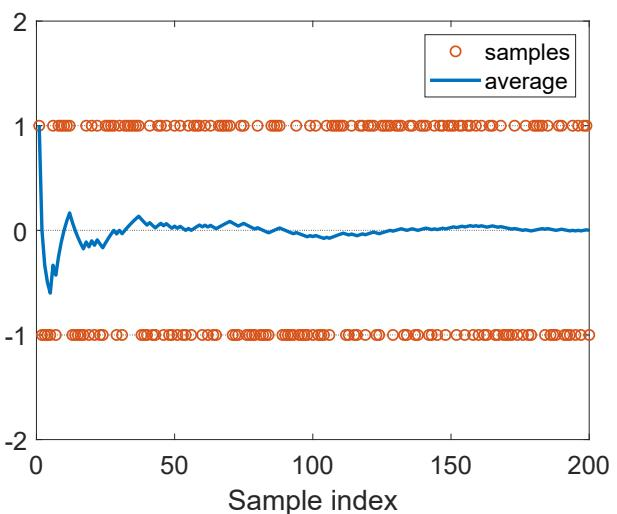
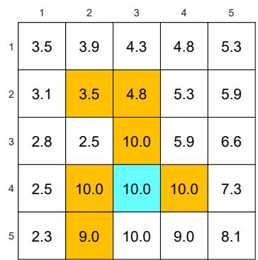
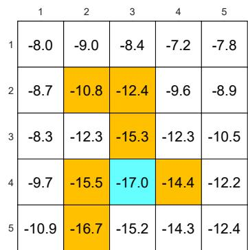
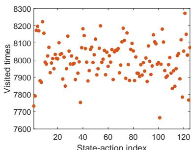
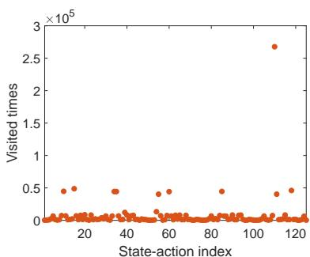

# 第 5 章 蒙特卡洛方法（Monte Carlo Methods）- 5.1-5.7

> 原书 p89-110 · 学习日期 2026-06-06 · 涵盖 5.1-5.7（全章完）

## 本章在全书的位置（先读这段）

第 4 章讲的 value iteration 值迭代、policy iteration 策略迭代和 truncated policy iteration 截断策略迭代都有一个共同前提：模型已知，也就是我们知道

$$
p(r|s,a),\qquad p(s'|s,a).
$$

这让我们可以直接计算

$$
\sum_r p(r|s,a)r+\gamma\sum_{s'}p(s'|s,a)v(s').
$$

第 5 章开始换一个现实得多的设定：**不知道模型，但能和环境交互、拿到样本轨迹**。Monte Carlo methods 蒙特卡洛方法的核心思想就是：

> 如果一个量本质上是某个随机变量的期望，那就不用先知道完整概率分布；我们可以反复采样，再用样本平均值去估计这个期望。

这就是从 model-based 基于模型 到 model-free 无模型 的第一步。它也解释了为什么本章先讲一个看起来很朴素的均值估计问题：state value 状态值和 action value 动作值，本质上都是 return 回报 的期望。

---

## 5.1 Motivating example: Mean estimation（引例：均值估计）

**要解决的问题**：前面计算价值时依赖环境模型；本节要说明，当目标量是 expected value 期望/mean 均值/average 平均值时，即使不知道模型，也可以用 Monte Carlo 蒙特卡洛采样来估计它。

### 为什么均值估计和强化学习有关

我们先看一个普通随机变量 $X$。假设 $X$ 只能取有限个实数，取值集合记为 $\mathcal X$。任务是计算它的期望：

$$
\mathbb E[X].
$$

这件事和强化学习的连接非常直接。第 2 章里，状态值和动作值分别定义为：

$$
v_\pi(s)=\mathbb E_\pi[G_t|S_t=s],
$$

$$
q_\pi(s,a)=\mathbb E_\pi[G_t|S_t=s,A_t=a].
$$

读法：在某个状态，或者某个状态-动作对出发，未来总回报 $G_t$ 是随机的；价值就是这个随机回报的平均水平。

所以估计价值，本质上就是估计均值。这里的随机变量 $X$，到了强化学习里就会变成 $G_t$。

### 方法一：model-based，知道分布就直接算

如果我们知道 $X$ 的概率分布，也就是知道每个 $x\in\mathcal X$ 出现的概率 $p(x)$，那么期望按定义就是：

$$
\mathbb {E} [ X ]
= \sum_ {x \in \mathcal {X}} p (x) x.
$$

可以把它拆成：

$$
\mathbb {E} [ X ]
=
\sum_{x\in\mathcal X}
\underbrace{p(x)}_{\text{这个取值出现的概率}}
\underbrace{x}_{\text{这个取值本身}}.
$$

读法：每个可能结果都乘上它出现的概率，再全部加起来。

这就是 model-based 基于模型 的思路。这里的“模型”就是 $X$ 的概率分布 $p(x)$。在 MDP 里，对应的模型就是转移概率和奖励概率：

$$
p(s'|s,a),\qquad p(r|s,a).
$$

如果这些模型已知，前四章的 Bellman equation 贝尔曼方程和 Bellman optimality equation 贝尔曼最优方程就能直接用。

### 方法二：model-free，不知道分布就用样本平均

如果概率分布 $p(x)$ 不知道，但我们可以拿到样本：

$$
\{x_1,x_2,\ldots,x_n\},
$$

那就用样本平均值估计期望：

$$
\mathbb {E} [ X ]
\approx
\bar{x}
=
\frac {1}{n}\sum_ {j = 1} ^ {n}x_j.
$$

拆开看：

$$
\bar{x}
=
\frac{1}{n}
\underbrace{(x_1+x_2+\cdots+x_n)}_{\text{把采到的结果加起来}}.
$$

读法：不知道每种结果的真实概率也没关系；我们反复观察，样本中各类结果出现的频率会慢慢接近真实概率，所以样本平均值会慢慢接近期望。

这就是 Monte Carlo methods 蒙特卡洛方法 的基本味道：**用随机样本解决估计问题**。

当 $n$ 比较小，$\bar x$ 可能不准；但当 $n\to\infty$ 时，

$$
\bar{x}\to\mathbb E[X].
$$

这个结论由 law of large numbers 大数定律 保证。

### 抛硬币例子：模型已知 vs 模型未知

令随机变量 $X$ 表示抛硬币结果：

$$
X=
\begin{cases}
1, & \text{正面},\\
-1, & \text{反面}.
\end{cases}
$$

如果我们知道硬币是公平的：

$$
p(X=1)=0.5,\qquad p(X=-1)=0.5,
$$

就可以直接算：

$$
\mathbb E[X]
=0.5\cdot 1+0.5\cdot(-1)=0.
$$

如果不知道分布，就反复抛硬币。例如前 10 次结果是：

| 次数 $j$ | 1 | 2 | 3 | 4 | 5 | 6 | 7 | 8 | 9 | 10 |
|---|---:|---:|---:|---:|---:|---:|---:|---:|---:|---:|
| 样本 $x_j$ | 1 | -1 | 1 | 1 | -1 | 1 | -1 | -1 | 1 | -1 |
| 累计和 | 1 | 0 | 1 | 2 | 1 | 2 | 1 | 0 | 1 | 0 |
| 平均值 $\bar x_j$ | 1 | 0 | 0.333 | 0.5 | 0.2 | 0.333 | 0.143 | 0 | 0.111 | 0 |

这里早期的平均值很跳，因为样本太少。比如第 4 次时刚好正面偏多，平均值是 $0.5$；第 10 次时正反面一样多，平均值回到 $0$。如果继续抛很多次，累计平均值通常会围绕真实期望 $0$ 上下摆动，并越来越稳定。

> **原书图 5.2**：橙色圆点是每次采样结果，只可能是 $+1$ 或 $-1$；蓝线是截至当前样本的平均值。样本很少时蓝线波动大，样本增多后逐渐贴近真实期望 $0$。

### Box 5.1：大数定律给了什么保证

设 $\{x_i\}_{i=1}^n$ 是随机变量 $X$ 的 i.i.d. samples 独立同分布样本，并定义样本平均值：

$$
\bar{x}=\frac{1}{n}\sum_{i=1}^{n}x_i.
$$

大数定律在本节用两个式子表达：

$$
\mathbb {E} [ \bar {x} ] = \mathbb {E} [ X ],
$$

$$
\operatorname {var} [ \bar {x} ] = \frac {1}{n} \operatorname {var} [ X ].
$$

第一条说：$\bar x$ 是 $\mathbb E[X]$ 的 unbiased estimate 无偏估计。也就是如果我们把“反复做实验得到的平均值”再取平均，它不会系统性偏高或偏低。

第二条说：样本平均值的方差会随着样本数 $n$ 增加而下降，下降速度是 $1/n$。样本越多，估计越稳。

### 公式推导：为什么均值无偏

从定义开始：

$$
\bar x=\frac{1}{n}\sum_{i=1}^{n}x_i.
$$

对两边取期望：

$$
\mathbb E[\bar x]
=
\mathbb E\left[\frac{1}{n}\sum_{i=1}^{n}x_i\right].
$$

常数 $\frac{1}{n}$ 可以提出去，期望对求和是线性的：

$$
\mathbb E[\bar x]
=
\frac{1}{n}\sum_{i=1}^{n}\mathbb E[x_i].
$$

因为样本同分布，每个 $x_i$ 都来自同一个 $X$，所以：

$$
\mathbb E[x_i]=\mathbb E[X].
$$

代入：

$$
\mathbb E[\bar x]
=
\frac{1}{n}\sum_{i=1}^{n}\mathbb E[X]
=
\frac{1}{n}\cdot n\mathbb E[X]
=
\mathbb E[X].
$$

读法：样本平均值的期望等于真实期望，所以它不是偏向某个方向的估计。

### 公式推导：为什么方差会变小

继续从样本平均值出发：

$$
\operatorname{var}(\bar x)
=
\operatorname{var}\left(\frac{1}{n}\sum_{i=1}^{n}x_i\right).
$$

常数乘随机变量时，方差会乘常数的平方：

$$
\operatorname{var}(\bar x)
=
\frac{1}{n^2}\operatorname{var}\left(\sum_{i=1}^{n}x_i\right).
$$

因为样本彼此独立，和的方差等于方差之和：

$$
\operatorname{var}\left(\sum_{i=1}^{n}x_i\right)
=
\sum_{i=1}^{n}\operatorname{var}(x_i).
$$

因为样本同分布：

$$
\operatorname{var}(x_i)=\operatorname{var}(X).
$$

所以：

$$
\operatorname{var}(\bar x)
=
\frac{1}{n^2}\sum_{i=1}^{n}\operatorname{var}(X)
=
\frac{1}{n^2}\cdot n\operatorname{var}(X)
=
\frac{1}{n}\operatorname{var}(X).
$$

读法：平均 $n$ 个独立样本，会把估计噪声压低到原来的 $1/n$。

### 一个小数值例子：样本数翻倍，估计更稳

公平硬币的 $X\in\{1,-1\}$，真实期望为 $0$。它的方差是：

$$
\operatorname{var}(X)
=\mathbb E[X^2]-\mathbb E[X]^2
=1-0=1.
$$

所以样本平均值的方差是：

$$
\operatorname{var}(\bar x)=\frac{1}{n}.
$$

| 样本数 $n$ | $\operatorname{var}(\bar x)$ | 直观含义 |
|---:|---:|---|
| 1 | 1 | 只抛一次，结果就是 $+1$ 或 $-1$，非常不稳 |
| 4 | 0.25 | 平均 4 次，波动明显小一些 |
| 25 | 0.04 | 平均 25 次，通常会更靠近 0 |
| 100 | 0.01 | 平均 100 次，估计已经比较稳 |

这就是图 5.2 的数学解释：蓝线不是单调靠近 0，它仍然会波动；但波动幅度总体会随样本数增加而变小。

### i.i.d. 是关键条件

本节最后特别提醒：用于均值估计的样本必须是 i.i.d.，即 independent and identically distributed 独立同分布。

它包含两件事：

- independent 独立：样本之间不能互相“绑架”。知道 $x_1$ 不应该决定 $x_2,x_3,\ldots$。
- identically distributed 同分布：每个样本都应该来自同一个随机变量 $X$ 的同一个分布。

原书给了一个极端反例：如果所有样本都等于第一个样本，那么不管采多少次，平均值永远等于第一个样本。比如第一次是 $+1$，后面全被复制成 $+1$，则

$$
\bar x=1
$$

永远不会接近公平硬币的真实期望 $0$。

⚠️ **易错点 1：样本多不等于一定可靠。** 大数定律需要独立同分布条件。很多强相关、带偏的样本，即使数量很大，也可能把你稳定地带向错误答案。

⚠️ **易错点 2：Monte Carlo 不是“神秘随机算法”，这里就是样本平均。** 本章后面把这个思想搬到强化学习：一条条 episode 轨迹给出一次次 return，把这些 return 平均起来估计 $v_\pi$ 或 $q_\pi$。

⚠️ **易错点 3：mean、expected value、average 在本书中可互换。** 但严格说，expected value 是真实分布下的理论量；sample average 是用有限样本算出的估计量。

### 和下一节的关系

5.1 只讲了普通随机变量的均值估计。下一节 5.2 会把随机变量换成回报 $G_t$，把

$$
\mathbb E[X]\approx \frac{1}{n}\sum_{i=1}^{n}x_i
$$

变成

$$
q_\pi(s,a)
=\mathbb E[G_t|S_t=s,A_t=a]
\approx
\frac{1}{n}\sum_{i=1}^{n}g_\pi^{(i)}(s,a).
$$

这一步就是 MC Basic 的核心：不用模型公式算动作值，而是从很多条轨迹的回报平均出来。

---

## 5.2 MC Basic: The simplest MC-based algorithm（MC Basic：最简单的基于 MC 的算法）

**要解决的问题**：第 4 章的 policy iteration 策略迭代需要已知模型来计算动作值；本节要把其中的 policy evaluation 策略评估替换成 Monte Carlo 采样估计，从而得到第一个 model-free 无模型强化学习算法。

### 从策略迭代看问题卡在哪里

策略迭代每一轮有两步。第 $k$ 轮先做策略评估，算当前策略 $\pi_k$ 的状态值：

$$
v_{\pi_k}=r_{\pi_k}+\gamma P_{\pi_k}v_{\pi_k}.
$$

然后做策略改进，找在 $v_{\pi_k}$ 下最贪心的新策略：

$$
\pi_{k+1}
=
\arg\max_{\pi}(r_\pi+\gamma P_\pi v_{\pi_k}).
$$

写到单个状态 $s$ 上，策略改进是：

$$
\begin{array}{l}
\pi_{k+1}(s)
=
\arg\max_\pi
\sum_a \pi(a|s)
\left[
\sum_r p(r|s,a)r
+\gamma\sum_{s'}p(s'|s,a)v_{\pi_k}(s')
\right] \\
=
\arg\max_\pi
\sum_a \pi(a|s)q_{\pi_k}(s,a),
\quad s\in\mathcal S.
\end{array}
$$

读法：在状态 $s$，如果策略 $\pi$ 以概率 $\pi(a|s)$ 选择动作 $a$，那么每个动作带来的“即时奖励加未来价值”就是 $q_{\pi_k}(s,a)$；策略改进就是把概率压到动作值最大的动作上。

这说明一个关键点：**策略迭代表面上先算 state value 状态值，但真正驱动策略变好的量是 action value 动作值**。状态值在这里像中间变量，最终还是要变成每个动作的好坏比较。

### 两种计算动作值的方法

第一种是 model-based 基于模型 的方法，也就是第 4 章策略迭代采用的方法：

$$
q_{\pi_k}(s,a)
=
\sum_r p(r|s,a)r
+\gamma\sum_{s'}p(s'|s,a)v_{\pi_k}(s').
\tag{5.1}
$$

拆开看：

$$
q_{\pi_k}(s,a)
=
\underbrace{\sum_r p(r|s,a)r}_{\text{动作 }a\text{ 的期望即时奖励}}
+
\gamma
\underbrace{\sum_{s'}p(s'|s,a)v_{\pi_k}(s')}_{\text{下一状态价值的期望}}.
$$

读法：先用模型算出这一步平均拿多少奖励，再用模型算出会去哪些下一状态以及那些状态值有多大。

这个方法的问题也很清楚：必须知道

$$
p(r|s,a),\qquad p(s'|s,a).
$$

第二种是 model-free 无模型 的方法。回到动作值的定义：

$$
\begin{array}{l}
q_{\pi_k}(s,a)
=
\mathbb E[G_t|S_t=s,A_t=a] \\
=
\mathbb E[
R_{t+1}+\gamma R_{t+2}+\gamma^2R_{t+3}+\cdots
\mid S_t=s,A_t=a].
\end{array}
$$

读法：从 $(s,a)$ 出发，后面继续按策略 $\pi_k$ 行动，能得到一条轨迹；这条轨迹的折扣回报 $G_t$ 是随机的，动作值就是这些回报的平均水平。

既然动作值本身是一个期望，就可以直接用 5.1 的样本平均思想估计。假设从同一个 $(s,a)$ 出发、后续跟随 $\pi_k$，采到 $n$ 条 episode 轨迹，第 $i$ 条轨迹的 return 回报是 $g_{\pi_k}^{(i)}(s,a)$，则：

$$
q_{\pi_k}(s,a)
=
\mathbb E[G_t|S_t=s,A_t=a]
\approx
\frac{1}{n}\sum_{i=1}^{n}g_{\pi_k}^{(i)}(s,a).
\tag{5.2}
$$

拆开看：

$$
\frac{1}{n}\sum_{i=1}^{n}g_{\pi_k}^{(i)}(s,a)
=
\frac{
\underbrace{g_{\pi_k}^{(1)}(s,a)+\cdots+g_{\pi_k}^{(n)}(s,a)}_{\text{从同一状态-动作对出发得到的多次回报}}
}{n}.
$$

读法：不要问模型“这个动作平均怎样”，而是亲自试很多次，把试出来的总回报平均一下。

⚠️ **易错点 1：model-free 这里要直接估计动作值，不是先估计状态值。** 如果只估计 $v_\pi(s)$，策略改进时仍要用式 (5.1) 从状态值转成动作值，而这一步又需要模型。为了完全摆脱模型，本节直接估计 $q_\pi(s,a)$。

### MC Basic 算法

MC Basic 是 policy iteration 的 model-free 版本。第 $k$ 轮做两件事：

1. Policy evaluation 策略评估：对每个状态-动作对 $(s,a)$，从 $(s,a)$ 出发采集足够多条 episode，后续按当前策略 $\pi_k$ 行动；用这些 episode 的平均 return 得到估计值 $q_k(s,a)$。
2. Policy improvement 策略改进：对每个状态 $s$，选择让 $q_k(s,a)$ 最大的动作，生成新的确定性贪心策略。

算法可以写成：

$$
q_k(s,a)
\approx
q_{\pi_k}(s,a)
=
\mathbb E[G_t|S_t=s,A_t=a],
$$

$$
a_k^*(s)=\arg\max_a q_k(s,a),
$$

$$
\pi_{k+1}(a|s)
=
\begin{cases}
1, & a=a_k^*(s),\\
0, & a\ne a_k^*(s).
\end{cases}
$$

读法：先用采样把每个动作有多好估出来，再在每个状态选当前估计最好的动作。

和第 4 章 policy iteration 对比：

| 步骤     | Policy iteration                  | MC Basic                    |
| ------ | --------------------------------- | --------------------------- |
| 策略评估   | 解 Bellman equation 得到 $v_{\pi_k}$ | 从样本 episode 平均得到 $q_k(s,a)$ |
| 是否需要模型 | 需要 $p(r｜s,a),p(s'｜s,a)$           | 不需要模型，只需要能和环境交互             |
| 策略改进   | 用模型和 $v_{\pi_k}$ 算动作值后贪心          | 直接对估计的 $q_k(s,a)$ 贪心        |
| 核心代价   | 计算模型方程                            | 大量采样                        |

如果每个 $(s,a)$ 都有足够多的样本，那么由大数定律，$q_k(s,a)$ 可以足够准确地近似 $q_{\pi_k}(s,a)$。在这个理想条件下，MC Basic 继承策略迭代的收敛性。

现实里通常拿不到“每个状态-动作对都有足够多 episode”这么奢侈的数据，所以动作值估计会有噪声。但算法仍然常常能工作，这和第 4 章的 truncated policy iteration 截断策略迭代有相似味道：策略改进不一定基于完全精确的动作值，但只要估计方向大体有用，策略就可能逐渐变好。

⚠️ **易错点 2：MC Basic 理论上清楚，实践上样本效率很低。** 它要求对每个 $(s,a)$ 都采集很多完整 episode，这在大状态空间里非常昂贵。本书引入它，主要是为了先把 MC-based reinforcement learning 的核心思想讲透。

### 一个最小数值例子：用回报平均估计动作值

假设在某个状态 $s$ 有两个动作 $a_L,a_R$，当前策略 $\pi_k$ 固定。折扣因子 $\gamma=0.9$。我们从每个状态-动作对出发，各采 3 条 episode，得到下面的折扣回报：

| 状态-动作对 | 第 1 条回报 | 第 2 条回报 | 第 3 条回报 | 样本平均 $q_k$ |
|---|---:|---:|---:|---:|
| $(s,a_L)$ | 2.0 | 1.0 | 3.0 | $2.0$ |
| $(s,a_R)$ | 0.0 | 4.0 | 2.0 | $2.0$ |

这时两个动作打平，策略改进可以任选一个作为贪心动作。假如再多采两条：

| 状态-动作对 | 新增回报 | 5 条样本平均 |
|---|---:|---:|
| $(s,a_L)$ | 2.0, 2.5 | $(2+1+3+2+2.5)/5=2.1$ |
| $(s,a_R)$ | 1.0, 1.5 | $(0+4+2+1+1.5)/5=1.7$ |

现在估计显示 $a_L$ 更好，于是策略改进会令：

$$
\pi_{k+1}(a_L|s)=1.
$$

这个小例子要表达的不是“5 条样本一定够”，而是 MC Basic 的机械过程：**轨迹给 return，return 平均成 action value，action value 决定下一轮策略**。

### 原书 3x3 小例子：一轮怎样改进策略

> **原书图 5.3**：黄色格是 forbidden states，青色格 $s_9$ 是 target state；箭头表示初始策略 $\pi_0$。本例用它展示从 $s_1$ 出发时，怎样比较五个动作的动作值。

奖励设置为：

$$
r_{\mathrm{boundary}}=r_{\mathrm{forbidden}}=-1,\qquad
r_{\mathrm{target}}=1,\qquad
\gamma=0.9.
$$

原书只展示 $s_1$ 的动作值。由于例子中的模型和策略都是 deterministic 确定性的，从同一个 $(s_1,a)$ 出发每次都会得到同一条轨迹，所以每个动作只需要一条 episode 就能知道对应回报。

从 $(s_1,a_1)$ 出发会一直撞边界，回报为：

$$
q_{\pi_0}(s_1,a_1)
=
-1+\gamma(-1)+\gamma^2(-1)+\cdots
=
\frac{-1}{1-\gamma}.
$$

代入 $\gamma=0.9$：

$$
q_{\pi_0}(s_1,a_1)=\frac{-1}{0.1}=-10.
$$

从 $(s_1,a_2)$ 出发，轨迹会到 $s_2$，然后按 $\pi_0$ 到 $s_5$，再到目标附近，原书给出的回报是：

$$
q_{\pi_0}(s_1,a_2)
=
0+\gamma 0+\gamma^2 0+\gamma^3(1)+\gamma^4(1)+\cdots
=
\frac{\gamma^3}{1-\gamma}.
$$

代入 $\gamma=0.9$：

$$
q_{\pi_0}(s_1,a_2)=\frac{0.9^3}{0.1}=7.29.
$$

同理：

$$
q_{\pi_0}(s_1,a_3)=\frac{\gamma^3}{1-\gamma}=7.29,
$$

$$
q_{\pi_0}(s_1,a_4)=\frac{-1}{1-\gamma}=-10,
$$

$$
q_{\pi_0}(s_1,a_5)=\frac{-\gamma}{1-\gamma}=-9.
$$

比较五个动作：

| 动作 | 动作值 | 直观含义 |
|---|---:|---|
| $a_1$ | $-10$ | 立刻撞边界并持续受罚 |
| $a_2$ | $7.29$ | 能走向目标，是最优之一 |
| $a_3$ | $7.29$ | 也能走向目标，是最优之一 |
| $a_4$ | $-10$ | 立刻受罚并持续受罚 |
| $a_5$ | $-9$ | 先不罚，但随后进入坏循环 |

所以策略改进可以选：

$$
\pi_1(a_2|s_1)=1
\quad\text{or}\quad
\pi_1(a_3|s_1)=1.
$$

读法：$a_2$ 和 $a_3$ 都是同样好的贪心动作，任选其一都能让 $s_1$ 的策略变优。这个例子里初始策略只在少数状态非最优，所以一轮就可以得到最优策略；更一般的情况需要多轮评估-改进。

### 更大的例子：episode length 为什么这么重要

图 5.4 的 5x5 网格世界用来说明：MC Basic 的估计依赖完整 episode 的 return，因此 episode 太短时，远期奖励根本传不回来。

奖励设置为：

$$
r_{\mathrm{boundary}}=-1,\qquad
r_{\mathrm{forbidden}}=-10,\qquad
r_{\mathrm{target}}=1,\qquad
\gamma=0.9.
$$

> **原书图 5.4(a)**：episode length 只有 1 时，只有目标附近状态能很快获得非零正奖励；更远的状态看不到目标，价值估计多为 0。

> **原书图 5.4(h)**：episode length 足够长时，远处状态的轨迹也有机会到达目标，正回报能通过 return 反映到更远的状态上。

为什么会这样？因为 MC 不是用 Bellman backup 一步步显式传播价值，而是看一整条采样轨迹的总回报。若从某个远处状态出发，至少要 15 步才能到目标，但 episode length 只有 4，那么这条 episode 的 return 永远看不到目标奖励。于是样本平均会告诉算法：“这里好像没有正价值。”这不是策略真的没用，而是采样窗口太短。

可以用一个极小例子看清楚。假设从状态 $s$ 到目标必须走 3 步，前两步奖励为 0，到目标后每步得到 1，$\gamma=0.9$。

如果 episode length 只有 2：

$$
G=0+\gamma\cdot 0=0.
$$

如果 episode length 至少 5：

$$
G=0+\gamma\cdot 0+\gamma^2\cdot 0+\gamma^3\cdot 1+\gamma^4\cdot 1+\cdots.
$$

截到第 5 步时至少有：

$$
G_{\text{len}=5}
=
\gamma^3+\gamma^4
=
0.729+0.6561
=
1.3851.
$$

同一个起点、同一个策略，因为 episode length 不同，估计出来的价值会完全不同。图 5.4(a)-(h) 展示的就是这种“正奖励从目标附近逐渐向外显现”的空间模式。

⚠️ **易错点 3：episode 不够长时，MC 不是低估一点点，而是可能完全看不到远期奖励。** 这在 sparse reward 稀疏奖励 问题里尤其严重。

### Sparse reward 稀疏奖励

Sparse reward 稀疏奖励指的是：除非到达目标，否则几乎没有正奖励。比如迷宫里只有走到终点才给 $+1$，中间所有格子都是 $0$。

这种设计很自然，但对 MC Basic 很不友好。原因是：

$$
\text{到不了目标}
\Rightarrow
\text{episode 里没有正奖励}
\Rightarrow
G_t \text{ 很可能为 }0
\Rightarrow
q_k(s,a)\text{ 难以区分动作好坏}.
$$

原书提到一种简单缓解办法：把奖励设计成 nonsparse rewards 非稀疏奖励。例如目标附近的状态也给一点小正奖励，形成类似 attractive field 吸引场 的效果，让智能体更容易发现“往目标方向走是有希望的”。

⚠️ **易错点 4：奖励塑形不是随便塞奖励。** 奖励变密可以提高学习效率，但如果设计不当，也可能改变原任务真正想要的最优行为。本节只是提出直觉，后面更复杂算法会继续处理样本效率问题。

### 和前后文的关系

5.1 给出 Monte Carlo 均值估计：

$$
\mathbb E[X]\approx\frac{1}{n}\sum_{i=1}^{n}x_i.
$$

5.2 把 $X$ 换成回报 $G_t$，得到：

$$
q_\pi(s,a)
\approx
\frac{1}{n}\sum_{i=1}^{n}g_\pi^{(i)}(s,a).
$$

再把这个估计嵌进第 4 章的 policy iteration，就得到 MC Basic。它的价值不在于实用性强，而在于把本章主线钉牢：**不用模型，也能通过采样估计动作值，然后用动作值改进策略**。后面的算法会沿着这条线继续提高样本效率。

---

## 5.3 MC Exploring Starts（蒙特卡洛探索性起点）

**要解决的问题**：5.2 的 MC Basic 能工作但太浪费样本；本节要让一条 episode 里的多个 state-action visits 状态-动作访问都贡献价值估计，并允许策略按 episode 逐步更新，从而得到更高效的 MC Exploring Starts 算法。

### 样本效率问题：一条 episode 不只服务于起点

假设当前策略是 $\pi$，我们采到一条 episode：

$$
s_1 \xrightarrow{a_2} s_2
\xrightarrow{a_4} s_1
\xrightarrow{a_2} s_2
\xrightarrow{a_3} s_5
\xrightarrow{a_1}\cdots
\tag{5.3}
$$

这里的下标是状态或动作编号，不是时间编号。比如 $s_1$ 表示“编号为 1 的状态”，不是“第 1 个时间步的状态”。

Every time a state-action pair appears in an episode, it is called a visit of that state-action pair. 翻成中文就是：episode 中每出现一次状态-动作对 $(s,a)$，就叫对这个 state-action pair 状态-动作对的一次 visit 访问。

MC Basic 的用法非常保守：一条 episode 从哪个 $(s,a)$ 出发，就只用来估计这个初始 $(s,a)$ 的动作值。这叫 initial-visit strategy 初始访问策略。对式 (5.3) 来说，它只估计：

$$
(s_1,a_2).
$$

但这条 episode 其实还访问了很多别的状态-动作对，比如：

$$
(s_2,a_4),\qquad (s_2,a_3),\qquad (s_5,a_1).
$$

这些访问后面的轨迹，也可以看成“从该状态-动作对出发的一条子 episode”。也就是：

$$
\begin{array}{l}
s_1 \xrightarrow{a_2} s_2 \xrightarrow{a_4} s_1 \xrightarrow{a_2} s_2 \xrightarrow{a_3} s_5 \xrightarrow{a_1}\cdots
\quad [\text{original episode}]\\
s_2 \xrightarrow{a_4} s_1 \xrightarrow{a_2} s_2 \xrightarrow{a_3} s_5 \xrightarrow{a_1}\cdots
\quad [\text{subepisode from }(s_2,a_4)]\\
s_1 \xrightarrow{a_2} s_2 \xrightarrow{a_3} s_5 \xrightarrow{a_1}\cdots
\quad [\text{subepisode from }(s_1,a_2)]\\
s_2 \xrightarrow{a_3} s_5 \xrightarrow{a_1}\cdots
\quad [\text{subepisode from }(s_2,a_3)]\\
s_5 \xrightarrow{a_1}\cdots
\quad [\text{subepisode from }(s_5,a_1)].
\end{array}
$$

读法：从一条完整轨迹的任意中间位置往后截一段，也是一条“从这个中间状态-动作对开始”的经验样本。因此，一条 episode 可以为多个动作值提供 return，而不是只为起点服务。

### Initial-visit、first-visit、every-visit

本节区分三种利用 visit 的策略：

| 策略 | 使用哪些访问 | 样本效率 |
|---|---|---|
| initial-visit 初始访问 | 只用 episode 开头的那个 $(s,a)$ | 最低，MC Basic 采用 |
| first-visit 首次访问 | 每个 $(s,a)$ 在一条 episode 中第一次出现时使用 | 中等 |
| every-visit 每次访问 | 每次出现 $(s,a)$ 都使用 | 最高，MC Exploring Starts 采用 |

用式 (5.3) 看，$(s_1,a_2)$ 出现了两次。first-visit 只会用第一次出现后的 return；every-visit 会把两次出现后的 return 都作为样本。

⚠️ **易错点 1：first-visit 不是 initial-visit。** initial-visit 只关心整条 episode 的起点；first-visit 会关心这条 episode 中每个状态-动作对的第一次出现。

⚠️ **易错点 2：every-visit 样本更多，但样本之间可能相关。** 如果同一条 episode 中第二次访问后的轨迹，是第一次访问后轨迹的一个后缀，那么这两个 return 不是完全独立样本。原书说，如果两次访问在轨迹上相距很远，这种相关性通常不会太强。

### 一个小数值例子：从后缀轨迹算多个 return

假设一条 episode 是：

$$
s_A \xrightarrow{a_R} s_B
\xrightarrow{a_U} s_C
\xrightarrow{a_L} s_D,
$$

奖励序列为：

$$
r_1=0,\qquad r_2=2,\qquad r_3=1,
$$

折扣因子 $\gamma=0.5$。

从每个时间点开始的 return 分别是：

$$
G_2=r_3=1,
$$

$$
G_1=r_2+\gamma G_2=2+0.5\cdot 1=2.5,
$$

$$
G_0=r_1+\gamma G_1=0+0.5\cdot 2.5=1.25.
$$

所以这一条 episode 可以同时更新三个状态-动作对：

| 起点 | 对应 return | 可用于估计 |
|---|---:|---|
| $(s_A,a_R)$ | $G_0=1.25$ | $q(s_A,a_R)$ |
| $(s_B,a_U)$ | $G_1=2.5$ | $q(s_B,a_U)$ |
| $(s_C,a_L)$ | $G_2=1$ | $q(s_C,a_L)$ |

这就是 every-visit 的威力：同样一条轨迹，MC Basic 可能只用第一行，MC Exploring Starts 会尽量把三行都用上。

换句话说，**子轨迹对应的状态-动作对也会被更新**。更重要的是，如果同一个状态-动作对在一条 episode 中出现多次，every-visit 会对它更新多次。例如完整轨迹

$$
A \xrightarrow{\mathrm{loop},\,r=0} A
\xrightarrow{\mathrm{loop},\,r=1} B
\xrightarrow{\mathrm{finish},\,r=3} T
$$

里，$(A,\mathrm{loop})$ 出现了两次。第二次出现后的后缀轨迹是：

$$
A \xrightarrow{\mathrm{loop},\,r=1} B
\xrightarrow{\mathrm{finish},\,r=3} T,
$$

它给 $(A,\mathrm{loop})$ 提供一个 return：

$$
G_1=1+\gamma\cdot 3.
$$

第一次出现后的后缀轨迹是完整轨迹本身：

$$
A \xrightarrow{\mathrm{loop},\,r=0} A
\xrightarrow{\mathrm{loop},\,r=1} B
\xrightarrow{\mathrm{finish},\,r=3} T,
$$

它又给同一个 $(A,\mathrm{loop})$ 提供另一个 return：

$$
G_0=0+\gamma(1+\gamma\cdot 3).
$$

因此，every-visit 会用 $G_1$ 和 $G_0$ 两个样本都更新 $q(A,\mathrm{loop})$。如果是 first-visit，则只使用第一次出现的 $G_0$。

⚠️ **易错点：子轨迹不是重新采样得到的新 episode。** 它只是同一条 episode 从某个 visit 开始往后的后缀。样本本身没有变多，算法只是把已有轨迹里的每次访问都用得更充分。

### 策略更新效率：等全部样本 vs 每条 episode 更新

MC-based reinforcement learning 还有第二个效率问题：什么时候更新策略？

第一种策略是 MC Basic 的做法：对同一个 $(s,a)$ 先收集很多 episode，然后平均这些 return，再更新动作值和策略。缺点是要等很久，必须攒够一批样本才能动。

第二种策略是 episode-by-episode 逐 episode 更新：每拿到一条 episode，就立刻用它的 return 更新相关动作值，然后顺手改进策略。

这个做法听起来粗糙，因为一条 episode 的 return 噪声很大，不可能准确代表真实动作值：

$$
q_\pi(s,a)=\mathbb E[G_t|S_t=s,A_t=a].
$$

但第 4 章的 generalized policy iteration 广义策略迭代 已经给了直觉：策略评估和策略改进可以交错进行；价值估计不必完全精确，策略仍然可以逐渐变好。也就是说，我们可以一边估计、一边改进。

### Algorithm 5.2：MC Exploring Starts

MC Exploring Starts 把上面两个增强技巧合在一起：

1. 使用 every-visit strategy 每次访问策略，提高一条 episode 的利用率。
2. 每条 episode 后立即更新 action value 动作值 和 policy 策略，而不是等全部样本收集完。

算法维护三个表：

| 量 | 含义 |
|---|---|
| $q(s,a)$ | 当前对动作值的估计 |
| $\mathrm{Returns}(s,a)$ | 到目前为止，所有用于 $(s,a)$ 的 return 总和 |
| $\mathrm{Num}(s,a)$ | 到目前为止，$(s,a)$ 被用于更新的次数 |

初始化：

$$
\mathrm{Returns}(s,a)=0,\qquad
\mathrm{Num}(s,a)=0,
$$

并给定初始策略 $\pi_0(a|s)$ 和初始动作值 $q(s,a)$。

每生成一条 episode，就做：

1. Episode generation 轨迹生成：选择一个起始状态-动作对 $(s_0,a_0)$，并保证所有状态-动作对都有可能被选为起点；这就是 exploring-starts condition 探索性起点条件。之后按当前策略生成长度为 $T$ 的 episode：

$$
s_0,a_0,r_1,\ldots,s_{T-1},a_{T-1},r_T.
$$

2. 从 episode 末尾往前计算 return。先令：

$$
g\leftarrow 0.
$$

然后对

$$
t=T-1,T-2,\ldots,0
$$

依次做：

$$
g\leftarrow \gamma g+r_{t+1}.
$$

读法：如果已经知道“从下一步开始的折扣回报”是 $g$，那么从当前步开始的回报就是“当前收到的奖励 $r_{t+1}$，加上折扣后的未来回报 $\gamma g$”。

这个反向递推来自 return 的定义：

$$
G_t
=
R_{t+1}+\gamma R_{t+2}+\gamma^2R_{t+3}+\cdots
=
R_{t+1}+\gamma G_{t+1}.
$$

3. 用当前得到的 $g$ 更新累计 return 和访问次数：

$$
\mathrm{Returns}(s_t,a_t)
\leftarrow
\mathrm{Returns}(s_t,a_t)+g,
$$

$$
\mathrm{Num}(s_t,a_t)
\leftarrow
\mathrm{Num}(s_t,a_t)+1.
$$

4. 用样本平均更新动作值：

$$
q(s_t,a_t)
\leftarrow
\frac{\mathrm{Returns}(s_t,a_t)}
{\mathrm{Num}(s_t,a_t)}.
$$

5. 对当前状态 $s_t$ 做贪心策略改进：

$$
\pi(a|s_t)
=
\begin{cases}
1, & a=\arg\max_a q(s_t,a),\\
0, & \text{otherwise}.
\end{cases}
$$

⚠️ **易错点 3：反向循环不是在“倒着经历环境”。** 环境交互仍然是从 $t=0$ 到 $T$ 正向发生；算法只是等 episode 收集完后，从末尾往前高效计算每个时间点的 return。

### 手算例子：同一个状态-动作对在一条 episode 中更新两次

我们用一个最小环境把 Algorithm 5.2 跑一遍，重点看 every-visit 怎样让同一个状态-动作对在一条 episode 中被更新两次。环境里有两个非终止状态 $A,B$，一个终止状态 $T$。折扣因子为：

$$
\gamma=0.9.
$$

动作和奖励如下：

| 状态 | 动作 | 结果 |
|---|---|---|
| $A$ | $\mathrm{loop}$ | 留在 $A$ 或到 $B$，奖励由样本轨迹给出 |
| $A$ | $\mathrm{exit}$ | 到 $T$，奖励 $1$ |
| $B$ | $\mathrm{finish}$ | 到 $T$，奖励 $3$ |

初始动作值都设为 0：

$$
q(A,\mathrm{loop})=0,\qquad
q(A,\mathrm{exit})=0,\qquad
q(B,\mathrm{finish})=0.
$$

对应的累计 return 和访问次数也都是 0：

$$
\mathrm{Returns}(s,a)=0,\qquad
\mathrm{Num}(s,a)=0.
$$

#### 第 1 条 episode：$(A,\mathrm{loop})$ 出现两次

Exploring starts 允许 episode 从任意状态-动作对开始。假设第一条 episode 从 $(A,\mathrm{loop})$ 开始，得到轨迹：

$$
A \xrightarrow{\mathrm{loop},\,r=0} A
\xrightarrow{\mathrm{loop},\,r=1} B
\xrightarrow{\mathrm{finish},\,r=3} T.
$$

写成时间步：

| $t$ | $s_t$ | $a_t$ | $r_{t+1}$ |
|---:|---|---|---:|
| 0 | $A$ | $\mathrm{loop}$ | 0 |
| 1 | $A$ | $\mathrm{loop}$ | 1 |
| 2 | $B$ | $\mathrm{finish}$ | 3 |

从后往前计算。先令：

$$
g\leftarrow 0.
$$

最后一步 $t=2$：

$$
g\leftarrow \gamma g+r_3
=0.9\cdot 0+3
=3.
$$

所以：

$$
G_2=3.
$$

更新 $(B,\mathrm{finish})$：

$$
\mathrm{Returns}(B,\mathrm{finish})=3,\qquad
\mathrm{Num}(B,\mathrm{finish})=1,
$$

$$
q(B,\mathrm{finish})
=
\frac{3}{1}
=3.
$$

再往前一步 $t=1$。这是第二次访问 $(A,\mathrm{loop})$：

$$
g\leftarrow \gamma g+r_2
=0.9\cdot 3+1
=3.7.
$$

所以：

$$
G_1=3.7.
$$

第一次更新 $(A,\mathrm{loop})$：

$$
\mathrm{Returns}(A,\mathrm{loop})=3.7,\qquad
\mathrm{Num}(A,\mathrm{loop})=1,
$$

$$
q(A,\mathrm{loop})
=
\frac{3.7}{1}
=3.7.
$$

再往前一步 $t=0$。这是第一次访问 $(A,\mathrm{loop})$：

$$
g\leftarrow \gamma g+r_1
=0.9\cdot 3.7+0
=3.33.
$$

所以：

$$
G_0=3.33.
$$

第二次更新同一个 $(A,\mathrm{loop})$：

$$
\mathrm{Returns}(A,\mathrm{loop})
\leftarrow
3.7+3.33
=7.03,
$$

$$
\mathrm{Num}(A,\mathrm{loop})
\leftarrow
1+1
=2.
$$

于是样本平均动作值变成：

$$
q(A,\mathrm{loop})
=
\frac{7.03}{2}
=3.515.
$$

第 1 条 episode 后，动作值表是：

| 状态-动作 | $q(s,a)$ |
|---|---:|
| $(A,\mathrm{loop})$ | 3.515 |
| $(A,\mathrm{exit})$ | 0 |
| $(B,\mathrm{finish})$ | 3 |

做 greedy policy improvement 贪心策略改进。在状态 $A$：

$$
q(A,\mathrm{loop})=3.515>q(A,\mathrm{exit})=0,
$$

所以：

$$
\pi(A)=\mathrm{loop}.
$$

在状态 $B$，只有一个动作：

$$
\pi(B)=\mathrm{finish}.
$$

这里就是 every-visit 和 first-visit 的差别。如果采用 first-visit，同一条 episode 里 $(A,\mathrm{loop})$ 只会用第一次出现的 $G_0=3.33$ 更新一次；而 every-visit 还会使用第二次出现的 $G_1=3.7$，所以 $\mathrm{Num}(A,\mathrm{loop})$ 会增加 2。

#### 第 2 条 episode：从 $(A,\mathrm{exit})$ 探索性起点开始

第二条 episode 从另一个状态-动作对 $(A,\mathrm{exit})$ 开始：

$$
A \xrightarrow{\mathrm{exit},\,r=1} T.
$$

反向计算 return。先令：

$$
g\leftarrow 0.
$$

唯一一步：

$$
g\leftarrow 0.9\cdot 0+1=1.
$$

更新 $(A,\mathrm{exit})$：

$$
\mathrm{Returns}(A,\mathrm{exit})=1,\qquad
\mathrm{Num}(A,\mathrm{exit})=1,
$$

$$
q(A,\mathrm{exit})
=
\frac{1}{1}
=1.
$$

此时动作值表变成：

| 状态-动作 | $q(s,a)$ |
|---|---:|
| $(A,\mathrm{loop})$ | 3.515 |
| $(A,\mathrm{exit})$ | 1 |
| $(B,\mathrm{finish})$ | 3 |

再次做策略改进：

$$
q(A,\mathrm{loop})=3.515>q(A,\mathrm{exit})=1,
$$

所以策略仍然是：

$$
\pi(A)=\mathrm{loop},\qquad
\pi(B)=\mathrm{finish}.
$$

这个结果符合直觉：在 $A$ 直接退出只能拿到 $1$；而当前样本显示 $\mathrm{loop}$ 后续可能到达 $B$ 并 finish，得到更高回报。注意这里的数值 $3.515$ 是从同一条 episode 里的两个 visit 平均出来的：

$$
\frac{G_1+G_0}{2}
=
\frac{3.7+3.33}{2}
=3.515.
$$

所以 $\mathrm{loop}$ 比 $\mathrm{exit}$ 更好。

这个例子展示了 MC Exploring Starts 的完整工作流：

$$
\text{选探索性起点}
\rightarrow
\text{生成 episode}
\rightarrow
\text{从后往前算每个 visit 的 return}
\rightarrow
\text{更新 }q(s,a)
\rightarrow
\text{立刻贪心改进策略}.
$$

### Exploring starts condition 探索性起点条件

Exploring starts condition 要求：每个状态-动作对 $(s,a)$ 都有足够多机会作为 episode 的起点。

为什么需要它？因为 MC 估计依靠大数定律：

$$
q_\pi(s,a)
\approx
\frac{1}{n}\sum_{i=1}^{n}g_\pi^{(i)}(s,a).
$$

如果某个 $(s,a)$ 几乎从不被采样，那么 $n$ 很小，甚至是 0；它的动作值就估不准。更糟的是，如果这个动作其实是最优动作，但因为没探索过，当前估计很低，贪心策略就永远不会选它。

可以用一个两动作例子看：

| 动作 | 真实平均回报 | 当前采样次数 | 当前估计 |
|---|---:|---:|---:|
| $a_1$ | 1 | 100 | 1.0 |
| $a_2$ | 5 | 0 | 0.0 |

如果策略只按当前估计贪心，它会一直选 $a_1$，因为 $1.0>0.0$。但真实最优动作其实是 $a_2$。这就是 insufficient exploration 探索不足 的危险。

MC Basic 和 MC Exploring Starts 都需要 exploring starts。但这个条件在很多现实任务里很难满足，尤其是涉及物理环境时：我们不能随意把智能体传送到任意状态，再强迫它以任意动作开局。

### 和前后文的关系

5.2 的 MC Basic 把“模型计算动作值”换成“采样估计动作值”，但它样本利用很低。5.3 的 MC Exploring Starts 做了两个升级：

$$
\text{一条 episode 只用起点}
\quad\Longrightarrow\quad
\text{一条 episode 的每次 visit 都能用};
$$

$$
\text{攒齐很多 episode 再更新}
\quad\Longrightarrow\quad
\text{每条 episode 后就更新}.
$$

不过它仍然保留一个强假设：所有 $(s,a)$ 都必须能被充分探索。下一节会问一个更现实的问题：能不能去掉 exploring starts 要求？

---

## 5.4 MC $\epsilon$-Greedy: Learning without exploring starts（不用探索性起点的 MC ε-贪心）

**要解决的问题**：5.3 的 MC Exploring Starts 仍要求每个 $(s,a)$ 都能作为 episode 起点；本节要用 soft policy 软策略，特别是 $\epsilon$-greedy policy ε-贪心策略，让智能体在正常交互中也能持续探索所有动作，从而移除 exploring starts 条件。

### 为什么 soft policy 可以替代 exploring starts

5.3 的 exploring starts condition 探索性起点条件要求：每个状态-动作对 $(s,a)$ 都有机会作为 episode 的开头。这个条件很强，因为现实里我们往往不能随意指定智能体“从某个状态开始，并且第一步必须做某个动作”。

本节换一个思路：不强行控制 episode 的起点，而是让策略本身保留探索性。

Soft policy 软策略 的定义是：在任意状态 $s$，每个动作 $a\in\mathcal A(s)$ 都有正概率被选择：

$$
\pi(a|s)>0.
$$

读法：策略可以偏爱某些动作，但不能把其他动作的概率压成 0。只要 episode 足够长，所有动作就仍有机会被试到；这样就不必依赖“从任意 $(s,a)$ 开局”的 exploring starts。

⚠️ **易错点 1：soft policy 不是 uniform policy。** Uniform policy 均匀策略 是每个动作概率完全相同；soft policy 只要求每个动作概率大于 0，可以明显偏向当前看起来最好的动作。

### $\epsilon$-greedy policy 的定义

一种常用 soft policy 是 $\epsilon$-greedy policy ε-贪心策略。它的思想是：

$$
\text{大部分概率选当前最优动作，小部分概率探索其他动作。}
$$

设状态 $s$ 下动作数为：

$$
|\mathcal A(s)|.
$$

当前 greedy action 贪心动作 是动作值最大的动作：

$$
a^*=\arg\max_a q(s,a).
$$

给定 $\epsilon\in[0,1]$，$\epsilon$-greedy policy 为：

$$
\pi(a|s)
=
\begin{cases}
1-\frac{\epsilon}{|\mathcal A(s)|}\left(|\mathcal A(s)|-1\right),
& \text{for the greedy action},\\
\frac{\epsilon}{|\mathcal A(s)|},
& \text{for the other }|\mathcal A(s)|-1\text{ actions}.
\end{cases}
$$

贪心动作的概率也可以改写成：

$$
1-\frac{\epsilon}{|\mathcal A(s)|}\left(|\mathcal A(s)|-1\right)
=
1-\epsilon+\frac{\epsilon}{|\mathcal A(s)|}.
$$

读法：先拿出 $\epsilon$ 的概率做随机探索，探索时从所有动作中均匀选；剩下 $1-\epsilon$ 的概率直接选贪心动作。因为探索时也可能再次选到贪心动作，所以贪心动作总概率是：

$$
1-\epsilon+\frac{\epsilon}{|\mathcal A(s)|}.
$$

其他每个动作只在探索阶段被选到，概率是：

$$
\frac{\epsilon}{|\mathcal A(s)|}.
$$

由于：

$$
1-\epsilon+\frac{\epsilon}{|\mathcal A(s)|}
\ge
\frac{\epsilon}{|\mathcal A(s)|},
$$

所以贪心动作的概率总是不小于其他动作。

### 一个三动作数值例子

假设状态 $s$ 有 3 个动作：

$$
\mathcal A(s)=\{a_1,a_2,a_3\},
\qquad
|\mathcal A(s)|=3.
$$

当前动作值为：

| 动作 | $q(s,a)$ |
|---|---:|
| $a_1$ | 4 |
| $a_2$ | 2 |
| $a_3$ | 1 |

所以：

$$
a^*=a_1.
$$

令：

$$
\epsilon=0.3.
$$

则非贪心动作概率为：

$$
\frac{\epsilon}{|\mathcal A(s)|}
=
\frac{0.3}{3}
=0.1.
$$

贪心动作概率为：

$$
1-\epsilon+\frac{\epsilon}{|\mathcal A(s)|}
=
1-0.3+0.1
=0.8.
$$

所以策略是：

| 动作 | 概率 |
|---|---:|
| $a_1$ | 0.8 |
| $a_2$ | 0.1 |
| $a_3$ | 0.1 |

这就是 $\epsilon$-greedy 的平衡：$a_1$ 明显更常被选，但 $a_2,a_3$ 永远没有被彻底放弃。

如果 $\epsilon=0$，策略退化成 pure greedy 纯贪心：

$$
\pi(a_1|s)=1,\qquad \pi(a_2|s)=\pi(a_3|s)=0.
$$

如果 $\epsilon=1$，每个动作概率都变成：

$$
\frac{1}{3}.
$$

这时策略就是 uniform random policy 均匀随机策略。

### 怎么实际按 $\epsilon$-greedy 选动作

原书给了一个采样办法：

1. 从 $[0,1]$ 上均匀采一个随机数 $x$。
2. 如果 $x\ge\epsilon$，选择 greedy action 贪心动作。
3. 如果 $x<\epsilon$，从所有动作 $\mathcal A(s)$ 中均匀随机选一个动作；注意这里仍可能再次选到贪心动作。

为什么这样得到的概率和上面一致？

贪心动作有两条路径被选中：

$$
\Pr(\text{greedy})
=
\Pr(x\ge\epsilon)
+
\Pr(x<\epsilon)\Pr(\text{random chooses greedy}).
$$

代入：

$$
\Pr(\text{greedy})
=
(1-\epsilon)+\epsilon\cdot\frac{1}{|\mathcal A(s)|}
=
1-\epsilon+\frac{\epsilon}{|\mathcal A(s)|}.
$$

任意非贪心动作只有探索阶段能被选中：

$$
\Pr(\text{non-greedy action})
=
\epsilon\cdot\frac{1}{|\mathcal A(s)|}
=
\frac{\epsilon}{|\mathcal A(s)|}.
$$

⚠️ **易错点 2：本书这里的实现是“探索时从所有动作中均匀选”，不是“只从非贪心动作中均匀选”。** 所以贪心动作概率不是 $1-\epsilon$，而是 $1-\epsilon+\epsilon/|\mathcal A(s)|$。

### 从 greedy policy improvement 到 ε-greedy policy improvement

MC Basic 和 MC Exploring Starts 的策略改进，本质上是在所有策略集合 $\Pi$ 中解：

$$
\pi_{k+1}(s)
=
\arg\max_{\pi\in\Pi}
\sum_a \pi(a|s)q_{\pi_k}(s,a).
\tag{5.4}
$$

读法：在状态 $s$，找一个策略分布 $\pi(a|s)$，让加权平均动作值最大。因为可以把全部概率放到动作值最大的动作上，所以解是 greedy policy 贪心策略：

$$
\pi_{k+1}(a|s)
=
\begin{cases}
1, & a=a_k^*,\\
0, & a\ne a_k^*,
\end{cases}
$$

其中：

$$
a_k^*=\arg\max_a q_{\pi_k}(s,a).
$$

现在为了保持探索性，我们不再允许策略从所有 $\Pi$ 中任选，而是限制在 $\epsilon$-greedy policies 的集合 $\Pi_\epsilon$ 中：

$$
\pi_{k+1}(s)
=
\arg\max_{\pi\in\Pi_\epsilon}
\sum_a \pi(a|s)q_{\pi_k}(s,a).
\tag{5.5}
$$

解就是：仍然让当前动作值最大的 $a_k^*$ 拿最高概率，但其他动作也保留 $\epsilon/|\mathcal A(s)|$ 的概率：

$$
\pi_{k+1}(a|s)
=
\begin{cases}
1-\frac{|\mathcal A(s)|-1}{|\mathcal A(s)|}\epsilon,
& a=a_k^*,\\
\frac{1}{|\mathcal A(s)|}\epsilon,
& a\ne a_k^*.
\end{cases}
$$

注意第一行和前面的写法等价：

$$
1-\frac{|\mathcal A(s)|-1}{|\mathcal A(s)|}\epsilon
=
1-\epsilon+\frac{\epsilon}{|\mathcal A(s)|}.
$$

### Algorithm 5.3：MC ε-Greedy

MC $\epsilon$-Greedy 和 MC Exploring Starts 几乎相同：仍然用 every-visit，每条 episode 后反向计算 return、更新 $\mathrm{Returns}$、$\mathrm{Num}$ 和 $q(s,a)$。唯一关键变化是策略改进：

$$
\text{greedy improvement}
\quad\Longrightarrow\quad
\epsilon\text{-greedy improvement}.
$$

算法步骤可以压缩成：

1. 初始化 $\pi_0(a|s)$、$q(s,a)$、$\mathrm{Returns}(s,a)=0$、$\mathrm{Num}(s,a)=0$，并选择 $\epsilon\in(0,1]$。
2. 生成 episode。起点不再要求满足 exploring starts；后续按当前 $\epsilon$-greedy 策略行动。
3. 从后往前计算：

$$
g\leftarrow \gamma g+r_{t+1}.
$$

4. 对每个 visit 更新：

$$
\mathrm{Returns}(s_t,a_t)
\leftarrow
\mathrm{Returns}(s_t,a_t)+g,
$$

$$
\mathrm{Num}(s_t,a_t)
\leftarrow
\mathrm{Num}(s_t,a_t)+1,
$$

$$
q(s_t,a_t)
\leftarrow
\frac{\mathrm{Returns}(s_t,a_t)}
{\mathrm{Num}(s_t,a_t)}.
$$

5. 令：

$$
a^*=\arg\max_a q(s_t,a),
$$

并把当前状态 $s_t$ 的策略更新为：

$$
\pi(a|s_t)
=
\begin{cases}
1-\frac{|\mathcal A(s_t)|-1}{|\mathcal A(s_t)|}\epsilon,
& a=a^*,\\
\frac{1}{|\mathcal A(s_t)|}\epsilon,
& a\ne a^*.
\end{cases}
$$

⚠️ **易错点 3：去掉 exploring starts 不等于去掉探索。** 只是把“从任意 $(s,a)$ 开局”的外部强制探索，改成“策略本身给每个动作正概率”的内部随机探索。

### 收敛到什么：最优策略还是 ε-贪心最优策略？

原书这里给出一个很诚实的回答：既是 yes，也是 no。

Yes 的意思是：如果样本足够多，MC $\epsilon$-Greedy 可以收敛到 $\Pi_\epsilon$ 中的最优策略，也就是在所有 $\epsilon$-greedy 策略里最好的那个。

No 的意思是：$\Pi_\epsilon$ 只是所有策略 $\Pi$ 的一个子集。只要 $\epsilon>0$，策略就必须保留一些探索概率，不能把最优动作概率设成 1。因此它可能不是整个 $\Pi$ 中真正的 optimal policy 最优策略。

不过，如果 $\epsilon$ 很小，$\Pi_\epsilon$ 中的最优策略会很接近真正的最优策略。比如两个动作时，$\epsilon=0.02$，贪心动作概率是：

$$
1-\epsilon+\frac{\epsilon}{2}
=
1-0.02+0.01
=0.99.
$$

它几乎总是选择当前最优动作，只保留很小概率继续探索。

### 图 5.5：单条超长 episode 也能学习

原书用 5x5 grid world 展示 MC $\epsilon$-Greedy。奖励设置为：

$$
r_{\mathrm{boundary}}=r_{\mathrm{forbidden}}=-1,\qquad
r_{\mathrm{target}}=1,\qquad
\gamma=0.9.
$$

每次迭代只生成一条 episode，但这条 episode 有一百万步。$\epsilon=0.5$。初始策略是 uniform policy，每个动作概率都是 $0.2$。

> **原书图 5.5(a)**：初始策略对每个动作给相同概率，因此每个格子里各方向都一样粗。

> **原书图 5.5(b)**：经过一条超长 episode 后，许多状态已经根据估计出的动作值偏向某个更好的方向，但仍保留探索概率。

> **原书图 5.5(c)**：第二次迭代后得到 $\epsilon=0.5$ 下的最优 ε-贪心策略。它不是纯贪心策略，因为每个状态仍必须给非贪心动作留概率。

这个例子说明：即使每次迭代只有一条 episode，只要策略是 soft 的、episode 又足够长，所有 $(s,a)$ 仍然能被访问很多次，动作值就能被估计出来。

### 和前后文的关系

5.3 的 MC Exploring Starts 靠“每个 $(s,a)$ 都能作为起点”保证探索；5.4 的 MC $\epsilon$-Greedy 改成靠“每个动作都有正概率被选择”保证探索：

$$
\text{exploring starts}
\quad\Longrightarrow\quad
\text{soft policy / }\epsilon\text{-greedy policy}.
$$

这让算法更接近真实交互场景：智能体不需要被传送到任意起点，而是在当前策略下持续行动，同时用少量随机性避免过早锁死到错误动作。

---

## 5.5 Exploration and exploitation of $\epsilon$-greedy policies（ε-贪心策略的探索与利用）

**要解决的问题**：5.4 用 $\epsilon$-greedy 去掉了 exploring starts，但 $\epsilon$ 取多大并不是免费选择；本节要解释 $\epsilon$ 如何控制 exploration 探索 和 exploitation 利用 的权衡，以及为什么实践中常让 $\epsilon$ 先大后小。

### Exploration 和 exploitation 是什么

Exploration 探索：策略要尽可能尝试更多动作，让所有动作都有机会被访问和评估。它回答的问题是：

$$
\text{我是不是还应该试试别的动作，避免错过真正好的选择？}
$$

Exploitation 利用：策略要更多选择当前估计最好的动作，也就是 greedy action 贪心动作。它回答的问题是：

$$
\text{既然我已经知道某个动作看起来最好，为什么不多用它拿回报？}
$$

这两者天然冲突：

| 目标 | 希望策略怎样做 | 风险 |
|---|---|---|
| exploration 探索 | 多试不同动作 | 当前回报可能变差 |
| exploitation 利用 | 选当前估计最好的动作 | 如果估计不准，可能错过真正最优动作 |

$\epsilon$-greedy policy 正是一个简单的折中方案：大概率选 greedy action 来利用已有估计，小概率随机选动作来继续探索。

### $\epsilon$ 控制什么

从 5.4 的公式回忆：

$$
\pi(a|s)
=
\begin{cases}
1-\epsilon+\frac{\epsilon}{|\mathcal A(s)|},
& a=a^*,\\
\frac{\epsilon}{|\mathcal A(s)|},
& a\ne a^*.
\end{cases}
$$

其中：

$$
a^*=\arg\max_a q(s,a).
$$

当 $\epsilon$ 变大：

$$
\frac{\epsilon}{|\mathcal A(s)|}
$$

变大，非贪心动作更常被试到，所以 exploration 更强；但贪心动作概率

$$
1-\epsilon+\frac{\epsilon}{|\mathcal A(s)|}
$$

变小，所以 exploitation 更弱。

当 $\epsilon$ 变小时正好相反：更像纯贪心，更会利用当前最优动作，但探索能力下降。

### 一个小数值例子：ε 越大，贪心动作概率越低

假设一个状态有 5 个动作：

$$
|\mathcal A(s)|=5.
$$

当前动作值最大的动作是 $a^*$。不同 $\epsilon$ 下的动作概率为：

| $\epsilon$ | 贪心动作概率 $1-\epsilon+\epsilon/5$ | 每个非贪心动作概率 $\epsilon/5$ | 直观 |
|---:|---:|---:|---|
| 0 | 1.00 | 0 | 纯利用，不探索 |
| 0.1 | 0.92 | 0.02 | 主要利用，少量探索 |
| 0.5 | 0.60 | 0.10 | 探索明显增强 |
| 1 | 0.20 | 0.20 | 完全均匀随机 |

读法：$\epsilon=0.1$ 时，智能体几乎总是选当前最优动作；$\epsilon=1$ 时，它完全不利用动作值，每个动作同样可能被选。

⚠️ **易错点 1：$\epsilon$ 不是“犯错概率”这么简单。** 因为探索时会从所有动作中均匀选，贪心动作也可能在探索阶段被再次选中。严格说，非贪心动作总概率是 $(|\mathcal A|-1)\epsilon/|\mathcal A|$，不是 $\epsilon$。

### ε 越大，策略最优性越差

Exploitation 和 optimality 最优性有关。真正的最优策略通常应当在每个状态选择贪心动作；但 $\epsilon$-greedy policy 被强制给非贪心动作留概率，所以它牺牲了一部分最优性来换探索。

原书的第一个例子固定一组“方向一致”的 $\epsilon$-greedy policies：这些策略的最大概率动作相同，只是 $\epsilon$ 不同。结果是：随着 $\epsilon$ 增大，状态值下降。

> **原书图 5.6(a)**：$\epsilon=0$ 时是 greedy policy，目标和目标附近状态价值很高。

> **原书图 5.6(d)**：$\epsilon=0.5$ 时，策略有很强随机性，很多状态价值显著下降，甚至目标附近也可能因为随机走入 forbidden areas 而变差。

为什么 target state 目标状态附近会在大 $\epsilon$ 下变差？在纯 greedy 情况下，智能体到目标后可以选择 stay unchanged 保持不动，持续拿正奖励。但当 $\epsilon$ 很大时，它会频繁随机走动，可能离开目标、撞边界或进入 forbidden areas 禁止区域，于是价值下降。

### optimal ε-greedy policy 也可能和 greedy optimal policy 不一致

原书第二个例子看的是：在固定 $\epsilon$ 的策略集合 $\Pi_\epsilon$ 中，最优的 $\epsilon$-greedy policy 长什么样。

当 $\epsilon=0$ 时，$\Pi_\epsilon$ 就包含 pure greedy policies，最优 $\epsilon$-greedy policy 就是全局最优策略。

当 $\epsilon=0.1$ 较小时，最优 $\epsilon$-greedy policy 往往仍和 greedy optimal policy 一致：每个状态里“概率最大的动作”还是那个真正最优动作。

但当 $\epsilon$ 增大到 0.2、0.5 时，最优 $\epsilon$-greedy policy 可能不再和 greedy optimal policy 一致。原因很微妙：由于策略必须保留随机探索，如果某个状态靠近危险区域，那么“原本最优的停留或靠近目标动作”在大随机性下可能反而会带来更多掉入 forbidden area 的风险。于是 $\Pi_\epsilon$ 中的最优策略会改选更保守的动作。

用原书 target state 的解释：

$$
\epsilon=0:\quad
\text{留在目标附近，持续拿正奖励;}
$$

$$
\epsilon\text{ 大}:\quad
\text{留在目标附近时随机动作太多，容易进入 forbidden areas;}
$$

所以在大 $\epsilon$ 下，目标状态处的最优 $\epsilon$-greedy 策略可能选择“逃离危险区域”，而不是“停留拿奖励”。

⚠️ **易错点 2：$\Pi_\epsilon$ 中最优，不等于 $\Pi$ 中最优。** $\Pi_\epsilon$ 是被探索概率约束后的策略集合。$\epsilon$ 越大，这个约束越强，最优策略可能越偏离真正的 greedy optimal policy。

### ε 越大，探索能力越强

本节的另一半是 exploration ability 探索能力。原书比较了 $\epsilon=1$ 和 $\epsilon=0.5$。

当 $\epsilon=1$ 且每个状态有 5 个动作时：

$$
\pi(a|s)=0.2
$$

对所有动作都成立。也就是说策略完全均匀随机。只要 episode 足够长，所有状态-动作对都能比较均匀地被访问。

> **原书图 5.8(d)**：$\epsilon=1$ 时，各状态-动作对访问次数大致均匀，都在 8000 次附近波动，说明探索覆盖很强。

当 $\epsilon=0.5$ 时，策略仍然是 soft 的，每个动作仍有正概率被访问。但由于 greedy action 的概率更高，访问次数会非常不均匀：某些动作被访问几十万次，很多动作只被访问几十次或几百次。

> **原书图 5.8(h)**：$\epsilon=0.5$ 时仍能探索所有动作，但访问次数高度不均匀；高概率动作获得大量样本，低概率动作样本很少。

所以：

$$
\epsilon\uparrow
\Rightarrow
\text{exploration ability 更强，访问更均匀;}
$$

$$
\epsilon\downarrow
\Rightarrow
\text{exploitation 更强，访问更集中。}
$$

### 一个更贴近日常调参的例子

假设你训练一个智能体，某状态下有 4 个动作。开始时 $q(s,a)$ 都很不准。

如果一开始就设：

$$
\epsilon=0.01,
$$

那么贪心动作概率是：

$$
1-0.01+\frac{0.01}{4}
=0.9925.
$$

这几乎是纯贪心。问题是：早期估计最好的动作可能只是运气好，真正好动作可能还没被试过。

如果一开始设：

$$
\epsilon=0.8,
$$

贪心动作概率是：

$$
1-0.8+\frac{0.8}{4}
=0.4,
$$

每个动作至少有：

$$
\frac{0.8}{4}=0.2
$$

的概率被选中。这样更容易收集全面样本。

但如果训练后期仍保持 $\epsilon=0.8$，智能体会长期做大量随机动作，最终策略质量会差。因此一个常见技巧是：

$$
\epsilon_0\text{ 较大}
\quad\Longrightarrow\quad
\epsilon_k\text{ 逐渐减小}.
$$

也就是：早期多探索，后期多利用。

### 和前后文的关系

5.4 说 $\epsilon$-greedy 可以移除 exploring starts；5.5 进一步说明代价是什么：

$$
\epsilon\text{ 大}
\Rightarrow
\text{探索强，但最优性差;}
$$

$$
\epsilon\text{ 小}
\Rightarrow
\text{利用强，更接近最优策略，但探索弱。}
$$

所以 $\epsilon$ 不是单纯“越大越好”或“越小越好”，而是学习阶段中的控制旋钮。后续章节里，类似的 exploration-exploitation tradeoff 还会反复出现，尤其是在 temporal-difference learning 时。

---

## 5.6 Summary（本章小结）

**要解决的问题**：本节把第 5 章从“均值估计”到“三个 MC 算法”的主线收束起来，说明本章真正引入的是本书第一批 model-free 无模型强化学习算法。

第 5 章的起点不是算法，而是一个普通统计问题：mean estimation 均值估计。原因是 state value 状态值 和 action value 动作值 本质上都是 return 回报 的期望：

$$
v_\pi(s)=\mathbb E_\pi[G_t|S_t=s],
$$

$$
q_\pi(s,a)=\mathbb E_\pi[G_t|S_t=s,A_t=a].
$$

所以只要我们能从环境里采样很多条 episode，就可以用 Monte Carlo estimation 蒙特卡洛估计来近似这些期望。

本章依次介绍了三个 MC-based reinforcement learning algorithms：

| 算法 | 从哪里来 | 解决什么 |
|---|---|---|
| MC Basic | 把 policy iteration 的 model-based policy evaluation 换成 MC estimation | 展示 model-free MC 强化学习的核心思想 |
| MC Exploring Starts | 在 MC Basic 上改进 sample usage strategy 样本使用策略 | 用 first-visit/every-visit 更充分利用一条 episode |
| MC $\epsilon$-Greedy | 在 MC Exploring Starts 上改进 policy improvement 策略改进 | 用 soft policy 移除 exploring starts 条件 |

它们之间的关系可以画成：

$$
\text{Policy iteration}
\xrightarrow{\text{用 MC 估计替代模型计算}}
\text{MC Basic}
\xrightarrow{\text{更充分利用 visits}}
\text{MC Exploring Starts}
\xrightarrow{\epsilon\text{-greedy soft policy}}
\text{MC }\epsilon\text{-Greedy}.
$$

本章最后引入 exploration-exploitation tradeoff 探索-利用权衡：

$$
\epsilon\uparrow
\Rightarrow
\text{exploration 更强，但 exploitation/optimality 更弱};
$$

$$
\epsilon\downarrow
\Rightarrow
\text{exploitation 更强，但 exploration 更弱}.
$$

这条权衡不只属于 MC 方法，后面 temporal-difference learning 时还会继续出现。

⚠️ **易错点：本章的复杂性是逐步加上去的。** MC Basic 最干净，但样本效率低；MC Exploring Starts 更高效，但 exploring starts 条件强；MC $\epsilon$-Greedy 更现实，但牺牲了纯贪心最优性。每一步都是为了解决前一步的一个具体问题。

---

## 5.7 Q&A（本章问答）

**要解决的问题**：本节用问答形式回收第 5 章的核心概念，尤其是 MC 估计、visit 策略、exploring starts、soft policy 和三个 MC 算法之间的关系。

### Q1：什么是 Monte Carlo estimation 蒙特卡洛估计？

Monte Carlo estimation 是一大类用 stochastic samples 随机样本 来近似求解问题的方法。在本章里，它最核心的形式就是：

$$
\mathbb E[X]\approx \frac{1}{n}\sum_{i=1}^n x_i.
$$

读法：不知道真实分布也没关系，只要能采到样本，就用样本平均近似真实期望。

### Q2：什么是 mean estimation problem 均值估计问题？

Mean estimation problem 指的是：根据随机样本估计随机变量的 expected value 期望。

如果知道随机变量 $X$ 的概率分布 $p(x)$，可以 model-based 地按定义计算：

$$
\mathbb E[X]=\sum_x p(x)x.
$$

如果不知道 $p(x)$，但能采到样本 $x_1,\ldots,x_n$，就 model-free 地用：

$$
\bar x=\frac{1}{n}\sum_{i=1}^n x_i.
$$

样本数足够大时，大数定律保证这个近似会变好。

### Q3：为什么均值估计对强化学习重要？

因为强化学习里的价值函数本来就是回报的期望：

$$
v_\pi(s)=\mathbb E_\pi[G_t|S_t=s],
\qquad
q_\pi(s,a)=\mathbb E_\pi[G_t|S_t=s,A_t=a].
$$

所以 estimating values 估计价值，本质上就是 estimating means 估计均值。这里的随机变量不是普通的 $X$，而是从环境交互得到的 return $G_t$。

### Q4：model-free MC-based reinforcement learning 的核心思想是什么？

核心思想是：把 policy iteration 策略迭代 中依赖系统模型的 policy evaluation 策略评估 替换成 model-free MC estimation 无模型蒙特卡洛估计。

第 4 章的 policy iteration 需要模型：

$$
p(r|s,a),\qquad p(s'|s,a).
$$

MC 方法不直接用这些模型，而是从 episode 中得到 return，然后估计：

$$
q_\pi(s,a)\approx
\frac{1}{n}\sum_{i=1}^n g_\pi^{(i)}(s,a).
$$

再用估计出的动作值做策略改进。

### Q5：initial-visit、first-visit、every-visit 有什么区别？

它们都是“如何使用一条 episode 里的 visits 访问”的策略。

| 策略 | 含义 | 样本利用程度 |
|---|---|---|
| initial-visit | 只用整条 episode 的起点 $(s_0,a_0)$ | 最低 |
| first-visit | 对每个 $(s,a)$，只用它在该 episode 中第一次出现后的 return | 中等 |
| every-visit | 每次出现 $(s,a)$，都用这次 visit 后面的 return | 最高 |

例如同一条 episode 中 $(A,\mathrm{loop})$ 出现两次。first-visit 只更新一次；every-visit 会把两次出现对应的两个 return 都用来更新 $q(A,\mathrm{loop})$。

### Q6：什么是 exploring starts？为什么重要？

Exploring starts 要求：每个 state-action pair 状态-动作对 $(s,a)$ 都能作为 episode 起点，并且有足够多 episode 从它开始。

它重要是因为：只有每个动作值都被充分探索，才能准确评估所有动作，再正确选出最优动作。如果某个动作从没被试过，即使它真实最优，估计值也可能很低，策略就不会选它。

用一句话说：

$$
\text{没有充分探索}
\Rightarrow
\text{动作值估不准}
\Rightarrow
\text{策略改进可能选错动作}.
$$

### Q7：如何避免 exploring starts？

基本思路是让策略变成 soft policy 软策略：

$$
\pi(a|s)>0,\qquad \forall s,a.
$$

也就是每个状态下每个动作都有正概率被选中。这样即使不能强行指定起点，只要 episode 足够长，所有 state-action pairs 仍有机会被访问。

$\epsilon$-greedy policy 就是一种常用 soft policy：

$$
\pi(a|s)
=
\begin{cases}
1-\epsilon+\frac{\epsilon}{|\mathcal A(s)|},
& a=a^*,\\
\frac{\epsilon}{|\mathcal A(s)|},
& a\ne a^*.
\end{cases}
$$

### Q8：$\epsilon$-greedy policy 可以是 optimal policy 吗？

答案是 yes and no。

Yes：给定足够多样本，MC $\epsilon$-Greedy 可以收敛到 $\Pi_\epsilon$ 中的 optimal $\epsilon$-greedy policy，也就是所有固定 $\epsilon$ 的 $\epsilon$-greedy 策略里最好的那个。

No：只要 $\epsilon>0$，策略必须给非贪心动作留概率，因此它通常不是整个策略集合 $\Pi$ 中的 pure optimal policy 纯最优策略。

可以记成：

$$
\text{optimal in }\Pi_\epsilon
\ne
\text{optimal in }\Pi.
$$

但当 $\epsilon$ 很小时，$\Pi_\epsilon$ 中的最优策略通常会很接近真正的 greedy optimal policy。

### Q9：一条 episode 能访问所有 state-action pairs 吗？

可以，但需要两个条件：

1. 策略是 soft 的，例如 $\epsilon$-greedy。
2. episode 足够长。

如果 $\epsilon=1$，策略几乎是均匀随机，访问覆盖会比较均匀。如果 $\epsilon$ 较小，仍然可以访问所有动作，但访问次数可能非常不均匀：高概率动作有大量样本，低概率动作样本很少。

### Q10：MC Basic、MC Exploring Starts、MC $\epsilon$-Greedy 的关系是什么？

三者是一条逐步增强的链：

$$
\text{MC Basic}
\rightarrow
\text{MC Exploring Starts}
\rightarrow
\text{MC }\epsilon\text{-Greedy}.
$$

MC Basic 最重要，因为它揭示了 model-free MC 的核心：

$$
\text{用 episode returns 估计 action values，再基于 action values 改进策略。}
$$

MC Exploring Starts 在样本利用上增强：从只用 initial visit，变成 first-visit 或 every-visit。

MC $\epsilon$-Greedy 在探索机制上增强：用 soft policy 让每个动作保持正概率，从而移除 exploring starts requirement。

本章学习时最该抓住的不是算法细节堆叠，而是这条主线：

$$
\text{核心思想简单}
\quad\rightarrow\quad
\text{为了样本效率和现实可用性，逐步增加机制}.
$$

---

## 我的疑问与解答

（本章学习中产生的问题后续追加到这里。）

---

## 脉络总结 / 要点速记

5.1：价值函数是回报的期望，所以估计价值就是均值估计；如果知道分布，就按期望定义直接加权求和；如果不知道分布，就用 Monte Carlo 样本平均估计；大数定律说明样本平均无偏且方差随 $1/n$ 下降；但这个保证依赖 i.i.d. 样本。

5.2：MC Basic 把 policy iteration 中依赖模型的策略评估换成 MC 采样估计；它不先估计状态值，而是直接从 episode return 平均得到 $q_k(s,a)$，再对 $q_k$ 贪心得到 $\pi_{k+1}$；如果每个 $(s,a)$ 都有足够多、足够长的 episode，它可以逼近策略迭代，但实践中样本效率很低；episode length 太短和 sparse reward 会让远期正奖励传不回来。

5.3：MC Exploring Starts 是 MC Basic 的更高效版本；它用 every-visit 策略把一条 episode 中每次出现的 $(s,a)$ 都当成可用样本，并用反向递推 $G_t=R_{t+1}+\gamma G_{t+1}$ 计算每个 visit 的 return；每条 episode 后就更新 $q(s,a)$ 和贪心策略；但它仍要求 exploring starts，即每个 $(s,a)$ 都能被充分探索。

5.4：MC $\epsilon$-Greedy 用 soft policy 软策略替代 exploring starts；$\epsilon$-greedy 策略以 $1-\epsilon+\epsilon/|\mathcal A(s)|$ 的概率选择贪心动作，以 $\epsilon/|\mathcal A(s)|$ 的概率选择每个非贪心动作；算法主体仍是 every-visit MC，只把策略改进从 greedy 改为 $\epsilon$-greedy；它能收敛到 $\Pi_\epsilon$ 中的最优策略，但不一定是全部策略集合 $\Pi$ 中的纯最优策略。

5.5：Exploration 探索 要求多尝试动作以获得更可靠估计，exploitation 利用 要求多选择当前动作值最大的动作；$\epsilon$ 越大，探索越强但策略最优性越差，甚至 $\Pi_\epsilon$ 中的最优策略也可能和 greedy optimal policy 不一致；$\epsilon$ 越小，策略越接近贪心最优但访问分布更集中、探索更弱；常用技巧是训练早期用较大的 $\epsilon$，随后逐渐减小。

5.6：本章总结出三层 MC 算法主线：MC Basic 用 MC 估计替代模型评估；MC Exploring Starts 用 first-visit/every-visit 提高样本利用率；MC $\epsilon$-Greedy 用 soft policy 去掉 exploring starts，并引出 exploration-exploitation tradeoff。

5.7：Q&A 回收本章关键词：MC estimation 是用随机样本做近似；价值估计是回报均值估计；initial-visit、first-visit、every-visit 是不同样本使用策略；exploring starts 保证每个动作值被探索；soft policy 和 $\epsilon$-greedy 用持续随机性替代 exploring starts；MC Basic、MC Exploring Starts、MC $\epsilon$-Greedy 是从核心思想到实用机制的逐步增强。

本节最该记住的一句话：

$$
\text{价值估计}
=
\text{回报的均值估计}
=
\text{用很多次采样回报做平均};
\qquad
\text{策略改进}
=
\text{对估计出的动作值贪心};
\qquad
\text{样本效率}
=
\text{尽量利用每条轨迹里的每一次访问};
\qquad
\text{持续探索}
=
\text{让每个动作始终保留正概率};
\qquad
\epsilon
=
\text{探索-利用权衡的旋钮}.
$$
