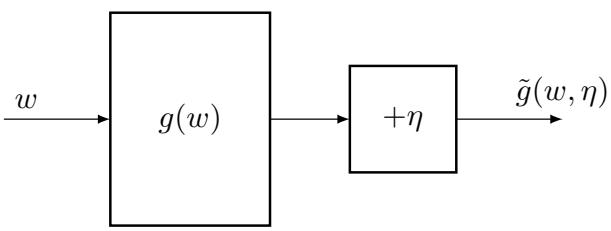
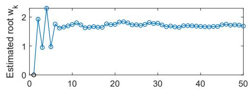
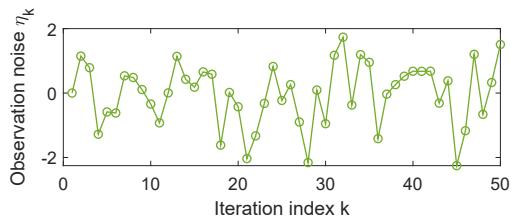
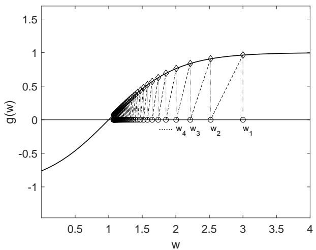
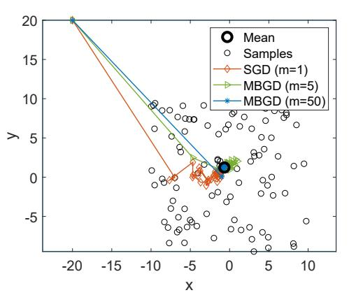
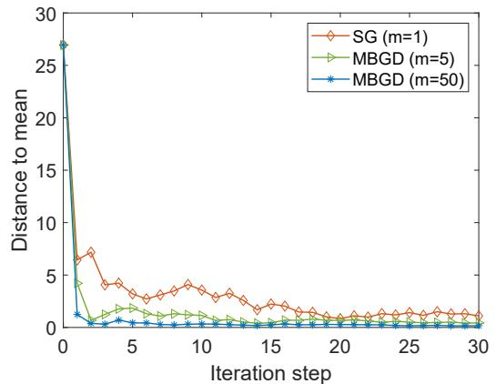

# 第 6 章 随机近似（Stochastic Approximation）- 6.1-6.4

> 原书 p111-132 · 学习日期 2026-06-09 · 当前涵盖 6.1-6.4

## 本章在全书的位置（先读这段）

第 5 章讲 Monte Carlo methods 蒙特卡洛方法时，核心动作是：把一个 unknown expectation 未知期望，用样本平均值估出来。比如 state value 状态值和 action value 动作值，本质上都是 return 回报 的期望：

$$
v_\pi(s)=\mathbb E_\pi[G_t|S_t=s],
\qquad
q_\pi(s,a)=\mathbb E_\pi[G_t|S_t=s,A_t=a].
$$

第 6 章往前推进一步：我们不只想“等样本收集完再算平均”，而是希望每来一个样本，就马上把当前估计更新一点点。这类算法叫 stochastic approximation 随机近似。

> 本章主线：先用均值估计说明 incremental update 增量更新，再抽象成 Robbins-Monro algorithm，最后把 stochastic gradient descent 随机梯度下降放进同一个框架。

补充结构梳理见：[第 6 章补充：6.1-6.3 结构梳理](/Users/qshf/Downloads/强化学习的数学原理/_tutor/notes/06_supplement-6.1-6.3-structure.md)。

---

## 6.1 Motivating example: Mean estimation（引例：均值估计）

**要解决的问题**：第 5 章已经说明可以用样本平均估计期望；本节要解决的是，怎样把“等所有样本到齐后一次性求平均”改成“每来一个样本就立刻更新一次”的 incremental algorithm 增量算法。

### 从非增量平均开始

设随机变量 $X$ 的取值来自有限集合 $\mathcal X$，目标是估计：

$$
\mathbb E[X].
$$

如果有一串 i.i.d. samples 独立同分布样本：

$$
\{x_i\}_{i=1}^n,
$$

那么 Monte Carlo estimation 蒙特卡洛估计 的基本公式是：

$$
\mathbb {E} [ X ] \approx \bar {x} \doteq \frac {1}{n} \sum_ {i = 1} ^ {n} x _ {i}. \tag {6.1}
$$

拆开读：

$$
\bar x
=
\frac{1}{n}
\underbrace{(x_1+x_2+\cdots+x_n)}_{\text{全部样本加起来}}.
$$

读法：不知道 $X$ 的真实分布也没关系；只要样本足够多，样本平均值 $\bar x$ 会根据 law of large numbers 大数定律逐渐接近 $\mathbb E[X]$。

问题是，这个写法是 non-incremental 非增量 的：要么保存所有样本，要么至少等一批样本收集完再算。强化学习里样本通常是边交互边来的，所以我们更想要一种“在线更新”的写法。

### 定义当前估计 $w_k$

原书定义：

$$
w _ {k + 1} \doteq \frac {1}{k} \sum_ {i = 1} ^ {k} x _ {i}, \quad k = 1, 2, \ldots
$$

也就是说，$w_{k+1}$ 表示看完前 $k$ 个样本后的平均值。相应地：

$$
w _ {k} = \frac {1}{k - 1} \sum_ {i = 1} ^ {k - 1} x _ {i}, \quad k = 2, 3, \ldots
$$

这里下标容易绕：$w_k$ 是前 $k-1$ 个样本的平均，$w_{k+1}$ 是前 $k$ 个样本的平均。作者这样写，是为了让第 $k$ 个新样本 $x_k$ 进入更新式。

### 逐步推导增量公式

从 $w_{k+1}$ 的定义开始：

$$
w _ {k + 1}
= \frac {1}{k} \sum_ {i = 1} ^ {k} x _ {i}.
$$

把最后一个样本 $x_k$ 单独拆出来：

$$
w _ {k + 1}
=
\frac {1}{k}
\left(\sum_ {i = 1} ^ {k - 1} x _ {i} + x _ {k}\right).
$$

由于

$$
w_k=\frac{1}{k-1}\sum_{i=1}^{k-1}x_i,
$$

所以

$$
\sum_{i=1}^{k-1}x_i=(k-1)w_k.
$$

代回去：

$$
w _ {k + 1}
=
\frac {1}{k} \left((k - 1) w _ {k} + x _ {k}\right).
$$

展开：

$$
w_{k+1}
=
\frac{k-1}{k}w_k+\frac{1}{k}x_k.
$$

把 $\frac{k-1}{k}w_k$ 写成 $w_k-\frac{1}{k}w_k$：

$$
w_{k+1}
=
w_k-\frac{1}{k}w_k+\frac{1}{k}x_k.
$$

合并最后两项：

$$
w _ {k + 1}
=
w _ {k} - \frac {1}{k} (w _ {k} - x _ {k}). \tag {6.2}
$$

读法：新估计等于旧估计，再向新样本 $x_k$ 的方向移动一点；移动比例是 $\frac{1}{k}$。

这就是本节的关键形式：

$$
\text{new estimate}
=
\text{old estimate}
-
\text{stepsize}\times
\text{current error}.
$$

其中

$$
\underbrace{w_k-x_k}_{\text{当前估计相对新样本的误差}}
$$

如果 $w_k>x_k$，更新会把 $w$ 往下拉；如果 $w_k<x_k$，更新会把 $w$ 往上推。

### 一个小数值例子

假设样本依次为：

$$
x_1=4,\quad x_2=8,\quad x_3=2,\quad x_4=6.
$$

按照原书的下标，先取：

$$
w_1=x_1=4.
$$

然后用

$$
w_{k+1}=w_k-\frac{1}{k}(w_k-x_k)
$$

更新：

| $k$ | 新样本 $x_k$ | 更新式 | $w_{k+1}$ | 含义 |
|---:|---:|---|---:|---|
| 1 | 4 | $w_2=4-\frac11(4-4)$ | 4 | 前 1 个样本平均 |
| 2 | 8 | $w_3=4-\frac12(4-8)$ | 6 | 前 2 个样本平均 $(4+8)/2$ |
| 3 | 2 | $w_4=6-\frac13(6-2)$ | 4.667 | 前 3 个样本平均 $(4+8+2)/3$ |
| 4 | 6 | $w_5=4.667-\frac14(4.667-6)$ | 5 | 前 4 个样本平均 $(4+8+2+6)/4$ |

这个例子说明，增量公式和一次性平均给出的结果完全一样，但它不需要每次重新计算整段求和，也不需要保存所有历史样本。

### 为什么步长越来越小

式 (6.2) 的步长是：

$$
\frac{1}{k}.
$$

早期样本少，每个新样本对平均值影响很大；后期样本多，一个新样本只应该轻轻修正已有估计。所以 $1/k$ 会越来越小。

直觉上：

- $k=1$ 时，新样本几乎完全决定当前平均；
- $k=1000$ 时，一个新样本只占全部信息的 $1/1000$。

这正是均值估计该有的行为。

### 推广：把 $1/k$ 换成一般步长 $\alpha_k$

原书接着给出更一般的算法：

$$
w _ {k + 1} = w _ {k} - \alpha_ {k} (w _ {k} - x _ {k}). \tag {6.4}
$$

等价地写成更常见的形式：

$$
w_{k+1}=w_k+\alpha_k(x_k-w_k).
$$

读法：当前估计 $w_k$ 朝新样本 $x_k$ 移动，移动比例由 $\alpha_k>0$ 控制。

当

$$
\alpha_k=\frac{1}{k}
$$

时，我们能明确得到：

$$
w _ {k + 1} = \frac {1}{k} \sum_ {i = 1} ^ {k} x _ {i}. \tag {6.3}
$$

也就是严格的样本平均。但当 $\alpha_k$ 是更一般的序列时，我们通常不能像 (6.3) 那样直接写出 $w_k$ 的闭式表达。问题就变成：

> 只要 $\alpha_k$ 选得合适，$w_k$ 还会不会收敛到 $\mathbb E[X]$？

这正是 6.2 Robbins-Monro algorithm 要回答的问题。

### 和强化学习的关系

这个式子：

$$
w_{k+1}=w_k+\alpha_k(x_k-w_k)
$$

以后会反复出现。到了 temporal-difference learning 时，它会长得像：

$$
\text{new value}
=
\text{old value}
+
\alpha
\left(
\text{target}
-
\text{old value}
\right).
$$

也就是：

$$
\text{更新}
=
\text{旧估计}
+
\text{步长}
\times
\text{误差}.
$$

所以 6.1 不是单纯复习平均数，而是在给后面的 TD learning 时间差分学习 和 stochastic gradient descent 随机梯度下降准备统一模板。

### 易错点

⚠️ **$w_{k+1}$ 的下标不是“第 $k+1$ 个样本的值”。** 在原书定义里，$w_{k+1}$ 是前 $k$ 个样本的平均。

⚠️ **式 (6.2) 不是近似，它和样本平均完全等价。** 只要步长是 $1/k$，增量更新得到的就是前 $k$ 个样本的精确平均。

⚠️ **式 (6.4) 才是真正的推广。** 把 $1/k$ 换成一般 $\alpha_k$ 后，不一定还能写成普通平均；它是否收敛，要靠 6.2 的 Robbins-Monro theorem 来保证。

---

## 6.2 Robbins-Monro algorithm（Robbins-Monro 算法）

**要解决的问题**：6.1 给出了一个很像“旧估计 + 步长 × 误差”的更新式；本节要把这个形式抽象成一个更通用的问题：如果我们想解某个方程，但只能看到带噪声的函数值，怎样一步步把估计值推向真正的解？

### 从 6.1 留下的问题开始

6.1 的一般增量均值更新是：

$$
w_{k+1}=w_k+\alpha_k(x_k-w_k)
=
w_k-\alpha_k(w_k-x_k).
$$

这个式子可以读成：

$$
\text{新估计}
=
\text{旧估计}
-
\text{步长}
\times
\text{当前观测到的误差}.
$$

当 $\alpha_k=1/k$ 时，它等价于普通样本平均，所以一定会接近：

$$
\mathbb E[X].
$$

但 6.1 末尾真正留下的问题是：

> 如果步长不是严格的 $1/k$，而是一般的 $\alpha_k$，这个迭代还会收敛吗？

Robbins-Monro algorithm 就是回答这类问题的更大框架。它不只处理均值估计，还处理一大类“只能看到带噪声信息”的求解问题。

### RM 把目标统一写成求根

RM 的第一步，是把目标写成 root-finding 求根 问题：

$$
g(w)=0,
$$

其中 $w\in\mathbb R$ 是我们要找的未知数，$g:\mathbb R\to\mathbb R$ 是某个函数。

这句话的意思是：我们想找到一个 $w^*$，使得：

$$
g(w^*)=0.
$$

这个 $w^*$ 就是真正目标；算法里的 $w_k$ 是第 $k$ 步对 $w^*$ 的当前猜测。

为什么均值估计也能写成求根？因为要估计 $\mathbb E[X]$，就是要找一个 $w$ 使：

$$
w=\mathbb E[X].
$$

把它移项：

$$
w-\mathbb E[X]=0.
$$

于是可以定义：

$$
g(w)\doteq w-\mathbb E[X].
$$

那么求 $g(w)=0$，就是找 $w=\mathbb E[X]$。这就是 6.1 和 6.2 之间的桥。

很多问题都能改写成求根：

如果要优化目标函数 $J(w)$，通常不是要求导数函数“处处等于 0”，而是要找一个候选最优点 $w^*$，使得导数在这个点为 0：

$$
\nabla_w J(w^*)=0.
$$

这叫 first-order necessary condition 一阶必要条件。直觉是：如果 $J$ 在某个内部点达到局部最小值或局部最大值，那么在这个点附近，往左或往右的一阶变化率应该从负变正或从正变负；在转折点本身，斜率就是 0。

注意这里的区别：

$$
\nabla_w J(w^*)=0
$$

表示“在某个点 $w^*$ 处导数为 0”；

$$
\nabla_w J(w)=0\quad \text{for all }w
$$

才表示“导数处处为 0”，这时原函数才是常数。

举个例子：

$$
J(w)=(w-3)^2.
$$

它不是常数函数，但它的导数是：

$$
\nabla_w J(w)=2(w-3).
$$

令导数为 0：

$$
2(w-3)=0
\quad\Longrightarrow\quad
w^*=3.
$$

这里我们只是在求“哪个 $w$ 让导数为 0”，不是说导数函数对所有 $w$ 都等于 0。

于是可以定义：

$$
g(w)\doteq \nabla_w J(w),
$$

把优化问题转成：

$$
g(w)=0.
$$

读法：只要能把“我想要的目标”写成某个函数等于 0，就可以尝试用求根算法。

### 难点：真实的 $g(w)$ 往往看不到

如果 $g(w)$ 的公式完全已知，我们可以用普通数值方法求根。但 RM 面对的是更困难、也更像强化学习的情况：

> 我们输入一个 $w$，系统返回一个带噪声的结果；真实的 $g(w)$ 藏在后面。

也就是：

$$
\tilde g(w,\eta)=g(w)+\eta.
$$

这里：

$$
\underbrace{\tilde g(w,\eta)}_{\text{我们实际看到的输出}}
=
\underbrace{g(w)}_{\text{真实函数值}}
+
\underbrace{\eta}_{\text{观测误差/噪声}}.
$$

读法：输入 $w$ 后，系统内部真实地产生 $g(w)$，但我们看到的结果被噪声 $\eta$ 污染了。

> **原书图 6.2**：输入 $w$ 进入未知函数 $g(w)$，输出时叠加噪声 $\eta$，所以观测值是 $\tilde g(w,\eta)$。

这和强化学习很像：我们常常不知道环境的完整模型，只能从交互样本里得到带随机性的反馈。

### RM 更新式：看到正值就往下调，看到负值就往上调

Robbins-Monro algorithm，简称 RM algorithm，用下面的迭代来解 $g(w)=0$：

$$
w _ {k + 1} = w _ {k} - a _ {k} \tilde {g} \left(w _ {k}, \eta_ {k}\right), \quad k = 1, 2, 3, \dots \tag {6.5}
$$

拆开看：

$$
\underbrace{w_{k+1}}_{\text{下一次估计}}
=
\underbrace{w_k}_{\text{当前估计}}
-
\underbrace{a_k}_{\text{步长}}
\underbrace{\tilde g(w_k,\eta_k)}_{\text{当前带噪声观测}}.
$$

读法：在当前点 $w_k$ 查询一次黑盒，得到带噪声的函数值 $\tilde g(w_k,\eta_k)$。如果观测值是正的，就从 $w_k$ 中减去一段，让 $w$ 往小的方向走；如果观测值是负的，减去负数，$w$ 就往大的方向走。

当 $g$ 是单调递增函数时，这个方向是合理的：

- 如果 $w_k>w^*$，通常 $g(w_k)>0$，更新会让 $w_k$ 变小，往根靠近；
- 如果 $w_k<w^*$，通常 $g(w_k)<0$，更新会让 $w_k$ 变大，也往根靠近。

这就是 RM 的基本直觉：**用带噪声的函数值判断当前估计在根的哪一侧，然后小步修正。**

和 6.1 对比一下：

$$
w_{k+1}=w_k-\alpha_k(w_k-x_k).
$$

这里的 $(w_k-x_k)$ 就会在 6.2.2 被解释成一个带噪声观测：

$$
\tilde g(w_k,\eta_k)=w_k-x_k.
$$

所以 6.1 的均值估计其实是 RM 的一个特例。6.2 先讲通用 RM，再回头证明均值估计为什么能套进去。

### 图 6.3：噪声很大，估计仍然能靠近根

原书用例子：

$$
g(w)=w^3-5.
$$

真实根是：

$$
w^*=5^{1/3}\approx 1.71.
$$

但我们不能直接观察 $g(w)$，只能看到：

$$
\tilde g(w)=g(w)+\eta,
$$

其中 $\eta$ 是均值为 0、标准差为 1 的独立噪声。令初始值 $w_1=0$，步长 $a_k=1/k$，用 RM 更新。

> **原书图 6.3**：下图显示噪声 $\eta_k$ 一直上下波动；上图显示估计 $w_k$ 虽然早期抖动明显，但逐渐稳定在真根附近。

这个例子想传达的重点不是“每一步都变好”，而是：**单步可以很吵，但长期可以收敛**。

⚠️ 这个例子的 $g(w)=w^3-5$ 并不满足后面定理的全部全局条件，因为它的导数 $3w^2$ 没有统一上界。但只要初始值选得合适，RM 仍可能收敛。定理给的是更强的“任意初始值也能保证”的充分条件。

### 补充：Figure 6.3 只迭代 3 次会怎样

图 6.3 的横轴画到 $k=50$，表示书中展示了一次随机实验的前 50 次迭代。这里的噪声不是固定的一个数，而是每一步都重新抽一次：

$$
\eta_1,\eta_2,\eta_3,\ldots
$$

在书的例子里，可以理解为：

$$
\eta_k\sim\mathcal N(0,1),
$$

也就是每一步从均值为 0、方差为 1 的标准正态分布里抽一个新噪声。

先把式 (6.5) 展开。RM 通式是：

$$
w_{k+1}=w_k-a_k\tilde g(w_k,\eta_k),
\qquad
k=1,2,3,\ldots \tag{6.5}
$$

而带噪声观测满足：

$$
\tilde g(w_k,\eta_k)=g(w_k)+\eta_k.
$$

代回 RM 通式：

$$
w_{k+1}
=
w_k-a_k\left(g(w_k)+\eta_k\right).
$$

Figure 6.3 的例子取：

$$
g(w)=w^3-5,
\qquad
a_k=\frac1k.
$$

所以：

$$
g(w_k)=w_k^3-5.
$$

再代入：

$$
\begin{aligned}
w_{k+1}
&=
w_k-\frac1k\left(g(w_k)+\eta_k\right)\\
&=
w_k-\frac1k\left(w_k^3-5+\eta_k\right).
\end{aligned}
$$

因此这个例子的具体更新式是：

$$
w_{k+1}
=
w_k-\frac1k\left(w_k^3-5+\eta_k\right),
\qquad
w_1=0.
$$

如果只写前 3 次迭代，就是：

$$
w_2
=
w_1-\left(w_1^3-5+\eta_1\right)
=
5-\eta_1,
$$

$$
w_3
=
w_2-\frac12\left(w_2^3-5+\eta_2\right),
$$

$$
w_4
=
w_3-\frac13\left(w_3^3-5+\eta_3\right).
$$

为了感受随机噪声的影响，随便取一组噪声：

$$
\eta_1=0.2,\qquad \eta_2=-0.6,\qquad \eta_3=0.4.
$$

第 1 次：

$$
w_2
=
0-\left(0^3-5+0.2\right)
=
4.8.
$$

第 2 次：

$$
\begin{aligned}
w_3
&=
4.8-\frac12\left(4.8^3-5-0.6\right)\\
&=
4.8-\frac12(110.592-5.6)\\
&=
-47.696.
\end{aligned}
$$

第 3 次：

$$
\begin{aligned}
w_4
&=
-47.696-\frac13\left((-47.696)^3-5+0.4\right)\\
&\approx
-47.696-\frac13(-108488.52-4.6)\\
&\approx
36116.68.
\end{aligned}
$$

这个演示看起来很夸张，但它很有用：它说明 Figure 6.3 不是在说“任意噪声序列都稳定”，而是在展示某一次随机实验中的收敛轨迹。对

$$
g(w)=w^3-5
$$

这种函数，一旦 $w_k$ 被噪声推到比较远的位置，$w_k^3$ 会变得非常大，下一步就可能被推得更远。根本原因是：

$$
g'(w)=3w^2
$$

没有统一上界，不满足 Robbins-Monro 定理条件 (a) 中的

$$
\nabla_w g(w)\le c_2.
$$

所以这里要区分两件事：

- Figure 6.3 是一个直观演示：某条随机路径在 50 次迭代内靠近真根 $5^{1/3}\approx1.71$；
- Robbins-Monro 定理是收敛保证：需要额外条件，才能说从任意初始值出发几乎必然收敛。

### 为什么 RM 会往根移动

先忽略噪声，设：

$$
\eta_k\equiv 0,
\qquad
\tilde g(w_k,\eta_k)=g(w_k).
$$

原书用：

$$
g(w)=\tanh(w-1)
$$

说明直觉。这个函数的根是：

$$
w^*=1.
$$

更新式变成：

$$
w_{k+1}=w_k-a_kg(w_k).
$$

> **原书图 6.4**：当 $w_k$ 在根 $w^*=1$ 右侧时，$g(w_k)>0$，更新会往左移动；随着 $k$ 增大，估计逐渐靠近根。

分两种情况看：

如果

$$
w_k>w^*,
$$

并且 $g$ 是单调递增、根处为零，那么：

$$
g(w_k)>0.
$$

代入 RM 更新：

$$
w_{k+1}=w_k-a_kg(w_k)<w_k.
$$

读法：估计在根的右边，函数值为正；减去一个正数，估计往左走，靠近根。

如果

$$
w_k<w^*,
$$

那么：

$$
g(w_k)<0.
$$

代入 RM 更新：

$$
w_{k+1}=w_k-a_kg(w_k)>w_k.
$$

读法：估计在根的左边，函数值为负；减去一个负数，估计往右走，也靠近根。

关键条件是步子不能太大。若 $a_kg(w_k)$ 太大，可能一下跨过根很远，甚至来回震荡。所以后面的步长条件不是装饰，它就是在控制“既能走到，又能稳住”。

### 一个小数值例子：无噪声 RM

令：

$$
g(w)=w-2.
$$

目标是解：

$$
g(w)=0
\quad\Longleftrightarrow\quad
w^*=2.
$$

取初始值 $w_1=5$，步长：

$$
a_k=\frac{0.5}{k}.
$$

无噪声时：

$$
w_{k+1}=w_k-a_k(w_k-2).
$$

手算几步：

| $k$ | $a_k$ | $w_k$ | $g(w_k)=w_k-2$ | $w_{k+1}=w_k-a_kg(w_k)$ |
|---:|---:|---:|---:|---:|
| 1 | 0.5 | 5.000 | 3.000 | 3.500 |
| 2 | 0.25 | 3.500 | 1.500 | 3.125 |
| 3 | 0.1667 | 3.125 | 1.125 | 2.9375 |
| 4 | 0.125 | 2.9375 | 0.9375 | 2.8203 |

每一步都在根 $2$ 的右边，所以 $g(w_k)>0$，更新不断把 $w_k$ 往左推。步长逐渐变小，所以后面会越来越稳。

### Robbins-Monro 定理

原书给出 Theorem 6.1 Robbins-Monro theorem。对 RM 更新：

$$
w _ {k + 1} = w _ {k} - a _ {k} \tilde {g} \left(w _ {k}, \eta_ {k}\right),
$$

如果满足三个条件：

**条件 (a)：函数单调递增且斜率有上下界**

$$
0 < c_{1} \leq \nabla_{w} g(w) \leq c_{2}
\quad \text{for all } w.
$$

意思是：

- $\nabla_w g(w)\ge c_1>0$：$g$ 严格单调递增，所以根是唯一的；
- $\nabla_w g(w)\le c_2$：函数不会陡得失控，更新不会因为局部斜率无限大而炸掉。

如果 $g$ 是单调递减的，可以把 $-g$ 当成新函数。

在优化问题里，如果

$$
g(w)=\nabla_w J(w),
$$

那么 $g$ 单调递增对应 $J(w)$ 是 convex 凸 的。这就是为什么凸优化里梯度法更容易分析。

**条件 (b)：步长既不能太快消失，也要最终变小**

$$
\sum_{k=1}^{\infty} a_k = \infty,
\qquad
\sum_{k=1}^{\infty} a_k^2 < \infty.
$$

这两个式子要一起理解。

第一条：

$$
\sum_{k=1}^{\infty} a_k = \infty
$$

表示总路程潜力无限。步长不能消失得太快，否则如果初始点离根很远，算法可能“还没走到根就没力气了”。

第二条：

$$
\sum_{k=1}^{\infty} a_k^2 < \infty
$$

强迫 $a_k\to 0$。直觉是：噪声一直存在，如果步长不变小，噪声会一直把 $w_k$ 推来推去，最后只能在根附近抖，难以真正收敛。

一句话记：

$$
\sum a_k=\infty
\quad\text{保证走得够远；}\qquad
\sum a_k^2<\infty
\quad\text{保证噪声影响能被压下去。}
$$

典型例子是：

$$
a_k=\frac1k.
$$

因为 harmonic series 调和级数 发散：

$$
\sum_{k=1}^{\infty}\frac1k=\infty,
$$

但平方级数收敛：

$$
\sum_{k=1}^{\infty}\frac1{k^2}=\frac{\pi^2}{6}<\infty.
$$

所以 $1/k$ 是一个非常经典的随机近似步长。

**条件 (c)：噪声条件均值为 0，且二阶矩有限**

令历史信息为：

$$
\mathcal H_k=\{w_k,w_{k-1},\ldots\}.
$$

定理要求：

$$
\mathbb E[\eta_k|\mathcal H_k]=0,
\qquad
\mathbb E[\eta_k^2|\mathcal H_k]<\infty.
$$

读法：在知道过去所有估计之后，当前噪声平均起来仍然不偏向正或负；并且噪声不能有无限大的方差。

注意它不要求噪声一定是 Gaussian 高斯 的。若 $\eta_k$ 是 i.i.d. 独立同分布、均值为 0、方差有限的噪声，那么这个条件自然成立。

满足这些条件时，定理结论是：

$$
w_k \to w^*
$$

almost surely 几乎必然收敛，其中 $w^*$ 是满足

$$
g(w^*)=0
$$

的根。

这里的“几乎必然”是概率论里的强收敛说法：不是说每条随机样本路径都收敛，而是说不收敛的路径概率为 0。

### 为什么要求 $\sum a_k=\infty$

这条条件的直觉是：**步长可以越来越小，但所有步长加起来不能只有一个有限额度**。否则算法可能还没走到根，步长就已经小到几乎动不了了。

RM 每一步满足：

$$
w_{k+1}-w_k=-a_k\tilde g(w_k,\eta_k).
$$

也就是说，第 $k$ 步真正移动了多少，由两部分相乘决定：

$$
\underbrace{w_{k+1}-w_k}_{\text{第 }k\text{ 步位移}}
=
-
\underbrace{a_k}_{\text{步长}}
\underbrace{\tilde g(w_k,\eta_k)}_{\text{观测到的方向/大小}}.
$$

如果只关心“移动距离”的大小，就取绝对值：

$$
|w_{k+1}-w_k|
=
a_k|\tilde g(w_k,\eta_k)|.
$$

为了只看步长的作用，先假设观测值不会无限大，也就是存在某个常数 $M$，使得：

$$
|\tilde g(w_k,\eta_k)|\le M.
$$

那么第 $k$ 步最多只能走：

$$
|w_{k+1}-w_k|
\le
a_kM.
$$

从第 1 步一直走到无限远，总移动距离最多是：

$$
\sum_{k=1}^{\infty}|w_{k+1}-w_k|
\le
M\sum_{k=1}^{\infty}a_k.
$$

现在关键来了：如果

$$
\sum_{k=1}^{\infty}a_k<\infty,
$$

那么右边是一个有限数。也就是说，不管迭代多少次，算法一辈子最多只能移动有限远。

举一个极端但清楚的例子。若：

$$
a_k=\frac1{2^k},
$$

则：

$$
\sum_{k=1}^{\infty}a_k
=
\frac12+\frac14+\frac18+\cdots
=1.
$$

如果再假设 $|\tilde g(w_k,\eta_k)|\le 3$，那么所有迭代加起来最多只能移动：

$$
3\sum_{k=1}^{\infty}a_k=3.
$$

假设真实根在 $w^*=10$，初始值在 $w_1=0$。即使每一步方向都完全正确，最多也只能从 0 走到 3 附近，根本到不了 10。这就是“步长消失太快”的危险。

所以 Robbins-Monro 定理要求：

$$
\sum_{k=1}^{\infty}a_k=\infty.
$$

它不是要求每一步都大，而是要求总移动潜力不能提前耗尽。典型的 $a_k=1/k$ 就满足这一点：

$$
\sum_{k=1}^{\infty}\frac1k=\infty.
$$

虽然每一步越来越小，但总和没有上限；如果方向长期是对的，它理论上仍有能力从很远的初始点走到根。

原书的写法是把所有步子加起来：

$$
w _ {1} - w _ {\infty}
=
\sum_ {k = 1} ^ {\infty} a _ {k} \tilde {g} (w _ {k}, \eta_ {k}).
$$

如果总步长有限，并且观测值有界，那么总移动量也有界。原书写成：

$$
\left| w _ {1} - w _ {\infty} \right|
=
\left| \sum_ {k = 1} ^ {\infty} a _ {k} \tilde {g} \left(w _ {k}, \eta_ {k}\right) \right|
\leq b. \tag {6.6}
$$

如果初始点离真实根太远：

$$
|w_1-w^*|>b,
$$

那无论怎么迭代，总移动距离都不够，当然不可能到达 $w^*$。

这就是式 (6.6) 的意思：如果总步长有限，算法能走的总距离会被一个上界 $b$ 卡住；为了保证任意初始点都有机会到达根，必须要求 $\sum a_k=\infty$。

### 6.2.2：把均值估计看成 RM 特例

现在回到 6.1 的均值估计。原始任务是：

$$
\text{Given samples } x_1,x_2,\ldots,\quad \text{estimate } \mathbb E[X].
$$

也就是说，我们不断看到样本 $x_1,x_2,\ldots$，但真正想找的是背后随机变量 $X$ 的均值 $\mathbb E[X]$。因此目标可以写成：

$$
\text{找一个数 } w,\quad \text{使得 } w=\mathbb E[X].
$$

这里的 $w$ 不是另一个真实随机变量，而是“我们正在寻找的答案”。迭代中的 $w_k$ 就是第 $k$ 步对这个答案的当前猜测。

为了把这个均值估计问题套进 Robbins-Monro 的求根框架，书里人为定义：

$$
g(w)\doteq w-\mathbb E[X].
$$

为什么这样定义？因为：

$$
\begin{aligned}
g(w)=0
&\Longleftrightarrow
w-\mathbb E[X]=0\\
&\Longleftrightarrow
w=\mathbb E[X].
\end{aligned}
$$

所以“估计 $\mathbb E[X]$”和“求 $g(w)=0$ 的根”其实是同一件事：

$$
\text{estimate } \mathbb E[X]
\quad\Longleftrightarrow\quad
\text{find } w \text{ such that } g(w)=0.
$$

这就是 $g(w)$ 和原始均值估计任务的关系：$g(w)$ 是为了把“找均值”包装成 RM algorithm 能处理的“求根问题”。

6.1 给出的增量均值更新是：

$$
w _ {k + 1} = w _ {k} + \alpha_ {k} \left(x _ {k} - w _ {k}\right).
$$

接下来要说明：它正好就是 RM 更新式的一个特例。但问题是，我们不知道 $\mathbb E[X]$，所以也不能直接计算 $g(w)$。我们只能拿到样本 $x$。于是定义带噪声观测：

$$
\tilde g(w,\eta)\doteq w-x.
$$

为什么是 $w-x$？因为真实函数是：

$$
g(w)=w-\mathbb E[X].
$$

这里减掉的是未知均值 $\mathbb E[X]$。但 $\mathbb E[X]$ 正是我们要求的目标，手里没有它；手里只有一个样本 $x$。于是最自然的观测版就是“把未知均值临时换成样本”：

$$
w-\mathbb E[X]
\quad\leadsto\quad
w-x.
$$

换句话说，样本 $x$ 可以看成 $\mathbb E[X]$ 的一次带随机偏差的观测，所以 $w-x$ 就是 $g(w)$ 的一次带噪声观测。它平均起来确实等于真实函数：

$$
\mathbb E[w-x]
=
w-\mathbb E[X]
=
g(w).
$$

把它拆成“真实函数 + 噪声”：

$$
\begin{aligned}
\tilde g(w,\eta)
&=w-x\\
&=w-x+\mathbb E[X]-\mathbb E[X]\\
&=(w-\mathbb E[X])+(\mathbb E[X]-x)\\
&\doteq g(w)+\eta,
\end{aligned}
$$

其中：

$$
\eta\doteq \mathbb E[X]-x.
$$

读法：$w-x$ 是我们能看到的带噪声版本；它的“平均意义”就是 $w-\mathbb E[X]$。

检查噪声是否无偏：

$$
\mathbb E[\eta]
=
\mathbb E[\mathbb E[X]-x]
=
\mathbb E[X]-\mathbb E[x]
=0.
$$

于是 RM 更新变成：

$$
\begin{aligned}
w_{k+1}
&=w_k-\alpha_k\tilde g(w_k,\eta_k)\\
&=w_k-\alpha_k(w_k-x_k)\\
&=w_k+\alpha_k(x_k-w_k).
\end{aligned}
$$

这正好就是 6.1 的一般增量均值估计式。

因此，Robbins-Monro theorem 告诉我们：如果

$$
\sum_{k=1}^{\infty}\alpha_k=\infty,
\qquad
\sum_{k=1}^{\infty}\alpha_k^2<\infty,
$$

并且 $\{x_k\}$ 是 i.i.d. 样本，那么：

$$
w_k\to \mathbb E[X]
$$

almost surely 几乎必然收敛。

这比 6.1 更强：6.1 只在 $\alpha_k=1/k$ 时能直接写出样本平均闭式；6.2 告诉我们，对一类更一般的 $\alpha_k$，即使写不出闭式，仍然可以保证收敛。

---

## 6.3 Dvoretzky's convergence theorem（Dvoretzky 收敛定理）

**要解决的问题**：6.2 说 Robbins-Monro algorithm 在合适条件下会收敛，但还没有证明；6.3 的任务不是发明新算法，而是提供一个证明工具：只要某个随机迭代的“误差”能写成 Dvoretzky 模板，就可以证明误差会收敛到 0。

### 先看本节的位置

6.1 和 6.2 都在讨论一个估计序列：

$$
w_1,w_2,w_3,\ldots
$$

但证明收敛时，直接看 $w_k$ 不方便。更自然的是看它离真实目标还有多远：

$$
\Delta_k
\doteq
\text{当前估计}-\text{真实目标}.
$$

如果能证明：

$$
\Delta_k\to0,
$$

就等价于证明当前估计收敛到真实目标。

所以 6.3 的主线只有一句：

> 把算法改写成误差递推，然后证明误差递推会归零。

整节的结构是：

| 步骤 | 内容 | 作用 |
|---|---|---|
| 1 | 写出 Dvoretzky 误差模板 | 说明我们要证明哪类递推 |
| 2 | 解释模板为什么会收敛 | 给出定理条件和证明直觉 |
| 3 | 把均值估计改写成模板 | 证明 $w_k\to\mathbb E[X]$ |
| 4 | 把 RM 改写成模板 | 证明 6.2 的 RM theorem |
| 5 | 扩展到多变量 | 为后面 RL 里多个状态/动作的收敛证明做准备 |

### 1. Dvoretzky 模板：误差 = 被压缩的旧误差 + 小噪声

Dvoretzky's theorem 研究的是这种递推：

$$
\Delta_{k+1}
=
(1-\alpha_k)\Delta_k+\beta_k\eta_k. \tag{6.7 前的形式}
$$

这个式子里每个符号的角色是：

| 符号 | 含义 |
|---|---|
| $\Delta_k$ | 第 $k$ 步的误差 |
| $(1-\alpha_k)\Delta_k$ | 旧误差被压小后的部分 |
| $\eta_k$ | 第 $k$ 步的新随机噪声 |
| $\beta_k$ | 噪声进入系统时的系数 |
| $\mathcal H_k$ | 第 $k$ 步以前的历史信息 |

读法：

$$
\text{新误差}
=
\underbrace{\text{旧误差被压小}}_{(1-\alpha_k)\Delta_k}
+
\underbrace{\text{新噪声影响}}_{\beta_k\eta_k}.
$$

如果没有噪声，即 $\beta_k\eta_k=0$，那就是：

$$
\Delta_{k+1}=(1-\alpha_k)\Delta_k.
$$

只要 $0<\alpha_k<1$，每一步都会把误差压小一点。

有噪声时，误差不一定每一步都变小，因为 $\beta_k\eta_k$ 可能把它推大。但如果噪声是无偏的，并且 $\beta_k$ 逐渐变小，噪声总体影响就可以被控制住。

### 2. Dvoretzky 定理：什么时候能保证 $\Delta_k\to0$

Theorem 6.2 的结论是：

$$
\Delta_k\to0
$$

almost surely 几乎必然收敛。

它需要两类条件。

**第一类：步长条件**

$$
\sum_{k=1}^{\infty}\alpha_k=\infty,
\qquad
\sum_{k=1}^{\infty}\alpha_k^2<\infty,
\qquad
\sum_{k=1}^{\infty}\beta_k^2<\infty.
$$

读法：

- $\sum\alpha_k=\infty$：压缩旧误差的动作要持续足够久；
- $\sum\alpha_k^2<\infty$：压缩步子最终要变小，避免一直震荡；
- $\sum\beta_k^2<\infty$：噪声的总体影响要有限。

**第二类：噪声条件**

$$
\mathbb E[\eta_k|\mathcal H_k]=0,
\qquad
\mathbb E[\eta_k^2|\mathcal H_k]\le C.
$$

读法：知道过去所有历史后，当前噪声平均起来不偏向正或负；并且噪声方差不能无限大。

### 3. 证明主线：为什么这个模板会收敛

这里按原书逻辑把关键步骤展开。证明不是只说“平方误差有界”，而是分两层：

第一层证明 $h_k=\Delta_k^2$ 会收敛；

第二层证明它的极限只能是 0。

**第一步：看平方误差**

定义：

$$
h_k\doteq\Delta_k^2.
$$

看平方误差有两个好处：它非负，而且不管误差是正还是负，平方都表示“离目标有多远”。

由

$$
\Delta_{k+1}=(1-\alpha_k)\Delta_k+\beta_k\eta_k
$$

先算两项：

$$
\Delta_{k+1}-\Delta_k
=
-\alpha_k\Delta_k+\beta_k\eta_k,
$$

$$
\Delta_{k+1}+\Delta_k
=
(2-\alpha_k)\Delta_k+\beta_k\eta_k.
$$

于是：

$$
\begin{aligned}
h_{k+1}-h_k
&=
\Delta_{k+1}^2-\Delta_k^2\\
&=
(\Delta_{k+1}-\Delta_k)(\Delta_{k+1}+\Delta_k)\\
&=
-\alpha_k(2-\alpha_k)\Delta_k^2\\
&\quad+\beta_k^2\eta_k^2\\
&\quad+2(1-\alpha_k)\beta_k\eta_k\Delta_k.
\end{aligned}
$$

这三个项分别是：

| 项 | 作用 |
|---|---|
| $-\alpha_k(2-\alpha_k)\Delta_k^2$ | 好项，让误差下降 |
| $\beta_k^2\eta_k^2$ | 噪声波动，可能让误差上升 |
| $2(1-\alpha_k)\beta_k\eta_k\Delta_k$ | 交叉项，条件期望下会消失 |

**第二步：对历史取条件期望，得到 (6.9)**

对上式两边取条件期望：

$$
\begin{aligned}
\mathbb E[h_{k+1}-h_k|\mathcal H_k]
&=
-\alpha_k(2-\alpha_k)\Delta_k^2\\
&\quad+\beta_k^2\mathbb E[\eta_k^2|\mathcal H_k]\\
&\quad+2(1-\alpha_k)\beta_k\Delta_k\mathbb E[\eta_k|\mathcal H_k].
\end{aligned}
$$

这里能把 $\Delta_k,\alpha_k,\beta_k$ 拿到条件期望外面，是因为它们由历史信息 $\mathcal H_k$ 决定，或者至少是 $\mathcal H_k$-measurable 可由历史确定的量。

因为：

$$
\mathbb E[\eta_k|\mathcal H_k]=0,
$$

所以第三项消失。又因为：

$$
\mathbb E[\eta_k^2|\mathcal H_k]\le C,
$$

噪声波动项被 $\beta_k^2C$ 控制。

另外，由 $\sum\alpha_k^2<\infty$ 可知 $\alpha_k\to0$，所以充分靠后时有 $\alpha_k\le1$。于是：

$$
-\alpha_k(2-\alpha_k)\Delta_k^2\le0.
$$

因此得到原书的核心不等式：

$$
\mathbb E[h_{k+1}-h_k|\mathcal H_k]
\le
\beta_k^2 C. \tag{6.9}
$$

由于：

$$
\sum_k\beta_k^2<\infty,
$$

这些“可能让平方误差上涨的总量”是有限的。原书借助 quasimartingale convergence theorem 拟鞅收敛定理，得到：

$$
h_k=\Delta_k^2
$$

会收敛到某个极限。

**第三步：从 (6.9) 移项，得到一个可求和的好项**

只知道 $h_k$ 有极限还不够，因为它可能收敛到一个正数。现在要证明极限只能是 0。

先不要丢掉 (6.9) 中的负项。更精确地写：

$$
\mathbb E[h_{k+1}-h_k|\mathcal H_k]
=
-\alpha_k(2-\alpha_k)\Delta_k^2
+\beta_k^2\mathbb E[\eta_k^2|\mathcal H_k].
$$

把负项移到左边：

$$
\alpha_k(2-\alpha_k)\Delta_k^2
=
\beta_k^2\mathbb E[\eta_k^2|\mathcal H_k]
-
\mathbb E[h_{k+1}-h_k|\mathcal H_k].
$$

对 $k$ 从 1 到 $\infty$ 求和：

$$
\sum_{k=1}^{\infty}\alpha_k(2-\alpha_k)\Delta_k^2
=
\sum_{k=1}^{\infty}\beta_k^2\mathbb E[\eta_k^2|\mathcal H_k]
-
\sum_{k=1}^{\infty}\mathbb E[h_{k+1}-h_k|\mathcal H_k].
$$

看右边两个部分。

第一部分有界，因为：

$$
\mathbb E[\eta_k^2|\mathcal H_k]\le C
$$

且：

$$
\sum_{k=1}^{\infty}\beta_k^2<\infty.
$$

所以：

$$
\sum_{k=1}^{\infty}\beta_k^2\mathbb E[\eta_k^2|\mathcal H_k]
\le
C\sum_{k=1}^{\infty}\beta_k^2
<\infty.
$$

第二部分也由拟鞅收敛定理来控制。更具体地说，前面由

$$
\mathbb E[h_{k+1}-h_k|\mathcal H_k]\le \beta_k^2C
$$

和

$$
\sum_k\beta_k^2<\infty
$$

说明 $h_k$ 的“条件期望上涨部分”总量有限。拟鞅收敛定理正是用这个条件保证 $h_k$ 不会因为反复随机上跳而失控，并推出 $h_k$ 收敛；同时，在这个定理的框架下，累计条件期望增量

$$
\sum_{k=1}^{\infty}\mathbb E[h_{k+1}-h_k|\mathcal H_k]
$$

不会无限发散。因此右边第二项也是有界的。关于 $\mathbf 1_{A_k}$ 和“上涨部分”的直觉，见补充：[第 6 章补充：6.1-6.3 结构梳理](/Users/qshf/Downloads/强化学习的数学原理/_tutor/notes/06_supplement-6.1-6.3-structure.md)。

因此左边也有界：

$$
\sum_{k=1}^{\infty}\alpha_k(2-\alpha_k)\Delta_k^2<\infty.
$$

再利用充分靠后时 $\alpha_k\le1$，所以：

$$
2-\alpha_k\ge1.
$$

于是：

$$
\alpha_k(2-\alpha_k)\Delta_k^2
\ge
\alpha_k\Delta_k^2.
$$

因此可得：

$$
\sum_{k=1}^{\infty}\alpha_k\Delta_k^2<\infty.
$$

**第四步：用 $\sum\alpha_k=\infty$ 把极限逼成 0**

定理条件还有：

$$
\sum_{k=1}^{\infty}\alpha_k=\infty.
$$

如果 $\Delta_k^2$ 长期不接近 0，比如从某一刻开始一直大于某个 $\epsilon>0$，那么：

$$
\sum_k\alpha_k\Delta_k^2
\ge
\epsilon\sum_k\alpha_k
$$

会发散。这和刚刚得到的

$$
\sum_k\alpha_k\Delta_k^2<\infty
$$

矛盾。

所以只能是：

$$
\Delta_k^2\to0,
\qquad
\Delta_k\to0.
$$

这就是 Dvoretzky 定理的证明逻辑。

### 4. 套用一：均值估计为什么收敛

现在把 6.1 的均值估计算法放进 Dvoretzky 模板。

均值估计的目标是：

$$
w^*=\mathbb E[X].
$$

算法是：

$$
w_{k+1}=w_k+\alpha_k(x_k-w_k).
$$

定义误差：

$$
\Delta_k\doteq w_k-w^*.
$$

目标 $w_k\to\mathbb E[X]$ 等价于：

$$
\Delta_k\to0.
$$

现在把 $w$ 的更新式改成 $\Delta$ 的更新式。

两边减去 $w^*$：

$$
w_{k+1}-w^*
=
w_k-w^*+\alpha_k(x_k-w_k).
$$

关键是把括号拆成“噪声 - 误差”。对 $x_k-w_k$ 加减 $w^*$：

$$
\begin{aligned}
x_k-w_k
&=x_k-w^*+w^*-w_k\\
&=\underbrace{x_k-w^*}_{\eta_k}
-\underbrace{(w_k-w^*)}_{\Delta_k}.
\end{aligned}
$$

代回去：

$$
\begin{aligned}
\Delta_{k+1}
&=
\Delta_k+\alpha_k(\eta_k-\Delta_k)\\
&=
(1-\alpha_k)\Delta_k+\alpha_k\eta_k.
\end{aligned}
$$

这正好是 Dvoretzky 模板：

$$
\Delta_{k+1}
=
(1-\alpha_k)\Delta_k+\beta_k\eta_k,
$$

其中：

$$
\beta_k=\alpha_k,
\qquad
\eta_k=x_k-w^*.
$$

因为 $x_k$ 是 i.i.d. 样本：

$$
\mathbb E[x_k|\mathcal H_k]=\mathbb E[x_k]=w^*,
$$

所以：

$$
\mathbb E[\eta_k|\mathcal H_k]
=
\mathbb E[x_k-w^*|\mathcal H_k]
=0.
$$

如果 $x_k$ 方差有限，噪声二阶矩也有界。因此 Dvoretzky 定理给出：

$$
\Delta_k\to0,
\qquad
w_k\to w^*=\mathbb E[X].
$$

### 5. 套用二：Robbins-Monro 定理为什么成立

RM algorithm 是：

$$
w_{k+1}
=
w_k-a_k\tilde g(w_k,\eta_k)
=
w_k-a_k[g(w_k)+\eta_k].
$$

设真实根为：

$$
g(w^*)=0.
$$

定义误差：

$$
\Delta_k\doteq w_k-w^*.
$$

两边减去 $w^*$：

$$
w_{k+1}-w^*
=
w_k-w^*
-a_k[g(w_k)-g(w^*)+\eta_k].
$$

这里加入 $-g(w^*)$ 不改变值，因为 $g(w^*)=0$；这样做是为了出现差值：

$$
g(w_k)-g(w^*).
$$

根据 mean value theorem 中值定理，存在 $w_k'$ 介于 $w_k$ 和 $w^*$ 之间，使得：

$$
g(w_k)-g(w^*)
=
\nabla_w g(w_k')(w_k-w^*).
$$

代回去：

$$
\begin{aligned}
\Delta_{k+1}
&=
\Delta_k-a_k[\nabla_w g(w_k')\Delta_k+\eta_k]\\
&=
\left[1-a_k\nabla_w g(w_k')\right]\Delta_k+a_k(-\eta_k).
\end{aligned}
$$

这也是 Dvoretzky 模板：

$$
\Delta_{k+1}
=
(1-\alpha_k)\Delta_k+\beta_k\eta_k',
$$

其中：

$$
\alpha_k=a_k\nabla_wg(w_k'),
\qquad
\beta_k=a_k,
\qquad
\eta_k'=-\eta_k.
$$

RM 定理假设：

$$
0<c_1\le\nabla_wg(w)\le c_2.
$$

所以 $\alpha_k=a_k\nabla_wg(w_k')$ 和 $a_k$ 同阶。既然：

$$
\sum a_k=\infty,
\qquad
\sum a_k^2<\infty,
$$

就能推出：

$$
\sum\alpha_k=\infty,
\qquad
\sum\alpha_k^2<\infty,
\qquad
\sum\beta_k^2<\infty.
$$

再加上噪声条件均值为 0、二阶矩有限，Dvoretzky 定理条件全部满足。因此：

$$
\Delta_k\to0,
\qquad
w_k\to w^*.
$$

这就证明了 6.2 的 Robbins-Monro theorem。

### 6. 多变量扩展为什么重要

前面的模板只处理一个数：

$$
\Delta_k.
$$

强化学习里常常要同时估计很多数，比如：

$$
v(s_1),v(s_2),\ldots
$$

或者：

$$
q(s_1,a_1),q(s_1,a_2),\ldots
$$

所以原书给出扩展形式：

$$
\Delta_{k+1}(s)
=
(1-\alpha_k(s))\Delta_k(s)+\beta_k(s)\eta_k(s),
\qquad s\in S.
$$

这里 $s$ 可以理解成索引。在强化学习里，它通常表示 state 状态，或 state-action pair 状态-动作对。

多变量版要证明的是每个 $s$ 上的误差都归零：

$$
\Delta_k(s)\to0,\qquad \forall s\in S.
$$

因此它会用 maximum norm 最大范数：

$$
\|\Delta_k\|_\infty=\max_{s\in S}|\Delta_k(s)|
$$

来统一控制所有状态上的最大误差。这为后面分析 Q-learning 这类算法做准备。

---

## 6.4 Stochastic gradient descent（随机梯度下降）

**要解决的问题**：6.2 把随机近似写成带噪声求根；6.4 要说明机器学习里最常见的 stochastic gradient descent 随机梯度下降，其实就是 Robbins-Monro algorithm 的一个特例，而 6.1 的均值估计又是 SGD 的一个特例。

这一节的链条是：

$$
\text{mean estimation}
\subset
\text{SGD}
\subset
\text{Robbins-Monro}.
$$

读法：均值估计可以看成一种特殊 SGD；SGD 又可以看成一种特殊 RM。

### 从期望目标函数开始

6.4 考虑的优化问题是：

$$
\min_w J(w)=\mathbb E[f(w,X)]. \tag{6.10}
$$

这里：

| 符号 | 含义 |
|---|---|
| $w$ | 要优化的参数 |
| $X$ | 随机变量，也可以理解成随机样本来源 |
| $f(w,X)$ | 单个样本对应的损失 |
| $J(w)$ | 平均损失，也就是整体目标 |

如果能直接算真实梯度：

$$
\nabla_w J(w)
=
\nabla_w\mathbb E[f(w,X)]
=
\mathbb E[\nabla_w f(w,X)],
$$

那么普通 gradient descent 梯度下降 是：

$$
w_{k+1}
=
w_k-\alpha_k\nabla_w J(w_k)
=
w_k-\alpha_k\mathbb E[\nabla_w f(w_k,X)]. \tag{6.11}
$$

读法：每一步沿着平均损失下降最快的方向走。

问题是，真实期望

$$
\mathbb E[\nabla_w f(w_k,X)]
$$

通常算不出来，因为我们不知道 $X$ 的分布，或者数据太多。

### 从 GD 到 SGD：用一个样本梯度代替真实梯度

如果我们有 $n$ 个样本，可以用全体样本平均近似真实梯度：

$$
\mathbb E[\nabla_w f(w_k,X)]
\approx
\frac1n\sum_{i=1}^n\nabla_w f(w_k,x_i).
$$

于是得到 batch gradient descent 批量梯度下降：

$$
w_{k+1}
=
w_k-\frac{\alpha_k}{n}
\sum_{i=1}^n\nabla_w f(w_k,x_i). \tag{6.12}
$$

但它每一步都要用全部样本，代价很高。SGD 的想法很直接：

> 每来一个样本，就用这个样本给出的梯度更新一次。

于是：

$$
w_{k+1}
=
w_k-\alpha_k\nabla_w f(w_k,x_k). \tag{6.13}
$$

这里 $\nabla_w f(w_k,x_k)$ 叫 stochastic gradient 随机梯度。它不是完整真实梯度，但它是一个无偏估计：

$$
\mathbb E_{x_k}[\nabla_w f(w_k,x_k)]
=
\mathbb E_X[\nabla_w f(w_k,X)].
$$

因此可以写成：

$$
\nabla_w f(w_k,x_k)
=
\underbrace{\mathbb E[\nabla_w f(w_k,X)]}_{\text{真实梯度}}
+
\underbrace{\eta_k}_{\text{零均值噪声}}.
$$

这一步不是额外假设，而是“加减同一项”的拆分。定义：

$$
\eta_k
\doteq
\nabla_w f(w_k,x_k)
-
\mathbb E[\nabla_w f(w_k,X)].
$$

那么移项就得到：

$$
\nabla_w f(w_k,x_k)
=
\mathbb E[\nabla_w f(w_k,X)]
+
\eta_k.
$$

如果再记：

$$
g(w)
=
\nabla_wJ(w)
=
\mathbb E[\nabla_w f(w,X)],
$$

那么在 $w_k$ 处：

$$
\nabla_w f(w_k,x_k)
=
g(w_k)+\eta_k.
$$

读法：单样本梯度 = 真实平均梯度 + 随机误差。

这个误差的条件均值为 0：

$$
\begin{aligned}
\mathbb E[\eta_k|\mathcal H_k]
&=
\mathbb E[\nabla_w f(w_k,x_k)|\mathcal H_k]
-
g(w_k)\\
&=
g(w_k)-g(w_k)\\
&=
0.
\end{aligned}
$$

所以 $\eta_k$ 可以理解成 zero-mean noise 零均值噪声。

代回 SGD：

$$
w_{k+1}
=
w_k-\alpha_k\mathbb E[\nabla_w f(w_k,X)]
-\alpha_k\eta_k.
$$

读法：SGD 等于“普通梯度下降 + 一个零均值扰动”。只要步长和噪声满足条件，这个扰动不会破坏收敛。

### 6.4.1：均值估计是 SGD 特例

现在把均值估计写成优化问题：

$$
\min_w J(w)
=
\mathbb E\left[\frac12\|w-X\|^2\right]. \tag{6.14}
$$

这句话很自然：想找一个 $w$，让它和随机样本 $X$ 的 average squared distance 平均平方距离 最小。

换成白话就是：

> 我不知道 $X$ 的真实均值是多少，但我想找一个代表值 $w$，让它离随机抽到的样本 $X$ 平均来说最近。

这里用平方距离而不是普通距离，有两个好处：

1. 平方距离可导，方便用 gradient descent 梯度下降。
2. 平方距离的最优代表值正好是均值 $\mathbb E[X]$。

先看标量情形。若 $w$ 和 $X$ 都是一维数，则目标函数是：

$$
J(w)
=
\mathbb E\left[\frac12(w-X)^2\right].
$$

系数 $\frac12$ 没有特殊概率含义，只是为了求导时把平方项的 $2$ 抵消掉：

$$
\frac{d}{dw}\frac12(w-X)^2=w-X.
$$

单样本损失是：

$$
f(w,X)=\frac12\|w-X\|^2.
$$

它表示：如果这次只看到一个样本 $X$，那么用 $w$ 代表这个样本会产生多少误差。

它对 $w$ 的梯度是：

$$
\nabla_w f(w,X)=w-X.
$$

读法：如果 $w>X$，梯度为正，梯度下降会把 $w$ 往小调；如果 $w<X$，梯度为负，梯度下降会把 $w$ 往大调。也就是说，每个样本都会把 $w$ 往自己这边拉。

真实目标函数的梯度是：

$$
\nabla_w J(w)
=
\nabla_w\mathbb E\left[\frac12\|w-X\|^2\right]
=
\mathbb E[\nabla_w f(w,X)]
=
\mathbb E[w-X]
=
w-\mathbb E[X].
$$

这里用了两件事：

$$
\nabla_w\mathbb E[f(w,X)]
=
\mathbb E[\nabla_w f(w,X)],
$$

以及 $w$ 在对 $X$ 取期望时是固定参数，所以：

$$
\mathbb E[w-X]
=
\mathbb E[w]-\mathbb E[X]
=
w-\mathbb E[X].
$$

令它为 0：

$$
w-\mathbb E[X]=0
\quad\Longrightarrow\quad
w^*=\mathbb E[X].
$$

所以这个优化问题和均值估计完全等价。

也可以用一个小例子看出来。假设样本只可能是：

$$
X\in\{2,4,8\},
\qquad
p(X=2)=p(X=4)=p(X=8)=\frac13.
$$

那么：

$$
\mathbb E[X]=\frac{2+4+8}{3}=\frac{14}{3}\approx4.667.
$$

目标函数是：

$$
J(w)
=
\frac13\left[
\frac12(w-2)^2
+
\frac12(w-4)^2
+
\frac12(w-8)^2
\right].
$$

求导：

$$
\begin{aligned}
J'(w)
&=
\frac13[(w-2)+(w-4)+(w-8)]\\
&=
w-\frac{14}{3}.
\end{aligned}
$$

令 $J'(w)=0$，得到：

$$
w^*=\frac{14}{3}.
$$

这正是样本均值。这个例子说明：**最小化平均平方误差，就是在找均值。**

普通 GD 需要：

$$
\nabla_wJ(w_k)
=
\mathbb E[w_k-X]
=
w_k-\mathbb E[X],
$$

但这正包含未知的 $\mathbb E[X]$，所以不可直接用。因为如果已经知道 $\mathbb E[X]$，均值估计问题本身就已经解决了。

SGD 的做法是：不用真实梯度

$$
\mathbb E[w_k-X],
$$

而用第 $k$ 次采到的样本 $x_k$ 构造一个单样本梯度：

$$
\nabla_w f(w_k,x_k)=w_k-x_k.
$$

这个单样本梯度平均起来是对的：

$$
\mathbb E[w_k-x_k|\mathcal H_k]
=
w_k-\mathbb E[X]
=
\nabla_wJ(w_k).
$$

这里 $\mathcal H_k$ 表示第 $k$ 步之前的历史信息。给定 $\mathcal H_k$ 后，$w_k$ 已经由过去的样本和更新决定，可以当成固定值；还没有被历史包含进去的是当前新样本 $x_k$。所以这个条件期望是在“固定当前估计 $w_k$”的前提下，只对 $x_k$ 的随机性取平均。

所以它是真实梯度的 noisy observation 带噪声观测，也就是 unbiased estimate 无偏估计。

把这个单样本梯度放进 SGD：

$$
\begin{aligned}
w_{k+1}
&=
w_k-\alpha_k\nabla_w f(w_k,x_k)\\
&=
w_k-\alpha_k(w_k-x_k)\\
&=
w_k+\alpha_k(x_k-w_k).
\end{aligned}
$$

这正是 6.1 的增量均值估计式。

读法：每来一个新样本 $x_k$，就把当前估计 $w_k$ 朝 $x_k$ 的方向移动一点点，移动比例是 $\alpha_k$。

如果 $x_k>w_k$，那么 $x_k-w_k>0$，更新会把 $w$ 往上推；如果 $x_k<w_k$，更新会把 $w$ 往下拉。长期来看，来自均值上方和下方的拉力会在 $\mathbb E[X]$ 附近平衡。

所以：

$$
\text{mean estimation update}
=
\text{SGD applied to } \frac12\|w-X\|^2.
$$

这句话的含义是：6.1 看起来是在“算平均”，6.4 看起来是在“做优化”，但它们其实是同一个更新式的两种解释。

$$
\begin{array}{c}
\text{均值估计视角：} w_{k+1}=w_k+\alpha_k(x_k-w_k)\\[4pt]
\text{SGD 视角：} w_{k+1}=w_k-\alpha_k\nabla_w f(w_k,x_k)
\end{array}
$$

当 $f(w,x)=\frac12\|w-x\|^2$ 时，两者完全相同。

### 6.4.2：SGD 为什么前期快、后期抖

SGD 用随机梯度代替真实梯度。它和真实梯度的相对误差定义为：

$$
\delta_k
\doteq
\frac{
|\nabla_w f(w_k,x_k)-\mathbb E[\nabla_w f(w_k,X)]|
}{
|\mathbb E[\nabla_w f(w_k,X)]|
}.
$$

当 $w_k$ 离最优解 $w^*$ 很远时，真实梯度通常比较大，分母大，所以随机误差的相对影响小；SGD 像普通 GD 一样快速靠近目标。

当 $w_k$ 接近 $w^*$ 时，真实梯度接近 0，分母变小，同样大小的随机扰动就显得很大；于是轨迹会更抖。

对均值估计，原书把相对误差化成：

$$
\delta_k
=
\frac{|\mathbb E[X]-x_k|}{|w_k-w^*|}.
$$

读法：越靠近真实均值 $w^*$，分母越小，随机样本 $x_k$ 带来的相对抖动越明显。

> **原书图 6.5**：黑色圆圈是样本，中心均值是 0。SGD 使用单个样本，所以轨迹更抖；mini-batch 越大，平均掉的随机性越多，靠近均值越快越稳。

图 6.5 中：

- SGD 对应 $m=1$，每次只用一个样本，抖动最大；
- MBGD $m=5$ 用 5 个样本平均，抖动变小；
- MBGD $m=50$ 用 50 个样本平均，最快贴近均值。

### 6.4.3：有限数据集也可以看成随机问题

有时我们不是从一个抽象随机变量 $X$ 采样，而是手里有一个固定数据集：

$$
\{x_i\}_{i=1}^n.
$$

目标是：

$$
\min_w J(w)
=
\frac1n\sum_{i=1}^n f(w,x_i).
$$

这看起来没有随机变量。但可以人为定义一个随机变量 $X$：它在有限集合 $\{x_i\}$ 上均匀取值：

$$
p(X=x_i)=\frac1n.
$$

于是：

$$
\mathbb E[f(w,X)]
=
\frac1n\sum_{i=1}^n f(w,x_i).
$$

这不是近似，而是严格相等。

所以从有限数据集中随机抽一个样本更新：

$$
w_{k+1}=w_k-\alpha_k\nabla_w f(w_k,x_k)
$$

也可以看成 SGD。注意这里的 $x_k$ 是第 $k$ 次随机抽到的样本，不一定是数据集里的第 $k$ 个元素；同一个样本可能被重复抽到。

### 6.4.4：BGD、SGD、mini-batch GD 的区别

三种算法的区别只在于每一步用多少样本估计梯度。

**BGD：Batch gradient descent 批量梯度下降**

$$
w_{k+1}
=
w_k-\alpha_k\frac1n\sum_{i=1}^n\nabla_w f(w_k,x_i).
$$

每一步用全部 $n$ 个样本。梯度最稳，但每一步最贵。

**SGD：Stochastic gradient descent 随机梯度下降**

$$
w_{k+1}
=
w_k-\alpha_k\nabla_w f(w_k,x_k).
$$

每一步用 1 个样本。每步便宜，但噪声最大。

**MBGD：Mini-batch gradient descent 小批量梯度下降**

$$
w_{k+1}
=
w_k-\alpha_k\frac1m\sum_{j\in\mathcal I_k}\nabla_w f(w_k,x_j).
$$

每一步用 $m$ 个样本，介于 BGD 和 SGD 之间。

关系是：

| 方法 | 每步样本数 | 优点 | 缺点 |
|---|---:|---|---|
| BGD | 全部 $n$ 个 | 梯度稳定 | 每步代价高 |
| SGD | 1 个 | 每步便宜，能快速更新 | 抖动大 |
| MBGD | $m$ 个 | 折中，常用 | 需要选 batch size |

对均值估计，三者分别变成：

$$
w_{k+1}=w_k-\alpha_k(w_k-\bar x),\qquad(\mathrm{BGD})
$$

$$
w_{k+1}=w_k-\alpha_k(w_k-\bar x_k^{(m)}),\qquad(\mathrm{MBGD})
$$

$$
w_{k+1}=w_k-\alpha_k(w_k-x_k).\qquad(\mathrm{SGD})
$$

其中：

$$
\bar x_k^{(m)}
=
\frac1m\sum_{j\in\mathcal I_k}x_j.
$$

读法：BGD 每次朝真实样本均值 $\bar x$ 走；SGD 每次朝单个样本 $x_k$ 走；MBGD 每次朝一个小批量均值 $\bar x_k^{(m)}$ 走。

### 6.4.5：SGD 收敛为什么仍然回到 RM

Theorem 6.4 说，在合适条件下，SGD 收敛到：

$$
\nabla_w\mathbb E[f(w,X)]=0
$$

的根。

条件包括：

$$
0<c_1\le\nabla_w^2f(w,X)\le c_2,
$$

也就是目标曲率有上下界；以及步长条件：

$$
\sum_k a_k=\infty,
\qquad
\sum_k a_k^2<\infty,
$$

再加上样本 $x_k$ 是 i.i.d.

为什么能证明？因为 SGD 是 RM 特例。

定义：

$$
g(w)
=
\nabla_wJ(w)
=
\mathbb E[\nabla_w f(w,X)].
$$

优化问题的一阶条件是：

$$
g(w)=0.
$$

而我们能观察到的是单样本梯度：

$$
\tilde g(w,\eta)
=
\nabla_w f(w,x).
$$

把它拆成：

$$
\tilde g(w,\eta)
=
\mathbb E[\nabla_w f(w,X)]
+
\underbrace{\left(
\nabla_w f(w,x)-\mathbb E[\nabla_w f(w,X)]
\right)}_{\eta(w,x)}.
$$

也就是：

$$
\tilde g(w,\eta)=g(w)+\eta.
$$

于是 RM 更新：

$$
w_{k+1}
=
w_k-a_k\tilde g(w_k,\eta_k)
$$

就变成：

$$
w_{k+1}
=
w_k-a_k\nabla_w f(w_k,x_k),
$$

这正是 SGD。

所以 6.4 的最终结论是：

$$
\text{SGD is RM applied to the gradient equation } \nabla_wJ(w)=0.
$$

### 本章到目前的易错点

⚠️ **$\Delta_k$ 不是新的估计目标，而是误差。** 它通常定义为“当前估计 - 真实目标”，比如 $\Delta_k=w_k-w^*$。

⚠️ **Dvoretzky 定理不是另一个算法。** 它是证明工具，用来证明某些随机迭代的误差会收敛到 0。

⚠️ **$\alpha_k$ 和 $\beta_k$ 分工不同。** $\alpha_k$ 控制旧误差被压缩多少；$\beta_k$ 控制新噪声进入多少。在均值估计里二者相同，都是原来的步长 $\alpha_k$。

⚠️ **证明里先得到 $h_k=\Delta_k^2$ 收敛，还要继续证明极限是 0。** 只知道平方误差有极限，不代表误差一定归零；关键还要用 $\sum\alpha_k=\infty$。

⚠️ **RM 不是普通梯度下降，但 SGD 是 RM 的特例。** RM 只要求能观察到带噪声的 $\tilde g(w,\eta)$；到 6.4，若令 $g(w)$ 是目标函数梯度，就会得到 stochastic gradient descent 随机梯度下降。

⚠️ **$\sum a_k=\infty$ 和 $a_k\to0$ 不矛盾。** 例如 $a_k=1/k$ 会越来越小，但总和仍然发散。

⚠️ **噪声不必是高斯噪声。** 定理只需要条件均值为 0、二阶矩有限。

⚠️ **定理条件是充分条件。** 不满足定理条件不代表算法一定失败，只是失去这个定理给出的全局保证。原书的 $g(w)=w^3-5$ 例子就是这样。

---

## 6.5 Summary（本章小结）

**这节干什么**：第 6 章不引入任何新的 RL 算法，它是一节「工具课」，为第 7 章的 temporal-difference learning 时序差分学习做数学铺垫。作者把全章拎成一条**从属链**：

$$
\underbrace{\text{mean estimation 均值估计}}_{\text{6.1, 式(6.4)}}
\;\subset\;
\underbrace{\text{SGD 随机梯度下降}}_{\text{6.4}}
\;\subset\;
\underbrace{\text{Robbins-Monro 随机近似}}_{\text{6.2}}
$$

读法：均值估计是 SGD 的特例，SGD 又是 RM 的特例，**一个套一个，最外层是 RM**。

四句要记死的话：

1. **RM 的杀手锏**：和别的求根算法（如牛顿法需要导数）比，RM **不需要目标函数表达式，也不需要导数**——它是黑盒算法，只要能喂输入、读带噪输出就能用。这正是 RL 的处境：环境模型未知，只有采样。
2. **SGD 是 RM 的特例**：把优化 $\min_w J(w)$ 转成求根 $\nabla_w J(w)=0$，单样本梯度 = 真实梯度 + 零均值噪声，正好套进 RM 框架。
3. **式 (6.4) 是全书第一个随机迭代算法**：

$$
w_{k+1}=w_k+\alpha_k(x_k-w_k).
$$

它是均值估计的增量形式，也是 SGD 的特例。第 7 章 TD 算法长得**几乎一模一样**——这就是先学本章的理由。
4. **名字出处**：「stochastic approximation」一词由 Robbins 与 Monro 在 1951 年首次使用。

⚠️ 别把本章当成「又一个 RL 算法章」去找它的策略/价值更新——它没有 grid world、没有策略改进，全部价值是**给第 7 章准备好「带噪迭代为什么收敛」这套语言和定理**。

---

## 6.6 Q&A（章末问答）

| 问题 | 答案要点 | 点评 |
|---|---|---|
| 什么是随机近似？ | 一大类用于**求根**或**优化**的随机迭代算法 | 关键词：随机、迭代、求根/优化 |
| 为什么要学它？ | 第 7 章 TD 算法**可看成随机近似算法**，先学不突兀 | 本章是第 7 章「前传」 |
| 为什么老讨论均值估计？ | 因为 state/action value **本身就定义为随机变量的均值**，TD 就是带噪均值估计 | 闭环到第 2 章状态值定义 |
| RM 比别的求根法强在哪？ | **不需要目标函数表达式或导数**，纯黑盒；SGD 是其特例 | 黑盒 = 适配「模型未知」 |
| SGD 的基本思想？ | 解含随机变量的优化；分布未知时**只用样本**；把 GD 里期望形式的真实梯度换成单样本随机梯度 | 真实梯度 → 随机梯度 |
| SGD 收敛快吗？ | **离最优解远时快，靠近时随机性占主导、变慢** | 对应 6.4.2 相对误差分析 |
| 什么是 MBGD？强在哪？ | mini-batch GD 是 SGD 与 BGD 的**折中**：比 SGD 随机性小（用多样本），比 BGD 灵活（不用全部样本） | 样本数 $1<m<n$ 的中间档 |

⚠️ 第三问是「为什么反复讲均值估计」的官方答案，务必记住：**值 = 均值，估值 = 估均值，TD = 带噪在线估均值**。这是把第 6 章和第 2、7 章串起来的扣环。

---

## 我的疑问与解答

### 6.4 和其他章节关联度低，开头为什么容易晕？

6.4 确实比 6.1-6.3 更像一段“插入的工具课”。它不是直接推进某个新的强化学习算法，而是在补一个以后会频繁用到的机器学习工具：stochastic gradient descent 随机梯度下降。

可以把第 6 章拆成两条线：

$$
\text{6.1 mean estimation}
\rightarrow
\text{6.2 Robbins-Monro}
\rightarrow
\text{6.3 convergence proof}
$$

这条线是随机近似主线：有噪声、用步长、证明会收敛。

而 6.4 是把另一条熟悉的优化线接进来：

$$
\text{optimization}
\rightarrow
\text{gradient descent}
\rightarrow
\text{SGD}
$$

然后作者要说明：这条优化线其实也能放回 RM 框架里。

所以 6.4 的真正位置是：

$$
\text{SGD}
\subset
\text{Robbins-Monro stochastic approximation}.
$$

开头最晕的地方，是它突然从 6.2 的“求根”

$$
g(w)=0
$$

切到 6.4 的“优化”

$$
\min_w J(w)=\mathbb E[f(w,X)].
$$

这看起来像换了话题，但桥梁只有一句：

$$
\min_w J(w)
\quad\Longrightarrow\quad
\nabla_w J(w)=0.
$$

也就是说，优化问题可以转成求根问题。令

$$
g(w)=\nabla_wJ(w)=\mathbb E[\nabla_w f(w,X)],
$$

SGD 就是在用单样本梯度

$$
\nabla_w f(w_k,x_k)
$$

去近似真实梯度

$$
\mathbb E[\nabla_w f(w_k,X)].
$$

于是：

$$
\nabla_w f(w_k,x_k)
=
g(w_k)+\eta_k,
$$

其中 $\eta_k$ 不是额外冒出来的量，而是定义为：

$$
\eta_k
\doteq
\nabla_w f(w_k,x_k)-g(w_k).
$$

也就是说，这只是把“单样本梯度”拆成“真实平均梯度 + 随机偏差”。

这又回到了 RM 的形式：

$$
w_{k+1}=w_k-a_k\tilde g(w_k,\eta_k).
$$

读 6.4 时不要先纠结它和 TD、MC 的直接关系。更顺的读法是：

1. 先接受 6.4 是工具补充，不是 RL 算法本体。
2. 只抓一句话：SGD 是 RM 用在 $\nabla_wJ(w)=0$ 上的特例。
3. 再记住均值估计也能写成 SGD：对损失 $\frac12\|w-X\|^2$ 做 SGD，就得到 6.1 的更新式。
4. 等到第 8、9、10 章出现 function approximation 函数近似 和 policy gradient 策略梯度 时，6.4 才会明显回收。

所以你的感觉是对的：6.4 和前面表格型 RL 主线关联没有那么强。它更像提前放在第 6 章里的“优化语言转换器”：以后只要算法里出现参数 $w$、损失 $J(w)$、随机样本梯度，就会用到这节。

---

## 脉络总结 / 要点速记

6.1：样本平均 $\bar x$ 可以估计 $\mathbb E[X]$，但普通写法是非增量的；通过代数变形可以得到增量更新

$$
w_{k+1}=w_k-\frac1k(w_k-x_k).
$$

进一步把 $1/k$ 换成一般步长 $\alpha_k$：

$$
w_{k+1}=w_k-\alpha_k(w_k-x_k),
$$

这就引出第 6 章的核心问题：在随机噪声和一般步长下，迭代什么时候仍然会收敛。

6.2：Robbins-Monro algorithm 把问题抽象成求根：

$$
g(w)=0,
$$

但我们只能观察到：

$$
\tilde g(w,\eta)=g(w)+\eta.
$$

RM 更新为：

$$
w_{k+1}=w_k-a_k\tilde g(w_k,\eta_k).
$$

如果函数单调递增且斜率有界、步长满足

$$
\sum a_k=\infty,\qquad \sum a_k^2<\infty,
$$

噪声条件均值为 0 且方差有限，那么 $w_k$ 几乎必然收敛到根 $w^*$。均值估计就是 RM 的特例：令 $g(w)=w-\mathbb E[X]$，观测 $\tilde g(w,\eta)=w-x$，就得到

$$
w_{k+1}=w_k+\alpha_k(x_k-w_k).
$$

6.3：Dvoretzky's theorem 提供一个通用误差模板：

$$
\Delta_{k+1}=(1-\alpha_k)\Delta_k+\beta_k\eta_k.
$$

其中 $(1-\alpha_k)\Delta_k$ 负责压缩旧误差，$\beta_k\eta_k$ 是新噪声。只要收缩持续足够久、噪声总体影响有限，并且噪声条件均值为 0，就有：

$$
\Delta_k\to0.
$$

均值估计里令 $\Delta_k=w_k-\mathbb E[X]$，RM 定理里令 $\Delta_k=w_k-w^*$；两者都能套进这个模板。因此 6.3 是在给 6.2 的收敛结论补证明，也是在为后面 Q-learning 这类多状态随机迭代准备证明工具。

6.4：Stochastic gradient descent 随机梯度下降解决的是：

$$
\min_w J(w)=\mathbb E[f(w,X)].
$$

普通 GD 需要真实梯度：

$$
\mathbb E[\nabla_w f(w,X)],
$$

而 SGD 用单样本梯度代替：

$$
\nabla_w f(w_k,x_k).
$$

这个随机梯度是无偏的，所以 SGD 可以看成“GD + 零均值噪声”。更重要的是，SGD 是 RM 的特例：令

$$
g(w)=\nabla_wJ(w)=\mathbb E[\nabla_wf(w,X)],
$$

单样本梯度就是

$$
\tilde g(w,\eta)=\nabla_wf(w,x)=g(w)+\eta.
$$

因此 SGD 更新

$$
w_{k+1}=w_k-a_k\nabla_wf(w_k,x_k)
$$

就是 RM 更新

$$
w_{k+1}=w_k-a_k\tilde g(w_k,\eta_k).
$$

均值估计又是 SGD 的特例：对损失 $\frac12\|w-X\|^2$ 做 SGD，就得到

$$
w_{k+1}=w_k+\alpha_k(x_k-w_k).
$$
