# 第 8 章 价值函数近似（Value Function Approximation）- 8.1-8.6

> 原书 p161-199 · 学习日期 2026-06-15 · 当前涵盖 8.1-8.5

## 本章在全书的位置（先读这段）

第 7 章已经把 temporal-difference learning 时序差分学习讲到了表格形式：每个 state 状态或 state-action pair 状态-动作对都有一个单独的格子，访问到哪个格子，就更新哪个格子。

第 8 章换一个更现实的表示方式：不再为每个状态单独存一个数，而是用一个带参数的函数统一产生价值估计。

> 本章主线：从 tabular method 表格方法走向 function approximation 函数近似。价值不再是“大表里的某个条目”，而是 $\hat v(s,w)$ 或 $\hat q(s,a,w)$ 的函数输出；学习也不再是改某个格子，而是改参数 $w$。

这一步很关键，因为状态空间很大甚至连续时，表格方法根本存不下，也很难泛化。函数近似用更少的参数换来存储效率和泛化能力，但代价是估计不再能保证精确表示每个状态的真实价值。

---

## 8.1 Value representation: From table to function（价值表示：从表到函数）

**要解决的问题**：前面所有 TD 算法都默认“每个状态一个价值格子”。本节要解释：为什么可以把一整张价值表换成一个函数 $\hat v(s,w)$，以及这样做会带来什么收益和代价。

### 1. 表格表示：一个状态对应一个格子

假设有 $n$ 个状态：

$$
\{s_i\}_{i=1}^n,
$$

给定策略 $\pi$ 下，它们的真实 state value 状态值是：

$$
\{v_\pi(s_i)\}_{i=1}^n.
$$

我们通常只能维护估计值：

$$
\{\hat v(s_i)\}_{i=1}^n.
$$

tabular method 表格方法就是把这些估计值直接存成表：

| State | $s_1$ | $s_2$ | $\cdots$ | $s_n$ |
|---|---:|---:|---:|---:|
| Estimated value | $\hat v(s_1)$ | $\hat v(s_2)$ | $\cdots$ | $\hat v(s_n)$ |

读法：要查 $s_i$ 的价值，就直接读第 $i$ 个位置；要改 $s_i$ 的价值，就直接重写第 $i$ 个位置。

这在小网格世界里很好用，但它有一个明显瓶颈：状态数 $n$ 一大，表就很大；如果状态是连续的，甚至没有办法列完所有格子。

### 2. 函数近似：用参数生成价值

function approximation 函数近似的想法是：不直接存 $n$ 个价值，而是找一个函数来近似这些价值点。

最简单的函数是一条直线：

$$
\hat {v} (s, w) = a s + b
= \underbrace {[ s , 1 ]} _ {\phi^ {T} (s)}
\underbrace {\left[ \begin{array}{l} a \\ b \end{array} \right]} _ {w}
= \phi^ {T} (s) w. \tag {8.1}
$$

逐项拆开：

$$
\underbrace{\hat v(s,w)}_{\text{对 }v_\pi(s)\text{ 的估计}}
=
\underbrace{\phi^T(s)}_{\text{由状态 }s\text{ 产生的特征行向量}}
\underbrace{w}_{\text{要学习的参数向量}}.
$$

读法：先把状态 $s$ 变成 feature vector 特征向量 $\phi(s)$，再和参数 $w$ 做内积，得到该状态的价值估计。

这里：

$$
\phi(s)=
\begin{bmatrix}
s\\
1
\end{bmatrix},
\qquad
w=
\begin{bmatrix}
a\\
b
\end{bmatrix}.
$$

$\hat v(s,w)$ 也常写成 $\hat v_w(s)$。这两个写法含义一样，只是前者更明确地把参数 $w$ 写出来。

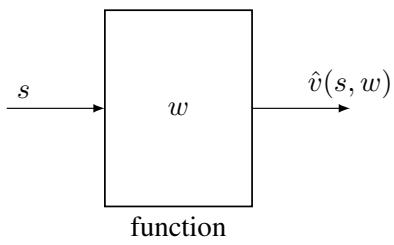
> **原书图 8.3**：输入状态 $s$，经过参数为 $w$ 的函数，输出价值估计 $\hat v(s,w)$。如果函数是神经网络，这一步就是 forward propagation 前向传播。

### 3. 读取价值：查表 vs 算函数

表格表示下，读取很直接：

$$
s_i \longrightarrow \text{读取表中第 }i\text{ 个条目} \longrightarrow \hat v(s_i).
$$

函数表示下，读取变成计算：

$$
s \longrightarrow \phi(s) \longrightarrow \phi^T(s)w \longrightarrow \hat v(s,w).
$$

这带来一个重要优点：storage efficiency 存储效率高。

表格方法要存：

$$
n\text{ 个数}.
$$

直线近似只需要存：

$$
w=
\begin{bmatrix}
a\\
b
\end{bmatrix},
$$

也就是 2 个参数。更一般地，函数近似只存参数向量 $w$，而 $w$ 的维度通常远小于状态数 $|\mathcal S|$。

但这个优点不是免费的。因为少量参数要表示大量状态价值，通常不可能完全精确，所以这叫 approximation 近似。

⚠️ **不要把“函数近似”理解成一定更准。** 它首先解决的是“存不下、泛化不了”的问题；精度取决于函数类是否适合任务。用一条直线去拟合弯曲很强的数据，当然会有误差。

### 4. 更新价值：改格子 vs 改参数

表格方法更新一个状态价值时，只改那个状态：

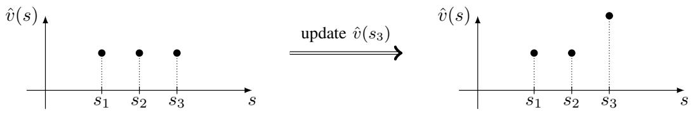
> **原书图 8.4(a)**：更新 $\hat v(s_3)$ 时，$\hat v(s_1)$ 和 $\hat v(s_2)$ 不受影响。图注原文中有一处写成 $s_2$，结合正文和图中箭头，这里应理解为更新 $s_3$。

函数近似更新一个状态价值时，不能直接改某一个输出值，而是改参数 $w$：

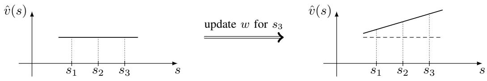
> **原书图 8.4(b)**：为了让 $\hat v(s_3)$ 变大，我们调整整条函数曲线；于是 $\hat v(s_1)$、$\hat v(s_2)$ 也会跟着变化。

这就是 generalization ability 泛化能力：一个状态的经验样本，不只帮助这个状态，也可能帮助“附近”或“特征相似”的其他状态。

读法：表格法像给每个状态单独放一个旋钮；函数近似像用少数几个总旋钮控制整条曲线。你调一个总旋钮时，不可能只改变一个点。

### 5. 一个最小数值例子：三格表压成一条线

假设只有三个状态：

$$
s_1=1,\quad s_2=2,\quad s_3=3,
$$

它们的真实价值是：

$$
v_\pi(s_1)=1,\quad v_\pi(s_2)=2,\quad v_\pi(s_3)=4.
$$

表格方法可以精确存：

| 状态 | $s_1$ | $s_2$ | $s_3$ |
|---|---:|---:|---:|
| 表格估计 | 1 | 2 | 4 |

现在用直线：

$$
\hat v(s,w)=as+b.
$$

最小二乘拟合会得到：

$$
a=1.5,\qquad b=-\frac{2}{3}.
$$

于是：

| 状态 | 真实值 $v_\pi(s)$ | 直线近似 $\hat v(s,w)$ | 误差 |
|---|---:|---:|---:|
| $s_1=1$ | 1 | $0.833$ | $-0.167$ |
| $s_2=2$ | 2 | $2.333$ | $0.333$ |
| $s_3=3$ | 4 | $3.833$ | $-0.167$ |

这张表说明两件事：

1. 用 2 个参数 $a,b$ 代替 3 个表格值，存储更省。
2. 直线不能完全穿过这三个点，所以出现近似误差。

如果以后来了一个没见过的新状态 $s=2.5$，表格方法没有对应格子；函数近似却可以直接算：

$$
\hat v(2.5,w)=1.5\times 2.5-\frac{2}{3}\approx 3.083.
$$

这就是泛化：函数可以对未单独存储的状态给出估计。

### 6. 更复杂的函数：二次多项式

如果直线太弱，可以用二次多项式：

$$
\hat {v} (s, w) = a s ^ {2} + b s + c
= \underbrace {\left[ s ^ {2} , s , 1 \right]} _ {\phi^ {T} (s)}
\underbrace {\left[ \begin{array}{l} a \\ b \\ c \end{array} \right]} _ {w}
= \phi^ {T} (s) w. \tag {8.2}
$$

读法：状态 $s$ 先被扩展成特征：

$$
\phi(s)=
\begin{bmatrix}
s^2\\
s\\
1
\end{bmatrix},
$$

再和参数

$$
w=
\begin{bmatrix}
a\\
b\\
c
\end{bmatrix}
$$

做内积。

注意一个很重要的说法：式 (8.1) 和式 (8.2) 都是 linear function approximation 线性函数近似。

为什么二次函数也叫线性函数近似？因为“线性”指的是对参数 $w$ 线性，不是对状态 $s$ 线性。

式 (8.2) 对 $s$ 是非线性的，因为有 $s^2$；但对参数 $a,b,c$ 是线性的：

$$
\hat v(s,w)=
a\cdot s^2+b\cdot s+c\cdot 1.
$$

⚠️ **易错点：linear in $w$ 与 linear in $s$ 不是一回事。** 本章说 linear function approximation 时，核心是 $\hat v(s,w)=\phi^T(s)w$，也就是参数 $w$ 只以一次方线性出现。

### 7. 特征选择为什么困难

要使用线性函数近似，我们必须先选 feature vector 特征向量 $\phi(s)$。

比如：

$$
\phi(s)=
\begin{bmatrix}
s\\
1
\end{bmatrix}
$$

对应直线；

$$
\phi(s)=
\begin{bmatrix}
s^2\\
s\\
1
\end{bmatrix}
$$

对应二次曲线。

如果我们知道真实价值大概是一条直线，直线特征就很好；如果真实价值明显弯曲，二次或更高阶特征可能更合适。

问题是：实际任务里，我们通常不知道该选什么特征。这就是 feature engineering 特征工程的困难。神经网络之所以流行，是因为它可以作为 nonlinear function approximator 非线性函数近似器，自动从数据中学习较复杂的表示。

### 8. 如果真实价值已知，参数可以用最小二乘求

如果我们知道所有真实值：

$$
\{v_\pi(s_i)\}_{i=1}^n,
$$

那么寻找最优参数 $w$ 就是 least-squares problem 最小二乘问题：

$$
\begin{array}{l}
J _ {1}
= \sum_ {i = 1} ^ {n}
\left(\hat {v} (s _ {i}, w) - v _ {\pi} (s _ {i})\right) ^ {2} \\
= \sum_ {i = 1} ^ {n}
\left(\phi^ {T} (s _ {i}) w - v _ {\pi} (s _ {i})\right) ^ {2} \\
= \left\|
\left[ \begin{array}{c}
\phi^ {T} (s _ {1}) \\
\vdots \\
\phi^ {T} (s _ {n})
\end{array} \right] w
-
\left[ \begin{array}{c}
v _ {\pi} (s _ {1}) \\
\vdots \\
v _ {\pi} (s _ {n})
\end{array} \right]
\right\| ^ {2}
\doteq \| \Phi w - v _ {\pi} \| ^ {2}.
\end{array}
$$

这里：

$$
\Phi \doteq
\left[ \begin{array}{c}
\phi^ {T} (s _ {1}) \\
\vdots \\
\phi^ {T} (s _ {n})
\end{array} \right],
\qquad
v _ {\pi} \doteq
\left[ \begin{array}{c}
v _ {\pi} (s _ {1}) \\
\vdots \\
v _ {\pi} (s _ {n})
\end{array} \right].
$$

读法：$\Phi$ 的每一行是一个状态的特征；$\Phi w$ 是所有状态的预测价值向量；$v_\pi$ 是真实价值向量；最小二乘就是让预测向量尽量接近真实向量。

这里把各个元素的 dimension 维度统一列一下。设状态数是 $n$，特征维度是 $m$。在式 (8.1) 的直线例子里，$m=2$；在式 (8.2) 的二次多项式例子里，$m=3$。

| 符号 | 含义 | 维度 |
|---|---|---|
| $s_i$ | 第 $i$ 个状态 | 一个状态对象；若用标量索引表示，可看作 scalar 标量 |
| $\phi(s_i)$ | 第 $i$ 个状态的 feature vector 特征向量 | $\mathbb R^{m}$，默认列向量 $m\times 1$ |
| $\phi^T(s_i)$ | 第 $i$ 个状态的特征行向量 | $1\times m$ |
| $w$ | 函数参数向量 | $\mathbb R^m$，即 $m\times 1$ |
| $\hat v(s_i,w)=\phi^T(s_i)w$ | 第 $i$ 个状态的预测价值 | scalar 标量，$1\times 1$ |
| $v_\pi(s_i)$ | 第 $i$ 个状态的真实价值 | scalar 标量，$1\times 1$ |
| $\Phi$ | 把所有状态的 $\phi^T(s_i)$ 按行叠起来的特征矩阵 | $n\times m$ |
| $v_\pi$ | 所有真实状态值组成的列向量 | $n\times 1$ |
| $\Phi w$ | 所有状态的预测价值向量 | $(n\times m)(m\times 1)=n\times 1$ |
| $\Phi w-v_\pi$ | prediction error 预测误差 / residual 残差向量 | $n\times 1$ |
| $\|\Phi w-v_\pi\|^2$ | 所有状态误差平方和 | scalar 标量 |

所以矩阵形式的目标函数维度是：

$$
\underbrace{\Phi}_{n\times m}
\underbrace{w}_{m\times 1}
-
\underbrace{v_\pi}_{n\times 1}
=
\underbrace{\Phi w-v_\pi}_{n\times 1}.
$$

最优解为：

$$
w ^ {*} = \left(\Phi^ {T} \Phi\right) ^ {- 1} \Phi^T v _ {\pi}.
$$

这条闭式解的维度检查是：

$$
\underbrace{\Phi^T}_{m\times n}
\underbrace{\Phi}_{n\times m}
=
\underbrace{\Phi^T\Phi}_{m\times m},
\qquad
\underbrace{(\Phi^T\Phi)^{-1}}_{m\times m},
$$

以及：

$$
\underbrace{\Phi^T}_{m\times n}
\underbrace{v_\pi}_{n\times 1}
=
\underbrace{\Phi^T v_\pi}_{m\times 1}.
$$

最后：

$$
\underbrace{(\Phi^T\Phi)^{-1}}_{m\times m}
\underbrace{\Phi^T v_\pi}_{m\times 1}
=
\underbrace{w^*}_{m\times 1}.
$$

这里原切片最后一式写作 $\left(\Phi^T\Phi\right)^{-1}\Phi v_\pi$，按矩阵维度应为 $\left(\Phi^T\Phi\right)^{-1}\Phi^T v_\pi$：因为 $\Phi\in\mathbb R^{n\times m}$，只有 $\Phi^T v_\pi$ 的维度才是 $m\times 1$。

⚠️ **但在强化学习里，$v_\pi$ 通常未知。** 如果真实价值都知道，就不需要学习估计了。第 8.2 节会把这个“理想的最小二乘目标”改造成可用样本和 TD target 训练的算法。

### 9. 本节闭环

本节完成了一个表示层面的转换：

$$
\text{表格价值 } \hat v(s_i)
\quad\Longrightarrow\quad
\text{函数价值 } \hat v(s,w).
$$

表格法的优点是直接、精确、容易理解；缺点是状态多时无法扩展，也不能自然泛化。

函数近似的优点是节省存储、能泛化、能接入神经网络；缺点是有近似误差，且学习参数 $w$ 比改表格条目更复杂。

下一节 8.2 会正式回答：如果价值写成 $\hat v(s,w)$，TD learning 应该怎样更新参数 $w$？

---

## 8.2 TD learning of state values based on function approximation（基于函数近似的状态值 TD 学习）

**要解决的问题**：8.1 只是说“可以用 $\hat v(s,w)$ 表示价值”。本节要正式回答：给定策略 $\pi$，如果价值函数由参数 $w$ 控制，TD learning 时序差分学习应该怎样更新 $w$，以及这个算法到底在优化什么目标。

这节很长，可以先抓住一条主线：

$$
\text{定义误差目标 }J(w)
\quad\Longrightarrow\quad
\text{用梯度下降更新 }w
\quad\Longrightarrow\quad
\text{真实 }v_\pi\text{ 未知，换成 MC 或 TD 目标}
\quad\Longrightarrow\quad
\text{得到基于函数近似的 TD 更新}.
$$

### 1. 把函数近似写成优化问题

给定一个策略 $\pi$，对任意状态 $s$，真实 state value 状态值是：

$$
v_\pi(s).
$$

函数近似给出的估计是：

$$
\hat v(s,w).
$$

我们想选一个参数 $w$，让 $\hat v(s,w)$ 尽量接近 $v_\pi(s)$。最自然的 objective function 目标函数是平方误差期望：

$$
J (w) = \mathbb {E} \left[ \left(v _ {\pi} (S) - \hat {v} (S, w)\right) ^ {2} \right]. \tag {8.3}
$$

读法：随机抽一个状态 $S$，比较真实值 $v_\pi(S)$ 和估计值 $\hat v(S,w)$，取平方误差，再对状态分布取平均。

这里最容易漏掉的问题是：$S$ 是随机变量，那它按什么分布抽？

第一种选择是 uniform distribution 均匀分布：所有状态同等重要。如果有 $n$ 个状态：

$$
J (w) = \frac {1}{n} \sum_ {s \in \mathcal {S}} \left(v _ {\pi} (s) - \hat {v} (s, w)\right) ^ {2}. \tag {8.4}
$$

读法：每个状态的误差权重都是 $1/n$。

但强化学习里状态不是平均出现的。有些状态经常访问，有些状态几乎不访问。于是本章重点使用 stationary distribution 平稳分布 $d_\pi(s)$：

$$
J (w) = \sum_ {s \in \mathcal {S}} d _ {\pi} (s) (v _ {\pi} (s) - \hat {v} (s, w)) ^ {2}. \tag {8.5}
$$

逐项读：

$$
\underbrace{d_\pi(s)}_{\text{长期访问 }s\text{ 的概率}}
\underbrace{(v_\pi(s)-\hat v(s,w))^2}_{\text{状态 }s\text{ 的平方误差}}.
$$

读法：经常访问的状态更重要，它们的误差在目标函数里权重大；很少访问的状态权重小。

⚠️ **这里的 $J(w)$ 不是普通“所有点平均拟合”的目标。** 它是按策略 $\pi$ 的长期访问频率加权的拟合目标。换一个策略 $\pi$，平稳分布 $d_\pi$ 会变，目标函数也会变。

### 2. Box 8.1：平稳分布到底是什么

给定策略 $\pi$ 后，MDP 会变成一个 Markov process 马尔可夫过程。记：

$$
P_\pi\in\mathbb R^{n\times n},
$$

其中 $[P_\pi]_{ij}$ 表示从 $s_i$ 转移到 $s_j$ 的一步概率。

$P_\pi^k$ 的含义是 $k$ 步转移概率：

$$
[ P _ {\pi} ^ {k} ] _ {i j} = p _ {i j} ^ {(k)}.
$$

如果初始状态分布是 $d_0$，那么经过 $k$ 步后的分布是：

$$
d _ {k} ^ {T} = d _ {0} ^ {T} P _ {\pi} ^ {k}. \tag {8.7}
$$

在适当条件下，长期行为会收敛：

$$
\lim _ {k \to \infty} P _ {\pi} ^ {k} = \mathbf {1} _ {n} d _ {\pi} ^ {T}. \tag {8.8}
$$

于是：

$$
\lim  _ {k \rightarrow \infty} d _ {k} ^ {T}
= d _ {\pi} ^ {T}. \tag {8.9}
$$

读法：不管从哪里出发，走得足够久以后，访问各状态的比例都会趋近于一个固定分布 $d_\pi$。

这个固定分布满足：

$$
d _ {\pi} ^ {T} = d _ {\pi} ^ {T} P _ {\pi}. \tag {8.10}
$$

也就是说，$d_\pi$ 是 $P_\pi$ 对应特征值 1 的 left eigenvector 左特征向量，并且：

$$
\sum_s d_\pi(s)=1.
$$

**一个体现 $k$ 的 2 状态小例子。**

设：

$$
P_\pi=
\begin{bmatrix}
0.8 & 0.2\\
0.4 & 0.6
\end{bmatrix}.
$$

它的意思是：

- 在 $s_1$ 时，下一步有 $0.8$ 概率留在 $s_1$，$0.2$ 概率去 $s_2$。
- 在 $s_2$ 时，下一步有 $0.4$ 概率去 $s_1$，$0.6$ 概率留在 $s_2$。

假设初始时一定在 $s_1$：

$$
d_0^T=[1,0].
$$

第 $k$ 步后的状态分布由：

$$
d_k^T=d_0^TP_\pi^k
$$

给出。我们逐步算：

$$
d_1^T=d_0^TP_\pi=[1,0]
\begin{bmatrix}
0.8 & 0.2\\
0.4 & 0.6
\end{bmatrix}
=[0.8,0.2].
$$

再走一步：

$$
d_2^T=d_1^TP_\pi=[0.8,0.2]
\begin{bmatrix}
0.8 & 0.2\\
0.4 & 0.6
\end{bmatrix}
=[0.72,0.28].
$$

也可以直接写成：

$$
d_2^T=d_0^TP_\pi^2.
$$

继续迭代，可以看到 $d_k$ 逐渐稳定：

| $k$ | $d_k^T=d_0^TP_\pi^k$ | 读法 |
|---:|---:|---|
| 0 | $[1.0000,\ 0.0000]$ | 初始一定在 $s_1$ |
| 1 | $[0.8000,\ 0.2000]$ | 一步后仍更可能在 $s_1$ |
| 2 | $[0.7200,\ 0.2800]$ | 开始靠近长期比例 |
| 3 | $[0.6880,\ 0.3120]$ | 更接近稳定值 |
| 4 | $[0.6752,\ 0.3248]$ | 继续靠近 |
| 5 | $[0.6701,\ 0.3299]$ | 已经很接近 $\left[\frac23,\frac13\right]$ |
| $\infty$ | $\left[\frac23,\frac13\right]$ | 平稳分布 |

这张表就是式 (8.7) 到式 (8.9) 的具体样子：$k$ 表示已经走了多少步，$P_\pi^k$ 表示 $k$ 步转移，$d_k$ 表示走完 $k$ 步后的状态分布。

最后再验证这个极限确实满足平稳条件。令 $d_\pi=[d_1,d_2]^T$。平稳条件是：

$$
[d_1,d_2]
=
[d_1,d_2]
\begin{bmatrix}
0.8 & 0.2\\
0.4 & 0.6
\end{bmatrix},
\qquad
d_1+d_2=1.
$$

第一维给：

$$
d_1=0.8d_1+0.4d_2
\Longrightarrow
0.2d_1=0.4d_2
\Longrightarrow
d_1=2d_2.
$$

再用 $d_1+d_2=1$：

$$
d_2=\frac13,\qquad d_1=\frac23.
$$

所以：

$$
d_\pi=
\begin{bmatrix}
2/3\\
1/3
\end{bmatrix}.
$$

读法：从 $d_0^T=[1,0]$ 出发，$d_k^T=d_0^TP_\pi^k$ 会逐步靠近 $\left[\frac23,\frac13\right]$。长期看，智能体大约三分之二时间在 $s_1$，三分之一时间在 $s_2$。如果用平稳分布加权目标函数，$s_1$ 的误差权重大约是 $s_2$ 的两倍。

> **原书图 8.5**：左图是 $\epsilon$-greedy 策略诱导的四状态 Markov process；右图显示 1000 步模拟中各状态访问比例逐渐靠近理论 $d_\pi$。原切片中右图文件名少了最后一个 `6`，这里使用本地实际存在的图片路径。

⚠️ **stationary distribution 平稳分布 和 limiting distribution 极限分布的说法略有区别。** 极限分布强调 $d_k$ 真的从任意初始分布收敛过去；平稳分布强调满足 $d_\pi^T=d_\pi^T P_\pi$。在 regular Markov process 正则马尔可夫过程等条件下，两者会一致。

### 3. 从梯度下降到随机梯度

目标是最小化：

$$
J (w) = \mathbb {E} \left[ \left(v _ {\pi} (S) - \hat {v} (S, w)\right) ^ {2} \right].
$$

用 gradient descent 梯度下降：

$$
w _ {k + 1} = w _ {k} - \alpha_ {k} \nabla_ {w} J (w _ {k}).
$$

对 $J(w)$ 求梯度：

$$
\begin{array}{l}
\nabla_ {w} J (w _ {k})
= \nabla_ {w} \mathbb {E} [ (v _ {\pi} (S) - \hat {v} (S, w _ {k})) ^ {2} ] \\
= \mathbb {E} \left[ \nabla_ {w} \left(v _ {\pi} (S) - \hat {v} (S, w _ {k})\right) ^ {2} \right] \\
= 2 \mathbb {E} \left[
\left(v _ {\pi} (S) - \hat {v} (S, w _ {k})\right)
\left(- \nabla_ {w} \hat {v} (S, w _ {k})\right)
\right] \\
= - 2 \mathbb {E} \left[
\left(v _ {\pi} (S) - \hat {v} (S, w _ {k})\right)
\nabla_ {w} \hat {v} (S, w _ {k})
\right].
\end{array}
$$

代回梯度下降，负号抵消：

$$
w _ {k + 1}
= w _ {k}
+ 2 \alpha_ {k}
\mathbb {E} [
(v _ {\pi} (S) - \hat {v} (S, w _ {k}))
\nabla_ {w} \hat {v} (S, w _ {k})
]. \tag {8.11}
$$

系数 2 可以并入步长 $\alpha_k$。但式 (8.11) 还需要算期望，实际采样时用 stochastic gradient 随机梯度，把随机变量 $S$ 的一个样本 $s_t$ 代进去：

$$
w _ {t + 1}
= w _ {t}
+ \alpha_ {t}
\left(v _ {\pi} (s _ {t}) - \hat {v} \left(s _ {t}, w _ {t}\right)\right)
\nabla_ {w} \hat {v} \left(s _ {t}, w _ {t}\right). \tag {8.12}
$$

读法：如果当前估计 $\hat v(s_t,w_t)$ 比真实值低，就沿着能提高 $\hat v(s_t,w_t)$ 的方向调整 $w$；如果估计太高，就反方向调整。

⚠️ **式 (8.12) 仍然不可实现。** 因为它需要真实 $v_\pi(s_t)$。在强化学习里，真实价值正是我们要学习的东西。

### 4. 用 MC 回报或 TD 目标替代真实价值

为了让式 (8.12) 能用，关键是替换：

$$
v_\pi(s_t).
$$

**Monte Carlo method 蒙特卡洛方法**：用从 $s_t$ 开始的 discounted return 折扣回报 $g_t$ 替代：

$$
w _ {t + 1}
= w _ {t}
+ \alpha_ {t}
\big (g _ {t} - \hat {v} (s _ {t}, w _ {t}) \big)
\nabla_ {w} \hat {v} (s _ {t}, w _ {t}).
$$

**Temporal-difference method 时序差分方法**：用一步 TD target 替代：

$$
r_{t+1}+\gamma \hat v(s_{t+1},w_t).
$$

于是得到本节核心公式：

$$
w _ {t + 1}
= w _ {t}
+ \alpha_ {t}
\left[
\underbrace{r _ {t + 1} + \gamma \hat {v} \left(s _ {t + 1}, w _ {t}\right)}_{\text{TD target}}
-
\underbrace{\hat {v} \left(s _ {t}, w _ {t}\right)}_{\text{当前估计}}
\right]
\nabla_ {w} \hat {v} \left(s _ {t}, w _ {t}\right). \tag {8.13}
$$

中括号里的量就是 TD error 时序差分误差：

$$
\delta_t
\doteq
r_{t+1}
+\gamma \hat v(s_{t+1},w_t)
-\hat v(s_t,w_t).
$$

所以式 (8.13) 可以写成更好记的形式：

$$
w_{t+1}
=
w_t+\alpha_t\delta_t\nabla_w\hat v(s_t,w_t).
$$

读法：参数更新 = 旧参数 + 步长 $\times$ TD 误差 $\times$ 当前状态价值对参数的梯度。

**一个最小数值例子。**

设：

$$
\hat v(s,w)=\phi^T(s)w,\qquad
\phi(s_t)=
\begin{bmatrix}
1\\
2
\end{bmatrix},
\quad
\phi(s_{t+1})=
\begin{bmatrix}
1\\
3
\end{bmatrix},
\quad
w_t=
\begin{bmatrix}
0.5\\
0.2
\end{bmatrix}.
$$

取 $r_{t+1}=1$，$\gamma=0.9$，$\alpha_t=0.1$。

先算当前状态估计：

$$
\hat v(s_t,w_t)=[1,2]
\begin{bmatrix}
0.5\\
0.2
\end{bmatrix}
=0.9.
$$

再算下个状态估计：

$$
\hat v(s_{t+1},w_t)=[1,3]
\begin{bmatrix}
0.5\\
0.2
\end{bmatrix}
=1.1.
$$

TD error：

$$
\delta_t=1+0.9\times 1.1-0.9=1.09.
$$

线性情况下 $\nabla_w\hat v(s_t,w_t)=\phi(s_t)$，所以：

$$
w_{t+1}
=
\begin{bmatrix}
0.5\\
0.2
\end{bmatrix}
+0.1\times 1.09
\begin{bmatrix}
1\\
2
\end{bmatrix}
=
\begin{bmatrix}
0.609\\
0.418
\end{bmatrix}.
$$

读法：这一次样本说“当前估计低了”，所以沿着 $\phi(s_t)$ 的方向把参数往上推。

### 5. Algorithm 8.1：状态值函数近似 TD

算法输入：

- 一个对 $w$ 可微的函数 $\hat v(s,w)$。
- 初始参数 $w_0$。
- 给定策略 $\pi$，目标是估计 $v_\pi(s)$。

每条由 $\pi$ 生成的经验样本：

$$
(s_t,r_{t+1},s_{t+1})
$$

执行更新：

$$
w _ {t + 1}
= w _ {t}
+ \alpha_ {t}
\left[
r _ {t + 1}
+ \gamma \hat {v} (s _ {t + 1}, w _ {t})
- \hat {v} (s _ {t}, w _ {t})
\right]
\nabla_ {w}\hat {v} (s _ {t}, w _ {t}).
$$

输出：更新后的参数 $w$，从而得到价值函数 $\hat v(\cdot,w)$。

这一节还强调：式 (8.13) 只能做 policy evaluation 策略评估，也就是学习给定策略 $\pi$ 的 state values。下一节 8.3 会把它扩展到 action values 动作值，并进一步做控制。

### 6. 线性函数近似：TD-Linear

若使用 linear function approximation 线性函数近似：

$$
\hat {v} (s, w) = \phi^ {T} (s) w,
$$

其中：

$$
\phi(s)\in\mathbb R^m,\qquad w\in\mathbb R^m.
$$

则梯度很简单：

$$
\nabla_ {w} \hat {v} (s, w) = \phi (s).
$$

把它代入式 (8.13)，得到 TD-Linear：

$$
w _ {t + 1}
= w _ {t}
+ \alpha_ {t}
\left[
r _ {t + 1}
+ \gamma \phi^ {T} \left(s _ {t + 1}\right) w _ {t}
- \phi^ {T} \left(s _ {t}\right) w _ {t}
\right]
\phi \left(s _ {t}\right). \tag {8.14}
$$

维度检查：

| 项 | 维度 |
|---|---:|
| $\phi(s_t)$ | $m\times 1$ |
| $\phi^T(s_t)w_t$ | $(1\times m)(m\times 1)=1\times 1$ |
| $\delta_t=r_{t+1}+\gamma\phi^T(s_{t+1})w_t-\phi^T(s_t)w_t$ | scalar |
| $\alpha_t\delta_t\phi(s_t)$ | $m\times 1$ |
| $w_{t+1}$ | $m\times 1$ |

⚠️ **线性 TD 的“线性”仍然是对 $w$ 线性。** 特征 $\phi(s)$ 可以包含 $x^2$、$xy$、$\cos(\pi x)$ 等非线性函数；只要最后是 $\phi^T(s)w$，它就是 linear in parameters。

### 7. Box 8.2：表格 TD 是 TD-Linear 的特例

如果有 $n$ 个状态，对每个状态 $s$ 选 one-hot feature 独热特征：

$$
\phi (s) = e _ {s} \in \mathbb {R} ^ {n},
$$

其中 $e_s$ 在状态 $s$ 对应位置为 1，其他位置为 0。

此时：

$$
\hat {v} (s, w) = e _ {s} ^ {T} w = w (s).
$$

也就是说，参数向量 $w$ 的第 $s$ 个分量就是表格里的 $\hat v(s)$。

代入 TD-Linear：

$$
w _ {t + 1}
= w _ {t}
+ \alpha_ {t}
\big (
r _ {t + 1}
+ \gamma w _ {t} (s _ {t + 1})
- w _ {t} (s _ {t})
\big )
e _ {s _ {t}}.
$$

由于 $e_{s_t}$ 只有 $s_t$ 对应位置是 1，所以它只会更新 $w(s_t)$：

$$
w _ {t + 1} (s _ {t})
= w _ {t} (s _ {t})
+ \alpha_ {t}
\big (
r _ {t + 1}
+ \gamma w _ {t} (s _ {t + 1})
- w _ {t} (s _ {t})
\big ).
$$

这正是第 7 章的 tabular TD 更新。

读法：表格方法不是函数近似的对立面，而是一个特殊的线性函数近似。只是它的特征维度 $m=n$，每个状态都有自己的独立参数，所以没有压缩，也没有跨状态泛化。

### 8. 特征选择：多项式特征与 Fourier 特征

原书用一个 $5\times 5$ grid world 网格世界展示 TD-Linear。给定策略在每个状态以 0.2 的概率采取任意动作；目标是估计该策略下 25 个状态值。

> **原书图 8.6**：同一组真实状态值既可以看成 25 个表格数，也可以看成一个二维位置 $(x,y)$ 上的三维曲面。

8.7 和 8.8 共用的实验条件如下：

| 条件 | 数值 |
|---|---:|
| 网格规模 | $5\times 5$，共 25 个状态 |
| 给定策略 | 每个状态下，每个动作概率为 $0.2$ |
| episode 数 | 500 |
| 每个 episode 长度 | 500 step |
| 初始 state-action pair | 均匀随机选择 |
| 参数初始化 | $w$ 的每个元素独立采样自 $\mathcal N(0,1)$ |
| forbidden / boundary reward | $r_{\text{forbidden}}=r_{\text{boundary}}=-1$ |
| target reward | $r_{\text{target}}=1$ |
| 折扣因子 | $\gamma=0.9$ |

如果状态位置是 $(x,y)$，先把 $x,y$ 归一化。最简单的特征是：

$$
\phi (s) =
\left[
\begin{array}{l}
1\\
x\\
y
\end{array}
\right]
\in \mathbb {R} ^ {3}. \tag {8.15}
$$

对应：

$$
\hat v(s,w)=w_1+w_2x+w_3y.
$$

这只能拟合一个平面。

更强一点的二次特征：

$$
\phi (s) =
\left[
1, x, y, x ^ {2}, y ^ {2}, x y
\right] ^ {T}
\in \mathbb {R} ^ {6}. \tag {8.16}
$$

对应二次曲面：

$$
\hat v(s,w)
=
w_1+w_2x+w_3y+w_4x^2+w_5y^2+w_6xy.
$$

再增强到三次相关特征：

$$
\phi (s) =
\left[
1, x, y, x ^ {2}, y ^ {2}, x y, x ^ {3}, y ^ {3}, x ^ {2} y, x y ^ {2}
\right] ^ {T}
\in \mathbb {R} ^ {10}. \tag {8.17}
$$

原书实验现象是：特征维度越高，拟合越准确；但只要函数类还不够强，误差仍不能降到 0。

图 8.7 的具体条件是：

| 子图 | 特征 | 维度 | 步长 |
|---|---|---:|---:|
| 8.7(a) | $\phi(s)=[1,x,y]^T$ | 3 | 图中标注 $\alpha=0.001$ |
| 8.7(b) | $\phi(s)=[1,x,y,x^2,y^2,xy]^T$ | 6 | 图中标注 $\alpha=0.001$ |
| 8.7(c) | $\phi(s)=[1,x,y,x^2,y^2,xy,x^3,y^3,x^2y,xy^2]^T$ | 10 | 图中标注 $\alpha=0.001$ |

每个条件有两张图：一张是学到的 3D value surface 价值曲面，另一张是 state value error (RMSE) 随 episode 下降的曲线。

> **原书图 8.7**：多项式特征维度从 3 到 10 增加时，近似曲面更灵活，误差通常更小。

另一类特征是 Fourier basis 傅里叶基。将 $x,y$ 归一化到 $[0,1]$，定义：

$$
\phi (s)
=
\left[
\begin{array}{c}
\vdots \\
\cos (\pi (c _ {1} x + c _ {2} y)) \\
\vdots
\end{array}
\right]
\in \mathbb {R} ^ {(q + 1) ^ {2}}, \tag {8.18}
$$

其中：

$$
c_1,c_2\in\{0,1,\dots,q\}.
$$

这里的 $q$ 是 user-specified integer 用户指定的非负整数阶数，不是一个实数区间。原书没有要求 $q$ 取某个连续范围，只是说你可以选 $q=1,2,3,\ldots$。式子里的

$$
\mathbb R^{(q+1)^2}
$$

表示的是 feature vector 特征向量的维度是 $(q+1)^2$，而这个向量的每个分量都是实数。

所以维度是：

$$
(q+1)^2.
$$

当 $q=1$ 时：

$$
\phi(s)=
\left[
\begin{array}{c}
1\\
\cos(\pi y)\\
\cos(\pi x)\\
\cos(\pi(x+y))
\end{array}
\right]
\in\mathbb R^4.
$$

图 8.8 的具体条件是：

| 子图 | Fourier 阶数 $q$ | 特征维度 $(q+1)^2$ | 步长 |
|---|---:|---:|---:|
| 8.8(a) | 1 | 4 | 图中标注 $\alpha=0.0005$ |
| 8.8(b) | 2 | 9 | 图中标注 $\alpha=0.0005$ |
| 8.8(c) | 3 | 16 | 图中标注 $\alpha=0.0005$ |

> **原书图 8.8**：这些图是在同一个 TD-Linear 设定下比较 Fourier 特征阶数的结果，控制变量是 $q$，对应维度分别为 4、9、16。

读图时可以这样看：每个条件其实有两类图。误差曲线看“训练过程是否收敛、误差最后停在哪里”；估计曲面看“学出来的价值函数形状像不像真实曲面”。$q$ 越大，可用的余弦基函数越多，函数空间越灵活，所以估计曲面通常更贴近真实状态值，误差曲线的最终平台也更低。

⚠️ **特征维度不是越高越无脑好。** 在这本书的例子里，维度升高改善拟合；但实际任务里维度更高也意味着更多参数、更高计算成本、更可能过拟合或训练不稳定。

### 9. 理论分析：TD-Linear 收敛到哪里

到这里，我们已经从直觉上得到 TD 更新式。但原书提醒：式 (8.13) 并不严格最小化最开始的 $J(w)$。为了说明 TD-Linear 为什么有效，需要看它真正收敛到什么。

先考虑一个 deterministic algorithm 确定性版本，把样本更新里的随机量换成期望：

$$
w _ {t + 1}
= w _ {t}
+ \alpha_ {t}
\mathbb {E} \left[
\left(
r _ {t + 1}
+ \gamma \phi^ {T} \left(s _ {t + 1}\right) w _ {t}
- \phi^ {T} \left(s _ {t}\right) w _ {t}
\right)
\phi \left(s _ {t}\right)
\right]. \tag {8.19}
$$

定义：

$$
\Phi
=
\left[
\begin{array}{c}
\vdots \\
\phi^ {T} (s) \\
\vdots
\end{array}
\right]
\in \mathbb {R} ^ {n \times m},
\qquad
D
=
\left[
\begin{array}{c c c}
\ddots & & \\
& d _ {\pi} (s) & \\
& & \ddots
\end{array}
\right]
\in \mathbb {R} ^ {n \times n}. \tag {8.20}
$$

这里：

- $\Phi$：所有状态特征按行叠起来。
- $D$：平稳分布构成的对角权重矩阵。

Lemma 8.1 说，式 (8.19) 里的期望可以写成：

$$
\mathbb {E} \left[
\left(
r _ {t + 1}
+ \gamma \phi^ {T} (s _ {t + 1}) w _ {t}
- \phi^ {T} (s _ {t}) w _ {t}
\right)
\phi (s _ {t})
\right]
= b - A w _ {t},
$$

其中：

$$
A \doteq \Phi^ {T} D (I - \gamma P _ {\pi}) \Phi \in \mathbb {R} ^ {m \times m},
$$

$$
b \doteq \Phi^ {T} D r _ {\pi} \in \mathbb {R} ^ {m}. \tag {8.21}
$$

### 补充：Lemma 8.1 怎么从期望变成 $b-Aw_t$

**放在这里最合适**：就在 Lemma 8.1 之后、式 (8.22) 之前。这样你先知道结论，再看它是怎么拆出来的。

这一推导的详细版单独整理在：[补充：Lemma 8.1 中 b-Aw_t 的详细推导](08_supplement-lemma-8.1-b-minus-aw-derivation.md)。

核心就两步：

1. 用 total expectation 全期望公式，把对随机样本的期望拆成对各个状态的加权平均。
2. 把结果分成 reward 项和 next-state 项，分别整理成矩阵形式。

先从原式出发：

$$
\mathbb {E} \left[
\left(
r _ {t + 1}
+ \gamma \phi^ {T} (s _ {t + 1}) w _ {t}
- \phi^ {T} (s _ {t}) w _ {t}
\right)
\phi (s _ {t})
\right].
$$

因为 $s_t$ 按平稳分布 $d_\pi$ 出现，所以可以先按当前状态 $s_t=s$ 分解：

$$
\sum_{s\in\mathcal S} d_\pi(s)\;
\mathbb E\!\left[
\left(
r_{t+1}
+ \gamma \phi^T(s_{t+1})w_t
- \phi^T(s)w_t
\right)\phi(s_t)
\mid s_t=s
\right].
$$

然后把它拆成两部分：

$$
\underbrace{
\mathbb E[r_{t+1}\phi(s_t)\mid s_t=s]
}_{\text{reward 项}}
\;+\;
\underbrace{
\mathbb E\!\left[\phi(s_t)\big(\gamma\phi^T(s_{t+1})-\phi^T(s_t)\big)w_t\mid s_t=s\right]
}_{\text{TD 项}}.
$$

reward 项很直接：

$$
\mathbb E[r_{t+1}\phi(s_t)\mid s_t=s]
=
\phi(s)\,r_\pi(s),
$$

因此加总后得到：

$$
\sum_{s\in\mathcal S} d_\pi(s)\phi(s)r_\pi(s)
=
\Phi^TDr_\pi
=b.
$$

TD 项则整理成：

$$
-\Phi^T D\Phi w_t
+\gamma \Phi^T D P_\pi \Phi w_t
=
-\Phi^T D(I-\gamma P_\pi)\Phi w_t
=
-Aw_t.
$$

合起来就是：

$$
\mathbb {E} \left[
\left(
r _ {t + 1}
+ \gamma \phi^ {T} (s _ {t + 1}) w _ {t}
- \phi^ {T} (s _ {t}) w _ {t}
\right)
\phi (s _ {t})
\right]
= b - A w _ {t}.
$$

读法：左边是“一个样本的平均更新方向”，右边被拆成一个常量向量 $b$ 和一个线性项 $Aw_t$。这就是为什么后面能把更新式写成

$$
w_{t+1}=w_t+\alpha_t(b-Aw_t).
$$

于是确定性更新简化成：

$$
w _ {t + 1} = w _ {t} + \alpha_ {t} (b - A w _ {t}). \tag {8.22}
$$

如果它收敛到 $w^*$，那么固定点必须满足：

$$
b-Aw^*=0,
$$

所以：

$$
w^*=A^{-1}b.
$$

维度检查：

| 符号 | 维度 |
|---|---:|
| $\Phi$ | $n\times m$ |
| $D$ | $n\times n$ |
| $P_\pi$ | $n\times n$ |
| $I-\gamma P_\pi$ | $n\times n$ |
| $A=\Phi^TD(I-\gamma P_\pi)\Phi$ | $(m\times n)(n\times n)(n\times n)(n\times m)=m\times m$ |
| $r_\pi$ | $n\times 1$ |
| $b=\Phi^TDr_\pi$ | $(m\times n)(n\times n)(n\times 1)=m\times 1$ |
| $A^{-1}b$ | $(m\times m)(m\times 1)=m\times 1$ |

Box 8.4 证明了在相应条件下 $A$ 是 positive definite 正定的，因此可逆。直觉上：只要特征列线性无关、平稳分布给每个状态正权重，TD-Linear 的确定性固定点是良定义的。

表格法作为特例时，$\Phi=I$，于是：

$$
A=D(I-\gamma P_\pi),
\qquad
b=Dr_\pi.
$$

所以：

$$
w^*
=A^{-1}b
=
(I-\gamma P_\pi)^{-1}D^{-1}Dr_\pi
=
(I-\gamma P_\pi)^{-1}r_\pi
=v_\pi. \tag {8.23}
$$

读法：如果特征就是 one-hot，TD-Linear 的极限就是精确的真实状态值；如果特征维度低于状态数，它通常只能收敛到某个近似解。

### 10. TD-Linear 实际最小化的是 projected Bellman error

这一节最重要的理论结论是：

$$
\text{TD-Linear 不直接最小化 }J_E(w)
=\mathbb E[(v_\pi(S)-\hat v(S,w))^2].
$$

它收敛到的 $w^*=A^{-1}b$，其实是在最小化 projected Bellman error 投影贝尔曼误差。

先看三个目标函数。

**第一个：真实价值误差**

$$
J _ {E} (w)
= \mathbb {E} [ (v _ {\pi} (S) - \hat {v} (S, w)) ^ {2} ]
= \| \hat {v} (w) - v _ {\pi} \| _ {D} ^ {2}.
$$

它最直观，但需要真实 $v_\pi$，不可直接用于学习。

**第二个：Bellman error 贝尔曼误差**

真实价值满足：

$$
v_\pi=r_\pi+\gamma P_\pi v_\pi.
$$

于是希望估计值也尽量满足 Bellman equation：

$$
J _ {B E} (w)
=
\| \hat {v} (w)
- \left(r _ {\pi} + \gamma P _ {\pi} \hat {v} (w)\right) \| _ {D} ^ {2}
\doteq
\| \hat {v} (w) - T _ {\pi} (\hat {v} (w)) \| _ {D} ^ {2}. \tag {8.30}
$$

其中 Bellman operator 贝尔曼算子是：

$$
T _ {\pi} (x) \dot {=} r _ {\pi} + \gamma P _ {\pi} x.
$$

**第三个：Projected Bellman error 投影贝尔曼误差**

函数近似的估计值只能落在“可表示空间”里。线性情况下，所有可能估计值形成 $\Phi$ 的列空间：

$$
\{\Phi w: w\in\mathbb R^m\}.
$$

Bellman 更新 $T_\pi(\Phi w)$ 可能跑出这个空间，所以要把它投影回来。投影矩阵为：

$$
M
=
\Phi \left(\Phi^ {T} D \Phi\right) ^ {- 1} \Phi^ {T} D
\in \mathbb {R} ^ {n \times n}.
$$

投影贝尔曼误差为：

$$
J _ {P B E} (w)
=
\| \hat {v} (w) - M T _ {\pi} (\hat {v} (w)) \| _ {D} ^ {2}.
$$

这里把它和前面的 Bellman error 串起来看，就不割裂了。

Bellman error 是：

$$
J_{BE}(w)
=
\|\hat v(w)-T_\pi(\hat v(w))\|_D^2.
$$

如果它能等于 0，就必须有：

$$
\hat v(w)=T_\pi(\hat v(w)).
$$

这就是“估计值本身就是 Bellman operator 的固定点”。  
但在线性函数近似里，$\hat v(w)=\Phi w$ 只能落在 $\Phi$ 的列空间里，而 $T_\pi(\Phi w)$ 不一定还在这个空间里。因此通常不能直接要求

$$
\Phi w=T_\pi(\Phi w).
$$

于是退一步：右边先做 Bellman backup，再用 $M$ 投影回可表示空间：

$$
T_\pi(\Phi w)
\quad\longrightarrow\quad
M T_\pi(\Phi w).
$$

这时 projected Bellman error 要比较的两边就变成：

$$
\underbrace{\Phi w}_{\text{当前估计，已经在特征空间里}}
-
\underbrace{M T_\pi(\Phi w)}_{\text{backup 后投影回特征空间}}.
$$

所以如果 projected Bellman error 达到 0，就必须有：

$$
\Phi w = M T_\pi(\Phi w).
$$

这就是图中的式子。它不是凭空来的，而是从

$$
\hat v(w)=T_\pi(\hat v(w))
$$

这个普通 Bellman 固定点条件，加上一句“函数近似时右边要投影回来”得到的。

和前面的式子对比：

| 目标 | 固定点形式 | 含义 |
|---|---|---|
| Bellman error | $\Phi w=T_\pi(\Phi w)$ | backup 后必须完全等于当前估计 |
| Projected Bellman error | $\Phi w=MT_\pi(\Phi w)$ | backup 后先投影回特征空间，再等于当前估计 |

所以差别就在 $M$：前一个式子没有投影，要求更强；后一个式子有投影，适合函数近似，因为 $T_\pi(\Phi w)$ 可能不在 $\Phi$ 的列空间里。

那它为什么最后会变成 $w^*=A^{-1}b$？关键是：图里的式子写在“价值向量空间”里，而 $A^{-1}b$ 是“参数空间”里的解。两者之间要通过矩阵展开才能连起来。

先把投影矩阵和 Bellman operator 代入：

$$
\Phi w
=
M T_\pi(\Phi w)
=
\Phi(\Phi^T D\Phi)^{-1}\Phi^T D\bigl(r_\pi+\gamma P_\pi \Phi w\bigr).
$$

因为我们要找的是同一个特征空间里的向量，所以左边和右边都在 $\Phi$ 的列空间里。把左边也写成 $\Phi$ 乘某个参数向量，就可以比较参数：

$$
w
=
(\Phi^T D\Phi)^{-1}\Phi^T D\bigl(r_\pi+\gamma P_\pi \Phi w\bigr).
$$

两边左乘 $\Phi^T D\Phi$，得到

$$
\Phi^T D\Phi w
=
\Phi^T D r_\pi
+\gamma \Phi^T D P_\pi \Phi w.
$$

移项：

$$
\Phi^T D(I-\gamma P_\pi)\Phi w
=
\Phi^T D r_\pi.
$$

定义

$$
A=\Phi^T D(I-\gamma P_\pi)\Phi,\qquad b=\Phi^T D r_\pi,
$$

就得到

$$
Aw=b,
\qquad
w^*=A^{-1}b.
$$

这说明：**图中的固定点方程和参数解不是两件事，而是同一件事的两种写法。**

⚠️ 这里的“区别”不是解不同，而是描述角度不同：

- **固定点方程**：在问“backup 再投影回来，会不会还是自己？”
- **最小化目标**：在问“这个投影误差能不能做到最小？”

在线性 TD 这套条件下，两者最后碰到同一个 $w^*$，所以才都写成 $A^{-1}b$。

更具体地说，这个“同一个解”其实有两种来源：

| 角度 | 你在看什么 | 结论 |
|---|---|---|
| 算法角度 | TD 更新还会不会继续变 | 不再变化时满足 $Aw=b$ |
| 几何角度 | backup 后投影回来是不是自己 | 投影误差为 0 时满足 $\Phi w=MT_\pi(\Phi w)$ |

这两个条件最后都化成同一个线性方程，所以得到同一个 $w^*$。  
但它们回答的问题不一样：

- **算法角度**关心“训练跑到最后会停在哪里”。
- **几何角度**关心“在可表示空间里，最像 Bellman 自洽点的那个点是什么”。

这也是为什么前面先写 TD 的固定点，再写 projected Bellman error：一个是从更新过程看，一个是从目标函数看。

把两边的推导放在一起看会更清楚。

**算法角度：**

TD-Linear 的期望更新方向是

$$
b-Aw.
$$

如果训练已经到固定点，参数不再往任何方向动，就必须有

$$
b-Aw=0
\quad\Longleftrightarrow\quad
Aw=b.
$$

**几何角度：**

Projected Bellman fixed point 是

$$
\Phi w=MT_\pi(\Phi w).
$$

把 $M$ 和 $T_\pi$ 展开后，也得到

$$
\Phi^T D(I-\gamma P_\pi)\Phi w
=
\Phi^T D r_\pi,
$$

也就是

$$
Aw=b.
$$

所以：

$$
\text{TD 更新停住}
\quad\Longleftrightarrow\quad
Aw=b
\quad\Longleftrightarrow\quad
\text{投影 Bellman 固定点成立}.
$$

这三个说法在本节的线性、on-policy、满足收敛条件的设定下是同一件事。

Box 8.5 证明这个方程的解正是：

$$
w ^ {*} = A ^ {- 1} b = \arg \min _ {w} J _ {P B E} (w).
$$

### 10.5.1 为什么它同时也是 $J_{PBE}$ 的最小点

$J_{PBE}(w)$ 是一个平方范数：

$$
J_{PBE}(w)=\|\hat v(w)-MT_\pi(\hat v(w))\|_D^2.
$$

平方范数永远非负。只要存在某个 $w$ 让

$$
\hat v(w)=MT_\pi(\hat v(w)),
$$

那么这个误差就是 0，而 0 已经是最小可能值。  
所以“满足投影 Bellman 固定点的解”就是“最小化 $J_{PBE}$ 的解”。

读法：TD-Linear 找到的是“经过 Bellman backup 后，再投影回可表示空间仍然不变”的点。

⚠️ **这解释了一个很重要的事实：TD with function approximation 不是简单地拟合真实 $v_\pi$。** 它实际追的是一个“投影 Bellman 固定点”。这也是为什么函数近似 TD 的理论会比表格 TD 微妙很多。

原书还给出一个误差上界：

$$
\| \Phi w ^ {*} - v _ {\pi} \| _ {D}
\leq
\frac {1}{1 - \gamma}
\min _ {w} \| \hat {v} (w) - v _ {\pi} \| _ {D}. \tag {8.32}
$$

读法：TD-Linear 得到的价值估计与真实价值之间的误差，不会超过“当前函数类能做到的最佳近似误差”的 $\frac1{1-\gamma}$ 倍。这个界在 $\gamma$ 接近 1 时会很松，主要是理论保证。

### 10.6 这一节再用白话重说一遍

你可以把这三件事分开：

1. **$J_E$**：拿“真实答案”直接比。  
   这是最自然的监督学习目标，但 RL 里通常不知道真实答案 $v_\pi$。

2. **$J_{BE}$**：拿当前估计做一次 Bellman backup，再看自己和备份后的差。  
   这个目标更贴近 Bellman 方程，但备份结果不一定还留在你能表示的函数空间里。

3. **$J_{PBE}$**：先把备份结果投影回你能表示的空间，再看和当前估计差多少。  
   这才是真正和 TD-Linear 收敛点对应的目标。

这三个目标不是“谁更高级”的关系，而是“站在不同位置看同一件事”：

- $J_E$ 看的是和真实答案的距离。
- $J_{BE}$ 看的是和 Bellman 自洽性的距离。
- $J_{PBE}$ 看的是“在你能表示的空间里，自洽到了什么程度”。

如果把函数近似空间想成一张平面：

- 真实价值函数是空中的一团点。
- 你的模型只能在这张平面上找点。
- Bellman backup 之后，点可能飞出平面。
- 投影算子 $M$ 会把它拉回平面。
- TD-Linear 想找的是“拉回平面之后仍然不动”的那个点。

所以：

$$
\Phi w = MT_\pi(\Phi w)
$$

这句话的意思不是“$\Phi w$ 等于真实价值”，而是：

> 先 backup，再投影，最后还是回到原来的 $\Phi w$。

这也是为什么它叫 **projected Bellman fixed point 投影贝尔曼固定点**。

如果还要再压缩成一句：

> TD-Linear 不是在求“真实价值的最好拟合”，而是在求“函数空间里最稳定的 Bellman 近似点”。

### 11. Least-squares TD：直接估计固定点

最后，原书介绍 least-squares TD，简称 LSTD。

既然 TD-Linear 的理论固定点是：

$$
w^*=A^{-1}b,
$$

并且：

$$
A
=
\mathbb {E}
\left[
\phi (s _ {t})
\left(\phi (s _ {t}) - \gamma \phi (s _ {t + 1})\right) ^ {T}
\right],
$$

$$
b
=
\mathbb {E}
\Big [
r _ {t + 1} \phi (s _ {t})
\Big ],
$$

那就可以用样本直接估计 $A$ 和 $b$：

$$
\hat {A} _ {t}
=
\sum_ {k = 0} ^ {t - 1}
\phi (s _ {k})
\left(\phi (s _ {k}) - \gamma \phi (s _ {k + 1})\right) ^ {T},
$$

$$
\hat {b} _ {t}
=
\sum_ {k = 0} ^ {t - 1}
r _ {k + 1} \phi \left(s _ {k}\right). \tag {8.34}
$$

然后：

$$
w_t=\hat A_t^{-1}\hat b_t.
$$

原书提醒：式 (8.34) 里没有写 $1/t$，因为 $\hat A_t$ 和 $\hat b_t$ 同时乘上 $1/t$，求 $\hat A_t^{-1}\hat b_t$ 时会抵消。

LSTD 的优点：

- 样本利用率高。
- 收敛通常比普通 TD 快。
- 它直接利用了固定点 $w^*=A^{-1}b$ 的结构。

LSTD 的缺点：

- 主要用于 state-value estimation 状态值估计，不像 TD 那样自然扩展到后面的 action-value 控制算法。
- 它基于线性形式和闭式解，不适合一般 nonlinear approximator 非线性近似器。
- 每步要维护 $m\times m$ 矩阵，直接求逆复杂度是 $O(m^3)$，特征维度大时很贵。

### 12. 本节闭环

8.1 只是把价值从表格换成函数；8.2 则把 TD 学习规则完整搬到了参数空间：

$$
\hat v(s)
\quad\Longrightarrow\quad
\hat v(s,w)
\quad\Longrightarrow\quad
w_{t+1}=w_t+\alpha_t\delta_t\nabla_w\hat v(s_t,w_t).
$$

这节最核心的三句话：

1. 函数近似的价值学习可以写成优化问题，目标函数通常按平稳分布 $d_\pi$ 加权。
2. 真实 $v_\pi$ 不可得，所以用 MC return 或 TD target 替代；TD 替代就得到式 (8.13)。
3. 在线性情况下，TD-Linear 收敛到 projected Bellman error 的最小解，而不是直接最小化真实价值平方误差。

下一节 8.3 会把这里的 state value 状态值算法扩展成 action value 动作值算法：Sarsa with function approximation 和 Q-learning with function approximation。

---

## 8.3 TD learning of action values based on function approximation（基于函数近似的动作值 TD 学习）

**要解决的问题**：8.2 已经把 state value 状态值做成了函数近似版 TD 学习，但真正做控制时，我们通常更关心 action value 动作值 $q(s,a)$，因为选动作时要比较的是“这个状态下哪个动作更好”。本节就是把 8.2 的思路从 $v(s)$ 平移到 $q(s,a)$。

这一步看起来很小，实际上很关键：一旦把输出从状态值换成动作值，后面就能自然接上 Sarsa 和 Q-learning 的函数近似版本。

### 8.3.1 Sarsa with function approximation

Sarsa 的函数近似版，本质上还是“用样本 TD 误差去推参数”，只是把状态值函数 $\hat v(s,w)$ 换成动作值函数 $\hat q(s,a,w)$。

如果

$$
\hat q(s,a,w)\approx q_\pi(s,a),
$$

那么 Sarsa 的参数更新就是

$$
w_{t+1}
=
w_t
+
\alpha_t
\Big[
r_{t+1}
+\gamma \hat q(s_{t+1},a_{t+1},w_t)
-\hat q(s_t,a_t,w_t)
\Big]
\nabla_w \hat q(s_t,a_t,w_t). \tag{8.35}
$$

这和 8.2 的式子几乎同构，只是把“下一状态的值”换成了“下一状态下实际跟着策略选出来的动作值”。

读法：

- 先算当前动作对的估计 $\hat q(s_t,a_t,w_t)$；
- 再看下一步按当前策略采样到的 $(s_{t+1},a_{t+1})$ 的估计；
- 二者差出来的 TD 误差，乘上当前特征方向，推动参数 $w$ 更新。

如果使用 linear function approximation 线性函数近似，

$$
\hat q(s,a,w)=\phi^T(s,a)w,
$$

那么

$$
\nabla_w \hat q(s,a,w)=\phi(s,a).
$$

这时更新式就变成了“TD 误差 $\times$ 当前 state-action 特征”。

#### Algorithm 8.2 的意思

算法 8.2 做的是一个控制闭环：

1. 从初始状态 $s_0$ 出发，先按初始策略选 $a_0$。
2. 反复采样 $(r_{t+1},s_{t+1},a_{t+1})$。
3. 用式 (8.35) 更新参数 $w$。
4. 再按更新后的 $\hat q$ 做 $\epsilon$-greedy policy improvement 策略改进。

这里要注意一点：**policy 仍然是表格形式的**，也就是 $\pi(a|s)$ 还是按有限状态和有限动作来写的，不是一个神经网络策略。这个限制会留到第 9 章再处理。

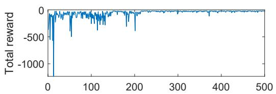
> **原书图 8.9(a)**：总回报随 episode index 增大后逐渐稳定，说明策略在变好。

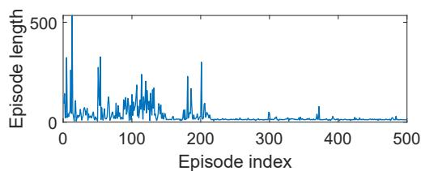
> **原书图 8.9(b)**：episode length 很快下降并稳定，说明到达目标所需步数越来越少。

> **原书图 8.9(c)**：从左上角起点出发，学到了一条绕开障碍、走向目标的路径。

这里用的是 5 阶 Fourier basis 傅里叶基特征，说明线性函数近似并不等于“只能用最简单的直线”，只要特征设计得好，也能表示相当灵活的函数。

⚠️ **易错点**：Sarsa 里 bootstrap 的对象是“自己采样到的下一步动作”，所以它是 on-policy 的；学到的是跟当前行为策略一致的动作值。

### 8.3.2 Q-learning with function approximation

Q-learning 的动作值函数近似版，和 Sarsa 的唯一核心差别在于目标项：

- Sarsa 用 $\hat q(s_{t+1},a_{t+1},w_t)$；
- Q-learning 用 $\max_{a\in\mathcal A(s_{t+1})}\hat q(s_{t+1},a,w_t)$。

所以更新式变成

$$
w_{t+1}
=
w_t
+
\alpha_t
\Big[
r_{t+1}
+\gamma \max_{a\in\mathcal A(s_{t+1})}\hat q(s_{t+1},a,w_t)
-\hat q(s_t,a_t,w_t)
\Big]
\nabla_w \hat q(s_t,a_t,w_t). \tag{8.36}
$$

读法：Sarsa 是“顺着当前策略往前看一步”，Q-learning 是“先假设下一步选最优动作，再来修正当前动作值”。

所以两者的关系可以压成一句：

| 方法 | 下一步目标 | 性质 |
|---|---|---|
| Sarsa | 当前策略实际选到的 $a_{t+1}$ | on-policy |
| Q-learning | 下一状态下的最大动作值 | 近似最优控制 |

#### Algorithm 8.3 的意思

算法 8.3 仍然是先采样、再更新参数、再更新策略。不同的是，参数更新里用了 max target，因此它在控制意义上更“往最优值靠”。

书里给出的图 8.10 显示了两个典型现象：

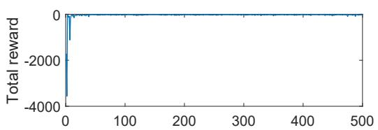
> **原书图 8.10(a)**：总回报在最初剧烈波动后迅速稳定。

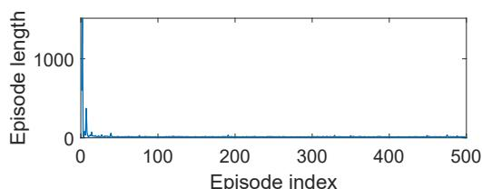
> **原书图 8.10(b)**：episode length 很快压到接近 0 的水平，说明路径越来越短。

> **原书图 8.10(c)**：学到了一条到目标更直接的路径，并避开了障碍。

这里的直觉和 Sarsa 一样：线性函数近似并不是在“死记硬背每个格子”，而是在用一组共享参数，把经验压缩成可泛化的动作值函数。

⚠️ **易错点**：Q-learning 的 target 里有 max，这意味着它在数学上盯着最优动作值；但在函数近似下，max 会让训练更敏感，后面的 deep Q-learning 深度 Q 学习才会专门处理这个问题。

### 8.3.3 这一节真正统一的地方

把 8.2 和 8.3 放在一起看，会发现结构完全一致：

$$
\text{TD target}
\quad\Longrightarrow\quad
\text{TD error}
\quad\Longrightarrow\quad
\text{参数沿梯度方向更新}
$$

区别只在“target 里到底放谁”：

- 8.2 放的是 state value 状态值；
- 8.3 放的是 action value 动作值；
- Sarsa 放的是策略实际执行的下一动作；
- Q-learning 放的是下一状态下的最大动作值。

这就是从“学状态值”到“学动作值”的最小改造。

本节末尾还有一个很重要的提醒：**虽然价值函数已经函数化了，但 policy 还是表格化的。** 也就是说，这一章还没真正进入“状态、动作都可以连续”的时代。那个门会在第 9 章打开。

下一节就是 8.4 Deep Q-learning。

---

## 8.4 Deep Q-learning（深度 Q 学习）

**要解决的问题**：8.3 已经把 Q-learning 写成了函数近似形式，但那里的函数可以是线性的、特征也需要人工设计。本节要进一步问：能不能用 neural network 神经网络自动承担这个近似器，让 Q-learning 进入 deep reinforcement learning 深度强化学习？

答案就是 deep Q-learning，也常叫 deep Q-network，简称 DQN。这里的“deep”不一定意味着网络必须很深；在简单网格世界里，一两个 hidden layers 隐藏层也够用。关键不在“层数炫不炫”，而在于：用神经网络表示动作值函数

$$
\hat q(s,a,w),
$$

并用 Q-learning 的 Bellman optimality target 贝尔曼最优目标来训练它。

### 8.4.1 从 Q-learning 更新式到 DQN 目标函数

8.3 的 Q-learning with function approximation 更新式是：

$$
w_{t+1}
=
w_t
+
\alpha_t
\Big[
r_{t+1}
+\gamma \max_{a}\hat q(s_{t+1},a,w_t)
-\hat q(s_t,a_t,w_t)
\Big]
\nabla_w\hat q(s_t,a_t,w_t).
$$

这可以理解为：让当前估计 $\hat q(s_t,a_t,w_t)$ 靠近一个 target：

$$
r_{t+1}+\gamma\max_a\hat q(s_{t+1},a,w_t).
$$

DQN 把这个想法写成一个平方误差目标：

$$
J
=
\mathbb E
\left[
\left(
R
+\gamma\max_{a\in\mathcal A(S')}\hat q(S',a,w)
-\hat q(S,A,w)
\right)^2
\right]. \tag{8.37}
$$

逐项读：

$$
\underbrace{R+\gamma\max_a\hat q(S',a,w)}_{\text{Bellman optimality target}}
-
\underbrace{\hat q(S,A,w)}_{\text{当前网络输出}}
$$

就是 TD error 时序差分误差。目标函数 $J$ 就是让这个误差的平方尽量小。

为什么这和 Bellman optimality equation 贝尔曼最优方程有关？因为最优动作值满足：

$$
q(s,a)
=
\mathbb E
\left[
R_{t+1}
+\gamma\max_{a\in\mathcal A(S_{t+1})}q(S_{t+1},a)
\mid S_t=s,A_t=a
\right].
$$

如果 $\hat q$ 已经准确等于最优 $q$，那么

$$
R+\gamma\max_a\hat q(S',a,w)-\hat q(S,A,w)
$$

在期望意义下就应该接近 0。

⚠️ **易错点**：式 (8.37) 不是监督学习里“有真实标签 $q^*(s,a)$”的误差。它的标签是自己用 Bellman optimality backup 造出来的 bootstrap target 自举目标。

### 8.4.2 为什么要有 target network

式 (8.37) 看起来像普通神经网络训练，但有一个麻烦：参数 $w$ 同时出现在两边。

左边当前输出是：

$$
\hat q(S,A,w).
$$

右边 target 也是用同一个网络算的：

$$
R+\gamma\max_a\hat q(S',a,w).
$$

这会让目标一边训练一边移动。好比你一边追终点，终点一边被你脚下的动作拖着跑，梯度就会变得不稳定。

为了把 target 暂时固定住，DQN 引入两个网络：

| 网络 | 参数 | 用途 |
|---|---|---|
| main network 主网络 | $w$ | 输出当前估计 $\hat q(s,a,w)$，每次迭代都更新 |
| target network 目标网络 | $w_T$ | 计算 target，隔一段时间才从主网络复制参数 |

于是目标函数改成：

$$
J
=
\mathbb E
\left[
\left(
R
+\gamma\max_{a\in\mathcal A(S')}\hat q(S',a,w_T)
-\hat q(S,A,w)
\right)^2
\right].
$$

这时 $w_T$ 暂时固定，梯度只对主网络参数 $w$ 求：

$$
\nabla_w J
=
\mathbb E
\left[
\left(
R
+\gamma\max_{a\in\mathcal A(S')}\hat q(S',a,w_T)
-\hat q(S,A,w)
\right)
\nabla_w\hat q(S,A,w)
\right]. \tag{8.38}
$$

原书说这里省略了一些常数系数，比如平方误差求导时的 $2$。这不影响梯度下降方向。

读法：target network 负责“给主网络出题”，主网络负责“答题并更新参数”；每隔 $C$ 次迭代，再把主网络的新参数复制给 target network。

### 8.4.3 为什么要有 experience replay

DQN 的第二个关键技术是 experience replay 经验回放。

普通在线 RL 会按时间顺序拿到样本：

$$
(s_0,a_0,r_1,s_1),
(s_1,a_1,r_2,s_2),
(s_2,a_2,r_3,s_3),
\ldots
$$

但相邻样本高度相关。比如在网格世界里，连续几步往往就在附近几个格子转。这种样本序列直接拿来训练神经网络，会让 mini-batch 不像独立抽样，训练更容易偏。

experience replay 的做法是：

1. 先把经验样本存进 replay buffer 回放池

$$
\mathcal B=\{(s,a,r,s')\}.
$$

2. 每次训练主网络时，从 $\mathcal B$ 里 uniform sampling 均匀抽一个 mini-batch。
3. 对每个样本算 target：

$$
y_T
=
r+\gamma\max_{a\in\mathcal A(s')}\hat q(s',a,w_T).
$$

这个 $y_T$ 对**单个样本**来说是一个 **标量**，不是向量。因为 $r$ 是标量，$\max_{a\in\mathcal A(s')}\hat q(s',a,w_T)$ 也是标量，所以两者相加仍然是标量。

如果一次抽的是 mini-batch，batch size 为 $B$，那可以把所有样本的 target 叠成一个向量：

$$
y_T \in \mathbb R^B,
\qquad
\hat y=\hat q(s,a,w)\in \mathbb R^B.
$$

更细一点说：

- 对单个样本，$\hat q(s,a,w)\in\mathbb R$；
- 对一个 batch，$\hat q$ 的输出会排成 $B\times 1$ 向量；
- 如果网络设计成“输入 state，输出所有动作值”，那单个状态的输出会是 $\mathbb R^{|\mathcal A(s)|}$ 向量，但这里原文用的是“输入 $(s,a)$，输出一个 $q$ 值”的设计，所以这里讨论的是标量输出。

4. 用 mini-batch 最小化：

$$
(y_T-\hat q(s,a,w))^2.
$$

为什么要“均匀抽样”？原书从目标函数角度解释：式 (8.37) 里的随机变量 $(S,A,R,S')$ 必须有一个明确分布。最简单的设定是把 state-action pair 状态-动作对看作均匀分布。现实中行为策略生成的轨迹不均匀，而且时间上相关；从 replay buffer 均匀抽样，可以打散这种顺序相关性，更接近目标函数想要的分布设定。

还有一个很实用的好处：同一个经验样本可以被重复使用，提高 data efficiency 数据效率。

#### 一个很小的例子：连续样本为什么会把网络带偏

假设在一个 $5\times 5$ 网格里，agent 从左上角开始，某一段连续轨迹是：

| 时间 | 状态 $s_t$ | 动作 $a_t$ | 奖励 $r_{t+1}$ | 下一状态 $s_{t+1}$ |
|---:|---|---|---:|---|
| 1 | $(1,1)$ | right | $0$ | $(1,2)$ |
| 2 | $(1,2)$ | right | $0$ | $(1,3)$ |
| 3 | $(1,3)$ | right | $0$ | $(1,4)$ |
| 4 | $(1,4)$ | down | $0$ | $(2,4)$ |

如果不用 replay buffer，而是按顺序直接拿这 4 个样本组成一个 mini-batch，那么这个 batch 全都来自网格上方的一小段路径，而且奖励全是 $0$。神经网络这一次更新时，会被迫主要适应“上方这一小段路径的 q 值应该怎样变”。

问题在于：这个 batch 没有告诉网络下面几件事：

- 靠近 forbidden area 禁区时会得到 $-10$；
- 到达 target 目标时会得到 $+1$；
- 网格下方、右侧、目标附近的动作值应该是什么样。

于是一次更新看到的信息很窄。连续很多次都这样，网络就容易被最近这段轨迹牵着走：刚学完上方路径，又被下一段局部路径推走，训练方向抖动很大。

有 replay buffer 时，假设回放池里已经存了这些样本：

| 样本编号 | 状态 $s$ | 动作 $a$ | 奖励 $r$ | 下一状态 $s'$ | 信息类型 |
|---:|---|---|---:|---|---|
| 1 | $(1,1)$ | right | $0$ | $(1,2)$ | 起点附近 |
| 2 | $(1,4)$ | down | $0$ | $(2,4)$ | 中间路径 |
| 3 | $(3,3)$ | right | $-10$ | forbidden | 禁区惩罚 |
| 4 | $(4,3)$ | stay | $+1$ | target | 目标奖励 |
| 5 | $(5,4)$ | left | $0$ | $(5,3)$ | 下方区域 |

这时均匀抽一个 batch size 为 3 的 mini-batch，可能抽到：

$$
\{2,4,5\}.
$$

这一个 batch 里就同时包含中间路径、目标奖励、下方区域。对每个样本分别算：

$$
y_T^{(i)}
=
r^{(i)}
+\gamma\max_a\hat q(s'^{(i)},a,w_T),
\qquad i=1,2,3.
$$

然后最小化 batch loss：

$$
L(w)
=
\frac{1}{3}
\sum_{i=1}^{3}
\left(
y_T^{(i)}
-\hat q(s^{(i)},a^{(i)},w)
\right)^2.
$$

读法：这次更新不再只服务于一小段连续轨迹，而是同时考虑 replay buffer 里随机抽到的几个区域。这样梯度方向更像“对整体经验分布做平均”，不会被刚刚走过的几步路牵得太厉害。

再看“重复利用数据”的好处。假设到达 target 的样本很稀有：

$$
((4,3),\text{stay},+1,\text{target}).
$$

如果不用 replay，这个宝贵样本只在刚发生时训练一次，很快就过去了。用了 replay buffer 后，它可能在后面的很多 mini-batch 里被再次抽到，于是 $+1$ 这个目标奖励可以反复参与训练，帮助网络更稳定地把“目标附近动作值高”传播出去。

⚠️ **易错点**：replay buffer 不是“为了省内存把样本存起来”。恰恰相反，它会额外占内存；它的核心作用是打散相关性、重复利用数据、让神经网络训练更像普通 mini-batch learning。

### 8.4.4 Algorithm 8.3：DQN 的 off-policy 版本

先回答一个容易疑惑的点：**这一小节和 8.4.3 确实有重叠，但作用不同。**

| 小节 | 关注点 | 它在回答什么 |
|---|---|---|
| 8.4.3 experience replay | 一个组件 | 为什么要把样本放进 replay buffer、为什么要随机抽 mini-batch |
| 8.4.4 Algorithm 8.3 | 完整算法 | DQN 每一轮到底怎么收集数据、算 target、更新主网络、同步目标网络 |

也就是说，8.4.3 是在解释“为什么需要这个零件”；8.4.4 是把这个零件和 target network、off-policy 行为策略一起装成完整训练流程。

原书的 Algorithm 8.3 可以按下面流程读：

1. 初始化 main network 和 target network，初始参数相同。
2. 用 behavior policy 行为策略 $\pi_b$ 收集经验，放入 replay buffer：

$$
\mathcal B=\{(s,a,r,s')\}.
$$

3. 每次迭代，从 $\mathcal B$ 均匀抽 mini-batch。
4. 对每个样本计算 target：

$$
y_T=r+\gamma\max_{a\in\mathcal A(s')}\hat q(s',a,w_T).
$$

5. 更新主网络，使

$$
(y_T-\hat q(s,a,w))^2
$$

在 mini-batch 上变小。
6. 每隔 $C$ 次迭代，设置：

$$
w_T=w.
$$

这个实现是 off-policy 离策略的：经验由行为策略 $\pi_b$ 产生，但学习目标是最优动作值，也就是通过 $\max_a$ 朝 greedy optimal policy 贪心最优策略靠近。

和 8.4.3 相比，这里多出来的关键信息有三点：

1. **经验从哪里来**：由 behavior policy $\pi_b$ 产生，所以它是 off-policy。
2. **target 用谁算**：用 target network 的参数 $w_T$ 算 $y_T$，不是用正在更新的主网络参数 $w$。
3. **两个网络怎么配合**：主网络每轮更新，target network 每隔 $C$ 轮才复制一次 $w_T=w$。

所以如果只看第 3-5 步，它和 8.4.3 很像；但原书 Algorithm 8.3 的完整意义是：

$$
\pi_b\text{ 采样}
\rightarrow
\mathcal B\text{ 存储}
\rightarrow
\text{随机 mini-batch}
\rightarrow
w_T\text{ 算 target}
\rightarrow
w\text{ 更新主网络}
\rightarrow
\text{周期性 }w_T=w.
$$

### 8.4.5 图 8.11：1000 步经验足够时，DQN 学得很好

图 8.11 的任务是：学习每个 state-action pair 状态-动作对的 optimal action value 最优动作值，然后直接取 greedy policy 得到最优策略。

> **原书图 8.11(a)**：行为策略在每个状态对各动作给出相同概率，所以探索性很强。

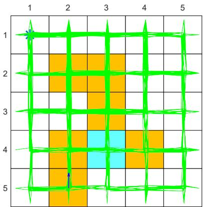
> **原书图 8.11(b)**：虽然只有 1000 步，但因为行为策略探索充分，几乎所有状态-动作对都被访问到了。

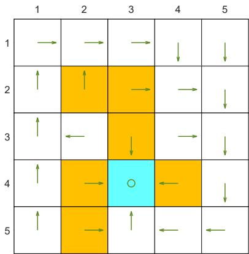
> **原书图 8.11(c)**：学到的最终策略能绕开障碍，到达目标状态。

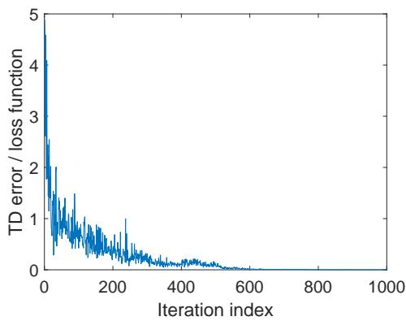
> **原书图 8.11(d)**：loss function 损失函数逐渐降到接近 0，说明网络很好地拟合了 replay buffer 里的训练样本。

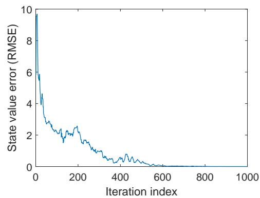
> **原书图 8.11(e)**：value error 也降到接近 0，说明动作值估计整体足够准确。

这里的网络结构很简单：一层 hidden layer，有 100 个神经元。输入有 3 个：

| 输入 | 含义 |
|---|---|
| 第 1 个 | normalized row index 归一化行号 |
| 第 2 个 | normalized column index 归一化列号 |
| 第 3 个 | normalized action index 归一化动作编号 |

输出是一个数：

$$
\hat q(s,a,w).
$$

为什么不用单纯的状态编号？因为网格世界的状态天然有二维位置结构。把 row 和 column 输入网络，比把状态压成一个编号更能保留几何信息。这个小细节很重要：function approximation 的效果不仅取决于算法，也取决于你给近似器喂了什么表示。

这里的 normalized 归一化，意思是把原始整数缩放到 $[0,1]$ 区间。比如在 $5\times 5$ 网格里：

- 行号 $1,2,3,4,5$ 可以分别映射成 $0,0.25,0.5,0.75,1$；
- 列号同理；
- 动作编号如果有 4 个，也可以映射成 $0,\frac13,\frac23,1$。

比如状态是右下角 $(5,5)$，动作是第 3 个动作，那么网络实际看到的输入可能是：

$$
\left(1,1,\frac23\right).
$$

如果状态是左上角 $(1,1)$，动作是第 1 个动作，那么输入可能是：

$$
(0,0,0).
$$

这样做的目的很朴素：让不同维度的输入都落在差不多的数值尺度上，训练更稳定，也更容易学到“位置变化”和“动作变化”之间的关系。

原书还提到另一种网络设计：输入 row、column 两个数，输出五个动作的动作值。也就是：

$$
s\longmapsto
\big[
\hat q(s,a_1),\ldots,\hat q(s,a_5)
\big].
$$

这和“输入 $(s,a)$、输出一个 $\hat q(s,a)$”是两种常见设计。

### 8.4.6 图 8.12：训练 loss 为 0，不代表真实价值估计正确

接下来原书故意把经验数据减少到 100 步。

> **原书图 8.12(a)**：行为策略仍然是强探索策略。

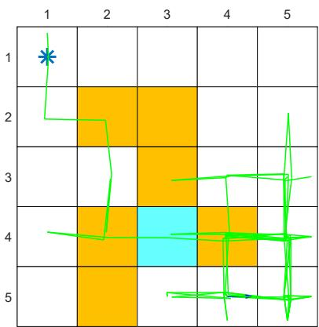
> **原书图 8.12(b)**：经验覆盖明显不足，很多状态-动作对没有被充分访问。

> **原书图 8.12(c)**：最终策略不再可靠，很多位置的动作选择明显不如图 8.11。

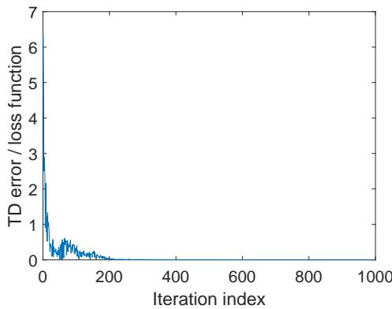
> **原书图 8.12(d)**：网络可以把已有 replay buffer 样本拟合得很好。

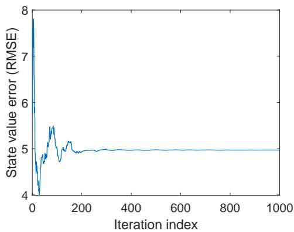
> **原书图 8.12(e)**：value error 停在较高水平，说明网络没有学到准确的整体动作值函数。

这组图是本节非常值得记住的地方：

> loss 低，只说明网络拟合了你给它的样本；不说明它已经知道那些没见过或没充分覆盖的状态-动作对。

1000 步例子里，DQN 高效有两个原因：

1. 函数近似有 generalization ability 泛化能力。
2. experience replay 让同一批经验可以被重复使用。

但 100 步例子提醒我们：泛化不是魔法。如果经验覆盖太少，网络仍然可能在训练集上表现很好，却在真实价值函数上偏得很远。

⚠️ **易错点**：不要把 DQN 的 loss function 和真实 value error 混为一谈。

$$
L_{\text{DQN}}(w)
=
\frac{1}{B}\sum_{i=1}^{B}
\left(
y_T^{(i)}
-\hat q(s^{(i)},a^{(i)},w)
\right)^2
$$

$$
E_{\text{value}}(w)
=
\sum_{s,a}
\left(
\hat q(s,a,w)-q^*(s,a)
\right)^2
$$

两者的关系是：

$$
L_{\text{DQN}}
=
\text{replay buffer 上的经验 Bellman/TD loss}
\neq
\text{真实 value error}
$$

$$
E_{\text{value}}
=
\text{相对 }q^*\text{ 的真实误差}
$$

所以，上面的 $L_{\text{DQN}}$ **不是真实误差**。它是训练时用 mini-batch 能算出来的代理目标，因为 $y_T^{(i)}$ 可以由 target network 算出：

$$
y_T^{(i)}
=
r^{(i)}
+\gamma\max_a\hat q(s'^{(i)},a,w_T).
$$

但 $E_{\text{value}}$ 需要知道真实最优动作值 $q^*(s,a)$。一般强化学习任务里 $q^*$ 不知道，所以训练时不能直接最小化 $E_{\text{value}}$；图 8.11/8.12 这种小网格例子里，作者可以额外算出或近似得到 $q^*$，所以能画 value error 曲线来评估训练结果。

$$
L_{\text{DQN}}(w)\approx 0
\not\Longrightarrow
E_{\text{value}}(w)\approx 0
$$

$$
\mathcal B\ \text{coverage small}
\quad\Longrightarrow\quad
L_{\text{DQN}}(w)\downarrow
\ \text{but}\ 
E_{\text{value}}(w)\nrightarrow 0
$$

这里的意思是：$L_{\text{DQN}}$ 只是在 replay buffer $\mathcal B$ 里的样本上算误差；如果 $\mathcal B$ 覆盖的状态-动作对很少，网络可以把这些样本拟合得很好，让 $L_{\text{DQN}}$ 下降。

但 $E_{\text{value}}$ 比的是整个动作值函数 $\hat q_w$ 和真实最优动作值 $q^*$ 的距离。没被充分采样的状态-动作对，loss 里几乎没有约束，所以整体 value error 仍然可能降不下来。

### 8.4.7 本节闭环

8.3 的 Q-learning with function approximation 给了一个参数更新式；8.4 的 DQN 则把它变成了真正可训练神经网络的流程：

$$
\text{Q-learning target}
\quad\Longrightarrow\quad
\text{target network 固定目标}
\quad\Longrightarrow\quad
\text{experience replay 打散样本}
\quad\Longrightarrow\quad
\text{mini-batch 神经网络训练}
$$

所以 DQN 不是“把 Q-learning 里的函数换成神经网络”这么简单。真正让它能训练起来的是两个工程-数学结合的稳定化技巧：

- target network：让目标在短时间内固定；
- experience replay：让训练样本更接近随机 mini-batch，并重复利用数据。

---

## 8.5 Summary（本章总结）

**要解决的问题**：这一节把第 8 章收束起来：本章并不是只多介绍了几个算法，而是完成了从 tabular method 表格方法到 function approximation 函数近似的范式切换。

第 8 章的主线可以这样串：

1. **8.1 表示方式改变**：价值不再是一张表，而是参数函数 $\hat v(s,w)$ 或 $\hat q(s,a,w)$。
2. **8.2 状态值学习改变**：TD 学习从“改一个格子”变成“更新参数 $w$”；线性情况下可以分析其收敛点。
3. **8.3 动作值控制改变**：Sarsa 和 Q-learning 也可以用 $\hat q(s,a,w)$ 来做函数近似。
4. **8.4 近似器升级**：把动作值近似器换成神经网络，得到 DQN。

本章最重要的观念是：value function approximation 价值函数近似本质上是 optimization problem 优化问题。最自然的目标是 estimated value 估计值和 true value 真实值之间的 squared error 平方误差：

$$
J_E(w)=\|\hat v(w)-v_\pi\|^2.
$$

但在 RL 里真实 $v_\pi$ 往往不知道，所以又引出 Bellman error 贝尔曼误差和 projected Bellman error 投影贝尔曼误差。第 8 章尤其强调：TD-Linear 实际对应的是 projected Bellman error，而不是简单地直接拟合真实价值函数。

本章还引入了 stationary distribution 平稳分布。它的作用是给目标函数中的不同状态分配权重：策略长期更常访问的状态，在误差度量里更重要。这个概念在第 9 章还会继续出现，因为下一章要把 policy 策略本身也变成函数。

可以把本章记成一句话：

> 第 8 章让“价值”从表格变成函数；第 9 章会让“策略”也从表格变成函数。

---

## 8.6 Q&A（问答）

**要解决的问题**：这一节不是引入新算法，而是把第 8 章最容易混的几个概念收束起来：表格法和函数近似的差别、函数近似的优缺点、stationary distribution 的作用、DQN 为什么需要 replay buffer 和 target network。

### Q1. tabular method 和 function approximation method 有什么区别？

核心区别是：**价值怎么读取，价值怎么更新**。

| 问题 | tabular method 表格法 | function approximation 函数近似 |
|---|---|---|
| 读取价值 | 直接查表中对应条目 | 把状态 $s$ 输入函数，计算 $\hat v(s,w)$ 或 $\hat q(s,a,w)$ |
| 更新价值 | 直接改某个表格条目 | 更新参数 $w$，间接改变函数输出 |

如果函数是神经网络，读取价值就是一次 forward propagation 前向传播：

$$
s
\rightarrow
\text{network}(w)
\rightarrow
\hat v(s,w).
$$

表格法像是“每个状态一个抽屉”；函数近似像是“所有状态共用一套参数机器”。

### Q2. 函数近似相对表格法有什么优点？

第一个优点是 storage efficiency 存储效率。

表格法要存：

$$
|\mathcal S|\text{ 个状态值}
$$

函数近似只存：

$$
w\in\mathbb R^m,
\qquad
m\ll |\mathcal S|\ \text{通常成立}.
$$

第二个优点是 generalization ability 泛化能力。

表格法更新一个状态：

$$
\hat v(s_i)\leftarrow \hat v(s_i)+\Delta
$$

通常不会影响其他状态。函数近似更新参数：

$$
w\leftarrow w+\Delta w
$$

会同时改变很多状态的输出：

$$
\hat v(s_1,w),\hat v(s_2,w),\ldots
$$

所以，一个状态上的经验可能帮助估计其他状态的价值。

⚠️ **易错点**：泛化不是一定更准。它只是让经验可以跨状态传播；传播得好不好，取决于函数类和特征/网络设计。

### Q3. 表格法和函数近似能统一吗？

可以。tabular method 表格法可以看作 function approximation 函数近似的特例。

用 one-hot feature 独热特征表示状态：

$$
\phi(s_i)=e_i,
\qquad
\hat v(s_i,w)=\phi(s_i)^T w=e_i^T w=w_i.
$$

这说明：表格里的第 $i$ 个格子，本质上就是参数向量 $w$ 的第 $i$ 个分量。

所以：

$$
\text{tabular value}
\equiv
\text{linear function approximation with one-hot features}.
$$

这也解释了为什么本章一直说“表格法是函数近似的特殊线性情形”。

### Q4. 什么是 stationary distribution？为什么重要？

stationary distribution 平稳分布描述的是：在给定策略 $\pi$ 下，agent 长期运行后访问各状态的概率。

如果长期访问状态 $s_i$ 的概率是 $d_\pi(s_i)$，那么：

$$
d_\pi
=
\begin{bmatrix}
d_\pi(s_1)&d_\pi(s_2)&\cdots&d_\pi(s_n)
\end{bmatrix}^T.
$$

它在本章出现，是因为价值函数近似需要定义 objective function 目标函数。比如加权平方误差：

$$
J(w)
=
\sum_s d_\pi(s)
\left(
v_\pi(s)-\hat v(s,w)
\right)^2.
$$

读法：常访问的状态权重大，不常访问的状态权重小。

这个概念不只在价值函数近似里重要，第 9 章 policy gradient 策略梯度还会继续用到它。

### Q5. 线性函数近似有什么优点和缺点？

优点：

- 形式简单：

$$
\hat v(s,w)=\phi(s)^T w.
$$

- 理论性质更容易分析，比如 TD-Linear 的收敛点、projected Bellman error 都能写清楚。
- 表格法可以看作它的特殊情形。

缺点：

- 表达能力有限。
- 特征 $\phi(s)$ 需要人工设计，复杂任务里很难选好。

神经网络作为 nonlinear function approximator 非线性函数近似器，使用上更像黑盒，表达能力更强；但正因为非线性，理论分析也更困难。

### Q6. 为什么 deep Q-learning 需要 experience replay？

原因来自 DQN 的目标函数：

$$
J
=
\mathbb E
\left[
\left(
R+\gamma\max_a\hat q(S',a,w)-\hat q(S,A,w)
\right)^2
\right]. \tag{8.37}
$$

要让这个期望有意义，就要说明随机变量 $(S,A,R,S')$ 从什么分布来。$R,S'$ 的分布由环境模型决定；关键是 $(S,A)$ 的分布。

实际采样时，样本来自行为策略生成的连续轨迹：

$$
(s_0,a_0,r_1,s_1),
(s_1,a_1,r_2,s_2),
(s_2,a_2,r_3,s_3),
\ldots
$$

相邻样本高度相关，不像独立均匀样本。experience replay 的作用就是：

$$
\text{sequence samples}
\rightarrow
\mathcal B
\rightarrow
\text{uniform mini-batch}.
$$

它有两个好处：

1. 打散时间相关性；
2. 同一个经验样本可以被多次使用，提高 data efficiency 数据效率。

### Q7. tabular Q-learning 可以用 experience replay 吗？

可以。虽然 tabular Q-learning 不需要 experience replay，但它可以使用，而且不会破坏算法。

原因是 Q-learning 是 off-policy 离策略的。它不要求样本一定来自当前目标策略，只要样本是合法环境交互数据，就可以用来更新：

$$
q(s_t,a_t)
\leftarrow
q(s_t,a_t)
+\alpha
\left[
r_{t+1}
+\gamma\max_a q(s_{t+1},a)
-q(s_t,a_t)
\right].
$$

使用 replay 的直接好处是：样本可以重复利用。

### Q8. 为什么 deep Q-learning 需要两个网络？

根本原因是简化式 (8.37) 的梯度计算，并稳定训练。

如果只用一个网络，参数 $w$ 同时出现在当前估计和 target 里：

$$
\underbrace{\hat q(S,A,w)}_{\text{当前输出}}
\quad\text{和}\quad
\underbrace{R+\gamma\max_a\hat q(S',a,w)}_{\text{target}}.
$$

target 会随着主网络更新而移动，梯度计算也更麻烦。

DQN 固定 target network 参数 $w_T$：

$$
y_T
=
R+\gamma\max_a\hat q(S',a,w_T).
$$

于是主网络只需要拟合：

$$
\left(
y_T-\hat q(S,A,w)
\right)^2.
$$

主网络参数 $w$ 每轮更新，target network 参数 $w_T$ 每隔 $C$ 轮同步一次：

$$
w_T\leftarrow w.
$$

### Q9. 用神经网络做非线性函数近似时，参数怎么更新？

不能直接机械套用式 (8.36) 那种手写参数更新：

$$
w_{t+1}
=
w_t
+\alpha_t\delta_t\nabla_w\hat q(s_t,a_t,w_t).
$$

实际做法是按 neural network training procedure 神经网络训练流程来更新参数：构造 mini-batch、计算 target、定义 loss，然后用成熟的自动微分和优化器训练网络。

也就是：

$$
\mathcal B_{\text{mini}}
\rightarrow
y_T
\rightarrow
L(w)
=
\frac1B\sum_i
\left(
y_T^{(i)}-\hat q(s^{(i)},a^{(i)},w)
\right)^2
\rightarrow
\text{optimizer step}.
$$

这就是原书最后一句的重点：DQN 的参数更新依赖神经网络训练工具链，而不是手工逐项更新每个参数。

---

## 我的疑问与解答

1. `y_T` 是向量吗？

   不是。对单个样本是标量；对 batch 才是向量。

2. 为什么动作值部分没有展开 projected Bellman error？是因为非线性吗？

   不完全是。projected Bellman error 主要服务于：

   $$
   \text{fixed policy evaluation}
   +
   \text{linear function approximation}
   $$

   也就是给定策略 $\pi$，学习 $v_\pi$ 或 $q_\pi$ 的理论分析。

   如果是固定策略的动作值评估，也可以写类似的投影 Bellman 方程：

   $$
   \hat q(s,a,w)=\phi(s,a)^T w,
   \qquad
   \hat q(w)=\Phi_Qw.
   $$

   $$
   \Phi_Q w
   =
   M_QT_\pi^Q(\Phi_Q w).
   $$

   但 8.3/8.4 讲的是 control 控制问题。Sarsa 会边估计边改策略；Q-learning 和 DQN 用的是 Bellman optimality target：

   $$
   r+\gamma\max_{a'}\hat q(s',a',w).
   $$

   这里的 $\max$ 让 Bellman optimality operator 非线性，目标也随着控制过程变化，所以本书不再展开 projected Bellman error 的线性评估理论，而是转向控制更新、target network 和 experience replay。

---

## 脉络总结 / 要点速记

8.1：价值表示从“每个状态一个表格条目”变成“输入状态、输出价值的参数函数”。

8.2：把 TD learning 搬到参数空间，用 $w_{t+1}=w_t+\alpha_t\delta_t\nabla_w\hat v(s_t,w_t)$ 学习给定策略的状态值；线性情况下，它收敛到 projected Bellman error 的最小解。

8.3：把函数近似 TD 从 state value 状态值扩展到 action value 动作值，得到 Sarsa with function approximation 和 Q-learning with function approximation。

8.4：把 Q-learning 的动作值函数近似器换成神经网络，并用 target network 和 experience replay 稳定训练，得到 DQN。

8.5：本章总结：价值函数近似本质上是优化问题；线性情形帮助理解非线性情形，stationary distribution 会在第 9 章继续发挥作用。

要点速记：

- 表格方法读取价值是查表，函数近似读取价值是计算 $\hat v(s,w)$。
- 表格方法更新价值是改某个格子，函数近似更新价值是改参数 $w$。
- 函数近似省存储，并能把一个状态的经验泛化到其他状态。
- 代价是近似误差：少量参数通常不能无损表示所有状态价值。
- linear function approximation 的“linear”指对参数 $w$ 线性，不一定指对状态 $s$ 线性。
- 如果真实 $v_\pi$ 已知，参数学习可写成最小二乘；但 RL 中真实 $v_\pi$ 通常未知，所以后面要用样本和 TD 目标来训练。
- 8.2 的目标函数常用 stationary distribution $d_\pi(s)$ 加权：常访问状态更重要。
- 基于函数近似的 TD 误差是 $\delta_t=r_{t+1}+\gamma\hat v(s_{t+1},w_t)-\hat v(s_t,w_t)$。
- TD-Linear 更新是 $w_{t+1}=w_t+\alpha_t\delta_t\phi(s_t)$。
- 表格 TD 是 TD-Linear 的 one-hot feature 特例。
- TD-Linear 的理论固定点是 $w^*=A^{-1}b$，实际对应 projected Bellman error，而不是直接最小化真实价值误差。
- 动作值函数近似写作 $\hat q(s,a,w)$，线性形式是 $\hat q(s,a,w)=\phi^T(s,a)w$。
- Sarsa 的 target 是 $r_{t+1}+\gamma\hat q(s_{t+1},a_{t+1},w_t)$，跟随当前策略采样到的下一动作。
- Q-learning 的 target 是 $r_{t+1}+\gamma\max_a\hat q(s_{t+1},a,w_t)$，直接朝下一状态的最大动作值靠。
- 8.3 中价值函数已经函数化，但策略 $\pi(a|s)$ 仍然是表格形式；策略函数化要到第 9 章。
- DQN 的平方 Bellman optimality error 目标是让 $R+\gamma\max_a\hat q(S',a,w)-\hat q(S,A,w)$ 尽量接近 0。
- target network 用 $w_T$ 暂时固定目标，避免主网络一更新 target 也跟着剧烈移动。
- experience replay 从 replay buffer 中均匀抽 mini-batch，打散时间相关性，并重复利用经验样本。
- DQN 的训练 loss 为 0 不等于真实 value error 为 0；经验覆盖不足时，网络可能只是在 replay buffer 上拟合得很好。
