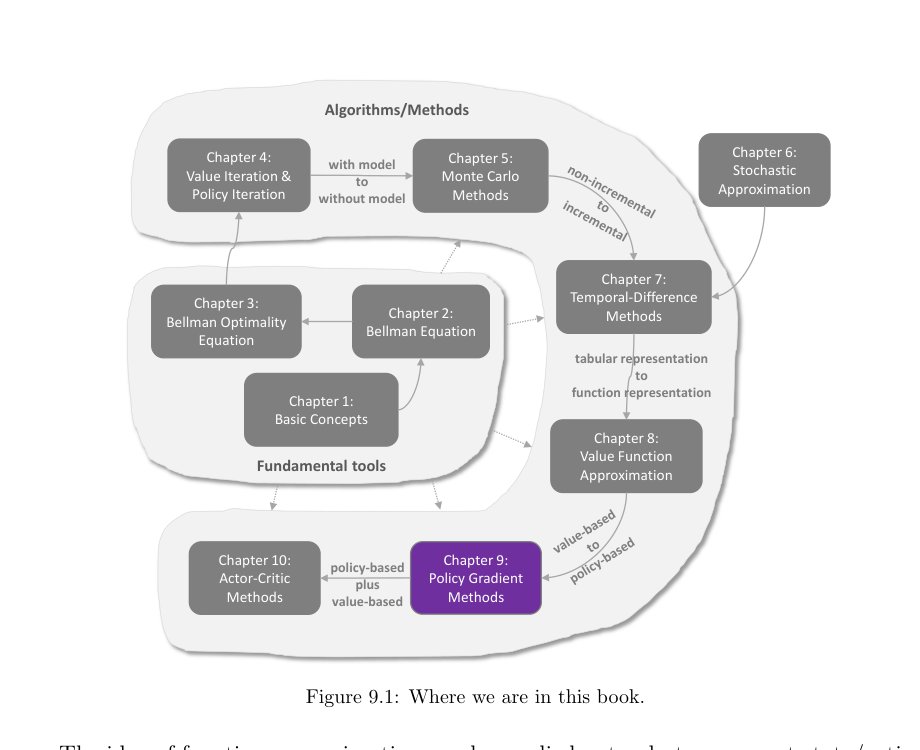
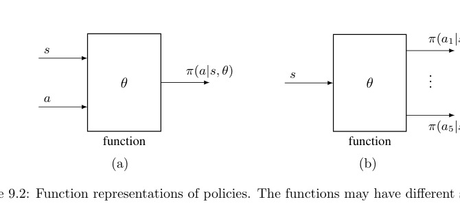

# 第 9 章 策略梯度方法（Policy Gradient Methods）- 9.1-9.6

> 原书 p199-223 · 学习日期 2026-06-18 · 涵盖 9.1-9.6（全章完）

## 本章在全书的位置（先读这段）

第 8 章把 value function 价值函数从表格推进到了 function approximation 函数近似：不再为每个状态或状态-动作对存一个独立数值，而是用 $\hat v(s,w)$ 或 $\hat q(s,a,w)$ 这样的参数化函数输出价值。

第 9 章继续做同一件事，但对象换成 policy 策略。过去的策略是表：

$$
\pi(a\mid s)
$$

表示“在状态 $s$ 下选动作 $a$ 的概率”。从本章开始，策略也变成带参数的函数：

$$
\pi(a\mid s,\theta),
$$

其中 $\theta \in \mathbb{R}^m$ 是要学习的参数向量。

> 本章主线：第 8 章让“评价动作好不好”的 value 变成函数；第 9 章让“直接决定怎么行动”的 policy 变成函数。于是学习不再只是更新价值估计，而是直接沿着某个标量目标 $J(\theta)$ 的梯度，调整策略参数 $\theta$。

这也是本书的一次换挡：前面章节主要是 value-based methods 基于价值的方法，先学习 $v$ 或 $q$，再从价值里导出策略；第 9 章进入 policy-based methods 基于策略的方法，直接优化策略本身。第 10 章 actor-critic 会把这两条线合起来：actor 更新策略，critic 估计价值。

> **原书图 9.1**：第 9 章从第 8 章的 function representation 函数表示继续往下走，但方向从 value-based 转到 policy-based；第 10 章会把 policy-based 和 value-based 合成 actor-critic。

---

## 9.1 Policy representation: From table to function（策略表示：从表到函数）

**要解决的问题**：前面我们已经会用函数表示价值了，但策略本身仍然像一张表。本节要说明：把策略从表格换成函数以后，“什么叫最优策略”“怎样更新策略”“怎样取动作概率”这三件事都会跟着变。

### 1. 表格策略：直接存每个状态-动作概率

tabular policy 表格策略最直观。假设有 9 个状态、5 个动作，那么策略表可以写成：

| State | $a_1$ | $a_2$ | $a_3$ | $a_4$ | $a_5$ |
|---|---:|---:|---:|---:|---:|
| $s_1$ | $\pi(a_1\mid s_1)$ | $\pi(a_2\mid s_1)$ | $\pi(a_3\mid s_1)$ | $\pi(a_4\mid s_1)$ | $\pi(a_5\mid s_1)$ |
| $\vdots$ | $\vdots$ | $\vdots$ | $\vdots$ | $\vdots$ | $\vdots$ |
| $s_9$ | $\pi(a_1\mid s_9)$ | $\pi(a_2\mid s_9)$ | $\pi(a_3\mid s_9)$ | $\pi(a_4\mid s_9)$ | $\pi(a_5\mid s_9)$ |

读法：要知道在 $s_i$ 下选择 $a_j$ 的概率，就直接查表格里的那一格。

这和前面 tabular value 表格价值很像：

| 表格对象 | 一个格子存什么 | 查询方式 | 更新方式 |
|---|---|---|---|
| value table 价值表 | $\hat v(s)$ 或 $\hat q(s,a)$ | 查状态或状态-动作对应的格子 | 改某个价值格子 |
| policy table 策略表 | $\pi(a\mid s)$ | 查状态-动作对应的概率格子 | 改某个概率格子 |

但是策略表还有一个额外约束：同一个状态下所有动作概率要加起来为 1。

$$
\sum_{a\in\mathcal A}\pi(a\mid s)=1,\qquad \pi(a\mid s)\ge 0.
$$

所以它不是随便填数字的表，而是一行一行的 probability distribution 概率分布。

⚠️ 易错点：价值表里的每个数可以独立理解为“好坏分数”；策略表里的数是概率，同一行互相牵制。把 $a_1$ 的概率调大，通常意味着别的动作概率要相应变小。

### 2. 函数策略：用参数 $\theta$ 生成动作概率

当状态空间或动作空间很大时，策略表会遇到和价值表一样的问题：格子太多，甚至列不完。于是我们把策略写成函数：

$$
\pi(a\mid s,\theta).
$$

逐项拆开：

$$
\underbrace{\pi(a\mid s,\theta)}_{\text{策略函数输出的动作概率}}
=
\text{function}(
\underbrace{s}_{\text{状态}},
\underbrace{a}_{\text{动作}},
\underbrace{\theta}_{\text{策略参数}}
).
$$

读法：给定状态 $s$、动作 $a$ 和当前参数 $\theta$，函数输出“在 $s$ 下选择 $a$ 的概率”。

原书还提醒，函数结构可以有两种常见形式：

| 结构 | 输入 | 输出 | 适合怎么理解 |
|---|---|---|---|
| Figure 9.2(a) | $(s,a)$ | 单个概率 $\pi(a\mid s,\theta)$ | 问“这个动作在这个状态下概率是多少？” |
| Figure 9.2(b) | $s$ | 所有动作概率 $\pi(a_1\mid s,\theta),\dots,\pi(a_5\mid s,\theta)$ | 问“这个状态下整行策略分布是什么？” |

> **原书图 9.2**：左图把 $(s,a)$ 输入函数，输出一个动作概率；右图只输入 $s$，一次输出该状态下所有动作的概率。

如果用神经网络实现，Figure 9.2(b) 更像常见做法：输入状态，最后一层用 softmax 输出所有动作的概率，使这些概率自然满足非负且和为 1。

### 3. 三个变化：最优性、更新方式、取概率方式

本节真正想让我们看清楚的是：表格策略换成函数策略，不只是换了存储格式，而是整个优化视角都换了。

#### 3.1 什么叫最优策略？

在表格情形，前面几章经常这样定义 optimal policy 最优策略：

$$
\pi^* \text{ is optimal}
\quad\Longleftrightarrow\quad
v_{\pi^*}(s)\ge v_\pi(s),\quad \forall s,\forall \pi.
$$

读法：一个策略如果能让每个状态的 state value 状态值都不低于其他策略，它就是最优的。

但函数策略里，策略被压缩进有限维参数 $\theta$。我们通常不再逐状态地要求“每个 $v_\pi(s)$ 都最大”，而是先定义一个 scalar metric 标量指标：

$$
J(\theta),
$$

然后说：

$$
\theta^* \in \arg\max_\theta J(\theta).
$$

读法：我们选择能让整体指标 $J(\theta)$ 最大的策略参数。

这一步非常关键，因为它解释了第 9.2 节为什么马上要问“应该用什么 metric 指标”。没有标量目标，就没有明确的梯度方向。

#### 3.2 怎样更新策略？

表格策略可以直接改某个格子，例如把 $\pi(a_1\mid s_3)$ 调大一点。

函数策略不能这样改。因为 $\pi(a\mid s,\theta)$ 的输出由共享参数 $\theta$ 决定，改参数会同时影响很多状态和动作的概率。这和第 8 章的函数近似很像：更新 $w$ 不只影响一个状态的价值，更新 $\theta$ 也不只影响一个状态-动作概率。

策略梯度的基本更新式是：

$$
\theta_{t+1}
=
\theta_t+\alpha\nabla_\theta J(\theta_t).
$$

逐项拆开：

$$
\underbrace{\theta_{t+1}}_{\text{更新后的策略参数}}
=
\underbrace{\theta_t}_{\text{当前策略参数}}
+
\underbrace{\alpha}_{\text{步长/优化率}}
\underbrace{\nabla_\theta J(\theta_t)}_{\text{让指标上升最快的方向}}.
$$

读法：当前策略参数 $\theta_t$ 往“让 $J$ 变大最快”的方向走一小步。

这里用的是 gradient ascent 梯度上升，而不是第 6 章 SGD 里常见的 gradient descent 梯度下降。原因很简单：如果目标是最小化误差，就沿负梯度下降；如果目标是最大化回报指标，就沿正梯度上升。

| 任务 | 目标 | 更新方向 |
|---|---|---|
| 价值函数拟合 | 最小化 error/loss | $w_{t+1}=w_t-\alpha\nabla_w L(w_t)$ |
| 策略梯度 | 最大化 metric/return | $\theta_{t+1}=\theta_t+\alpha\nabla_\theta J(\theta_t)$ |

#### 3.3 怎样取动作概率？

表格情形：

$$
\pi(a\mid s)
$$

就是表里的一个条目。

函数情形：

$$
\pi(a\mid s,\theta)
$$

是一次函数计算的输出。这个差别会影响后面的采样和梯度估计：我们不只是“查概率”，还要知道这个概率对参数 $\theta$ 的导数是多少。

也就是说，第 9 章真正关心的不只是概率本身，而是：

$$
\nabla_\theta \pi(a\mid s,\theta)
\quad\text{或更常见的}\quad
\nabla_\theta \ln \pi(a\mid s,\theta).
$$

这个 $\nabla_\theta\ln\pi(a\mid s,\theta)$ 会在 9.3 和 9.4 中反复出现，是 policy gradient theorem 策略梯度定理和 REINFORCE 算法的核心形状。

### 4. 一个最小数值例子：从“改表格”到“改参数”

假设只有一个状态 $s$，两个动作 $a_1,a_2$。表格策略可以直接写：

| 动作 | $a_1$ | $a_2$ |
|---|---:|---:|
| 概率 | 0.70 | 0.30 |

如果我们觉得 $a_1$ 更好，可以手动把表改成：

| 动作 | $a_1$ | $a_2$ |
|---|---:|---:|
| 概率 | 0.80 | 0.20 |

但函数策略会先有一个参数，例如用 logistic/sigmoid 形式：

$$
\pi(a_1\mid s,\theta)=\frac{1}{1+e^{-\theta}},
\qquad
\pi(a_2\mid s,\theta)=1-\pi(a_1\mid s,\theta).
$$

当 $\theta=0$ 时：

$$
\pi(a_1\mid s,0)=0.5,\qquad \pi(a_2\mid s,0)=0.5.
$$

如果梯度告诉我们“增加 $\theta$ 会提高 $J(\theta)$”，比如 $\nabla_\theta J(\theta_t)=2$，步长 $\alpha=0.1$，那么：

$$
\theta_{t+1}=0+0.1\times 2=0.2.
$$

新的动作概率变成：

$$
\pi(a_1\mid s,0.2)=\frac{1}{1+e^{-0.2}}\approx 0.55,
\qquad
\pi(a_2\mid s,0.2)\approx 0.45.
$$

这个例子说明：函数策略里我们不直接写“把 $a_1$ 的概率改成 0.55”，而是改 $\theta$；动作概率是 $\theta$ 改变后的结果。

### 5. 本章接下来要回答的三个问题

本节最后把 policy gradient method 策略梯度方法拆成三问：

| 问题 | 对应小节 | 为什么必须回答 |
|---|---|---|
| What metrics should be used? 应该用什么指标？ | 9.2 | 没有 $J(\theta)$，就不知道优化什么 |
| How to calculate the gradients? 怎样算指标的梯度？ | 9.3 | 有了 $J$ 还不够，还要有 $\nabla_\theta J$ |
| How to use experience samples to calculate the gradients? 怎样用经验样本估计梯度？ | 9.4 | 真实环境里通常不能精确求期望，只能采样估计 |

所以第 9 章的逻辑链是：

$$
\pi(a\mid s,\theta)
\Longrightarrow
J(\theta)
\Longrightarrow
\nabla_\theta J(\theta)
\Longrightarrow
\theta_{t+1}=\theta_t+\alpha\nabla_\theta J(\theta_t)
\Longrightarrow
\text{REINFORCE}.
$$

读法：先把策略写成参数化函数；再定义一个可最大化的整体指标；然后推导指标对参数的梯度；最后用样本估计这个梯度并更新策略。

### 6. 和第 8 章的闭环

第 8 章和第 9 章可以并排看：

| 章节 | 函数化对象 | 参数 | 目标 |
|---|---|---|---|
| 第 8 章 | value 价值 | $w$ | 让 $\hat v(s,w)$ 或 $\hat q(s,a,w)$ 接近真实价值/TD target |
| 第 9 章 | policy 策略 | $\theta$ | 让策略对应的整体表现 $J(\theta)$ 尽量大 |

两章都从“表格”走向“函数”，但学习目标不同：

$$
\text{第 8 章：学会评价}
\qquad
\text{第 9 章：直接学会行动}.
$$

⚠️ 易错点：policy gradient 不是“不需要价值”。第 9 章后面会看到，策略梯度的表达式里仍会出现 $q_\pi(s,a)$。区别在于：价值在这里服务于“更新策略”，而不是像 Q-learning 那样先学出 $q$ 再贪心选动作。

---

## 9.2 Metrics for defining optimal policies（定义最优策略的指标）

**要解决的问题**：9.1 已经把策略写成 $\pi(a\mid s,\theta)$，并说要用梯度上升

$$
\theta_{t+1}=\theta_t+\alpha\nabla_\theta J(\theta_t)
$$

来更新策略。那本节要回答的就是：这个 $J(\theta)$ 到底应该是什么？换句话说，怎样把“这个策略好不好”压缩成一个可以最大化的标量？

这一步是策略梯度的入口。没有 $J(\theta)$，就没有 $\nabla_\theta J(\theta)$；没有梯度，就不知道 $\theta$ 应该往哪里走。

本节给出两类常用 metric 指标：

| 指标 | 关注什么 | 典型形式 |
|---|---|---|
| average state value 平均状态价值 | 从某种状态分布出发，长期折扣回报有多大 | $\bar v_\pi=\sum_s d(s)v_\pi(s)$ |
| average reward 平均一步奖励 | 长期运行中，平均每一步奖励有多大 | $\bar r_\pi=\sum_s d_\pi(s)r_\pi(s)$ |

### 1. 指标一：average state value 平均状态价值

第一个指标是把所有状态的 state value 状态价值按权重平均：

$$
\bar v_\pi
=
\sum_{s\in\mathcal S}d(s)v_\pi(s).
$$

其中 $d(s)$ 是状态 $s$ 的权重，满足：

$$
d(s)\ge 0,\qquad
\sum_{s\in\mathcal S}d(s)=1.
$$

所以 $d$ 可以理解成一个状态分布：

$$
\bar v_\pi
=
\mathbb E_{S\sim d}[v_\pi(S)].
$$

读法：先按分布 $d$ 抽一个状态 $S$，再看这个状态在策略 $\pi$ 下的价值，最后取平均。

这里的逻辑接着 9.1：因为函数策略 $\pi(a\mid s,\theta)$ 对应很多状态的表现，我们需要一个标量把它们汇总起来。$\bar v_\pi$ 就是在问：

> 如果我按某个状态分布关心各个状态，那么这个策略的平均长期表现是多少？

### 2. $d$ 怎么选：固定分布 $d_0$ vs 平稳分布 $d_\pi$

平均状态价值的关键不只是 $v_\pi(s)$，还包括权重 $d(s)$ 怎么选。原书分两种情况。

**情况一：$d$ 和策略无关。**

这时记作 $d_0$，对应指标记作：

$$
\bar v_\pi^0.
$$

常见例子：

| 选择方式 | 定义 | 含义 |
|---|---|---|
| 均匀关心所有状态 | $d_0(s)=1/\lvert\mathcal S\rvert$ | 每个状态同等重要 |
| 只关心初始状态 $s_0$ | $d_0(s_0)=1,\ d_0(s\neq s_0)=0$ | 只看从固定起点出发的表现 |

第二种尤其常见：如果每局游戏总是从同一个起点开始，那么最大化 $v_\pi(s_0)$ 就很自然。

**情况二：$d$ 依赖策略。**

这时常选 $d=d_\pi$，即策略 $\pi$ 下的 stationary distribution 平稳分布。它满足：

$$
d_\pi^TP_\pi=d_\pi^T.
$$

读法：如果当前状态分布已经是 $d_\pi$，再按策略 $\pi$ 转移一步后，状态分布仍然是 $d_\pi$。

这个选择的含义是：长期经常访问的状态更重要，长期很少访问的状态权重更低。

**一个 2 状态例子：为什么 $d_\pi$ 会给“常去的状态”更大权重。**

假设策略 $\pi$ 固定后，状态转移矩阵是：

$$
P_\pi=
\left[
\begin{array}{cc}
0.9&0.1\\
0.4&0.6
\end{array}
\right].
$$

读法：如果当前在 $s_1$，下一步有 $0.9$ 的概率还在 $s_1$，$0.1$ 的概率去 $s_2$；如果当前在 $s_2$，下一步有 $0.4$ 的概率去 $s_1$，$0.6$ 的概率留在 $s_2$。

设平稳分布为：

$$
d_\pi^T=[x,\ 1-x].
$$

它要满足：

$$
d_\pi^TP_\pi=d_\pi^T.
$$

代入：

$$
[x,\ 1-x]
\left[
\begin{array}{cc}
0.9&0.1\\
0.4&0.6
\end{array}
\right]
=
[x,\ 1-x].
$$

看第一个分量：

$$
0.9x+0.4(1-x)=x.
$$

化简：

$$
0.9x+0.4-0.4x=x
\quad\Longrightarrow\quad
0.4=0.5x
\quad\Longrightarrow\quad
x=0.8.
$$

所以：

$$
d_\pi=
\left[
\begin{array}{c}
0.8\\
0.2
\end{array}
\right].
$$

这说明：在这个策略下，长期大约 80% 的时间在 $s_1$，20% 的时间在 $s_2$。所以用 $d_\pi$ 做权重时，$s_1$ 自动更重要。

也可以从分布迭代看出来。假设一开始两个状态各占一半：

$$
d_0^T=[0.5,\ 0.5].
$$

每走一步：

$$
d_{k+1}^T=d_k^TP_\pi.
$$

前几步是：

| $k$ | $d_k^T$ |
|---:|---|
| 0 | $[0.500,\ 0.500]$ |
| 1 | $[0.650,\ 0.350]$ |
| 2 | $[0.725,\ 0.275]$ |
| 3 | $[0.7625,\ 0.2375]$ |
| 4 | $[0.78125,\ 0.21875]$ |
| $\infty$ | $[0.800,\ 0.200]$ |

你会看到状态分布一步步靠近 $d_\pi=[0.8,0.2]^T$。

现在假设两个状态的价值是：

$$
v_\pi(s_1)=10,\qquad v_\pi(s_2)=2.
$$

如果用均匀权重 $d_0=[0.5,0.5]^T$，平均价值是：

$$
\bar v_\pi^0=0.5\times10+0.5\times2=6.
$$

如果用平稳分布 $d_\pi=[0.8,0.2]^T$，平均价值是：

$$
\bar v_\pi=0.8\times10+0.2\times2=8.4.
$$

这两个数不同，不是因为 $v_\pi$ 变了，而是因为“我们用什么权重评价这个策略”变了。$d_\pi$ 的视角更像是在问：

> 这个策略自己长期运行时，经常遇到哪些状态？在这些常遇到的状态上表现如何？

和第 8 章联系起来看：

| 符号 | 在哪里出现过 | 含义 |
|---|---|---|
| $D=\operatorname{diag}(d_\pi)$ | 第 8 章 TD-Linear / 投影误差 | 用状态访问频率加权误差 |
| $d_\pi$ | 这里的平均价值 / 平均奖励 | 用长期访问频率加权策略表现 |

这不是巧合：函数近似和策略梯度都需要回答“哪些状态更重要”。$d_\pi$ 就是一个自然答案。

### 3. $\bar v_\pi$ 的三种等价写法

原书接着说明，很多文献不会直接写 $\sum_s d(s)v_\pi(s)$，而是写成 return 回报的形式：

$$
J(\theta)
=
\lim_{n\to\infty}
\mathbb E\left[
\sum_{t=0}^{n}\gamma^tR_{t+1}
\right]
=
\mathbb E\left[
\sum_{t=0}^{\infty}\gamma^tR_{t+1}
\right]. \tag{9.1}
$$

这个式子看起来是在沿时间加奖励，但它和 $\bar v_\pi$ 是同一个东西。关键桥梁是全期望：

$$
\begin{array}{l}
\mathbb E\left[\sum_{t=0}^{\infty}\gamma^tR_{t+1}\right]
=
\sum_{s\in\mathcal S}
d(s)
\mathbb E\left[
\sum_{t=0}^{\infty}\gamma^tR_{t+1}
\mid S_0=s
\right]\\
=
\sum_{s\in\mathcal S}d(s)v_\pi(s)
=
\bar v_\pi.
\end{array}
$$

读法：先按 $d$ 抽初始状态；从每个初始状态出发的折扣回报期望就是 $v_\pi(s)$；再按初始状态分布加权平均。

还可以写成向量内积。令：

$$
v_\pi=
\left[
\begin{array}{c}
\vdots\\
v_\pi(s)\\
\vdots
\end{array}
\right],
\qquad
d=
\left[
\begin{array}{c}
\vdots\\
d(s)\\
\vdots
\end{array}
\right],
$$

则：

$$
\bar v_\pi=d^Tv_\pi.
$$

三种写法放在一起：

| 写法 | 公式 | 适合什么时候看 |
|---|---|---|
| 状态加权平均 | $\sum_s d(s)v_\pi(s)$ | 理解“哪些状态重要” |
| 折扣回报期望 | $\mathbb E[\sum_{t=0}^{\infty}\gamma^tR_{t+1}]$ | 和采样轨迹、RL 目标联系 |
| 向量内积 | $d^Tv_\pi$ | 后面推导梯度时方便 |

### 4. 一个最小数值例子：平均状态价值

假设只有两个状态：

$$
v_\pi(s_1)=10,\qquad v_\pi(s_2)=2.
$$

如果我们同等关心两个状态：

$$
d_0=
\left[
\begin{array}{c}
0.5\\
0.5
\end{array}
\right],
$$

那么：

$$
\bar v_\pi^0
=
0.5\times 10+0.5\times 2
=6.
$$

如果长期运行时更常访问 $s_2$，例如：

$$
d_\pi=
\left[
\begin{array}{c}
0.2\\
0.8
\end{array}
\right],
$$

那么：

$$
\bar v_\pi
=
0.2\times 10+0.8\times 2
=3.6.
$$

这个例子说明：同一个价值函数 $v_\pi$，换一个状态权重分布，策略指标会变。也就是说，“策略好不好”不只取决于每个状态价值，还取决于你关心哪些状态。

### 5. 指标二：average reward 平均一步奖励

第二个指标不看折扣累计回报，而是看长期平均每一步能拿多少奖励：

$$
\bar r_\pi
\doteq
\sum_{s\in\mathcal S}d_\pi(s)r_\pi(s)
=
\mathbb E_{S\sim d_\pi}[r_\pi(S)]. \tag{9.2}
$$

其中：

$$
r_\pi(s)
\doteq
\sum_{a\in\mathcal A}\pi(a\mid s,\theta)r(s,a)
=
\mathbb E_{A\sim \pi(s,\theta)}[r(s,A)\mid s]. \tag{9.3}
$$

逐项读：

| 符号 | 含义 |
|---|---|
| $r(s,a)$ | 在状态 $s$ 执行动作 $a$ 的 immediate reward 一步奖励期望 |
| $\pi(a\mid s,\theta)$ | 当前策略选择动作 $a$ 的概率 |
| $r_\pi(s)$ | 在状态 $s$ 按策略随机选动作时，平均能拿到的一步奖励 |
| $d_\pi(s)$ | 长期运行中访问状态 $s$ 的比例 |
| $\bar r_\pi$ | 长期平均每一步奖励 |

这两个式子其实是两层平均，不要混在一起：

| 式子 | 在平均什么 | 结果 |
|---|---|---|
| $r_\pi(s)=\sum_a\pi(a\mid s,\theta)r(s,a)$ | 固定状态 $s$，对动作平均 | 得到“这个状态下的一步平均奖励” |
| $\bar r_\pi=\sum_s d_\pi(s)r_\pi(s)$ | 固定策略 $\pi$，对状态平均 | 得到“长期每一步的总体平均奖励” |

先在每个状态里把动作平均掉，得到 $r_\pi(s)$；再按长期访问频率把状态平均掉，得到 $\bar r_\pi$。这就是它们的层级关系。

这里和 $\bar v_\pi$ 的区别很重要：

| 指标 | 看的是 | 时间尺度 |
|---|---|---|
| $\bar v_\pi$ | 从状态出发的 discounted return 折扣累计回报 | 往未来看很多步 |
| $\bar r_\pi$ | 当前一步的平均奖励，再按长期访问频率平均 | 每一步的长期平均 |

### 6. $\bar r_\pi$ 的等价时间平均形式

文献里也常把 average reward 写成轨迹上的时间平均：

$$
J(\theta)
=
\lim_{n\to\infty}
\frac{1}{n}
\mathbb E
\left[
\sum_{t=0}^{n-1}R_{t+1}
\right]. \tag{9.4}
$$

原书 Box 9.1 证明它等于：

$$
\lim_{n\to\infty}
\frac{1}{n}
\mathbb E
\left[
\sum_{t=0}^{n-1}R_{t+1}
\right]
=
\sum_{s\in\mathcal S}d_\pi(s)r_\pi(s)
=
\bar r_\pi. \tag{9.5}
$$

这个证明的直觉是：

1. 长期运行后，状态分布会趋近 $d_\pi$。
2. 第 $t$ 步的期望奖励会趋近 $\sum_s d_\pi(s)r_\pi(s)$。
3. 很多步奖励的平均值，极限也会趋近这个长期平均值。

下面把推导展开。先固定一个初始状态 $S_0=s_0$，目标是证明：

$$
\lim_{n\to\infty}
\frac1n
\mathbb E
\left[
\sum_{t=0}^{n-1}R_{t+1}
\mid S_0=s_0
\right]
=
\bar r_\pi. \tag{9.6}
$$

第一步，把“和的期望”改成“期望的和”：

$$
\begin{array}{l}
\displaystyle
\lim_{n\to\infty}
\frac1n
\mathbb E
\left[
\sum_{t=0}^{n-1}R_{t+1}
\mid S_0=s_0
\right]\\[6pt]
\displaystyle
=
\lim_{n\to\infty}
\frac1n
\sum_{t=0}^{n-1}
\mathbb E[R_{t+1}\mid S_0=s_0].
\end{array}
$$

这里没有用很深的东西，只是 expectation 期望的线性性：

$$
\mathbb E[X_0+\cdots+X_{n-1}]
=
\mathbb E[X_0]+\cdots+\mathbb E[X_{n-1}].
$$

第二步，用 Cesaro mean Cesaro 平均。令

$$
a_t
=
\mathbb E[R_{t+1}\mid S_0=s_0].
$$

如果我们能证明 $a_t$ 收敛到某个极限 $a$，那么：

$$
\lim_{n\to\infty}
\frac1n
\sum_{t=0}^{n-1}a_t
=
a.
$$

所以现在问题变成：第 $t$ 步的期望奖励

$$
\mathbb E[R_{t+1}\mid S_0=s_0]
$$

长期会收敛到哪里？

第三步，用全期望按 $S_t$ 拆开：

$$
\begin{array}{l}
\mathbb E[R_{t+1}\mid S_0=s_0]\\
=
\displaystyle
\sum_{s\in\mathcal S}
\mathbb E[R_{t+1}\mid S_t=s,S_0=s_0]
\Pr(S_t=s\mid S_0=s_0).
\end{array}
$$

记

$$
p^{(t)}(s|s_0)
\doteq
\Pr(S_t=s\mid S_0=s_0),
$$

也就是从 $s_0$ 出发经过 $t$ 步到达 $s$ 的概率。

这里的 $\Pr$ 就是 probability 概率的缩写，和 $\mathbb P$ 是同一个意思。  
所以 $\Pr(S_t=s\mid S_0=s_0)$ 读作：

> 在已知初始状态是 $s_0$ 的条件下，第 $t$ 步时系统处在状态 $s$ 的概率。

第四步，用 Markov property 马尔可夫性。给定当前状态 $S_t=s$ 后，下一步奖励的分布不再依赖更早的 $S_0=s_0$，所以：

$$
\mathbb E[R_{t+1}\mid S_t=s,S_0=s_0]
=
\mathbb E[R_{t+1}\mid S_t=s]
=
r_\pi(s).
$$

因此：

$$
\mathbb E[R_{t+1}\mid S_0=s_0]
=
\sum_{s\in\mathcal S}
r_\pi(s)p^{(t)}(s|s_0).
$$

第五步，让 $t\to\infty$。在本节默认的平稳分布条件下：

$$
\lim_{t\to\infty}
p^{(t)}(s|s_0)
=
d_\pi(s).
$$

于是：

$$
\begin{array}{l}
\displaystyle
\lim_{t\to\infty}
\mathbb E[R_{t+1}\mid S_0=s_0]\\[4pt]
\displaystyle
=
\lim_{t\to\infty}
\sum_{s\in\mathcal S}
r_\pi(s)p^{(t)}(s|s_0)\\[4pt]
\displaystyle
=
\sum_{s\in\mathcal S}
r_\pi(s)d_\pi(s)
=
\bar r_\pi.
\end{array}
$$

这就证明了：不管从哪个 $s_0$ 出发，长期来看每一步的期望奖励都会趋近 $\bar r_\pi$。再结合 Cesaro 平均，就得到固定初始状态版本的 (9.6)。

最后一步，去掉固定初始状态。如果初始状态本身也来自某个分布 $d$，再用一次全期望：

$$
\begin{array}{l}
\displaystyle
\lim_{n\to\infty}
\frac1n
\mathbb E
\left[
\sum_{t=0}^{n-1}R_{t+1}
\right]\\[6pt]
\displaystyle
=
\sum_{s_0\in\mathcal S}
d(s_0)
\lim_{n\to\infty}
\frac1n
\mathbb E
\left[
\sum_{t=0}^{n-1}R_{t+1}
\mid S_0=s_0
\right]\\[6pt]
\displaystyle
=
\sum_{s_0\in\mathcal S}
d(s_0)\bar r_\pi
=
\bar r_\pi.
\end{array}
$$

这就得到 (9.5)：

$$
\lim_{n\to\infty}
\frac1n
\mathbb E
\left[
\sum_{t=0}^{n-1}R_{t+1}
\right]
=
\bar r_\pi.
$$

一条线总结就是：

$$
\text{时间平均奖励}
\xrightarrow{\text{期望线性性}}
\text{每一步期望奖励的平均}
\xrightarrow{\text{平稳分布}}
\sum_s d_\pi(s)r_\pi(s).
$$

### 7. 一个最小数值例子：平均奖励

继续用两个状态。设长期访问分布为：

$$
d_\pi=
\left[
\begin{array}{c}
0.2\\
0.8
\end{array}
\right],
$$

每个状态按当前策略能拿到的一步期望奖励为：

$$
r_\pi=
\left[
\begin{array}{c}
5\\
1
\end{array}
\right].
$$

那么长期平均一步奖励是：

$$
\bar r_\pi
=
d_\pi^Tr_\pi
=
0.2\times 5+0.8\times 1
=1.8.
$$

读法：虽然 $s_1$ 的一步奖励高，但它长期只出现 20%；$s_2$ 奖励低，却出现 80%。所以总体平均一步奖励是 1.8。

**同一个例子里再看 $r_\pi(s)$ 和 $\bar r_\pi$ 的区别。**

假设有两个状态、两个动作。状态内的动作奖励是：

| 状态 | $r(s,a_1)$ | $r(s,a_2)$ | 策略 $\pi(a_1\mid s)$ | 策略 $\pi(a_2\mid s)$ |
|---|---:|---:|---:|---:|
| $s_1$ | 10 | 2 | 0.8 | 0.2 |
| $s_2$ | 1 | 5 | 0.3 | 0.7 |

先算每个状态里的平均一步奖励：

$$
r_\pi(s_1)=0.8\times 10+0.2\times 2=8.4,
\qquad
r_\pi(s_2)=0.3\times 1+0.7\times 5=3.8.
$$

这一步只是在“状态内部”把动作平均掉，还没有谈长期访问频率。

如果长期访问分布是：

$$
d_\pi=
\left[
\begin{array}{c}
0.8\\
0.2
\end{array}
\right],
$$

那么总体平均一步奖励是：

$$
\bar r_\pi
=
0.8\times 8.4+0.2\times 3.8
=7.48.
$$

所以：

- $r_\pi(s)$ 说的是“在某个状态里，按策略随机选动作，平均能拿多少奖励”
- $\bar r_\pi$ 说的是“整个系统长期跑起来后，平均每一步能拿多少奖励”

这两个量不是同一个层级。前者是状态内平均，后者是状态间平均。

### 8. 两类指标的关系：折扣任务里方向一致

本节最后说，在 discounted case 折扣情形 $\gamma<1$ 下，两个指标有关系：

$$
\bar r_\pi=(1-\gamma)\bar v_\pi.
$$

这个结论会在后面的 Lemma 9.1 证明。现在先看它的意义：

因为 $1-\gamma>0$，所以最大化 $\bar r_\pi$ 和最大化 $\bar v_\pi$ 的最优策略是一致的。也就是说，在折扣问题里，这两个指标只是差了一个正比例常数。

⚠️ 注意：这句话需要对应原书设定，尤其是使用 stationary distribution $d_\pi$ 的版本。不要把它误解成“任意初始分布 $d_0$ 下都一定有这个关系”。

### 9. 本节把 9.1 的空位补上

9.1 说策略梯度要做：

$$
\theta_{t+1}
=
\theta_t+\alpha\nabla_\theta J(\theta_t).
$$

9.2 就是在回答 $J(\theta)$ 可以怎么定义：

| 选择 | $J(\theta)$ | 适合理解为 |
|---|---|---|
| 平均状态价值 | $\bar v_\pi=d^Tv_\pi$ | 从某个状态分布出发，长期折扣回报最大 |
| 平均奖励 | $\bar r_\pi=d_\pi^Tr_\pi$ | 长期运行中，每一步平均奖励最大 |

下一节 9.3 会接着问：既然 $J(\theta)$ 已经定义好了，$\nabla_\theta J(\theta)$ 怎么算？

---

## 9.3 Gradients of the metrics（指标的梯度）

**要解决的问题**：9.2 已经选出了可优化的标量指标 $J(\theta)$。这节要回答的是：这些指标的梯度怎么求？也就是，参数 $\theta$ 应该往哪个方向改，才能让 $J(\theta)$ 增大。

这一节是策略梯度方法的核心。前一节解决“优化什么”，这一节解决“怎么优化”。

### 1. Policy gradient theorem 的主公式

原书先给出最重要的结论：

$$
\nabla_{\theta}J(\theta)
=
\sum_{s\in\mathcal S}\eta(s)\sum_{a\in\mathcal A}\nabla_{\theta}\pi(a\mid s,\theta)\,q_\pi(s,a). \tag{9.8}
$$

读法：先看哪些状态重要，用状态分布 $\eta(s)$ 加权；再看在这个状态下各动作对参数的敏感程度 $\nabla_\theta\pi(a\mid s,\theta)$；最后乘上动作价值 $q_\pi(s,a)$，表示“这个动作到底值不值得被放大”。

这条公式的直觉很像：

- **状态分布 $\eta$**：哪些状态值得重点关注
- **策略导数 $\nabla_\theta\pi$**：改参数后，动作概率会怎么变
- **动作价值 $q_\pi$**：这个动作对长期回报到底有多好

所以策略梯度不是“只看概率”，而是“概率变化方向 × 动作好坏 × 状态重要性”。

Theorem 9.1 还给出一个更紧凑的期望形式：

$$
\nabla_{\theta}J(\theta)
=
\mathbb E_{S\sim\eta,\ A\sim\pi(S,\theta)}
\Big[
\nabla_\theta\ln\pi(A\mid S,\theta)\,q_\pi(S,A)
\Big]. \tag{9.9}
$$

这个式子更适合后面用样本估计，因为它已经写成“对随机状态和随机动作取期望”的形式。

这里的期望下标：

$$
\mathbb E_{S\sim\eta,\ A\sim\pi(S,\theta)}[\cdots]
$$

读作：先按状态分布 $\eta$ 抽一个状态 $S$，再在这个状态下按当前策略 $\pi(\cdot\mid S,\theta)$ 抽一个动作 $A$，最后对括号里的量取平均。

所以它不是说“两个互不相关的平均”，而是一个 joint expectation 联合期望。因为动作分布依赖抽到的状态 $S$，所以更完整地写应是：

$$
S\sim\eta,\qquad
A|S=s\sim\pi(\cdot\mid s,\theta).
$$

离散情况下，把这个期望完全展开就是：

$$
\begin{array}{l}
\mathbb E_{S\sim\eta,\ A\sim\pi(S,\theta)}
\left[
f(S,A)
\right] \\
=
\sum_{s\in\mathcal S}
\eta(s)
\sum_{a\in\mathcal A}
\pi(a\mid s,\theta)
f(s,a).
\end{array}
$$

在 (9.9) 里：

$$
f(s,a)
=
\nabla_\theta\ln\pi(a\mid s,\theta)q_\pi(s,a).
$$

因此 (9.9) 展开后就是：

$$
\sum_{s\in\mathcal S}
\eta(s)
\sum_{a\in\mathcal A}
\pi(a\mid s,\theta)
\nabla_\theta\ln\pi(a\mid s,\theta)q_\pi(s,a).
$$

这和 (9.8) 的区别只差一步 log-trick。也就是说，(9.9) 不是换了一个新结论，而是把 (9.8) 改写成“可以用采样估计”的形式。

### 2. 为什么会出现 $\ln \pi$？

从 (9.8) 到 (9.9) 的关键一步是：

$$
\nabla_{\theta}\ln \pi(a\mid s,\theta)
=
\frac{\nabla_{\theta}\pi(a\mid s,\theta)}{\pi(a\mid s,\theta)}.
$$

于是：

$$
\nabla_{\theta}\pi(a\mid s,\theta)
=
\pi(a\mid s,\theta)\nabla_{\theta}\ln \pi(a\mid s,\theta). \tag{9.11}
$$

这就是 log-trick 对数技巧。它的好处是把“概率的梯度”变成“对数概率的梯度”，后面很容易写成采样期望。

这里最容易疑惑的是：$\nabla_\theta\ln\pi$ 里面明明有一个分母 $\pi(a\mid s,\theta)$，为什么到 (9.9) 的期望形式里看起来“分母没了”？

关键是：**分母没有凭空消失，而是和按动作采样的概率权重抵消了。**

先固定一个状态 $s$，只看动作求和部分。原式是：

$$
\sum_{a\in\mathcal A}
\nabla_\theta\pi(a\mid s,\theta)q_\pi(s,a).
$$

用 log-trick：

$$
\nabla_\theta\pi(a\mid s,\theta)
=
\pi(a\mid s,\theta)\nabla_\theta\ln\pi(a\mid s,\theta).
$$

代入：

$$
\sum_{a\in\mathcal A}
\pi(a\mid s,\theta)
\nabla_\theta\ln\pi(a\mid s,\theta)
q_\pi(s,a).
$$

这已经正好是“对 $A\sim\pi(\cdot\mid s,\theta)$ 取期望”的形式：

$$
\mathbb E_{A\sim\pi(\cdot\mid s,\theta)}
\left[
\nabla_\theta\ln\pi(A\mid s,\theta)q_\pi(s,A)
\right].
$$

为什么？因为对离散动作来说：

$$
\mathbb E_{A\sim\pi}[f(A)]
=
\sum_a \pi(a\mid s,\theta)f(a).
$$

这里的

$$
f(a)=\nabla_\theta\ln\pi(a\mid s,\theta)q_\pi(s,a).
$$

所以展开期望时，外面天然会带一个 $\pi(a\mid s,\theta)$：

$$
\sum_a
\pi(a\mid s,\theta)
\left[
\nabla_\theta\ln\pi(a\mid s,\theta)q_\pi(s,a)
\right].
$$

再把 $\nabla_\theta\ln\pi$ 展开：

$$
\sum_a
\pi(a\mid s,\theta)
\left[
\frac{\nabla_\theta\pi(a\mid s,\theta)}{\pi(a\mid s,\theta)}
q_\pi(s,a)
\right].
$$

这时你就能看到分母被谁抵消了：

$$
\pi(a\mid s,\theta)
\cdot
\frac{\nabla_\theta\pi(a\mid s,\theta)}{\pi(a\mid s,\theta)}
=
\nabla_\theta\pi(a\mid s,\theta).
$$

于是回到原来的动作求和：

$$
\sum_a\nabla_\theta\pi(a\mid s,\theta)q_\pi(s,a).
$$

所以 (9.9) 不是少了分母，而是把分母藏进了“按策略概率采样动作”的期望写法里。

**一个两动作小例子。** 假设在状态 $s$ 下：

$$
\pi(a_1\mid s,\theta)=0.8,\qquad
\pi(a_2\mid s,\theta)=0.2.
$$

那么期望形式展开就是：

$$
\begin{array}{l}
\mathbb E_{A\sim\pi}
[\nabla_\theta\ln\pi(A\mid s,\theta)q_\pi(s,A)]\\
=
0.8
\frac{\nabla_\theta\pi(a_1\mid s,\theta)}{0.8}
q_\pi(s,a_1)
+
0.2
\frac{\nabla_\theta\pi(a_2\mid s,\theta)}{0.2}
q_\pi(s,a_2)\\
=
\nabla_\theta\pi(a_1\mid s,\theta)q_\pi(s,a_1)
+
\nabla_\theta\pi(a_2\mid s,\theta)q_\pi(s,a_2).
\end{array}
$$

这就是分母“消掉”的具体过程。

⚠️ 这里要求 $\pi(a\mid s,\theta)>0$，不然 $\ln \pi(a\mid s,\theta)$ 没法定义。所以原书马上引入 softmax：

$$
\pi(a\mid s,\theta)
=
\frac{e^{h(s,a,\theta)}}{\sum_{a'\in\mathcal A}e^{h(s,a',\theta)}}. \tag{9.12}
$$

其中 $h(s,a,\theta)$ 可以理解成 preference 偏好分数。softmax 的作用是把任意实数分数变成合法概率：

- 每个动作概率都大于 0
- 所有动作概率之和等于 1

这也是神经网络策略最常见的输出层形式。

### 3. 一个最小数值例子：softmax 为什么自然给出概率

假设某状态下两个动作的偏好分数是：

$$
h(s,a_1,\theta)=2,\qquad h(s,a_2,\theta)=0.
$$

那么：

$$
\pi(a_1\mid s,\theta)=\frac{e^2}{e^2+e^0}\approx 0.88,\qquad
\pi(a_2\mid s,\theta)=\frac{1}{e^2+1}\approx 0.12.
$$

这说明：

- 分数高的动作会被分到更大的概率
- 但不会被直接变成 1
- 低分动作也不会变成 0

所以 softmax 是 stochastic stochastic 随机策略的天然实现方式。

### 4. discounted case 的主线

在折扣情形 $\gamma\in(0,1)$ 下，原书先重新写出：

$$
v_\pi(s)
=
\mathbb E[R_{t+1}+\gamma R_{t+2}+\gamma^2R_{t+3}+\dots\mid S_t=s],
$$

$$
q_\pi(s,a)
=
\mathbb E[R_{t+1}+\gamma R_{t+2}+\gamma^2R_{t+3}+\dots\mid S_t=s,A_t=a].
$$

然后把 average reward 和 average value 联系起来。Lemma 9.1 说：

$$
\bar r_\pi=(1-\gamma)\bar v_\pi. \tag{9.13}
$$

这说明在折扣任务里，最大化 $\bar r_\pi$ 和最大化 $\bar v_\pi$ 是同一方向，只差一个正比例常数。

### 5. 先记住一条关键线

这一节的核心不是先算所有细节，而是先把主线记住：

$$
\boxed{
\nabla_\theta J(\theta)
\approx
\mathbb E\big[\nabla_\theta\ln\pi(A\mid S,\theta)\,q_\pi(S,A)\big]
}
$$

意思是：

> 如果某个动作在某个状态下 value 高，就应该提高它的概率；如果 value 低，就应该降低它的概率。

这就是策略梯度的直觉。

### 6. 和 9.2 的闭环

9.2 告诉我们 $J(\theta)$ 可以选成 $\bar v_\pi$ 或 $\bar r_\pi$。  
9.3 告诉我们这些指标的梯度都可以写成“状态分布 × 策略梯度 × 动作价值”的形式。

所以第 9 章现在已经接成一条完整链：

$$
\pi(a\mid s,\theta)
\Longrightarrow
J(\theta)
\Longrightarrow
\nabla_\theta J(\theta)
\Longrightarrow
\theta_{t+1}=\theta_t+\alpha\nabla_\theta J(\theta_t).
$$

下一步就是把这个理论梯度变成可以采样估计的 stochastic gradient。

### 7. Lemma 9.1：为什么 $\bar r_\pi=(1-\gamma)\bar v_\pi$

在折扣情形下，平均价值和平均奖励有一个简单关系：

$$
\bar r_\pi=(1-\gamma)\bar v_\pi.
$$

这个式子不是凭空来的，而是把 Bellman equation 和 stationary distribution 放在一起得到的。

Bellman equation 向量形式是：

$$
v_\pi=r_\pi+\gamma P_\pi v_\pi.
$$

两边左乘 $d_\pi^T$：

$$
d_\pi^Tv_\pi
=
d_\pi^Tr_\pi+\gamma d_\pi^TP_\pi v_\pi.
$$

利用平稳分布性质：

$$
d_\pi^TP_\pi=d_\pi^T,
$$

所以：

$$
\bar v_\pi
=
\bar r_\pi+\gamma\bar v_\pi.
$$

移项：

$$
(1-\gamma)\bar v_\pi=\bar r_\pi.
$$

读法：折扣累计价值 $\bar v_\pi$ 大约是把每一步平均奖励 $\bar r_\pi$ 按几何级数累起来；所以反过来，一步平均奖励就是 $(1-\gamma)$ 倍的累计价值。

### 8. Lemma 9.2：为什么 $\nabla_\theta v_\pi(s)$ 会牵出未来所有状态

接下来原书推导 state value 对策略参数的梯度。这里很容易把两个式子混在一起，所以先把“普通的 $v_\pi(s)$ 公式”和“对参数求导后的公式”分开。

普通的 state value 状态价值确实可以写成你熟悉的形式：

$$
v_\pi(s)
=
\sum_{a\in\mathcal A}
\pi(a\mid s,\theta)q_\pi(s,a).
$$

读法：在当前状态 $s$ 下，策略会以概率 $\pi(a\mid s,\theta)$ 选择动作 $a$；每个动作有动作价值 $q_\pi(s,a)$；所以状态价值就是这些动作价值的加权平均。

但是 Lemma 9.2 问的不是“$v_\pi(s)$ 等于多少”，而是：

$$
\nabla_\theta v_\pi(s)
$$

也就是**策略参数 $\theta$ 改一点点时，从状态 $s$ 出发的长期价值会怎么变**。

这时不能只盯着当前状态 $s$，原因是：改了 $\theta$ 之后，不仅当前状态的动作概率会变，未来每个可能到达的状态 $s'$ 的动作概率也会变；而这些未来动作又会反过来影响从 $s$ 出发的总回报。

所以两个式子的层级不同：

| 公式 | 在问什么 | 看哪些状态 |
|---|---|---|
| $v_\pi(s)=\sum_a\pi(a\mid s,\theta)q_\pi(s,a)$ | 当前策略下，状态 $s$ 的价值是多少 | 当前状态 $s$ 的动作平均 |
| $\nabla_\theta v_\pi(s)$ | 参数 $\theta$ 改变时，状态 $s$ 的价值怎么变 | 从 $s$ 出发未来可能访问到的所有状态 $s'$ |

把这个“未来所有状态的影响”递归展开后，Lemma 9.2 得到关键式：

先说清楚这里两个状态符号的角色：

| 符号 | 角色 | 是否被求和 |
|---|---|---|
| $s$ | 起点状态，也就是左边 $v_\pi(s)$ 里的那个状态 | 不求和，先固定住 |
| $s'$ | 从 $s$ 出发后，未来可能访问到的状态 | 要对所有 $s'$ 求和 |

所以这条式子不是说“$s$ 和 $s'$ 是两个不同种类的状态”。它们都来自同一个状态集合 $\mathcal S$，只是角色不同：$s$ 是当前正在分析的起点，$s'$ 是从这个起点往未来展开时枚举出来的状态。

$$
\nabla_\theta v_\pi(s)
=
\sum_{s'\in\mathcal S}
\Pr_\pi(s'\mid s)
\sum_{a\in\mathcal A}
\nabla_\theta\pi(a\mid s',\theta)q_\pi(s',a). \tag{9.14}
$$

这里可以用“图 1 vs 图 2”的方式理解。

**图 1：普通值函数公式**

$$
v_\pi(s)
=
\sum_a
\pi(a\mid s,\theta)q_\pi(s,a).
$$

它只在当前状态 $s$ 内部做动作平均：状态固定为 $s$，只枚举动作 $a$。

**图 2：值函数梯度公式**

$$
\nabla_\theta v_\pi(s)
=
\sum_{s'}
\Pr_\pi(s'\mid s)
\sum_a
\nabla_\theta\pi(a\mid s',\theta)q_\pi(s',a).
$$

它不是“把图 1 直接求导一下就只看 $s$”。因为 $v_\pi(s)$ 是从 $s$ 出发的长期价值，参数变化会影响未来所有可能访问到的状态。所以图 2 先枚举未来状态 $s'$，再在每个未来状态 $s'$ 里枚举动作 $a$。

如果先把图 2 里的求导符号拿掉，只看外层结构，它会变成：

$$
H(s)
=
\sum_{s'}
\Pr_\pi(s'\mid s)g(s').
$$

这里后面用的是 $s'$，因为 $g(s')$ 表示“未来状态 $s'$ 自己的局部贡献”。也就是说：

| 位置 | 状态符号 | 含义 |
|---|---|---|
| $H(s)$ 或 $\nabla_\theta v_\pi(s)$ | $s$ | 起点状态，先固定住 |
| $g(s')$ 或 $\sum_a\nabla_\theta\pi(a\mid s',\theta)q_\pi(s',a)$ | $s'$ | 从 $s$ 出发后未来可能访问到的状态，要枚举 |

所以“去掉求导符号后，后面用 $s'$”是合理的：我们正在说“从起点 $s$ 出发，把未来每个状态 $s'$ 的局部贡献加权加起来”，不是在重新写普通值函数公式。

它和普通值函数公式的对应关系是：

$$
\underbrace{v_\pi(s)}_{\text{值本身}}
=
\sum_a
\underbrace{\pi(a\mid s,\theta)}_{\text{当前状态动作概率}}
\underbrace{q_\pi(s,a)}_{\text{当前状态动作价值}},
$$

而

$$
\underbrace{\nabla_\theta v_\pi(s)}_{\text{值对参数的敏感度}}
=
\sum_{s'}
\underbrace{\Pr_\pi(s'\mid s)}_{\text{从 }s\text{ 出发未来访问 }s'\text{ 的折扣权重}}
\sum_a
\underbrace{\nabla_\theta\pi(a\mid s',\theta)}_{\text{在未来状态 }s'\text{，动作概率对参数的敏感度}}
\underbrace{q_\pi(s',a)}_{\text{未来状态 }s'\text{ 的动作价值}}.
$$

所以 (9.14) 不是把 $v_\pi(s)$ 的普通公式改错了，而是在说：当前状态 $s$ 的价值变化，可以拆成“未来每个状态 $s'$ 的策略变化 × 那里的动作价值 × 从 $s$ 到 $s'$ 的访问权重”。

这个式子的数值例子单独放在补充文档里，因为真正关键的不是“给定一个 $\Pr_\pi(s'\mid s)$ 以后怎么乘”，而是 $\Pr_\pi(s'\mid s)$ 怎样由 $P_\pi,\gamma$ 和未来多步访问累加出来。见：

[详细说明：补充了例子](./09_supplement-lemma-9.2-discounted-total-probability)

这条式子的含义很重要：

> 改变策略参数 $\theta$ 不只影响当前状态 $s$ 的动作概率，还会影响从 $s$ 出发未来可能访问到的所有状态 $s'$ 的动作概率。

所以 $\nabla_\theta v_\pi(s)$ 不是只看 $s$ 本身，而是把未来可能到达的状态都算进来。

这里的

$$
\Pr_\pi(s'\mid s)
\doteq
\sum_{k=0}^{\infty}\gamma^k[P_\pi^k]_{ss'}
=
\left[(I-\gamma P_\pi)^{-1}\right]_{ss'}
$$

不是普通的一步转移概率，而是 discounted total probability 折扣总访问权重。

逐项读：

| 项 | 含义 |
|---|---|
| $[P_\pi^0]_{ss'}$ | 0 步后在 $s'$ 的概率，也就是是否 $s=s'$ |
| $\gamma[P_\pi]_{ss'}$ | 1 步后到 $s'$ 的概率，乘折扣 |
| $\gamma^2[P_\pi^2]_{ss'}$ | 2 步后到 $s'$ 的概率，乘折扣 |
| $\cdots$ | 所有未来步数继续累加 |

所以 $\Pr_\pi(s'\mid s)$ 可以理解成：

> 从 $s$ 出发，未来会以多大折扣权重“经过” $s'$。

这里很容易和前面的 $d_\pi$ 混淆。两者都在描述“访问状态”，但视角不同：

| 符号 | 读法 | 是否指定起点 | 是否带折扣 | 加起来是多少 | 主要用途 |
|---|---|---|---|---|---|
| $\Pr_\pi(s'\mid s)$ | 从 $s$ 出发，未来折扣访问 $s'$ 的总权重 | 是，起点固定为 $s$ | 是，包含 $\gamma^k$ | 对 $s'$ 求和为 $\frac{1}{1-\gamma}$ | 展开 $\nabla_\theta v_\pi(s)$ 时，追踪“从这个起点会影响到哪些未来状态” |
| $d_\pi(s)$ | 策略 $\pi$ 长期运行时处在状态 $s$ 的比例 | 否，已经进入长期稳定状态 | 否，是长期平均比例 | 对 $s$ 求和为 $1$ | 平均奖励、平稳分布加权目标、on-policy 采样分布 |

一句话区分：

> $\Pr_\pi(s'\mid s)$ 是“从这个起点出发，未来会经过哪里”；$d_\pi$ 是“系统长期跑起来后，平时待在哪里”。

后面 Theorem 9.2 里的 $\rho_\pi$ 会把这两个视角接起来：先用初始分布 $d_0$ 选起点，再用 $\Pr_\pi$ 统计这些起点未来会访问哪些状态。

这和第 8 章的几何级数矩阵逆是同一个结构：

$$
(I-\gamma P_\pi)^{-1}
=
I+\gamma P_\pi+\gamma^2P_\pi^2+\cdots.
$$

### 9. Theorem 9.2 和 9.3：两种状态分布视角

这一段先不要陷进推导。Theorem 9.2 和 Theorem 9.3 都想得到同一个 policy-gradient 形状：

$$
\mathbb E\left[
\nabla_\theta\ln\pi(A\mid S,\theta)q_\pi(S,A)
\right],
$$

但它们回答的是两个不同问题：**状态 $S$ 应该从哪个分布里抽？**

#### 9.1 Theorem 9.2：从固定初始分布 $d_0$ 出发

Theorem 9.2 的目标是：

$$
\bar v_\pi^0=d_0^Tv_\pi.
$$

这里 $\bar v_\pi^0$ 是用 initial distribution 初始分布 $d_0$ 加权的平均状态价值。上标 $0$ 不是幂，而是在提醒我们：这个目标看的是“时刻 0 从哪里开始”。

如果每一局都从固定起点分布 $d_0$ 开始，那么目标是在问：

> 从这些起点出发，平均长期折扣回报是多少？

但是梯度不只看起点。因为从起点 $s_0$ 出发后，策略会一路访问很多未来状态，而 $\theta$ 会影响这些未来状态里的动作概率。所以 Theorem 9.2 把 $d_0$ 推成 discounted state visitation distribution 折扣状态访问分布：

$$
\rho_\pi(s)
\doteq
\sum_{s_0}d_0(s_0)\Pr_\pi(s\mid s_0).
$$

读法：状态 $s$ 的权重，等于所有可能起点 $s_0$ 对它的折扣访问贡献加起来。

所以 Theorem 9.2 给出严格等式：

$$
\nabla_\theta\bar v_\pi^0
=
\mathbb E_{S\sim\rho_\pi,\ A\sim\pi(S,\theta)}
\left[
\nabla_\theta\ln\pi(A\mid S,\theta)q_\pi(S,A)
\right].
$$

一句话：**目标从 $d_0$ 开始，但梯度按 $\rho_\pi$ 加权。**

#### 9.2 Theorem 9.3：直接用平稳分布 $d_\pi$

Theorem 9.3 换了一个视角：不再问“从指定起点出发表现如何”，而是问“策略长期运行起来以后，按它经常待的状态加权，表现如何”。

这时平均状态价值是：

$$
\bar v_\pi=d_\pi^Tv_\pi,
$$

平均一步奖励是：

$$
\bar r_\pi=d_\pi^Tr_\pi.
$$

在折扣情形下，两者满足：

$$
\bar r_\pi=(1-\gamma)\bar v_\pi.
$$

Theorem 9.3 给出的是近似式：

$$
\nabla_\theta\bar r_\pi
=(1-\gamma)\nabla_\theta\bar v_\pi
\approx
\mathbb E_{S\sim d_\pi,\ A\sim\pi(S,\theta)}
\left[
\nabla_\theta\ln\pi(A\mid S,\theta)q_\pi(S,A)
\right].
$$

为什么是近似？因为 $d_\pi$ 本身依赖策略参数 $\theta$。严格求 $\nabla_\theta(d_\pi^Tv_\pi)$ 时，会出现 $\nabla_\theta d_\pi$ 项；原书在 $\gamma\to1$ 的折扣情形下近似忽略它。

一句话：**Theorem 9.3 直接按长期平稳访问频率 $d_\pi$ 加权，但在折扣情形下只是近似。**

#### 9.3 两个定理的核心区别

| 对比点 | Theorem 9.2 | Theorem 9.3 |
|---|---|---|
| 目标 | $\bar v_\pi^0=d_0^Tv_\pi$ | $\bar r_\pi$ 或 $\bar v_\pi=d_\pi^Tv_\pi$ |
| 起点视角 | 先给定初始分布 $d_0$ | 不指定起点，看长期运行 |
| 梯度里的状态分布 | $\rho_\pi$ | $d_\pi$ |
| 状态分布含义 | 从 $d_0$ 出发后，未来折扣访问哪些状态 | 策略长期运行时，经常待在哪些状态 |
| 结论性质 | 严格等式 | 近似式，$\gamma\to1$ 时更合理 |
| 直觉 | “从这些起点出发，未来哪里会被影响？” | “长期常去的地方更重要” |

两者最后长得像，是因为都可以写成：

$$
\nabla_\theta J(\theta)
\approx
\mathbb E_{S,A}
\left[
\nabla_\theta\ln\pi(A\mid S,\theta)q_\pi(S,A)
\right].
$$

真正的区别藏在 $S$ 的分布里：

$$
S\sim\rho_\pi
\quad\text{vs}\quad
S\sim d_\pi.
$$

详细代数推导放在补充笔记里：

[Theorem 9.2 和 9.3 推导补充](./09_supplement-theorem-9.2-9.3-gradient-derivations)

### 10. undiscounted case：为什么要重新定义价值

当 $\gamma=1$ 时，如果直接定义：

$$
\mathbb E[R_{t+1}+R_{t+2}+\cdots\mid S_t=s],
$$

这个和可能发散。比如每一步平均奖励都是 1，那么无限求和就是无穷大。

所以 continuing task 持续任务里，要改用 differential value 差分价值，也叫 bias 偏置：

$$
v_\pi(s)
\doteq
\mathbb E
\left[
(R_{t+1}-\bar r_\pi)
+(R_{t+2}-\bar r_\pi)
+\cdots
\mid S_t=s
\right].
$$

它不再问“总共能拿多少奖励”，而是问：

> 从这个状态开始，相比长期平均水平，未来会多拿还是少拿多少奖励？

对应的 Bellman-like equation 是 Poisson equation 泊松方程：

$$
v_\pi
=
r_\pi-\bar r_\pi\mathbf 1_n+P_\pi v_\pi. \tag{9.23}
$$

它和普通 Bellman equation 很像：

| 情形 | 方程 |
|---|---|
| 折扣情形 | $v_\pi=r_\pi+\gamma P_\pi v_\pi$ |
| 无折扣平均奖励情形 | $v_\pi=r_\pi-\bar r_\pi\mathbf 1_n+P_\pi v_\pi$ |

差别是：无折扣情形把每一步奖励减去平均奖励 $\bar r_\pi$，避免无限累加发散。

### 11. Theorem 9.5：无折扣平均奖励的梯度最干净

在 undiscounted case 无折扣情形，平均奖励梯度有严格公式：

$$
\nabla_\theta\bar r_\pi
=
\sum_{s\in\mathcal S}d_\pi(s)
\sum_{a\in\mathcal A}
\nabla_\theta\pi(a\mid s,\theta)q_\pi(s,a)
=
\mathbb E
\left[
\nabla_\theta\ln\pi(A\mid S,\theta)q_\pi(S,A)
\right]. \tag{9.28}
$$

其中：

$$
S\sim d_\pi,\qquad A\sim\pi(S,\theta).
$$

注意这里不再是近似，而是严格等式。这也是为什么 average reward formulation 在 continuing tasks 中很重要。

### 12. 本节几个公式放在一起看

| 情形 | 目标 $J(\theta)$ | 状态分布 | 梯度形式 |
|---|---|---|---|
| 折扣 + 固定初始分布 | $\bar v_\pi^0=d_0^Tv_\pi$ | $\rho_\pi$ | 严格等式 |
| 折扣 + 平稳分布 | $\bar r_\pi$ 或 $\bar v_\pi$ | $d_\pi$ | 近似，$\gamma\to1$ 更准 |
| 无折扣 + 平均奖励 | $\bar r_\pi$ | $d_\pi$ | 严格等式 |

虽然细节不同，但形状都像：

$$
\nabla_\theta J(\theta)
=
\mathbb E
\left[
\nabla_\theta\ln\pi(A\mid S,\theta)q_\pi(S,A)
\right].
$$

这就是 Theorem 9.1 把后面几个定理统一总结成一条 policy gradient theorem 的原因。

---

## 9.4 Monte Carlo policy gradient (REINFORCE)（蒙特卡洛策略梯度）

**要解决的问题**：9.3 已经把指标梯度写成了期望形式，但真实环境里我们通常算不出完整期望。本节要回答：怎样用一条实际采样轨迹来近似这个梯度，并据此更新策略参数？

### 1. 从真实梯度到样本梯度

9.3 的核心结论可以写成：

$$
\nabla_\theta J(\theta)
=
\mathbb E
\left[
\nabla_\theta\ln\pi(A\mid S,\theta)q_\pi(S,A)
\right].
$$

因此，如果要最大化 $J(\theta)$，最直接的 gradient ascent 梯度上升更新是：

$$
\begin{aligned}
\theta_{t+1}
&=
\theta_t+\alpha\nabla_\theta J(\theta_t)\\
&=
\theta_t+\alpha
\mathbb E
\left[
\nabla_\theta\ln\pi(A\mid S,\theta_t)q_\pi(S,A)
\right]. \tag{9.31}
\end{aligned}
$$

读法：如果我们知道真实梯度，就把参数 $\theta_t$ 往“让 $J$ 变大”的方向推一步。

但问题是：这个期望通常算不出来。它需要知道状态分布、动作分布以及真实动作价值 $q_\pi(S,A)$。真实交互中，我们更常见的是拿到一个样本：

$$
(s_t,a_t,r_{t+1},s_{t+1},\ldots).
$$

于是用一个 stochastic gradient 随机梯度替代真实期望：

$$
\theta_{t+1}
=
\theta_t
+
\alpha
\nabla_\theta\ln\pi(a_t\mid s_t,\theta_t)
q_t(s_t,a_t). \tag{9.32}
$$

这里 $q_t(s_t,a_t)$ 是对真实动作价值 $q_\pi(s_t,a_t)$ 的估计。REINFORCE 的选择是用 Monte Carlo return 蒙特卡洛回报来估计它：

$$
q_t(s_t,a_t)
=
\sum_{k=t+1}^{T}\gamma^{k-t-1}r_k
=
r_{t+1}+\gamma r_{t+2}+\gamma^2 r_{t+3}+\cdots+\gamma^{T-t-1}r_T.
$$

所以 REINFORCE 的核心想法很朴素：

> 实际试一整局；某一步选了动作 $a_t$；如果这一步之后的折扣回报高，就提高这类选择的概率；如果回报低，就降低这类选择的概率。

### 2. Algorithm 9.1：REINFORCE 的流程

原书 Algorithm 9.1 可以整理成下面几步。

**输入**：初始参数 $\theta$，折扣因子 $\gamma\in(0,1)$，学习率 $\alpha>0$。

**目标**：学习一个最大化 $J(\theta)$ 的策略。

每个 episode 回合中：

1. 按当前策略 $\pi(\theta)$ 生成一条轨迹：

$$
\{s_0,a_0,r_1,\ldots,s_{T-1},a_{T-1},r_T\}.
$$

2. 对每个时间步 $t=0,1,\ldots,T-1$，计算从 $t$ 之后开始的折扣回报：

$$
q_t(s_t,a_t)
=
\sum_{k=t+1}^{T}\gamma^{k-t-1}r_k.
$$

3. 用这个回报更新策略参数：

$$
\theta
\gets
\theta
+
\alpha
\nabla_\theta\ln\pi(a_t\mid s_t,\theta)
q_t(s_t,a_t).
$$

⚠️ 易错点：这里的 $q_t(s_t,a_t)$ 不是额外训练出来的 critic，也不是一张动作价值表；它只是当前 episode 里从 $t$ 往后实际看到的折扣回报。所以 REINFORCE 是 Monte Carlo 方法：等一整局结束后，才能知道每一步后面的总回报。

### 3. 为什么这个更新会“奖励好动作”？

把 log-trick 展开：

$$
\nabla_\theta\ln\pi(a_t\mid s_t,\theta_t)
=
\frac{\nabla_\theta\pi(a_t\mid s_t,\theta_t)}
{\pi(a_t\mid s_t,\theta_t)}.
$$

代入 (9.32)：

$$
\theta_{t+1}
=
\theta_t
+
\alpha
\underbrace{
\left(
\frac{q_t(s_t,a_t)}
{\pi(a_t\mid s_t,\theta_t)}
\right)
}_{\beta_t}
\nabla_\theta\pi(a_t\mid s_t,\theta_t).
$$

也就是：

$$
\theta_{t+1}
=
\theta_t+\alpha\beta_t\nabla_\theta\pi(a_t\mid s_t,\theta_t). \tag{9.33}
$$

这里

$$
\beta_t
=
\frac{q_t(s_t,a_t)}
{\pi(a_t\mid s_t,\theta_t)}.
$$

它决定了这次更新是增强还是削弱动作概率。

| 情况 | 更新效果 | 直觉 |
|---|---|---|
| $\beta_t\ge 0$ | 增大 $\pi(a_t\mid s_t,\theta)$ | 这次动作后面的回报不差，应该更常选 |
| $\beta_t<0$ | 减小 $\pi(a_t\mid s_t,\theta)$ | 这次动作后面的回报不好，应该少选 |

为什么？当参数步子很小时，用一阶 Taylor expansion 泰勒展开：

$$
\begin{aligned}
\pi(a_t\mid s_t,\theta_{t+1})
&\approx
\pi(a_t\mid s_t,\theta_t)
+
\nabla_\theta\pi(a_t\mid s_t,\theta_t)^T
(\theta_{t+1}-\theta_t)\\
&=
\pi(a_t\mid s_t,\theta_t)
+
\alpha\beta_t
\left\|
\nabla_\theta\pi(a_t\mid s_t,\theta_t)
\right\|_2^2.
\end{aligned}
$$

最后一项的符号由 $\beta_t$ 决定。因此 $\beta_t$ 为正就把这次动作概率往上推，$\beta_t$ 为负就往下压。

### 4. 探索和利用的平衡

从

$$
\beta_t
=
\frac{q_t(s_t,a_t)}
{\pi(a_t\mid s_t,\theta_t)}
$$

可以看出两个方向。

**利用 exploitation**：如果 $q_t(s_t,a_t)$ 大，说明这次动作后面的回报大，$\beta_t$ 也大，于是算法会明显提高 $\pi(a_t\mid s_t,\theta_t)$。

**探索 exploration**：如果 $q_t(s_t,a_t)>0$ 且当前 $\pi(a_t\mid s_t,\theta_t)$ 很小，那么分母小，$\beta_t$ 会变大。也就是说，一个低概率动作只要偶然被采到并带来好回报，就会得到较强增强。

这就是原书说 REINFORCE 在一定程度上能平衡 exploration 探索和 exploitation 利用的原因。

⚠️ 这个解释只是在说明 (9.33) 的更新倾向。实际训练中，REINFORCE 的方差通常很大，因为 $q_t$ 来自整段随机回报；后面的 actor-critic 会用 critic 来降低这种方差。

### 5. 样本应该怎么来？

真实梯度里的期望是：

$$
\mathbb E
\left[
\nabla_\theta\ln\pi(A\mid S,\theta_t)q_\pi(S,A)
\right].
$$

所以理想情况下：

| 变量 | 应该怎么采样 | 含义 |
|---|---|---|
| $S$ | $S\sim\eta$，其中 $\eta$ 可以是 $d_\pi$ 或 $\rho_\pi$ | 状态要来自当前策略的长期行为 |
| $A$ | $A\sim\pi(S,\theta_t)$ | 动作要按当前策略采样 |

这里的 $d_\pi$ 和 $\rho_\pi$ 都和当前策略 $\pi$ 有关，但含义不同：

| 分布 | 从哪里来 | 回答的问题 | 对应前文 |
|---|---|---|---|
| $d_\pi$ | 策略 $\pi$ 长期运行后的 stationary distribution 平稳分布 | 系统长期跑起来后，平时更常待在哪些状态？ | Theorem 9.3、average reward |
| $\rho_\pi$ | 从初始分布 $d_0$ 出发后，把未来访问状态按 $\gamma^k$ 折扣累加 | 从这些起点出发，整个折扣未来会经过哪些状态？ | Theorem 9.2、$\bar v_\pi^0$ |

一句话区分：

$$
d_\pi:\ \text{长期平稳以后在哪里}
\qquad
\rho_\pi:\ \text{从起点出发的折扣未来经过哪里}.
$$

所以表里写 $\eta$，是为了统一记号：不同目标函数下，理论梯度要求的状态采样分布不同；但动作采样始终是 $A\sim\pi(S,\theta_t)$。

第二点很重要：动作 $A$ 必须按当前策略 $\pi$ 采样，所以 REINFORCE 是 on-policy 同策略方法。也就是说，生成数据的策略和被更新的策略是同一个。

不过实践中严格按理想分布采样状态效率很低。Algorithm 9.1 的做法是：先按当前策略跑出一整条 episode，然后用这条 episode 里的每个 $(s_t,a_t)$ 都更新一次。这样样本利用率更高。

### 6. 和 9.3 的闭环

9.3 给了理论梯度：

$$
\nabla_\theta J(\theta)
\approx
\mathbb E[
\nabla_\theta\ln\pi(A\mid S,\theta)q_\pi(S,A)
].
$$

9.4 把它变成可执行算法：

$$
\theta
\gets
\theta
+
\alpha
\nabla_\theta\ln\pi(a_t\mid s_t,\theta)
\underbrace{
\sum_{k=t+1}^{T}\gamma^{k-t-1}r_k
}_{\text{用一条轨迹估计 }q_\pi(s_t,a_t)}.
$$

所以第 9 章到这里完成了三步：

| 小节 | 回答的问题 | 结果 |
|---|---|---|
| 9.2 | 优化什么？ | 定义 $J(\theta)$ |
| 9.3 | 梯度长什么样？ | policy gradient theorem |
| 9.4 | 用样本怎么更新？ | REINFORCE |

---

## 9.5 Summary（本章总结）

**要解决的问题**：这一节不引入新公式，而是把第 9 章的主线收束起来：策略梯度方法到底完成了什么，以及哪些结果最值得记住。

第 9 章引入的是 policy gradient method 策略梯度方法。它是本书从 value-based methods 基于价值的方法走向 policy-based methods 基于策略的方法的关键一步。

前面几章的典型路线是：

$$
\text{先学 }v_\pi\text{ 或 }q_\pi
\Longrightarrow
\text{再从价值中导出策略}.
$$

第 9 章换成：

$$
\text{直接参数化策略 }\pi(a\mid s,\theta)
\Longrightarrow
\text{定义标量指标 }J(\theta)
\Longrightarrow
\text{沿 }\nabla_\theta J(\theta)\text{ 更新策略}.
$$

所以策略梯度的基本想法其实很简单：

> 选一个合适的 scalar metric 标量指标，然后用 gradient ascent 梯度上升最大化它。

真正复杂的是梯度推导。原因不是“想法复杂”，而是场景太多：

| 变化点 | 会影响什么 |
|---|---|
| 指标选 $\bar v_\pi^0$、$\bar v_\pi$ 还是 $\bar r_\pi$ | 目标函数不同 |
| 使用初始分布 $d_0$ 还是平稳分布 $d_\pi$ | 状态采样分布不同 |
| discounted 折扣还是 undiscounted 无折扣 | 等式是否严格、价值定义是否要改 |

幸运的是，不同场景最后的梯度形状非常像。Theorem 9.1 把它们统一总结成：

$$
\nabla_\theta J(\theta)
\approx
\mathbb E
\left[
\nabla_\theta\ln\pi(A\mid S,\theta)q_\pi(S,A)
\right].
$$

这就是本章最重要的理论结果。对很多读者来说，知道这个统一形状、知道不同场景中 $S$ 的分布不同，比记住每一个证明细节更重要。

最后，9.4 的 REINFORCE 更新式也很重要：

$$
\theta
\gets
\theta
+
\alpha\nabla_\theta\ln\pi(a_t\mid s_t,\theta)q_t(s_t,a_t).
$$

它是很多后续策略梯度算法的起点。第 10 章 actor-critic 会在这个基础上继续改进：不再只靠整段 Monte Carlo 回报估计 $q_\pi$，而是引入 critic 来估计价值，从而降低方差、提高学习效率。

---

## 9.6 Q&A（本章问答）

**Q1：policy gradient method 的基本思想是什么？**

基本思想是三步：

$$
\text{定义指标 }J(\theta)
\Longrightarrow
\text{推导梯度 }\nabla_\theta J(\theta)
\Longrightarrow
\text{用梯度上升优化策略参数 }\theta.
$$

其中最重要的理论结果是 Theorem 9.1，也就是统一的 policy gradient theorem。

**Q2：策略梯度最复杂的部分是什么？**

不是更新式本身，而是梯度推导。因为我们要区分不同场景：指标可能是 $\bar v_\pi^0$、$\bar v_\pi$ 或 $\bar r_\pi$；任务可能是折扣或无折扣；状态分布可能是 $\rho_\pi$ 或 $d_\pi$。

对初学者来说，先抓住统一结果更重要：

$$
\nabla_\theta J(\theta)
\approx
\mathbb E
\left[
\nabla_\theta\ln\pi(A\mid S,\theta)q_\pi(S,A)
\right].
$$

详细证明可以回看 9.3 和补充推导。

**Q3：策略梯度里可以用哪些 metric 指标？**

本章介绍了三个常见指标：

| 指标 | 含义 |
|---|---|
| $\bar v_\pi^0=d_0^Tv_\pi$ | 从固定初始分布出发的平均折扣价值 |
| $\bar v_\pi=d_\pi^Tv_\pi$ | 按平稳分布加权的平均状态价值 |
| $\bar r_\pi=d_\pi^Tr_\pi$ | 长期平均一步奖励 |

这些指标虽然定义不同，但都能导出相似的策略梯度形式。

**Q4：为什么策略梯度里会出现 $\ln\pi$？**

因为 log-trick 可以把概率的梯度改写成对数概率的梯度：

$$
\nabla_\theta\pi(a\mid s,\theta)
=
\pi(a\mid s,\theta)
\nabla_\theta\ln\pi(a\mid s,\theta).
$$

这样做的好处是：外面的 $\pi(a\mid s,\theta)$ 正好变成“按策略采样动作”的概率权重，于是整个梯度可以写成期望，后面就能用样本近似。

**Q5：为什么要研究 undiscounted 无折扣情形？**

有两个原因。

第一，continuing tasks 持续任务可能没有自然终止点，一直乘折扣因子并不总是合适。

第二，average reward 平均奖励 $\bar r_\pi$ 在折扣和无折扣情形都可以定义。折扣情形下 $\nabla_\theta\bar r_\pi$ 的推导是近似；无折扣平均奖励情形下，Theorem 9.5 给出了更干净的严格形式。

**Q6：REINFORCE 更新式在数学上做了什么？**

REINFORCE 的更新式是：

$$
\theta
\gets
\theta
+
\alpha\nabla_\theta\ln\pi(a_t\mid s_t,\theta)q_t(s_t,a_t).
$$

也可以看成：

$$
\theta_{t+1}
=
\theta_t
+
\alpha\beta_t\nabla_\theta\pi(a_t\mid s_t,\theta_t),
\qquad
\beta_t=
\frac{q_t(s_t,a_t)}
{\pi(a_t\mid s_t,\theta_t)}.
$$

所以它在做的事是：根据样本 $(s_t,a_t)$ 后面的回报 $q_t(s_t,a_t)$，决定提高还是降低当前策略选择这个动作的概率。

如果 $\beta_t\ge0$，就增强 $\pi(a_t\mid s_t,\theta)$；如果 $\beta_t<0$，就降低它。这正是“好结果多鼓励，坏结果少鼓励”的策略梯度版本。

---

## 我的疑问与解答

暂无。

---

## 脉络总结 / 要点速记

9.1：策略也可以从表格变成函数 $\pi(a\mid s,\theta)$；一旦策略参数化，最优策略就通常通过最大化标量指标 $J(\theta)$ 来定义，并用梯度上升更新 $\theta$。

9.2：$J(\theta)$ 可以选成 average state value 平均状态价值 $\bar v_\pi$，也可以选成 average reward 平均奖励 $\bar r_\pi$；前者看折扣累计回报，后者看长期每步平均奖励。它们都有“状态加权形式、轨迹期望形式、向量内积形式”，后面推导梯度时会用到。

9.3：这些指标的梯度都可以统一写成 policy gradient theorem 的形状：状态按某个分布采样，动作按当前策略采样，然后用 $\nabla_\theta\ln\pi(A\mid S,\theta)q_\pi(S,A)$ 作为梯度核心项。不同定理的区别主要在 $J(\theta)$ 和状态分布怎么选，以及等式是严格还是近似。

9.4：REINFORCE 把 9.3 的期望梯度换成一条轨迹上的随机梯度，用蒙特卡洛回报 $q_t(s_t,a_t)=\sum_{k=t+1}^{T}\gamma^{k-t-1}r_k$ 估计 $q_\pi(s_t,a_t)$，再用 $\theta\gets\theta+\alpha\nabla_\theta\ln\pi(a_t\mid s_t,\theta)q_t(s_t,a_t)$ 更新策略。

9.5：本章总结强调两点：策略梯度是从 value-based 转向 policy-based 的关键一步；Theorem 9.1 的统一梯度形式比每个场景的证明细节更重要。

9.6：Q&A 把本章易混问题收束起来：策略梯度三步走、可用指标、$\ln\pi$ 的来源、为什么研究无折扣、以及 REINFORCE 更新式到底在提高或降低什么概率。

目前最重要的链条：

$$
\boxed{
\theta_{t+1}=\theta_t+\alpha\nabla_\theta J(\theta_t)
}
$$

其中 9.2 给出了两个常用的 $J(\theta)$ 候选：

$$
\boxed{
J(\theta)=\bar v_\pi=d^Tv_\pi
\quad\text{或}\quad
J(\theta)=\bar r_\pi=d_\pi^Tr_\pi.
}
$$

9.3 给出了核心梯度形状：

$$
\boxed{
\nabla_\theta J(\theta)
\approx
\mathbb E[
\nabla_\theta\ln\pi(A\mid S,\theta)q_\pi(S,A)
].
}
$$

第 9 章已经回答了三件事：$J(\theta)$ 选什么、$\nabla_\theta J(\theta)$ 怎么推、真实交互样本怎么估计这个梯度。第 10 章会继续改进这个基本 REINFORCE 形状，引入 actor-critic，让估计更稳定、更高效。
