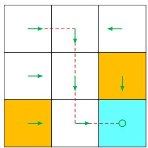
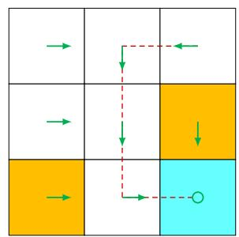
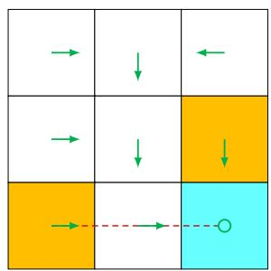

# 1.4 Policy

A policy tells the agent which actions to take at every state. Intuitively, policies can be depicted as arrows (see Figure 1.4(a)). Following a policy, the agent can generate a trajectory starting from an initial state (see Figure 1.4(b)).

  
(a) A deterministic policy

  
(b) Trajectories obtained from the policy   
Figure 1.4: A policy represented by arrows and some trajectories obtained by starting from different initial states.

Mathematically, policies can be described by conditional probabilities. Denote the policy in Figure 1.4 as $\pi(a|s)$ , which is a conditional probability distribution function defined for every state. For example, the policy for $s_1$ is

$$
\pi \left(a _ {1} \mid s _ {1}\right) = 0,
$$

$$
\pi \left(a _ {2} \mid s _ {1}\right) = 1,
$$

$$
\pi \left(a _ {3} \mid s _ {1}\right) = 0,
$$

$$
\pi \left(a _ {4} \mid s _ {1}\right) = 0,
$$

$$
\pi \left(a _ {5} \mid s _ {1}\right) = 0,
$$

which indicates that the probability of taking action $a_2$ at state $s_1$ is one, and the probabilities of taking other actions are zero.

The above policy is deterministic. Policies may be stochastic in general. For example, the policy shown in Figure 1.5 is stochastic: at state $s_1$ , the agent may take actions to go either rightward or downward. The probabilities of taking these two actions are the

same (both are 0.5). In this case, the policy for $s_1$ is

$$
\pi \left(a _ {1} \mid s _ {1}\right) = 0,
$$

$$
\pi (a _ {2} | s _ {1}) = 0. 5,
$$

$$
\pi \left(a _ {3} \mid s _ {1}\right) = 0. 5,
$$

$$
\pi \left(a _ {4} \mid s _ {1}\right) = 0,
$$

$$
\pi \left(a _ {5} \mid s _ {1}\right) = 0.
$$

  
Figure 1.5: A stochastic policy. At state $s_1$ , the agent may move rightward or downward with equal probabilities of 0.5.

Policies represented by conditional probabilities can be stored as tables. For example, Table 1.2 represents the stochastic policy depicted in Figure 1.5. The entry in the $i$ th row and $j$ th column is the probability of taking the $j$ th action at the $i$ th state. Such a representation is called a tabular representation. We will introduce another way to represent policies as parameterized functions in Chapter 8.

Table 1.2: A tabular representation of a policy. Each entry indicates the probability of taking an action at a state.   

<table><tr><td></td><td>a1 (upward)</td><td>a2 (rightward)</td><td>a3 (downward)</td><td>a4 (leftward)</td><td>a5 (unchanged)</td></tr><tr><td>s1</td><td>0</td><td>0.5</td><td>0.5</td><td>0</td><td>0</td></tr><tr><td>s2</td><td>0</td><td>0</td><td>1</td><td>0</td><td>0</td></tr><tr><td>s3</td><td>0</td><td>0</td><td>0</td><td>1</td><td>0</td></tr><tr><td>s4</td><td>0</td><td>1</td><td>0</td><td>0</td><td>0</td></tr><tr><td>s5</td><td>0</td><td>0</td><td>1</td><td>0</td><td>0</td></tr><tr><td>s6</td><td>0</td><td>0</td><td>1</td><td>0</td><td>0</td></tr><tr><td>s7</td><td>0</td><td>1</td><td>0</td><td>0</td><td>0</td></tr><tr><td>s8</td><td>0</td><td>1</td><td>0</td><td>0</td><td>0</td></tr><tr><td>s9</td><td>0</td><td>0</td><td>0</td><td>0</td><td>1</td></tr></table>
