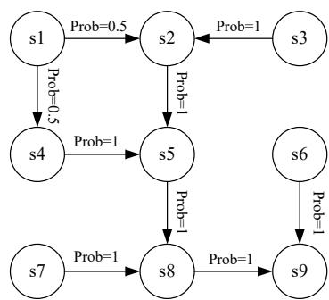

# 1.7 Markov decision processes

The previous sections of this chapter illustrated some fundamental concepts in reinforcement learning through examples. This section presents these concepts in a more formal way under the framework of Markov decision processes (MDPs).

An MDP is a general framework for describing stochastic dynamical systems. The key ingredients of an MDP are listed below.

Sets:

- State space: the set of all states, denoted as $S$ .   
- Action space: a set of actions, denoted as $\mathcal{A}(s)$ , associated with each state $s \in S$ .   
- Reward set: a set of rewards, denoted as $\mathcal{R}(s,a)$ , associated with each state-action pair $(s,a)$ .

Model:

- State transition probability: At state $s$ , when taking action $a$ , the probability of transitioning to state $s'$ is $p(s'|s, a)$ . It holds that $\sum_{s' \in S} p(s'|s, a) = 1$ for any $(s, a)$ .   
- Reward probability: At state $s$ , when taking action $a$ , the probability of obtaining reward $r$ is $p(r|s,a)$ . It holds that $\sum_{r\in \mathcal{R}(s,a)}p(r|s,a) = 1$ for any $(s,a)$ .

$\diamond$ Policy: At state $s$ , the probability of choosing action $a$ is $\pi(a|s)$ . It holds that $\sum_{a \in \mathcal{A}(s)} \pi(a|s) = 1$ for any $s \in S$ .   
Markov property: The Markov property refers to the memoryless property of a stochastic process. Mathematically, it means that

$$
p \big (s _ {t + 1} | s _ {t}, a _ {t}, s _ {t - 1}, a _ {t - 1}, \ldots , s _ {0}, a _ {0} \big) = p \big (s _ {t + 1} | s _ {t}, a _ {t} \big),
$$

$$
p (r _ {t + 1} | s _ {t}, a _ {t}, s _ {t - 1}, a _ {t - 1}, \dots , s _ {0}, a _ {0}) = p (r _ {t + 1} | s _ {t}, a _ {t}), \tag {1.4}
$$

where $t$ represents the current time step and $t + 1$ represents the next time step. Equation (1.4) indicates that the next state or reward depends merely on the current state and action and is independent of the previous ones. The Markov property is important for deriving the fundamental Bellman equation of MDPs, as shown in the next chapter.

Here, $p(s'|s,a)$ and $p(r|s,a)$ for all $(s,a)$ are called the model or dynamics. The model can be either stationary or nonstationary (or in other words, time-invariant or time-variant). A stationary model does not change over time; a nonstationary model may vary over time. For instance, in the grid world example, if a forbidden area may pop up or disappear sometimes, the model is nonstationary. In this book, we only consider stationary models.

One may have heard about the Markov processes (MPs). What is the difference between an MDP and an MP? The answer is that, once the policy in an MDP is fixed, the MDP degenerates into an MP. For example, the grid world example in Figure 1.7 can be abstracted as a Markov process. In the literature on stochastic processes, a Markov process is also called a Markov chain if it is a discrete-time process and the number of states is finite or countable [1]. In this book, the terms "Markov process" and "Markov chain" are used interchangeably when the context is clear. Moreover, this book mainly considers finite MDPs where the numbers of states and actions are finite. This is the simplest case that should be fully understood.

  
Figure 1.7: Abstraction of the grid world example as a Markov process. Here, the circles represent states and the links with arrows represent state transitions.

Finally, reinforcement learning can be described as an agent-environment interaction process. The agent is a decision-maker that can sense its state, maintain policies, and execute actions. Everything outside of the agent is regarded as the environment. In the grid world examples, the agent and environment correspond to the robot and grid world, respectively. After the agent decides to take an action, the actuator executes such a decision. Then, the state of the agent would be changed and a reward can be obtained. By using interpreters, the agent can interpret the new state and the reward. Thus, a closed loop can be formed.
