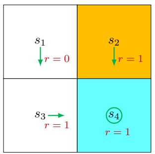
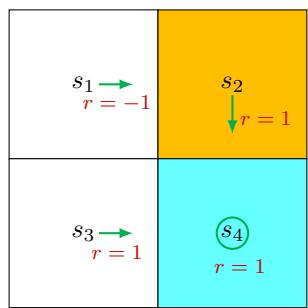
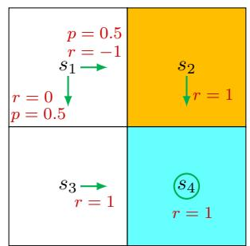

# 2.1 Motivating example 1: Why are returns important?

The previous chapter introduced the concept of returns. In fact, returns play a fundamental role in reinforcement learning since they can evaluate whether a policy is good or not. This is demonstrated by the following examples.

  
Figure 2.2: Examples for demonstrating the importance of returns. The three examples have different policies for $s_1$ .

Consider the three policies shown in Figure 2.2. It can be seen that the three policies are different at $s_1$ . Which is the best and which is the worst? Intuitively, the leftmost policy is the best because the agent starting from $s_1$ can avoid the forbidden area. The middle policy is intuitively worse because the agent starting from $s_1$ moves to the forbidden area. The rightmost policy is in between the others because it has a probability of 0.5 to go to the forbidden area.

While the above analysis is based on intuition, a question that immediately follows is whether we can use mathematics to describe such intuition. The answer is yes and relies on the return concept. In particular, suppose that the agent starts from $s_1$ .

$\diamond$ Following the first policy, the trajectory is $s_1 \to s_3 \to s_4 \to s_4 \cdots$ . The corresponding discounted return is

$$
\begin{array}{l} \mathrm {r e t u r n} _ {1} = 0 + \gamma 1 + \gamma^ {2} 1 + \dots \\ = \gamma (1 + \gamma + \gamma^ {2} + \dots) \\ = \frac {\gamma}{1 - \gamma}, \\ \end{array}
$$

where $\gamma \in (0,1)$ is the discount rate.

$\diamond$ Following the second policy, the trajectory is $s_1 \to s_2 \to s_4 \to s_4 \cdots$ . The discounted

return is

$$
\begin{array}{l} \mathrm {r e t u r n} _ {2} = - 1 + \gamma 1 + \gamma^ {2} 1 + \dots \\ = - 1 + \gamma (1 + \gamma + \gamma^ {2} + \dots) \\ = - 1 + \frac {\gamma}{1 - \gamma}. \\ \end{array}
$$

$\diamond$ Following the third policy, two trajectories can possibly be obtained. One is $s_1 \rightarrow s_3 \rightarrow s_4 \rightarrow s_4 \cdots$ , and the other is $s_1 \rightarrow s_2 \rightarrow s_4 \rightarrow s_4 \cdots$ . The probability of either of the two trajectories is 0.5. Then, the average return that can be obtained starting from $s_1$ is

$$
\begin{array}{l} \operatorname {r e t u r n} _ {3} = 0. 5 \left(- 1 + \frac {\gamma}{1 - \gamma}\right) + 0. 5 \left(\frac {\gamma}{1 - \gamma}\right) \\ = - 0. 5 + \frac {\gamma}{1 - \gamma}. \\ \end{array}
$$

By comparing the returns of the three policies, we notice that

$$
\operatorname {r e t u r n} _ {1} > \operatorname {r e t u r n} _ {3} > \operatorname {r e t u r n} _ {2} \tag {2.1}
$$

for any value of $\gamma$ . Inequality (2.1) suggests that the first policy is the best because its return is the greatest, and the second policy is the worst because its return is the smallest. This mathematical conclusion is consistent with the aforementioned intuition: the first policy is the best since it can avoid entering the forbidden area, and the second policy is the worst because it leads to the forbidden area.

The above examples demonstrate that returns can be used to evaluate policies: a policy is better if the return obtained by following that policy is greater. Finally, it is notable that $\mathrm{return}_3$ does not strictly comply with the definition of returns because it is more like an expected value. It will become clear later that $\mathrm{return}_3$ is actually a state value.
