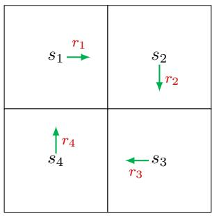

# 2.2 Motivating example 2: How to calculate returns?

While we have demonstrated the importance of returns, a question that immediately follows is how to calculate the returns when following a given policy.

There are two ways to calculate returns.

The first is simply by definition: a return equals the discounted sum of all the rewards collected along a trajectory. Consider the example in Figure 2.3. Let $v_{i}$ denote the return obtained by starting from $s_{i}$ for $i = 1,2,3,4$ . Then, the returns obtained when

  
Figure 2.3: An example for demonstrating how to calculate returns. There are no target or forbidden cells in this example.

starting from the four states in Figure 2.3 can be calculated as

$$
v _ {1} = r _ {1} + \gamma r _ {2} + \gamma^ {2} r _ {3} + \dots ,
$$

$$
v _ {2} = r _ {2} + \gamma r _ {3} + \gamma^ {2} r _ {4} + \dots , \tag {2.2}
$$

$$
v _ {3} = r _ {3} + \gamma r _ {4} + \gamma^ {2} r _ {1} + \dots ,
$$

$$
v _ {4} = r _ {4} + \gamma r _ {1} + \gamma^ {2} r _ {2} + \dots .
$$

The second way, which is more important, is based on the idea of bootstrapping. By observing the expressions of the returns in (2.2), we can rewrite them as

$$
v _ {1} = r _ {1} + \gamma (r _ {2} + \gamma r _ {3} + \dots) = r _ {1} + \gamma v _ {2},
$$

$$
v _ {2} = r _ {2} + \gamma \left(r _ {3} + \gamma r _ {4} + \dots\right) = r _ {2} + \gamma v _ {3}, \tag {2.3}
$$

$$
v _ {3} = r _ {3} + \gamma (r _ {4} + \gamma r _ {1} + \dots) = r _ {3} + \gamma v _ {4},
$$

$$
v _ {4} = r _ {4} + \gamma (r _ {1} + \gamma r _ {2} + \dots) = r _ {4} + \gamma v _ {1}.
$$

The above equations indicate an interesting phenomenon that the values of the returns rely on each other. More specifically, $v_{1}$ relies on $v_{2}$ , $v_{2}$ relies on $v_{3}$ , $v_{3}$ relies on $v_{4}$ , and $v_{4}$ relies on $v_{1}$ . This reflects the idea of bootstrapping, which is to obtain the values of some quantities from themselves.

At first glance, bootstrapping is an endless loop because the calculation of an unknown value relies on another unknown value. In fact, bootstrapping is easier to understand if we view it from a mathematical perspective. In particular, the equations in (2.3) can be reformed into a linear matrix-vector equation:

$$
\underbrace {\left[ \begin{array}{l} v _ {1} \\ v _ {2} \\ v _ {3} \\ v _ {4} \end{array} \right]} _ {v} = \left[ \begin{array}{l} r _ {1} \\ r _ {2} \\ r _ {3} \\ r _ {4} \end{array} \right] + \left[ \begin{array}{l} \gamma v _ {2} \\ \gamma v _ {3} \\ \gamma v _ {4} \\ \gamma v _ {1} \end{array} \right] = \underbrace {\left[ \begin{array}{l} r _ {1} \\ r _ {2} \\ r _ {3} \\ r _ {4} \end{array} \right]} _ {r} + \gamma \underbrace {\left[ \begin{array}{l l l l} 0 & 1 & 0 & 0 \\ 0 & 0 & 1 & 0 \\ 0 & 0 & 0 & 1 \\ 1 & 0 & 0 & 0 \end{array} \right]} _ {P} \underbrace {\left[ \begin{array}{l} v _ {1} \\ v _ {2} \\ v _ {3} \\ v _ {4} \end{array} \right]} _ {v},
$$

which can be written compactly as

$$
v = r + \gamma P v.
$$

Thus, the value of $v$ can be calculated easily as $v = (I - \gamma P)^{-1}r$ , where $I$ is the identity matrix with appropriate dimensions. One may ask whether $I - \gamma P$ is always invertible. The answer is yes and explained in Section 2.7.1.

In fact, (2.3) is the Bellman equation for this simple example. Although it is simple, (2.3) demonstrates the core idea of the Bellman equation: the return obtained by starting from one state depends on those obtained when starting from other states. The idea of bootstrapping and the Bellman equation for general scenarios will be formalized in the following sections.
