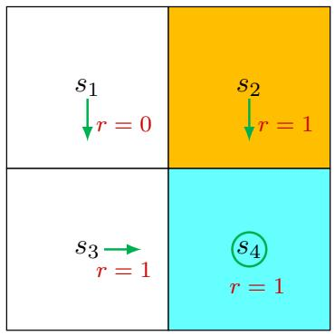
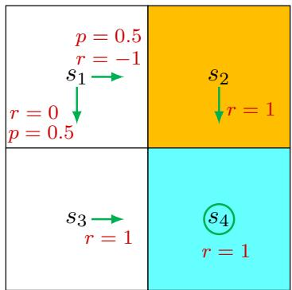

# 2.5 Examples for illustrating the Bellman equation

We next use two examples to demonstrate how to write out the Bellman equation and calculate the state values step by step. Readers are advised to carefully go through the examples to gain a better understanding of the Bellman equation.

  
Figure 2.4: An example for demonstrating the Bellman equation. The policy in this example is deterministic.

$\diamond$ Consider the first example shown in Figure 2.4, where the policy is deterministic. We next write out the Bellman equation and then solve the state values from it.

First, consider state $s_1$ . Under the policy, the probabilities of taking the actions are $\pi(a = a_3 | s_1) = 1$ and $\pi(a \neq a_3 | s_1) = 0$ . The state transition probabilities are $p(s' = s_3 | s_1, a_3) = 1$ and $p(s' \neq s_3 | s_1, a_3) = 0$ . The reward probabilities are $p(r = 0 | s_1, a_3) = 1$ and $p(r \neq 0 | s_1, a_3) = 0$ . Substituting these values into (2.7) gives

$$
v _ {\pi} (s _ {1}) = 0 + \gamma v _ {\pi} (s _ {3}).
$$

Interestingly, although the expression of the Bellman equation in (2.7) seems complex, the expression for this specific state is very simple.

Similarly, it can be obtained that

$$
v _ {\pi} (s _ {2}) = 1 + \gamma v _ {\pi} (s _ {4}),
$$

$$
v _ {\pi} (s _ {3}) = 1 + \gamma v _ {\pi} (s _ {4}),
$$

$$
v _ {\pi} (s _ {4}) = 1 + \gamma v _ {\pi} (s _ {4}).
$$

We can solve the state values from these equations. Since the equations are simple, we can manually solve them. More complicated equations can be solved by the algorithms presented in Section 2.7. Here, the state values can be solved as

$$
v _ {\pi} (s _ {4}) = \frac {1}{1 - \gamma},
$$

$$
v _ {\pi} (s _ {3}) = \frac {1}{1 - \gamma},
$$

$$
v _ {\pi} (s _ {2}) = \frac {1}{1 - \gamma},
$$

$$
v _ {\pi} (s _ {1}) = \frac {\gamma}{1 - \gamma}.
$$

Furthermore, if we set $\gamma = 0.9$ , then

$$
v _ {\pi} (s _ {4}) = \frac {1}{1 - 0 . 9} = 1 0,
$$

$$
v _ {\pi} (s _ {3}) = \frac {1}{1 - 0 . 9} = 1 0,
$$

$$
v _ {\pi} (s _ {2}) = \frac {1}{1 - 0 . 9} = 1 0,
$$

$$
v _ {\pi} (s _ {1}) = \frac {0 . 9}{1 - 0 . 9} = 9.
$$

  
Figure 2.5: An example for demonstrating the Bellman equation. The policy in this example is stochastic.

$\diamond$ Consider the second example shown in Figure 2.5, where the policy is stochastic. We next write out the Bellman equation and then solve the state values from it.

At state $s_1$ , the probabilities of going right and down equal 0.5. Mathematically, we have $\pi(a = a_2|s_1) = 0.5$ and $\pi(a = a_3|s_1) = 0.5$ . The state transition probability is deterministic since $p(s' = s_3|s_1, a_3) = 1$ and $p(s' = s_2|s_1, a_2) = 1$ . The reward probability is also deterministic since $p(r = 0|s_1, a_3) = 1$ and $p(r = -1|s_1, a_2) = 1$ . Substituting these values into (2.7) gives

$$
v _ {\pi} (s _ {1}) = 0. 5 [ 0 + \gamma v _ {\pi} (s _ {3}) ] + 0. 5 [ - 1 + \gamma v _ {\pi} (s _ {2}) ].
$$

Similarly, it can be obtained that

$$
v _ {\pi} (s _ {2}) = 1 + \gamma v _ {\pi} (s _ {4}),
$$

$$
v _ {\pi} \left(s _ {3}\right) = 1 + \gamma v _ {\pi} \left(s _ {4}\right),
$$

$$
v _ {\pi} (s _ {4}) = 1 + \gamma v _ {\pi} (s _ {4}).
$$

The state values can be solved from the above equations. Since the equations are

simple, we can solve the state values manually and obtain

$$
v _ {\pi} (s _ {4}) = \frac {1}{1 - \gamma},
$$

$$
v _ {\pi} (s _ {3}) = \frac {1}{1 - \gamma},
$$

$$
v _ {\pi} (s _ {2}) = \frac {1}{1 - \gamma},
$$

$$
\begin{array}{l} v _ {\pi} (s _ {1}) = 0. 5 [ 0 + \gamma v _ {\pi} (s _ {3}) ] + 0. 5 [ - 1 + \gamma v _ {\pi} (s _ {2}) ], \\ = - 0. 5 + \frac {\gamma}{1 - \gamma}. \\ \end{array}
$$

Furthermore, if we set $\gamma = 0.9$ , then

$$
v _ {\pi} \left(s _ {4}\right) = 1 0,
$$

$$
v _ {\pi} (s _ {3}) = 1 0,
$$

$$
v _ {\pi} (s _ {2}) = 1 0,
$$

$$
v _ {\pi} (s _ {1}) = - 0. 5 + 9 = 8. 5.
$$

If we compare the state values of the two policies in the above examples, it can be seen that

$$
v _ {\pi_ {1}} (s _ {i}) \geq v _ {\pi_ {2}} (s _ {i}), \quad i = 1, 2, 3, 4,
$$

which indicates that the policy in Figure 2.4 is better because it has greater state values. This mathematical conclusion is consistent with the intuition that the first policy is better because it can avoid entering the forbidden area when the agent starts from $s_1$ . As a result, the above two examples demonstrate that state values can be used to evaluate policies.
