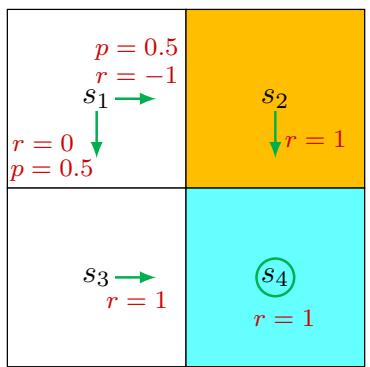

# 2.6 Matrix-vector form of the Bellman equation

The Bellman equation in (2.7) is in an elementwise form. Since it is valid for every state, we can combine all these equations and write them concisely in a matrix-vector form, which will be frequently used to analyze the Bellman equation.

To derive the matrix-vector form, we first rewrite the Bellman equation in (2.7) as

$$
v _ {\pi} (s) = r _ {\pi} (s) + \gamma \sum_ {s ^ {\prime} \in \mathcal {S}} p _ {\pi} (s ^ {\prime} | s) v _ {\pi} (s ^ {\prime}), \tag {2.8}
$$

where

$$
r _ {\pi} (s) \doteq \sum_ {a \in \mathcal {A}} \pi (a | s) \sum_ {r \in \mathcal {R}} p (r | s, a) r,
$$

$$
p _ {\pi} (s ^ {\prime} | s) \doteq \sum_ {a \in \mathcal {A}} \pi (a | s) p (s ^ {\prime} | s, a).
$$

Here, $r_{\pi}(s)$ denotes the mean of the immediate rewards, and $p_{\pi}(s'|s)$ is the probability of transitioning from $s$ to $s'$ under policy $\pi$ .

Suppose that the states are indexed as $s_i$ with $i = 1, \ldots, n$ , where $n = |\mathcal{S}|$ . For state $s_i$ , (2.8) can be written as

$$
v _ {\pi} (s _ {i}) = r _ {\pi} (s _ {i}) + \gamma \sum_ {s _ {j} \in \mathcal {S}} p _ {\pi} (s _ {j} | s _ {i}) v _ {\pi} (s _ {j}). \tag {2.9}
$$

Let $v_{\pi} = [v_{\pi}(s_1), \ldots, v_{\pi}(s_n)]^T \in \mathbb{R}^n$ , $r_{\pi} = [r_{\pi}(s_1), \ldots, r_{\pi}(s_n)]^T \in \mathbb{R}^n$ , and $P_{\pi} \in \mathbb{R}^{n \times n}$ with $[P_{\pi}]_{ij} = p_{\pi}(s_j | s_i)$ . Then, (2.9) can be written in the following matrix-vector form:

$$
v _ {\pi} = r _ {\pi} + \gamma P _ {\pi} v _ {\pi}, \tag {2.10}
$$

where $v_{\pi}$ is the unknown to be solved, and $r_{\pi}, P_{\pi}$ are known.

The matrix $P_{\pi}$ has some interesting properties. First, it is a nonnegative matrix, meaning that all its elements are equal to or greater than zero. This property is denoted as $P_{\pi} \geq 0$ , where 0 denotes a zero matrix with appropriate dimensions. In this book, $\geq$ or $\leq$ represents an elementwise comparison operation. Second, $P_{\pi}$ is a stochastic matrix, meaning that the sum of the values in every row is equal to one. This property is denoted as $P_{\pi}\mathbf{1} = \mathbf{1}$ , where $\mathbf{1} = [1,\dots ,1]^T$ has appropriate dimensions.

Consider the example shown in Figure 2.6. The matrix-vector form of the Bellman equation is

$$
\underbrace {\left[ \begin{array}{l} v _ {\pi} (s _ {1}) \\ v _ {\pi} (s _ {2}) \\ v _ {\pi} (s _ {3}) \\ v _ {\pi} (s _ {4}) \end{array} \right]} _ {v _ {\pi}} = \underbrace {\left[ \begin{array}{l} r _ {\pi} (s _ {1}) \\ r _ {\pi} (s _ {2}) \\ r _ {\pi} (s _ {3}) \\ r _ {\pi} (s _ {4}) \end{array} \right]} _ {r _ {\pi}} + \gamma \underbrace {\left[ \begin{array}{l l l l} p _ {\pi} (s _ {1} | s _ {1}) & p _ {\pi} (s _ {2} | s _ {1}) & p _ {\pi} (s _ {3} | s _ {1}) & p _ {\pi} (s _ {4} | s _ {1}) \\ p _ {\pi} (s _ {1} | s _ {2}) & p _ {\pi} (s _ {2} | s _ {2}) & p _ {\pi} (s _ {3} | s _ {2}) & p _ {\pi} (s _ {4} | s _ {2}) \\ p _ {\pi} (s _ {1} | s _ {3}) & p _ {\pi} (s _ {2} | s _ {3}) & p _ {\pi} (s _ {3} | s _ {3}) & p _ {\pi} (s _ {4} | s _ {3}) \\ p _ {\pi} (s _ {1} | s _ {4}) & p _ {\pi} (s _ {2} | s _ {4}) & p _ {\pi} (s _ {3} | s _ {4}) & p _ {\pi} (s _ {4} | s _ {4}) \end{array} \right]} _ {P _ {\pi}} \underbrace {\left[ \begin{array}{l} v _ {\pi} (s _ {1}) \\ v _ {\pi} (s _ {2}) \\ v _ {\pi} (s _ {3}) \\ v _ {\pi} (s _ {4}) \end{array} \right]} _ {v _ {\pi}}.
$$

Substituting the specific values into the above equation gives

$$
\left[ \begin{array}{c} v _ {\pi} (s _ {1}) \\ v _ {\pi} (s _ {2}) \\ v _ {\pi} (s _ {3}) \\ v _ {\pi} (s _ {4}) \end{array} \right] = \left[ \begin{array}{c} 0. 5 (0) + 0. 5 (- 1) \\ 1 \\ 1 \\ 1 \end{array} \right] + \gamma \left[ \begin{array}{c c c c} 0 & 0. 5 & 0. 5 & 0 \\ 0 & 0 & 0 & 1 \\ 0 & 0 & 0 & 1 \\ 0 & 0 & 0 & 1 \end{array} \right] \left[ \begin{array}{c} v _ {\pi} (s _ {1}) \\ v _ {\pi} (s _ {2}) \\ v _ {\pi} (s _ {3}) \\ v _ {\pi} (s _ {4}) \end{array} \right].
$$

It can be seen that $P_{\pi}$ satisfies $P_{\pi} \mathbf{1} = \mathbf{1}$ .

  
Figure 2.6: An example for demonstrating the matrix-vector form of the Bellman equation.
