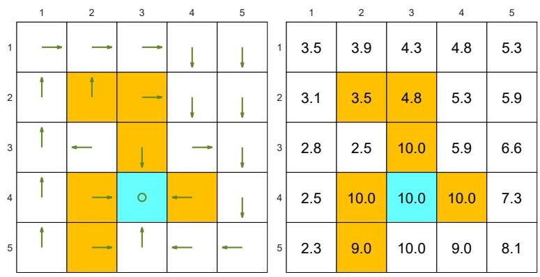
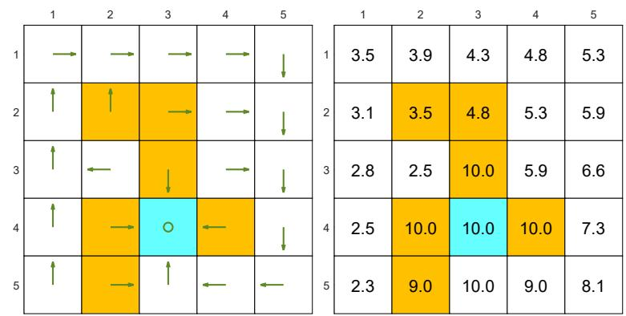
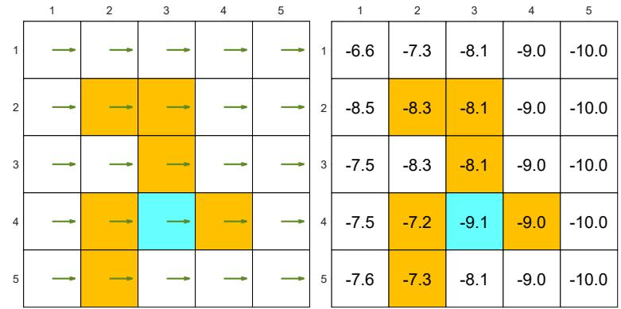
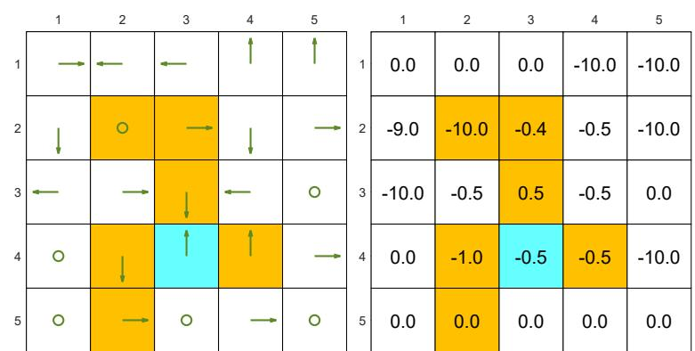

# 2.7 Solving state values from the Bellman equation

Calculating the state values of a given policy is a fundamental problem in reinforcement learning. This problem is often referred to as policy evaluation. In this section, we present two methods for calculating state values from the Bellman equation.

# 2.7.1 Closed-form solution

Since $v_{\pi} = r_{\pi} + \gamma P_{\pi}v_{\pi}$ is a simple linear equation, its closed-form solution can be easily obtained as

$$
v _ {\pi} = \left(I - \gamma P _ {\pi}\right) ^ {- 1} r _ {\pi}.
$$

Some properties of $(I - \gamma P_{\pi})^{-1}$ are given below.

$\diamond$ $I - \gamma P_{\pi}$ is invertible. The proof is as follows. According to the Gershgorin circle theorem [4], every eigenvalue of $I - \gamma P_{\pi}$ lies within at least one of the Gershgorin circles. The $i$ th Gershgorin circle has a center at $[I - \gamma P_{\pi}]_{ii} = 1 - \gamma p_{\pi}(s_i|s_i)$ and a radius equal to $\sum_{j\neq i}[I - \gamma P_{\pi}]_{ij} = -\sum_{j\neq i}\gamma p_{\pi}(s_j|s_i)$ . Since $\gamma < 1$ , we know that the radius is less than the magnitude of the center: $\sum_{j\neq i}\gamma p_{\pi}(s_j|s_i) < 1 - \gamma p_{\pi}(s_i|s_i)$ . Therefore, all Gershgorin circles do not encircle the origin, and hence, no eigenvalue of $I - \gamma P_{\pi}$ is zero.   
$\diamond$ $(I - \gamma P_{\pi})^{-1} \geq I$ , meaning that every element of $(I - \gamma P_{\pi})^{-1}$ is nonnegative and, more specifically, no less than that of the identity matrix. This is because $P_{\pi}$ has nonnegative entries, and hence, $(I - \gamma P_{\pi})^{-1} = I + \gamma P_{\pi} + \gamma^{2}P_{\pi}^{2} + \dots \geq I \geq 0$ .   
For any vector $r \geq 0$ , it holds that $(I - \gamma P_{\pi})^{-1}r \geq r \geq 0$ . This property follows from the second property because $[(I - \gamma P_{\pi})^{-1} - I]r \geq 0$ . As a consequence, if $r_1 \geq r_2$ , we have $(I - \gamma P_{\pi})^{-1}r_1 \geq (I - \gamma P_{\pi})^{-1}r_2$ .

# 2.7.2 Iterative solution

Although the closed-form solution is useful for theoretical analysis purposes, it is not applicable in practice because it involves a matrix inversion operation, which still needs to be calculated by other numerical algorithms. In fact, we can directly solve the Bellman equation using the following iterative algorithm:

$$
v _ {k + 1} = r _ {\pi} + \gamma P _ {\pi} v _ {k}, \quad k = 0, 1, 2, \dots . \tag {2.11}
$$

This algorithm generates a sequence of values $\{v_0, v_1, v_2, \ldots\}$ , where $v_0 \in \mathbb{R}^n$ is an initial guess of $v_\pi$ . It holds that

$$
v _ {k} \rightarrow v _ {\pi} = \left(I - \gamma P _ {\pi}\right) ^ {- 1} r _ {\pi}, \quad \text {a s} k \rightarrow \infty . \tag {2.12}
$$

Interested readers may see the proof in Box 2.1.

# Box 2.1: Convergence proof of (2.12)

Define the error as $\delta_{k} = v_{k} - v_{\pi}$ . We only need to show that $\delta_{k} \to 0$ . Substituting $v_{k+1} = \delta_{k+1} + v_{\pi}$ and $v_{k} = \delta_{k} + v_{\pi}$ into $v_{k+1} = r_{\pi} + \gamma P_{\pi} v_{k}$ gives

$$
\delta_ {k + 1} + v _ {\pi} = r _ {\pi} + \gamma P _ {\pi} (\delta_ {k} + v _ {\pi}),
$$

which can be rewritten as

$$
\begin{array}{l} \delta_ {k + 1} = - v _ {\pi} + r _ {\pi} + \gamma P _ {\pi} \delta_ {k} + \gamma P _ {\pi} v _ {\pi}, \\ = \gamma P _ {\pi} \delta_ {k} - v _ {\pi} + \left(r _ {\pi} + \gamma P _ {\pi} v _ {\pi}\right), \\ = \gamma P _ {\pi} \delta_ {k}. \\ \end{array}
$$

As a result,

$$
\delta_ {k + 1} = \gamma P _ {\pi} \delta_ {k} = \gamma^ {2} P _ {\pi} ^ {2} \delta_ {k - 1} = \dots = \gamma^ {k + 1} P _ {\pi} ^ {k + 1} \delta_ {0}.
$$

Since every entry of $P_{\pi}$ is nonnegative and no greater than one, we have that $0 \leq P_{\pi}^{k} \leq 1$ for any $k$ . That is, every entry of $P_{\pi}^{k}$ is no greater than 1. On the other hand, since $\gamma < 1$ , we know that $\gamma^{k} \to 0$ , and hence, $\delta_{k+1} = \gamma^{k+1} P_{\pi}^{k+1} \delta_{0} \to 0$ as $k \to \infty$ .

# 2.7.3 Illustrative examples

We next apply the algorithm in (2.11) to solve the state values of some examples.

The examples are shown in Figure 2.7. The orange cells represent forbidden areas. The blue cell represents the target area. The reward settings are $r_{\mathrm{boundary}} = r_{\mathrm{forbidden}} = -1$

  
(a) Two "good" policies and their state values. The state values of the two policies are the same, but the two policies are different at the top two states in the fourth column.

Figure 2.7: Examples of policies and their corresponding state values.   
  
(b) Two "bad" policies and their state values. The state values are smaller than those of the "good" policies.

and $r_{\mathrm{target}} = 1$ . Here, the discount rate is $\gamma = 0.9$ .

Figure 2.7(a) shows two "good" policies and their corresponding state values obtained by (2.11). The two policies have the same state values but differ at the top two states in the fourth column. Therefore, we know that different policies may have the same state values.

Figure 2.7(b) shows two "bad" policies and their corresponding state values. These two policies are bad because the actions of many states are intuitively unreasonable. Such intuition is supported by the obtained state values. As can be seen, the state values of these two policies are negative and much smaller than those of the good policies in Figure 2.7(a).
