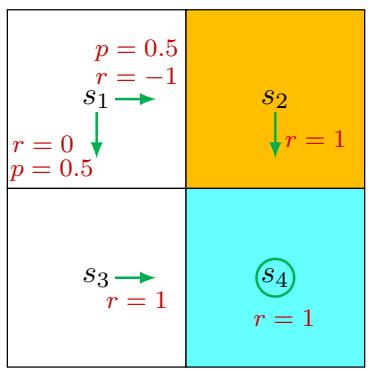

# 2.8 From state value to action value

While we have been discussing state values thus far in this chapter, we now turn to the action value, which indicates the "value" of taking an action at a state. While the concept of action value is important, the reason why it is introduced in the last section of this chapter is that it heavily relies on the concept of state values. It is important to understand state values well first before studying action values.

The action value of a state-action pair $(s,a)$ is defined as

$$
q _ {\pi} (s, a) \doteq \mathbb {E} [ G _ {t} | S _ {t} = s, A _ {t} = a ].
$$

As can be seen, the action value is defined as the expected return that can be obtained after taking an action at a state. It must be noted that $q_{\pi}(s,a)$ depends on a state-action pair $(s,a)$ rather than an action alone. It may be more rigorous to call this value a state-action value, but it is conventionally called an action value for simplicity.

What is the relationship between action values and state values?

First, it follows from the properties of conditional expectation that

$$
\underbrace {\mathbb {E} [ G _ {t} | S _ {t} = s ]} _ {v _ {\pi} (s)} = \sum_ {a \in \mathcal {A}} \underbrace {\mathbb {E} [ G _ {t} | S _ {t} = s , A _ {t} = a ]} _ {q _ {\pi} (s, a)} \pi (a | s).
$$

It then follows that

$$
v _ {\pi} (s) = \sum_ {a \in \mathcal {A}} \pi (a | s) q _ {\pi} (s, a). \tag {2.13}
$$

As a result, a state value is the expectation of the action values associated with that state.

Second, since the state value is given by

$$
v _ {\pi} (s) = \sum_ {a \in \mathcal {A}} \pi (a | s) \Big [ \sum_ {r \in \mathcal {R}} p (r | s, a) r + \gamma \sum_ {s ^ {\prime} \in \mathcal {S}} p (s ^ {\prime} | s, a) v _ {\pi} (s ^ {\prime}) \Big ],
$$

comparing it with (2.13) leads to

$$
q _ {\pi} (s, a) = \sum_ {r \in \mathcal {R}} p (r | s, a) r + \gamma \sum_ {s ^ {\prime} \in \mathcal {S}} p \left(s ^ {\prime} \mid s, a\right) v _ {\pi} \left(s ^ {\prime}\right). \tag {2.14}
$$

It can be seen that the action value consists of two terms. The first term is the mean of the immediate rewards, and the second term is the mean of the future rewards.

Both (2.13) and (2.14) describe the relationship between state values and action values. They are the two sides of the same coin: (2.13) shows how to obtain state values from action values, whereas (2.14) shows how to obtain action values from state values.

# 2.8.1 Illustrative examples

  
Figure 2.8: An example for demonstrating the process of calculating action values.

We next present an example to illustrate the process of calculating action values and discuss a common mistake that beginners may make.

Consider the stochastic policy shown in Figure 2.8. We next only examine the actions of $s_1$ . The other states can be examined similarly. The action value of $(s_1, a_2)$ is

$$
q _ {\pi} \left(s _ {1}, a _ {2}\right) = - 1 + \gamma v _ {\pi} \left(s _ {2}\right),
$$

where $s_2$ is the next state. Similarly, it can be obtained that

$$
q _ {\pi} (s _ {1}, a _ {3}) = 0 + \gamma v _ {\pi} (s _ {3}).
$$

A common mistake that beginners may make is about the values of the actions that the given policy does not select. For example, the policy in Figure 2.8 can only select $a_2$ or $a_3$ and cannot select $a_1, a_4, a_5$ . One may argue that since the policy does not select $a_1, a_4, a_5$ , we do not need to calculate their action values, or we can simply set $q_{\pi}(s_1, a_1) = q_{\pi}(s_1, a_4) = q_{\pi}(s_1, a_5) = 0$ . This is wrong.

First, even if an action would not be selected by a policy, it still has an action value.

In this example, although policy $\pi$ does not take $a_1$ at $s_1$ , we can still calculate its

action value by observing what we would obtain after taking this action. Specifically, after taking $a_1$ , the agent is bounced back to $s_1$ (hence, the immediate reward is $-1$ ) and then continues moving in the state space starting from $s_1$ by following $\pi$ (hence, the future reward is $\gamma v_{\pi}(s_1)$ ). As a result, the action value of $(s_1, a_1)$ is

$$
q _ {\pi} \left(s _ {1}, a _ {1}\right) = - 1 + \gamma v _ {\pi} \left(s _ {1}\right).
$$

Similarly, for $a_4$ and $a_5$ , which cannot be possibly selected by the given policy either, we have

$$
q _ {\pi} (s _ {1}, a _ {4}) = - 1 + \gamma v _ {\pi} (s _ {1}),
$$

$$
q _ {\pi} (s _ {1}, a _ {5}) = 0 + \gamma v _ {\pi} (s _ {1}).
$$

$\diamond$ Second, why do we care about the actions that the given policy would not select? Although some actions cannot be possibly selected by a given policy, this does not mean that these actions are not good. It is possible that the given policy is not good, so it cannot select the best action. The purpose of reinforcement learning is to find optimal policies. To that end, we must keep exploring all actions to determine better actions for each state.

Finally, after computing the action values, we can also calculate the state value according to (2.14):

$$
\begin{array}{l} v _ {\pi} (s _ {1}) = 0. 5 q _ {\pi} (s _ {1}, a _ {2}) + 0. 5 q _ {\pi} (s _ {1}, a _ {3}), \\ = 0. 5 \left[ 0 + \gamma v _ {\pi} \left(s _ {3}\right) \right] + 0. 5 \left[ - 1 + \gamma v _ {\pi} \left(s _ {2}\right) \right]. \\ \end{array}
$$

# 2.8.2 The Bellman equation in terms of action values

The Bellman equation that we previously introduced was defined based on state values. In fact, it can also be expressed in terms of action values.

In particular, substituting (2.13) into (2.14) yields

$$
q _ {\pi} (s, a) = \sum_ {r \in \mathcal {R}} p (r | s, a) r + \gamma \sum_ {s ^ {\prime} \in \mathcal {S}} p (s ^ {\prime} | s, a) \sum_ {a ^ {\prime} \in \mathcal {A} (s ^ {\prime})} \pi (a ^ {\prime} | s ^ {\prime}) q _ {\pi} (s ^ {\prime}, a ^ {\prime}),
$$

which is an equation of action values. The above equation is valid for every state-action pair. If we put all these equations together, their matrix-vector form is

$$
q _ {\pi} = \tilde {r} + \gamma P \Pi q _ {\pi}, \tag {2.15}
$$

where $q_{\pi}$ is the action value vector indexed by the state-action pairs: its $(s,a)$ th element is $[q_{\pi}]_{(s,a)} = q_{\pi}(s,a)$ . $\tilde{r}$ is the immediate reward vector indexed by the state-action pairs: $[\tilde{r}]_{(s,a)} = \sum_{r \in \mathcal{R}} p(r|s,a)r$ . The matrix $P$ is the probability transition matrix, whose

row is indexed by the state-action pairs and whose column is indexed by the states: $[P]_{(s,a),s'} = p(s'|s,a)$ . Moreover, $\Pi$ is a block diagonal matrix in which each block is a $1 \times |\mathcal{A}|$ vector: $\Pi_{s',(s',a')} = \pi(a'|s')$ and the other entries of $\Pi$ are zero.

Compared to the Bellman equation defined in terms of state values, the equation defined in terms of action values has some unique features. For example, $\tilde{r}$ and $P$ are independent of the policy and are merely determined by the system model. The policy is embedded in $\Pi$ . It can be verified that (2.15) is also a contraction mapping and has a unique solution that can be iteratively solved. More details can be found in [5].
