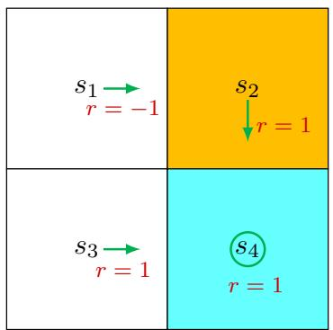

# 3.1 Motivating example: How to improve policies?

  
Figure 3.2: An example for demonstrating policy improvement.

Consider the policy shown in Figure 3.2. Here, the orange and blue cells represent the forbidden and target areas, respectively. The policy here is not good because it selects $a_2$ (rightward) at state $s_1$ . How can we improve the given policy to obtain a better policy? The answer lies in state values and action values.

$\diamond$ Intuition: It is intuitively clear that the policy can improve if it selects $a_3$ (downward) instead of $a_2$ (rightward) at $s_1$ . This is because moving downward enables the agent to avoid entering the forbidden area.   
$\diamond$ Mathematics: The above intuition can be realized based on the calculation of state values and action values.

First, we calculate the state values of the given policy. In particular, the Bellman equation of this policy is

$$
\begin{array}{l} v _ {\pi} (s _ {1}) = - 1 + \gamma v _ {\pi} (s _ {2}), \\ v _ {\pi} (s _ {2}) = + 1 + \gamma v _ {\pi} (s _ {4}), \\ v _ {\pi} (s _ {3}) = + 1 + \gamma v _ {\pi} (s _ {4}), \\ v _ {\pi} (s _ {4}) = + 1 + \gamma v _ {\pi} (s _ {4}). \\ \end{array}
$$

Let $\gamma = 0.9$ . It can be easily solved that

$$
v _ {\pi} \left(s _ {4}\right) = v _ {\pi} \left(s _ {3}\right) = v _ {\pi} \left(s _ {2}\right) = 1 0,
$$

$$
v _ {\pi} (s _ {1}) = 8.
$$

Second, we calculate the action values for state $s_1$ :

$$
q _ {\pi} \left(s _ {1}, a _ {1}\right) = - 1 + \gamma v _ {\pi} \left(s _ {1}\right) = 6. 2,
$$

$$
q _ {\pi} \left(s _ {1}, a _ {2}\right) = - 1 + \gamma v _ {\pi} \left(s _ {2}\right) = 8,
$$

$$
q _ {\pi} (s _ {1}, a _ {3}) = 0 + \gamma v _ {\pi} (s _ {3}) = 9,
$$

$$
q _ {\pi} \left(s _ {1}, a _ {4}\right) = - 1 + \gamma v _ {\pi} \left(s _ {1}\right) = 6. 2,
$$

$$
q _ {\pi} \left(s _ {1}, a _ {5}\right) = 0 + \gamma v _ {\pi} \left(s _ {1}\right) = 7. 2.
$$

It is notable that action $a_3$ has the greatest action value:

$$
q _ {\pi} \left(s _ {1}, a _ {3}\right) \geq q _ {\pi} \left(s _ {1}, a _ {i}\right), \quad \text {f o r a l l} i \neq 3.
$$

Therefore, we can update the policy to select $a_3$ at $s_1$ .

This example illustrates that we can obtain a better policy if we update the policy to select the action with the greatest action value. This is the basic idea of many reinforcement learning algorithms.

This example is very simple in the sense that the given policy is only not good for state $s_1$ . If the policy is also not good for the other states, will selecting the action with the greatest action value still generate a better policy? Moreover, whether there always exist optimal policies? What does an optimal policy look like? We will answer all of these questions in this chapter.
