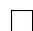

# 3.3 Bellman optimality equation

The tool for analyzing optimal policies and optimal state values is the Bellman optimality equation (BOE). By solving this equation, we can obtain optimal policies and optimal state values. We next present the expression of the BOE and then analyze it in detail.

For every $s \in S$ , the elementwise expression of the BOE is

$$
\begin{array}{l} v (s) = \max  _ {\pi (s) \in \Pi (s)} \sum_ {a \in \mathcal {A}} \pi (a | s) \left(\sum_ {r \in \mathcal {R}} p (r | s, a) r + \gamma \sum_ {s ^ {\prime} \in \mathcal {S}} p (s ^ {\prime} | s, a) v (s ^ {\prime})\right) \\ = \max  _ {\pi (s) \in \Pi (s)} \sum_ {a \in \mathcal {A}} \pi (a | s) q (s, a), \tag {3.1} \\ \end{array}
$$

where $v(s), v(s')$ are unknown variables to be solved and

$$
q (s, a) \doteq \sum_ {r \in \mathcal {R}} p (r | s, a) r + \gamma \sum_ {s ^ {\prime} \in \mathcal {S}} p (s ^ {\prime} | s, a) v (s ^ {\prime}).
$$

Here, $\pi(s)$ denotes a policy for state $s$ , and $\Pi(s)$ is the set of all possible policies for $s$ .

The BOE is an elegant and powerful tool for analyzing optimal policies. However, it may be nontrivial to understand this equation. For example, this equation has two unknown variables $v(s)$ and $\pi(a|s)$ . It may be confusing to beginners how to solve two unknown variables from one equation. Moreover, the BOE is actually a special Bellman equation. However, it is nontrivial to see that since its expression is quite different from that of the Bellman equation. We also need to answer the following fundamental questions about the BOE.

$\diamond$ Existence: Does this equation have a solution?   
Uniqueness: Is the solution unique?   
Algorithm: How to solve this equation?   
$\diamond$ Optimality: How is the solution related to optimal policies?

Once we can answer these questions, we will clearly understand optimal state values and optimal policies.

# 3.3.1 Maximization of the right-hand side of the BOE

We next clarify how to solve the maximization problem on the right-hand side of the BOE in (3.1). At first glance, it may be confusing to beginners how to solve two unknown variables $v(s)$ and $\pi(a|s)$ from one equation. In fact, these two unknown variables can be solved one by one. This idea is illustrated by the following example.

Example 3.1. Consider two unknown variables $x, y \in \mathbb{R}$ that satisfy

$$
x = \max _ {y \in \mathbb {R}} (2 x - 1 - y ^ {2}).
$$

The first step is to solve $y$ on the right-hand side of the equation. Regardless of the value of $x$ , we always have $\max_y (2x - 1 - y^2) = 2x - 1$ , where the maximum is achieved when $y = 0$ . The second step is to solve $x$ . When $y = 0$ , the equation becomes $x = 2x - 1$ , which leads to $x = 1$ . Therefore, $y = 0$ and $x = 1$ are the solutions of the equation.

We now turn to the maximization problem on the right-hand side of the BOE. The BOE in (3.1) can be written concisely as

$$
v (s) = \max  _ {\pi (s) \in \Pi (s)} \sum_ {a \in \mathcal {A}} \pi (a | s) q (s, a), \quad s \in \mathcal {S}.
$$

Inspired by Example 3.1, we can first solve the optimal $\pi$ on the right-hand side. How to do that? The following example demonstrates its basic idea.

Example 3.2. Given $q_{1}, q_{2}, q_{3} \in \mathbb{R}$ , we would like to find the optimal values of $c_{1}, c_{2}, c_{3}$ to maximize

$$
\sum_ {i = 1} ^ {3} c _ {i} q _ {i} = c _ {1} q _ {1} + c _ {2} q _ {2} + c _ {3} q _ {3},
$$

where $c_{1} + c_{2} + c_{3} = 1$ and $c_{1},c_{2},c_{3}\geq 0$

Without loss of generality, suppose that $q_{3} \geq q_{1}, q_{2}$ . Then, the optimal solution is $c_{3}^{*} = 1$ and $c_{1}^{*} = c_{2}^{*} = 0$ . This is because

$$
q _ {3} = \left(c _ {1} + c _ {2} + c _ {3}\right) q _ {3} = c _ {1} q _ {3} + c _ {2} q _ {3} + c _ {3} q _ {3} \geq c _ {1} q _ {1} + c _ {2} q _ {2} + c _ {3} q _ {3}
$$

for any $c_{1},c_{2},c_{3}$

Inspired by the above example, since $\sum_{a}\pi (a|s) = 1$ , we have

$$
\sum_ {a \in \mathcal {A}} \pi (a | s) q (s, a) \leq \sum_ {a \in \mathcal {A}} \pi (a | s) \max _ {a \in \mathcal {A}} q (s, a) = \max _ {a \in \mathcal {A}} q (s, a),
$$

where equality is achieved when

$$
\pi (a | s) = \left\{ \begin{array}{l l} 1, & a = a ^ {*}, \\ 0, & a \neq a ^ {*}. \end{array} \right.
$$

Here, $a^* = \arg \max_a q(s, a)$ . In summary, the optimal policy $\pi(s)$ is the one that selects the action that has the greatest value of $q(s, a)$ .

# 3.3.2 Matrix-vector form of the BOE

The BOE refers to a set of equations defined for all states. If we combine these equations, we can obtain a concise matrix-vector form, which will be extensively used in this chapter.

The matrix-vector form of the BOE is

$$
v = \max  _ {\pi \in \Pi} (r _ {\pi} + \gamma P _ {\pi} v), \tag {3.2}
$$

where $v \in \mathbb{R}^{|S|}$ and $\max_{\pi}$ is performed in an elementwise manner. The structures of $r_{\pi}$ and $P_{\pi}$ are the same as those in the matrix-vector form of the normal Bellman equation:

$$
[ r _ {\pi} ] _ {s} \doteq \sum_ {a \in \mathcal {A}} \pi (a | s) \sum_ {r \in \mathcal {R}} p (r | s, a) r, \qquad [ P _ {\pi} ] _ {s, s ^ {\prime}} = p (s ^ {\prime} | s) \doteq \sum_ {a \in \mathcal {A}} \pi (a | s) p (s ^ {\prime} | s, a).
$$

Since the optimal value of $\pi$ is determined by $v$ , the right-hand side of (3.2) is a function of $v$ , denoted as

$$
f (v) \doteq \max  _ {\pi \in \Pi} (r _ {\pi} + \gamma P _ {\pi} v).
$$

Then, the BOE can be expressed in a concise form as

$$
v = f (v). \tag {3.3}
$$

In the remainder of this section, we show how to solve this nonlinear equation.

# 3.3.3 Contraction mapping theorem

Since the BOE can be expressed as a nonlinear equation $v = f(v)$ , we next introduce the contraction mapping theorem [6] to analyze it. The contraction mapping theorem is a powerful tool for analyzing general nonlinear equations. It is also known as the fixed-point theorem. Readers who already know this theorem can skip this part. Otherwise, the reader is advised to be familiar with this theorem since it is the key to analyzing the

BOE.

Consider a function $f(x)$ , where $x \in \mathbb{R}^d$ and $f: \mathbb{R}^d \to \mathbb{R}^d$ . A point $x^*$ is called a fixed point if

$$
f (x ^ {*}) = x ^ {*}.
$$

The interpretation of the above equation is that the map of $x^{*}$ is itself. This is the reason why $x^{*}$ is called "fixed". The function $f$ is a contraction mapping (or contractive function) if there exists $\gamma \in (0,1)$ such that

$$
\left\| f (x _ {1}) - f (x _ {2}) \right\| \leq \gamma \| x _ {1} - x _ {2} \|
$$

for any $x_1, x_2 \in \mathbb{R}^d$ . In this book, $\| \cdot \|$ denotes a vector or matrix norm.

Example 3.3. We present three examples to demonstrate fixed points and contraction mappings.

$x = f(x) = 0.5x$ $x\in \mathbb{R}$

It is easy to verify that $x = 0$ is a fixed point since $0 = 0.5 \cdot 0$ . Moreover, $f(x) = 0.5x$ is a contraction mapping because $\| 0.5x_1 - 0.5x_2 \| = 0.5 \| x_1 - x_2 \| \leq \gamma \| x_1 - x_2 \|$ for any $\gamma \in [0.5, 1)$ .

$x = f(x) = Ax$ , where $x\in \mathbb{R}^n,A\in \mathbb{R}^{n\times n}$ and $\| A\| \leq \gamma <  1$

It is easy to verify that $x = 0$ is a fixed point since $0 = A0$ . To see the contraction property, $\| Ax_1 - Ax_2 \| = \| A(x_1 - x_2) \| \leq \| A \| \| x_1 - x_2 \| \leq \gamma \| x_1 - x_2 \|$ . Therefore, $f(x) = Ax$ is a contraction mapping.

$x = f(x) = 0.5\sin x,x\in \mathbb{R}.$

It is easy to see that $x = 0$ is a fixed point since $0 = 0.5\sin 0$ . Moreover, it follows from the mean value theorem [7, 8] that

$$
\left| \frac {0 . 5 \sin x _ {1} - 0 . 5 \sin x _ {2}}{x _ {1} - x _ {2}} \right| = | 0. 5 \cos x _ {3} | \leq 0. 5, \quad x _ {3} \in [ x _ {1}, x _ {2} ].
$$

As a result, $|0.5\sin x_1 - 0.5\sin x_2| \leq 0.5|x_1 - x_2|$ and hence $f(x) = 0.5\sin x$ is a contraction mapping.

The relationship between a fixed point and the contraction property is characterized by the following classic theorem.

Theorem 3.1 (Contraction mapping theorem). For any equation that has the form $x = f(x)$ where $x$ and $f(x)$ are real vectors, if $f$ is a contraction mapping, then the following properties hold.

$\diamond$ Existence: There exists a fixed point $x^{*}$ satisfying $f(x^{*}) = x^{*}$ .

Uniqueness: The fixed point $x^{*}$ is unique.   
Algorithm: Consider the iterative process:

$$
x _ {k + 1} = f (x _ {k}),
$$

where $k = 0,1,2,\ldots$ . Then, $x_{k}\to x^{*}$ as $k\to \infty$ for any initial guess $x_0$ . Moreover, the convergence rate is exponentially fast.

The contraction mapping theorem not only can tell whether the solution of a nonlinear equation exists but also suggests a numerical algorithm for solving the equation. The proof of the theorem is given in Box 3.1.

The following example demonstrates how to calculate the fixed points of some equations using the iterative algorithm suggested by the contraction mapping theorem.

Example 3.4. Let us revisit the abovementioned examples: $x = 0.5x$ , $x = Ax$ , and $x = 0.5\sin x$ . While it has been shown that the right-hand sides of these three equations are all contraction mappings, it follows from the contraction mapping theorem that they each have a unique fixed point, which can be easily verified to be $x^{*} = 0$ . Moreover, the fixed points of the three equations can be iteratively solved by the following algorithms:

$$
x _ {k + 1} = 0. 5 x _ {k},
$$

$$
x _ {k + 1} = A x _ {k},
$$

$$
x _ {k + 1} = 0. 5 \sin x _ {k},
$$

given any initial guess $x_0$ .

# Box 3.1: Proof of the contraction mapping theorem

Part 1: We prove that the consequence $\{x_k\}_{k=1}^{\infty}$ with $x_k = f(x_{k-1})$ is convergent.

The proof relies on Cauchy sequences. A sequence $x_{1}, x_{2}, \dots \in \mathbb{R}$ is called Cauchy if for any small $\varepsilon > 0$ , there exists $N$ such that $\| x_{m} - x_{n} \| < \varepsilon$ for all $m, n > N$ . The intuitive interpretation is that there exists a finite integer $N$ such that all the elements after $N$ are sufficiently close to each other. Cauchy sequences are important because it is guaranteed that a Cauchy sequence converges to a limit. Its convergence property will be used to prove the contraction mapping theorem. Note that we must have $\| x_{m} - x_{n} \| < \varepsilon$ for all $m, n > N$ . If we simply have $x_{n+1} - x_{n} \to 0$ , it is insufficient to claim that the sequence is a Cauchy sequence. For example, it holds that $x_{n+1} - x_{n} \to 0$ for $x_{n} = \sqrt{n}$ , but apparently, $x_{n} = \sqrt{n}$ diverges.

We next show that $\{x_{k} = f(x_{k - 1})\}_{k = 1}^{\infty}$ is a Cauchy sequence and hence converges.

First, since $f$ is a contraction mapping, we have

$$
\left\| x _ {k + 1} - x _ {k} \right\| = \left\| f (x _ {k}) - f (x _ {k - 1}) \right\| \leq \gamma \| x _ {k} - x _ {k - 1} \|.
$$

Similarly, we have $\| x_{k} - x_{k - 1}\| \leq \gamma \| x_{k - 1} - x_{k - 2}\|$ , $\dots$ , $\| x_{2} - x_{1}\| \leq \gamma \| x_{1} - x_{0}\|$ . Thus, we have

$$
\begin{array}{l} \left\| x _ {k + 1} - x _ {k} \right\| \leq \gamma \left\| x _ {k} - x _ {k - 1} \right\| \\ \leq \gamma^ {2} \| x _ {k - 1} - x _ {k - 2} \| \\ \begin{array}{c} \bullet \\ \bullet \\ \bullet \end{array} \\ \leq \gamma^ {k} \| x _ {1} - x _ {0} \|. \\ \end{array}
$$

Since $\gamma < 1$ , we know that $\| x_{k + 1} - x_k\|$ converges to zero exponentially fast as $k\to \infty$ given any $x_{1},x_{0}$ . Notably, the convergence of $\{\| x_{k + 1} - x_k\|\}$ is not sufficient for implying the convergence of $\{x_{k}\}$ . Therefore, we need to further consider $\| x_m - x_n\|$ for any $m > n$ . In particular,

$$
\begin{array}{l} \left\| x _ {m} - x _ {n} \right\| = \left\| x _ {m} - x _ {m - 1} + x _ {m - 1} - \dots - x _ {n + 1} + x _ {n + 1} - x _ {n} \right\| \\ \leq \left\| x _ {m} - x _ {m - 1} \right\| + \dots + \left\| x _ {n + 1} - x _ {n} \right\| \\ \leq \gamma^ {m - 1} \| x _ {1} - x _ {0} \| + \dots + \gamma^ {n} \| x _ {1} - x _ {0} \| \\ = \gamma^ {n} \left(\gamma^ {m - 1 - n} + \dots + 1\right) \| x _ {1} - x _ {0} \| \\ \leq \gamma^ {n} (1 + \dots + \gamma^ {m - 1 - n} + \gamma^ {m - n} + \gamma^ {m - n + 1} + \dots) \| x _ {1} - x _ {0} \| \\ = \frac {\gamma^ {n}}{1 - \gamma} \| x _ {1} - x _ {0} \|. \tag {3.4} \\ \end{array}
$$

As a result, for any $\varepsilon$ , we can always find $N$ such that $\|x_m - x_n\| < \varepsilon$ for all $m, n > N$ . Therefore, this sequence is Cauchy and hence converges to a limit point denoted as $x^* = \lim_{k \to \infty} x_k$ .

Part 2: We show that the limit $x^{*} = \lim_{k\to \infty}x_{k}$ is a fixed point. To do that, since

$$
\left\| f (x _ {k}) - x _ {k} \right\| = \left\| x _ {k + 1} - x _ {k} \right\| \leq \gamma^ {k} \| x _ {1} - x _ {0} \|,
$$

we know that $\| f(x_k) - x_k\|$ converges to zero exponentially fast. Hence, we have $f(x^{*}) = x^{*}$ at the limit.

Part 3: We show that the fixed point is unique. Suppose that there is another fixed point $x'$ satisfying $f(x') = x'$ . Then,

$$
\left\| x ^ {\prime} - x ^ {*} \right\| = \left\| f (x ^ {\prime}) - f (x ^ {*}) \right\| \leq \gamma \left\| x ^ {\prime} - x ^ {*} \right\|.
$$

Since $\gamma < 1$ , this inequality holds if and only if $\| x' - x^* \| = 0$ . Therefore, $x' = x^*$ .

Part 4: We show that $x_{k}$ converges to $x^{*}$ exponentially fast. Recall that $\| x_{m} - x_{n}\| \leq \frac{\gamma^{n}}{1 - \gamma}\| x_{1} - x_{0}\|$ , as proven in (3.4). Since $m$ can be arbitrarily large, we have

$$
\| x ^ {*} - x _ {n} \| = \lim _ {m \to \infty} \| x _ {m} - x _ {n} \| \leq \frac {\gamma^ {n}}{1 - \gamma} \| x _ {1} - x _ {0} \|.
$$

Since $\gamma < 1$ , the error converges to zero exponentially fast as $n \to \infty$ .

# 3.3.4 Contraction property of the right-hand side of the BOE

We next show that $f(v)$ in the BOE in (3.3) is a contraction mapping. Thus, the contraction mapping theorem introduced in the previous subsection can be applied.

Theorem 3.2 (Contraction property of $f(v)$ ). The function $f(v)$ on the right-hand side of the BOE in (3.3) is a contraction mapping. In particular, for any $v_{1}, v_{2} \in \mathbb{R}^{|S|}$ , it holds that

$$
\left\| f (v _ {1}) - f (v _ {2}) \right\| _ {\infty} \leq \gamma \left\| v _ {1} - v _ {2} \right\| _ {\infty},
$$

where $\gamma \in (0,1)$ is the discount rate, and $\| \cdot \|_{\infty}$ is the maximum norm, which is the maximum absolute value of the elements of a vector.

The proof of the theorem is given in Box 3.2. This theorem is important because we can use the powerful contraction mapping theorem to analyze the BOE.

# Box 3.2: Proof of Theorem 3.2

Consider any two vectors $v_{1}, v_{2} \in \mathbb{R}^{|S|}$ , and suppose that $\pi_1^* \doteq \arg \max_{\pi}(r_{\pi} + \gamma P_{\pi}v_{1})$ and $\pi_2^* \doteq \arg \max_{\pi}(r_{\pi} + \gamma P_{\pi}v_{2})$ . Then,

$$
f (v _ {1}) = \max _ {\pi} (r _ {\pi} + \gamma P _ {\pi} v _ {1}) = r _ {\pi_ {1} ^ {*}} + \gamma P _ {\pi_ {1} ^ {*}} v _ {1} \geq r _ {\pi_ {2} ^ {*}} + \gamma P _ {\pi_ {2} ^ {*}} v _ {1},
$$

$$
f (v _ {2}) = \max _ {\pi} (r _ {\pi} + \gamma P _ {\pi} v _ {2}) = r _ {\pi_ {2} ^ {*}} + \gamma P _ {\pi_ {2} ^ {*}} v _ {2} \geq r _ {\pi_ {1} ^ {*}} + \gamma P _ {\pi_ {1} ^ {*}} v _ {2},
$$

where $\geq$ is an elementwise comparison. As a result,

$$
\begin{array}{l} f (v _ {1}) - f (v _ {2}) = r _ {\pi_ {1} ^ {*}} + \gamma P _ {\pi_ {1} ^ {*}} v _ {1} - (r _ {\pi_ {2} ^ {*}} + \gamma P _ {\pi_ {2} ^ {*}} v _ {2}) \\ \leq r _ {\pi_ {1} ^ {*}} + \gamma P _ {\pi_ {1} ^ {*}} v _ {1} - (r _ {\pi_ {1} ^ {*}} + \gamma P _ {\pi_ {1} ^ {*}} v _ {2}) \\ = \gamma P _ {\pi_ {1} ^ {*}} (v _ {1} - v _ {2}). \\ \end{array}
$$

Similarly, it can be shown that $f(v_{2}) - f(v_{1}) \leq \gamma P_{\pi_{2}^{*}}(v_{2} - v_{1})$ . Therefore,

$$
\gamma P _ {\pi_ {2} ^ {*}} (v _ {1} - v _ {2}) \leq f (v _ {1}) - f (v _ {2}) \leq \gamma P _ {\pi_ {1} ^ {*}} (v _ {1} - v _ {2}).
$$

Define

$$
z \doteq \max \left\{\left| \gamma P _ {\pi_ {2} ^ {*}} (v _ {1} - v _ {2}) \right|, \left| \gamma P _ {\pi_ {1} ^ {*}} (v _ {1} - v _ {2}) \right| \right\} \in \mathbb {R} ^ {| S |},
$$

where $\max (\cdot),|\cdot |,$ and $\geq$ are all elementwise operators. By definition, $z\geq 0$ .On the one hand, it is easy to see that

$$
- z \leq \gamma P _ {\pi_ {2} ^ {*}} (v _ {1} - v _ {2}) \leq f (v _ {1}) - f (v _ {2}) \leq \gamma P _ {\pi_ {1} ^ {*}} (v _ {1} - v _ {2}) \leq z,
$$

which implies

$$
| f (v _ {1}) - f (v _ {2}) | \leq z.
$$

It then follows that

$$
\left\| f \left(v _ {1}\right) - f \left(v _ {2}\right) \right\| _ {\infty} \leq \| z \| _ {\infty}, \tag {3.5}
$$

where $\| \cdot \|_{\infty}$ is the maximum norm.

On the other hand, suppose that $z_{i}$ is the $i$ th entry of $z$ , and $p_{i}^{T}$ and $q_{i}^{T}$ are the $i$ th row of $P_{\pi_1^*}$ and $P_{\pi_2^*}$ , respectively. Then,

$$
z _ {i} = \max \{\gamma | p _ {i} ^ {T} (v _ {1} - v _ {2}) |, \gamma | q _ {i} ^ {T} (v _ {1} - v _ {2}) | \}.
$$

Since $p_i$ is a vector with all nonnegative elements and the sum of the elements is equal to one, it follows that

$$
| p _ {i} ^ {T} (v _ {1} - v _ {2}) | \leq p _ {i} ^ {T} | v _ {1} - v _ {2} | \leq \| v _ {1} - v _ {2} \| _ {\infty}.
$$

Similarly, we have $|q_i^T (v_1 - v_2)| \leq \| v_1 - v_2\|_\infty$ . Therefore, $z_{i} \leq \gamma \| v_{1} - v_{2}\|_{\infty}$ and hence

$$
\left\| z \right\| _ {\infty} = \max _ {i} \left| z _ {i} \right| \leq \gamma \left\| v _ {1} - v _ {2} \right\| _ {\infty}.
$$

Substituting this inequality to (3.5) gives

$$
\left\| f (v _ {1}) - f (v _ {2}) \right\| _ {\infty} \leq \gamma \left\| v _ {1} - v _ {2} \right\| _ {\infty},
$$

which concludes the proof of the contraction property of $f(v)$ .
