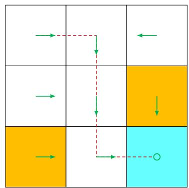
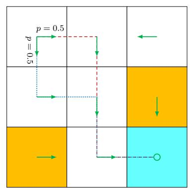

# 3.4 Solving an optimal policy from the BOE

With the preparation in the last section, we are ready to solve the BOE to obtain the optimal state value $v^{*}$ and an optimal policy $\pi^{*}$ .

$\diamond$ Solving $v^{*}$ : If $v^{*}$ is a solution of the BOE, then it satisfies

$$
v ^ {*} = \max _ {\pi \in \Pi} (r _ {\pi} + \gamma P _ {\pi} v ^ {*}).
$$

Clearly, $v^{*}$ is a fixed point because $v^{*} = f(v^{*})$ . Then, the contraction mapping theorem suggests the following results.

Theorem 3.3 (Existence, uniqueness, and algorithm). For the BOE $v = f(v) = \max_{\pi \in \Pi} (r_{\pi} + \gamma P_{\pi}v)$ , there always exists a unique solution $v^{*}$ , which can be solved iteratively by

$$
v _ {k + 1} = f (v _ {k}) = \max _ {\pi \in \Pi} (r _ {\pi} + \gamma P _ {\pi} v _ {k}), \quad k = 0, 1, 2, \ldots .
$$

The value of $v_{k}$ converges to $v^{*}$ exponentially fast as $k \to \infty$ given any initial guess $v_{0}$ .

The proof of this theorem directly follows from the contraction mapping theorem since $f(v)$ is a contraction mapping. This theorem is important because it answers some fundamental questions.

- Existence of $v^{*}$ : The solution of the BOE always exists.   
- Uniqueness of $v^{*}$ : The solution $v^{*}$ is always unique.   
- Algorithm for solving $v^{*}$ : The value of $v^{*}$ can be solved by the iterative algorithm suggested by Theorem 3.3. This iterative algorithm has a specific name called value iteration. Its implementation will be introduced in detail in Chapter 4. We mainly focus on the fundamental properties of the BOE in the present chapter.

$\diamond$ Solving $\pi^{*}$ : Once the value of $v^{*}$ has been obtained, we can easily obtain $\pi^{*}$ by solving

$$
\pi^ {*} = \arg \max  _ {\pi \in \Pi} (r _ {\pi} + \gamma P _ {\pi} v ^ {*}). \tag {3.6}
$$

The value of $\pi^{*}$ will be given in Theorem 3.5. Substituting (3.6) into the BOE yields

$$
v ^ {*} = r _ {\pi^ {*}} + \gamma P _ {\pi^ {*}} v ^ {*}.
$$

Therefore, $v^{*} = v_{\pi^{*}}$ is the state value of $\pi^{*}$ , and the BOE is a special Bellman equation whose corresponding policy is $\pi^{*}$ .

At this point, although we can solve $v^{*}$ and $\pi^{*}$ , it is still unclear whether the solution is optimal. The following theorem reveals the optimality of the solution.

Theorem 3.4 (Optimality of $v^{*}$ and $\pi^{*}$ ). The solution $v^{*}$ is the optimal state value, and $\pi^{*}$ is an optimal policy. That is, for any policy $\pi$ , it holds that

$$
v ^ {*} = v _ {\pi^ {*}} \geq v _ {\pi},
$$

where $v_{\pi}$ is the state value of $\pi$ , and $\geq$ is an elementwise comparison.

Now, it is clear why we must study the BOE: its solution corresponds to optimal state values and optimal policies. The proof of the above theorem is given in the following box.

# Box 3.3: Proof of Theorem 3.4

For any policy $\pi$ , it holds that

$$
v _ {\pi} = r _ {\pi} + \gamma P _ {\pi} v _ {\pi}.
$$

Since

$$
v ^ {*} = \max _ {\pi} (r _ {\pi} + \gamma P _ {\pi} v ^ {*}) = r _ {\pi^ {*}} + \gamma P _ {\pi^ {*}} v ^ {*} \geq r _ {\pi} + \gamma P _ {\pi} v ^ {*},
$$

we have

$$
v ^ {*} - v _ {\pi} \geq (r _ {\pi} + \gamma P _ {\pi} v ^ {*}) - (r _ {\pi} + \gamma P _ {\pi} v _ {\pi}) = \gamma P _ {\pi} (v ^ {*} - v _ {\pi}).
$$

Repeatedly applying the above inequality gives $v^{*} - v_{\pi} \geq \gamma P_{\pi}(v^{*} - v_{\pi}) \geq \gamma^{2}P_{\pi}^{2}(v^{*} - v_{\pi}) \geq \dots \geq \gamma^{n}P_{\pi}^{n}(v^{*} - v_{\pi})$ . It follows that

$$
v ^ {*} - v _ {\pi} \geq \lim _ {n \to \infty} \gamma^ {n} P _ {\pi} ^ {n} (v ^ {*} - v _ {\pi}) = 0,
$$

where the last equality is true because $\gamma < 1$ and $P_{\pi}^{n}$ is a nonnegative matrix with all its elements less than or equal to 1 (because $P_{\pi}^{n}\mathbf{1} = \mathbf{1}$ ). Therefore, $v^{*} \geq v_{\pi}$ for any $\pi$ .

We next examine $\pi^{*}$ in (3.6) more closely. In particular, the following theorem shows that there always exists a deterministic greedy policy that is optimal.

Theorem 3.5 (Greedy optimal policy). For any $s \in S$ , the deterministic greedy policy

$$
\pi^ {*} (a | s) = \left\{ \begin{array}{l l} 1, & a = a ^ {*} (s), \\ 0, & a \neq a ^ {*} (s), \end{array} \right. \tag {3.7}
$$

is an optimal policy for solving the BOE. Here,

$$
a ^ {*} (s) = \arg \max  _ {a} q ^ {*} (a, s),
$$

where

$$
q ^ {*} (s, a) \doteq \sum_ {r \in \mathcal {R}} p (r | s, a) r + \gamma \sum_ {s ^ {\prime} \in \mathcal {S}} p (s ^ {\prime} | s, a) v ^ {*} (s ^ {\prime}).
$$

# Box 3.4: Proof of Theorem 3.5

While the matrix-vector form of the optimal policy is $\pi^{*} = \arg \max_{\pi}(r_{\pi} + \gamma P_{\pi}v^{*})$ , its elementwise form is

$$
\pi^ {*} (s) = \arg \max _ {\pi \in \Pi} \sum_ {a \in \mathcal {A}} \pi (a | s) \underbrace {\left(\sum_ {r \in \mathcal {R}} p (r | s , a) r + \gamma \sum_ {s ^ {\prime} \in \mathcal {S}} p (s ^ {\prime} | s , a) v ^ {*} (s ^ {\prime})\right)} _ {q ^ {*} (s, a)}, \quad s \in \mathcal {S}.
$$

It is clear that $\sum_{a\in \mathcal{A}}\pi (a|s)q^{*}(s,a)$ is maximized if $\pi (s)$ selects the action with the greatest $q^{*}(s,a)$ .

The policy in (3.7) is called greedy because it seeks the actions with the greatest $q^{*}(s,a)$ . Finally, we discuss two important properties of $\pi^{*}$ .

Uniqueness of optimal policies: Although the value of $v^{*}$ is unique, the optimal policy that corresponds to $v^{*}$ may not be unique. This can be easily verified by counterexamples. For example, the two policies shown in Figure 3.3 are both optimal.   
$\diamond$ Stochasticity of optimal policies: An optimal policy can be either stochastic or deterministic, as demonstrated in Figure 3.3. However, it is certain that there always exists a deterministic optimal policy according to Theorem 3.5.

  
Figure 3.3: Examples for demonstrating that optimal policies may not be unique. The two policies are different but are both optimal.
