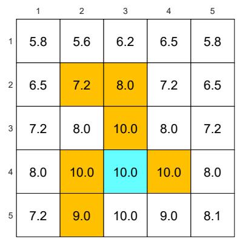
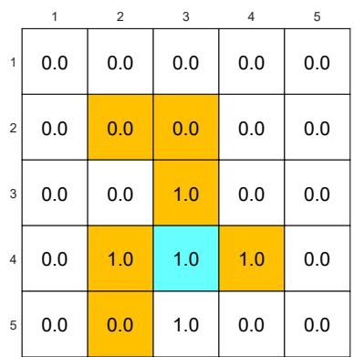
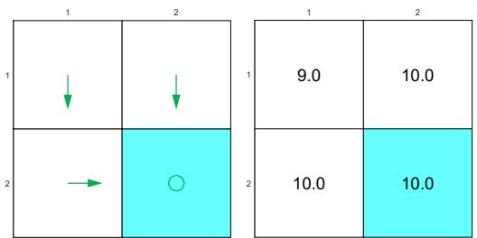
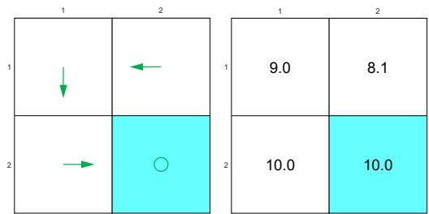

# 3.5 Factors that influence optimal policies

The BOE is a powerful tool for analyzing optimal policies. We next apply the BOE to study what factors can influence optimal policies. This question can be easily answered by observing the elementwise expression of the BOE:

$$
v (s) = \max _ {\pi (s) \in \Pi (s)} \sum_ {a \in \mathcal {A}} \pi (a | s) \left(\sum_ {r \in \mathcal {R}} p (r | s, a) r + \gamma \sum_ {s ^ {\prime} \in \mathcal {S}} p (s ^ {\prime} | s, a) v (s ^ {\prime})\right), \quad s \in \mathcal {S}.
$$

The optimal state value and optimal policy are determined by the following parameters: 1) the immediate reward $r$ , 2) the discount rate $\gamma$ , and 3) the system model $p(s'|s,a), p(r|s,a)$ . While the system model is fixed, we next discuss how the optimal policy varies when we change the values of $r$ and $\gamma$ . All the optimal policies presented in this section can be obtained via the algorithm in Theorem 3.3. The implementation details of the algorithm will be given in Chapter 4. The present chapter mainly focuses on the fundamental properties of optimal policies.

# A baseline example

Consider the example in Figure 3.4. The reward settings are $r_{\mathrm{boundary}} = r_{\mathrm{forbidden}} = -1$ and $r_{\mathrm{target}} = 1$ . In addition, the agent receives a reward of $r_{\mathrm{other}} = 0$ for every movement step. The discount rate is selected as $\gamma = 0.9$ .

With the above parameters, the optimal policy and optimal state values are given in Figure 3.4(a). It is interesting that the agent is not afraid of passing through forbidden areas to reach the target area. More specifically, starting from the state at $(\text{row} = 4, \text{column} = 1)$ , the agent has two options for reaching the target area. The first option is to avoid all the forbidden areas and travel a long distance to the target area. The second option is to pass through forbidden areas. Although the agent obtains negative rewards when entering forbidden areas, the cumulative reward of the second trajectory is greater than that of the first trajectory. Therefore, the optimal policy is far-sighted due to the relatively large value of $\gamma$ .

# Impact of the discount rate

If we change the discount rate from $\gamma = 0.9$ to $\gamma = 0.5$ and keep other parameters unchanged, the optimal policy becomes the one shown in Figure 3.4(b). It is interesting that the agent does not dare to take risks anymore. Instead, it would travel a long distance to reach the target while avoiding all the forbidden areas. This is because the optimal policy becomes short-sighted due to the relatively small value of $\gamma$ .

In the extreme case where $\gamma = 0$ , the corresponding optimal policy is shown in Figure 3.4(c). In this case, the agent is not able to reach the target area. This is

  
(a) Baseline example: $r_{\mathrm{boundary}} = r_{\mathrm{forbidden}} = -1$ , $r_{\mathrm{target}} = 1$ , $\gamma = 0.9$

  
(b) The discount rate is changed to $\gamma = 0.5$ . The other parameters are the same as those in (a).

  
(c) The discount rate is changed to $\gamma = 0$ . The other parameters are the same as those in (a).

  
(d) $r_{\mathrm{forbidden}}$ is changed from $-1$ to $-10$ . The other parameters are the same as those in (a).   
Figure 3.4: The optimal policies and optimal state values given different parameter values.

because the optimal policy for each state is extremely short-sighted and merely selects the action with the greatest immediate reward instead of the greatest total reward.

In addition, the spatial distribution of the state values exhibits an interesting pattern: the states close to the target have greater state values, whereas those far away have lower values. This pattern can be observed from all the examples shown in Figure 3.4. It can be explained by using the discount rate: if a state must travel along a longer trajectory to reach the target, its state value is smaller due to the discount rate.

# Impact of the reward values

If we want to strictly prohibit the agent from entering any forbidden area, we can increase the punishment received for doing so. For instance, if $r_{\text{forbidden}}$ is changed from -1 to -10, the resulting optimal policy can avoid all the forbidden areas (see Figure 3.4(d)).

However, changing the rewards does not always lead to different optimal policies. One important fact is that optimal policies are invariant to affine transformations of the rewards. In other words, if we scale all the rewards or add the same value to all the rewards, the optimal policy remains the same.

Theorem 3.6 (Optimal policy invariance). Consider a Markov decision process with $v^{*} \in \mathbb{R}^{|S|}$ as the optimal state value satisfying $v^{*} = \max_{\pi \in \Pi} (r_{\pi} + \gamma P_{\pi} v^{*})$ . If every reward $r \in \mathcal{R}$ is changed by an affine transformation to $\alpha r + \beta$ , where $\alpha, \beta \in \mathbb{R}$ and $\alpha > 0$ , then the corresponding optimal state value $v'$ is also an affine transformation of $v^{*}$ :

$$
v ^ {\prime} = \alpha v ^ {*} + \frac {\beta}{1 - \gamma} \mathbf {1}, \tag {3.8}
$$

where $\gamma \in (0,1)$ is the discount rate and $\mathbf{1} = [1,\dots ,1]^T$ . Consequently, the optimal policy derived from $v^{\prime}$ is invariant to the affine transformation of the reward values.

# Box 3.5: Proof of Theorem 3.6

For any policy $\pi$ , define $r_{\pi} = [\ldots, r_{\pi}(s), \ldots]^T$ where

$$
r _ {\pi} (s) = \sum_ {a \in \mathcal {A}} \pi (a | s) \sum_ {r \in \mathcal {R}} p (r | s, a) r, \quad s \in \mathcal {S}.
$$

If $r \to \alpha r + \beta$ , then $r_{\pi}(s) \to \alpha r_{\pi}(s) + \beta$ and hence $r_{\pi} \to \alpha r_{\pi} + \beta \mathbf{1}$ , where $\mathbf{1} = [1, \ldots, 1]^T$ . In this case, the BOE becomes

$$
v ^ {\prime} = \max  _ {\pi \in \Pi} \left(\alpha r _ {\pi} + \beta \mathbf {1} + \gamma P _ {\pi} v ^ {\prime}\right). \tag {3.9}
$$

We next solve the new BOE in (3.9) by showing that $v' = \alpha v^* + c\mathbf{1}$ with $c = \beta/(1 - \gamma)$ is a solution of (3.9). In particular, substituting $v' = \alpha v^* + c\mathbf{1}$ into (3.9) gives

$$
\alpha v ^ {*} + c \mathbf {1} = \max  _ {\pi \in \Pi} (\alpha r _ {\pi} + \beta \mathbf {1} + \gamma P _ {\pi} (\alpha v ^ {*} + c \mathbf {1})) = \max  _ {\pi \in \Pi} (\alpha r _ {\pi} + \beta \mathbf {1} + \alpha \gamma P _ {\pi} v ^ {*} + c \gamma \mathbf {1}),
$$

where the last equality is due to the fact that $P_{\pi} \mathbf{1} = \mathbf{1}$ . The above equation can be reorganized as

$$
\alpha v ^ {*} = \max  _ {\pi \in \Pi} \left(\alpha r _ {\pi} + \alpha \gamma P _ {\pi} v ^ {*}\right) + \beta \mathbf {1} + c \gamma \mathbf {1} - c \mathbf {1},
$$

which is equivalent to

$$
\beta \mathbf {1} + c \gamma \mathbf {1} - c \mathbf {1} = 0.
$$

Since $c = \beta / (1 - \gamma)$ , the above equation is valid and hence $v' = \alpha v^* + c\mathbf{1}$ is the solution of (3.9). Since (3.9) is the BOE, $v'$ is also the unique solution. Finally, since $v'$ is an affine transformation of $v^*$ , the relative relationships between the action values remain the same. Hence, the greedy optimal policy derived from $v'$ is the same as that from $v^*$ : $\arg \max_{\pi \in \Pi}(r_\pi + \gamma P_\pi v')$ is the same as $\arg \max_{\pi}(r_\pi + \gamma P_\pi v^*)$ .

Readers may refer to [9] for a further discussion on the conditions under which modifications to the reward values preserve the optimal policy.

# Avoiding meaningless detours

In the reward setting, the agent receives a reward of $r_{\text{other}} = 0$ for every movement step (unless it enters a forbidden area or the target area or attempts to go beyond the boundary). Since a zero reward is not a punishment, would the optimal policy take meaningless detours before reaching the target? Should we set $r_{\text{other}}$ to be negative to encourage the agent to reach the target as quickly as possible?

  
(a) Optimal policy

  
(b) Non-optimal policy   
Figure 3.5: Examples illustrating that optimal policies do not take meaningless detours due to the discount rate.

Consider the examples in Figure 3.5, where the bottom-right cell is the target area

to reach. The two policies here are the same except for state $s_2$ . By the policy in Figure 3.5(a), the agent moves downward at $s_2$ and the resulting trajectory is $s_2 \rightarrow s_4$ . By the policy in Figure 3.5(b), the agent moves leftward and the resulting trajectory is $s_2 \rightarrow s_1 \rightarrow s_3 \rightarrow s_4$ .

It is notable that the second policy takes a detour before reaching the target area. If we merely consider the immediate rewards, taking this detour does not matter because no negative immediate rewards will be obtained. However, if we consider the discounted return, then this detour matters. In particular, for the first policy, the discounted return is

$$
\mathrm {r e t u r n} = 1 + \gamma 1 + \gamma^ {2} 1 + \dots = 1 / (1 - \gamma) = 1 0.
$$

As a comparison, the discounted return for the second policy is

$$
\mathrm {r e t u r n} = 0 + \gamma 0 + \gamma^ {2} 1 + \gamma^ {3} 1 + \dots = \gamma^ {2} / (1 - \gamma) = 8. 1.
$$

It is clear that the shorter the trajectory is, the greater the return is. Therefore, although the immediate reward of every step does not encourage the agent to approach the target as quickly as possible, the discount rate does encourage it to do so.

A misunderstanding that beginners may have is that adding a negative reward (e.g., -1) on top of the rewards obtained for every movement is necessary to encourage the agent to reach the target as quickly as possible. This is a misunderstanding because adding the same reward on top of all rewards is an affine transformation, which preserves the optimal policy. Moreover, optimal policies do not take meaningless detours due to the discount rate, even though a detour may not receive any immediate negative rewards.
