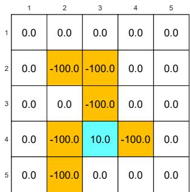
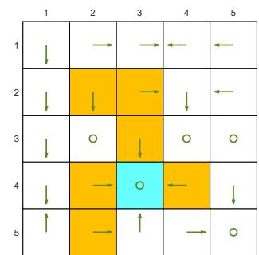
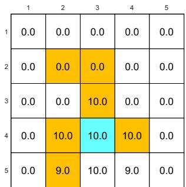
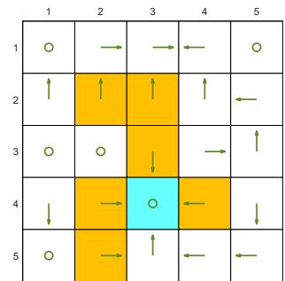
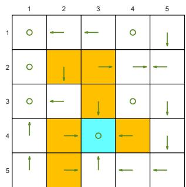
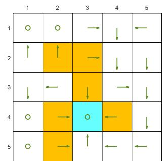
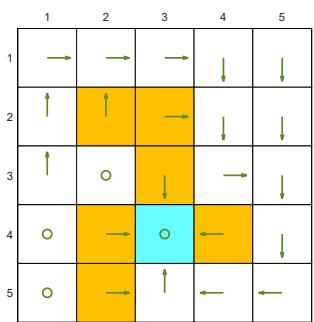

# 4.2 Policy iteration

This section presents another important algorithm: policy iteration. Unlike value iteration, policy iteration is not for directly solving the Bellman optimality equation. However, it has an intimate relationship with value iteration, as shown later. Moreover, the idea of policy iteration is very important since it is widely utilized in reinforcement learning algorithms.

# 4.2.1 Algorithm analysis

Policy iteration is an iterative algorithm. Each iteration has two steps.

The first is a policy evaluation step. As its name suggests, this step evaluates a given policy by calculating the corresponding state value. That is to solve the following Bellman equation:

$$
v _ {\pi_ {k}} = r _ {\pi_ {k}} + \gamma P _ {\pi_ {k}} v _ {\pi_ {k}}, \tag {4.3}
$$

where $\pi_k$ is the policy obtained in the last iteration and $v_{\pi_k}$ is the state value to be calculated. The values of $r_{\pi_k}$ and $P_{\pi_k}$ can be obtained from the system model.

The second is a policy improvement step. As its name suggests, this step is used to improve the policy. In particular, once $v_{\pi_k}$ has been calculated in the first step, a new policy $\pi_{k+1}$ can be obtained as

$$
\pi_ {k + 1} = \arg \max _ {\pi} (r _ {\pi} + \gamma P _ {\pi} v _ {\pi_ {k}}).
$$

Three questions naturally follow the above description of the algorithm.

In the policy evaluation step, how to solve the state value $v_{\pi_k}$ ?   
In the policy improvement step, why is the new policy $\pi_{k + 1}$ better than $\pi_k$ ?   
$\diamond$ Why can this algorithm finally converge to an optimal policy?

We next answer these questions one by one.

# In the policy evaluation step, how to calculate $v_{\pi_k}$ ?

We introduced two methods in Chapter 2 for solving the Bellman equation in (4.3). We next revisit the two methods briefly. The first method is a closed-form solution:

$v_{\pi_k} = (I - \gamma P_{\pi_k})^{-1}r_{\pi_k}$ . This closed-form solution is useful for theoretical analysis purposes, but it is inefficient to implement since it requires other numerical algorithms to compute the matrix inverse. The second method is an iterative algorithm that can be easily implemented:

$$
v _ {\pi_ {k}} ^ {(j + 1)} = r _ {\pi_ {k}} + \gamma P _ {\pi_ {k}} v _ {\pi_ {k}} ^ {(j)}, \quad j = 0, 1, 2, \dots \tag {4.4}
$$

where $v_{\pi_k}^{(j)}$ denotes the $j$ th estimate of $v_{\pi_k}$ . Starting from any initial guess $v_{\pi_k}^{(0)}$ , it is ensured that $v_{\pi_k}^{(j)} \to v_{\pi_k}$ as $j \to \infty$ . Details can be found in Section 2.7.

Interestingly, policy iteration is an iterative algorithm with another iterative algorithm (4.4) embedded in the policy evaluation step. In theory, this embedded iterative algorithm requires an infinite number of steps (that is, $j \to \infty$ ) to converge to the true state value $v_{\pi_k}$ . This is, however, impossible to realize. In practice, the iterative process terminates when a certain criterion is satisfied. For example, the termination criterion can be that $\| v_{\pi_k}^{(j + 1)} - v_{\pi_k}^{(j)} \|$ is less than a prespecified threshold or that $j$ exceeds a prespecified value. If we do not run an infinite number of iterations, we can only obtain an imprecise value of $v_{\pi_k}$ , which will be used in the subsequent policy improvement step. Would this cause problems? The answer is no. The reason will become clear when we introduce the truncated policy iteration algorithm later in Section 4.3.

In the policy improvement step, why is $\pi_{k + 1}$ better than $\pi_k$ ?

The policy improvement step can improve the given policy, as shown below.

Lemma 4.1 (Policy improvement). If $\pi_{k + 1} = \arg \max_{\pi}(r_{\pi} + \gamma P_{\pi}v_{\pi_k})$ , then $v_{\pi_{k + 1}}\geq v_{\pi_k}$

Here, $v_{\pi_{k+1}} \geq v_{\pi_k}$ means that $v_{\pi_{k+1}}(s) \geq v_{\pi_k}(s)$ for all $s$ . The proof of this lemma is given in Box 4.1.

# Box 4.1: Proof of Lemma 4.1

Since $v_{\pi_{k+1}}$ and $v_{\pi_k}$ are state values, they satisfy the Bellman equations:

$$
v _ {\pi_ {k + 1}} = r _ {\pi_ {k + 1}} + \gamma P _ {\pi_ {k + 1}} v _ {\pi_ {k + 1}},
$$

$$
v _ {\pi_ {k}} = r _ {\pi_ {k}} + \gamma P _ {\pi_ {k}} v _ {\pi_ {k}}.
$$

Since $\pi_{k + 1} = \arg \max_{\pi}(r_{\pi} + \gamma P_{\pi}v_{\pi_k})$ , we know that

$$
r _ {\pi_ {k + 1}} + \gamma P _ {\pi_ {k + 1}} v _ {\pi_ {k}} \geq r _ {\pi_ {k}} + \gamma P _ {\pi_ {k}} v _ {\pi_ {k}}.
$$

It then follows that

$$
\begin{array}{l} v _ {\pi_ {k}} - v _ {\pi_ {k + 1}} = \left(r _ {\pi_ {k}} + \gamma P _ {\pi_ {k}} v _ {\pi_ {k}}\right) - \left(r _ {\pi_ {k + 1}} + \gamma P _ {\pi_ {k + 1}} v _ {\pi_ {k + 1}}\right) \\ \leq \left(r _ {\pi_ {k + 1}} + \gamma P _ {\pi_ {k + 1}} v _ {\pi_ {k}}\right) - \left(r _ {\pi_ {k + 1}} + \gamma P _ {\pi_ {k + 1}} v _ {\pi_ {k + 1}}\right) \\ \leq \gamma P _ {\pi_ {k + 1}} \left(v _ {\pi_ {k}} - v _ {\pi_ {k + 1}}\right). \\ \end{array}
$$

Therefore,

$$
\begin{array}{l} v _ {\pi_ {k}} - v _ {\pi_ {k + 1}} \leq \gamma^ {2} P _ {\pi_ {k + 1}} ^ {2} (v _ {\pi_ {k}} - v _ {\pi_ {k + 1}}) \leq \ldots \leq \gamma^ {n} P _ {\pi_ {k + 1}} ^ {n} (v _ {\pi_ {k}} - v _ {\pi_ {k + 1}}) \\ \leq \lim _ {n \rightarrow \infty} \gamma^ {n} P _ {\pi_ {k + 1}} ^ {n} (v _ {\pi_ {k}} - v _ {\pi_ {k + 1}}) = 0. \\ \end{array}
$$

The limit is due to the facts that $\gamma^n\to 0$ as $n\to \infty$ and $P_{\pi_{k + 1}}^n$ is a nonnegative stochastic matrix for any $n$ . Here, a stochastic matrix refers to a nonnegative matrix whose row sums are equal to one for all rows.

# Why can the policy iteration algorithm eventually find an optimal policy?

The policy iteration algorithm generates two sequences. The first is a sequence of policies: $\{\pi_0,\pi_1,\ldots ,\pi_k,\ldots \}$ . The second is a sequence of state values: $\{v_{\pi_0},v_{\pi_1},\ldots ,v_{\pi_k},\ldots \}$ . Suppose that $v^{*}$ is the optimal state value. Then, $v_{\pi_k}\leq v^*$ for all $k$ . Since the policies are continuously improved according to Lemma 4.1, we know that

$$
v _ {\pi_ {0}} \leq v _ {\pi_ {1}} \leq v _ {\pi_ {2}} \leq \dots \leq v _ {\pi_ {k}} \leq \dots \leq v ^ {*}.
$$

Since $v_{\pi_k}$ is nondecreasing and always bounded from above by $v^*$ , it follows from the monotone convergence theorem [12] (Appendix C) that $v_{\pi_k}$ converges to a constant value, denoted as $v_\infty$ , when $k \to \infty$ . The following analysis shows that $v_\infty = v^*$ .

Theorem 4.1 (Convergence of policy iteration). The state value sequence $\{v_{\pi_k}\}_{k=0}^{\infty}$ generated by the policy iteration algorithm converges to the optimal state value $v^*$ . As a result, the policy sequence $\{\pi_k\}_{k=0}^{\infty}$ converges to an optimal policy.

The proof of this theorem is given in Box 4.2. The proof not only shows the convergence of the policy iteration algorithm but also reveals the relationship between the policy iteration and value iteration algorithms. Loosely speaking, if both algorithms start from the same initial guess, policy iteration will converge faster than value iteration due to the additional iterations embedded in the policy evaluation step. This point will become clearer when we introduce the truncated policy iteration algorithm in Section 4.3.

# Box 4.2: Proof of Theorem 4.1

The idea of the proof is to show that the policy iteration algorithm converges faster than the value iteration algorithm.

In particular, to prove the convergence of $\{v_{\pi_k}\}_{k = 0}^{\infty}$ , we introduce another sequence $\{v_k\}_{k = 0}^{\infty}$ generated by

$$
v _ {k + 1} = f (v _ {k}) = \max  _ {\pi} (r _ {\pi} + \gamma P _ {\pi} v _ {k}).
$$

This iterative algorithm is exactly the value iteration algorithm. We already know that $v_{k}$ converges to $v^{*}$ when given any initial value $v_{0}$ .

For $k = 0$ , we can always find a $v_{0}$ such that $v_{\pi_0} \geq v_0$ for any $\pi_0$ .

We next show that $v_{k} \leq v_{\pi_{k}} \leq v^{*}$ for all $k$ by induction.

For $k \geq 0$ , suppose that $v_{\pi_k} \geq v_k$ .

For $k + 1$ , we have

$$
\begin{array}{l} v _ {\pi_ {k + 1}} - v _ {k + 1} = \left(r _ {\pi_ {k + 1}} + \gamma P _ {\pi_ {k + 1}} v _ {\pi_ {k + 1}}\right) - \max  _ {\pi} \left(r _ {\pi} + \gamma P _ {\pi} v _ {k}\right) \\ \geq \left(r _ {\pi_ {k + 1}} + \gamma P _ {\pi_ {k + 1}} v _ {\pi_ {k}}\right) - \max  _ {\pi} \left(r _ {\pi} + \gamma P _ {\pi} v _ {k}\right) \\ (b e c a u s e v _ {\pi_ {k + 1}} \geq v _ {\pi_ {k}} b y L e m m a 4. 1 a n d P _ {\pi_ {k + 1}} \geq 0) \\ = \left(r _ {\pi_ {k + 1}} + \gamma P _ {\pi_ {k + 1}} v _ {\pi_ {k}}\right) - \left(r _ {\pi_ {k} ^ {\prime}} + \gamma P _ {\pi_ {k} ^ {\prime}} v _ {k}\right) \\ \left(\text {s u p p o s e} \pi_ {k} ^ {\prime} = \arg \max  _ {\pi} \left(r _ {\pi} + \gamma P _ {\pi} v _ {k}\right)\right) \\ \geq \left(r _ {\pi_ {k} ^ {\prime}} + \gamma P _ {\pi_ {k} ^ {\prime}} v _ {\pi_ {k}}\right) - \left(r _ {\pi_ {k} ^ {\prime}} + \gamma P _ {\pi_ {k} ^ {\prime}} v _ {k}\right) \\ \left(\text {b e c a u s e} \pi_ {k + 1} = \arg \max  _ {\pi} \left(r _ {\pi} + \gamma P _ {\pi} v _ {\pi_ {k}}\right)\right) \\ = \gamma P _ {\pi_ {k} ^ {\prime}} \left(v _ {\pi_ {k}} - v _ {k}\right). \\ \end{array}
$$

Since $v_{\pi_k} - v_k \geq 0$ and $P_{\pi_k'}$ is nonnegative, we have $P_{\pi_k'}(v_{\pi_k} - v_k) \geq 0$ and hence $v_{\pi_{k+1}} - v_{k+1} \geq 0$ .

Therefore, we can show by induction that $v_{k} \leq v_{\pi_{k}} \leq v^{*}$ for any $k \geq 0$ . Since $v_{k}$ converges to $v^{*}$ , $v_{\pi_k}$ also converges to $v^{*}$ .

# 4.2.2 Elementwise form and implementation

To implement the policy iteration algorithm, we need to study its elementwise form.

$\diamond$ First, the policy evaluation step solves $v_{\pi_k}$ from $v_{\pi_k} = r_{\pi_k} + \gamma P_{\pi_k} v_{\pi_k}$ by using the

# Algorithm 4.2: Policy iteration algorithm

Initialization: The system model, $p(r|s,a)$ and $p(s'|s,a)$ for all $(s,a)$ , is known. Initial guess $\pi_0$ .

Goal: Search for the optimal state value and an optimal policy.

While $v_{\pi_k}$ has not converged, for the $k$ th iteration, do

Policy evaluation:

Initialization: an arbitrary initial guess $v_{\pi_k}^{(0)}$

While $v_{\pi_k}^{(j)}$ has not converged, for the $j$ th iteration, do

For every state $s \in S$ , do

$$
v _ {\pi_ {k}} ^ {(j + 1)} (s) = \sum_ {a} \pi_ {k} (a | s) \left[ \sum_ {r} p (r | s, a) r + \gamma \sum_ {s ^ {\prime}} p \left(s ^ {\prime} \mid s, a\right) v _ {\pi_ {k}} ^ {(j)} \left(s ^ {\prime}\right) \right]
$$

Policy improvement:

For every state $s \in S$ , do

For every action $a \in \mathcal{A}$ , do

$$
q _ {\pi_ {k}} (s, a) = \sum_ {r} p (r | s, a) r + \gamma \sum_ {s ^ {\prime}} p \left(s ^ {\prime} \mid s, a\right) v _ {\pi_ {k}} \left(s ^ {\prime}\right)
$$

$a_{k}^{*}(s) = \arg \max_{a}q_{\pi_{k}}(s,a)$

$$
\pi_ {k + 1} (a | s) = 1 \text {i f} a = a _ {k} ^ {*}, \text {a n d} \pi_ {k + 1} (a | s) = 0 \text {o t h e r w i s e}
$$

iterative algorithm in (4.4). The elementwise form of this algorithm is

$$
v _ {\pi_ {k}} ^ {(j + 1)} (s) = \sum_ {a} \pi_ {k} (a | s) \left(\sum_ {r} p (r | s, a) r + \gamma \sum_ {s ^ {\prime}} p \left(s ^ {\prime} \mid s, a\right) v _ {\pi_ {k}} ^ {(j)} \left(s ^ {\prime}\right)\right), \quad s \in \mathcal {S},
$$

where $j = 0,1,2,\ldots$

$\diamond$ Second, the policy improvement step solves $\pi_{k + 1} = \arg \max_{\pi}(r_{\pi} + \gamma P_{\pi}v_{\pi_k})$ . The elementwise form of this equation is

$$
\pi_ {k + 1} (s) = \arg \max _ {\pi} \sum_ {a} \pi (a | s) \underbrace {\left(\sum_ {r} p (r | s , a) r + \gamma \sum_ {s ^ {\prime}} p (s ^ {\prime} | s , a) v _ {\pi_ {k}} (s ^ {\prime})\right)} _ {q _ {\pi_ {k}} (s, a)}, \quad s \in \mathcal {S},
$$

where $q_{\pi_k}(s,a)$ is the action value under policy $\pi_k$ . Let $a_k^*(s) = \arg \max_a q_{\pi_k}(s,a)$ . Then, the greedy optimal policy is

$$
\pi_ {k + 1} (a | s) = \left\{ \begin{array}{l l} 1, & a = a _ {k} ^ {*} (s), \\ 0, & a \neq a _ {k} ^ {*} (s). \end{array} \right.
$$

The implementation details are summarized in Algorithm 4.2.

# 4.2.3 Illustrative examples

# A simple example

Consider a simple example shown in Figure 4.3. There are two states with three possible actions: $\mathcal{A} = \{a_{\ell}, a_0, a_r\}$ . The three actions represent moving leftward, staying unchanged, and moving rightward. The reward settings are $r_{\mathrm{boundary}} = -1$ and $r_{\mathrm{target}} = 1$ . The discount rate is $\gamma = 0.9$ .

  
(a)

  
(b)   
Figure 4.3: An example for illustrating the implementation of the policy iteration algorithm.

We next present the implementation of the policy iteration algorithm in a step-by-step manner. When $k = 0$ , we start with the initial policy shown in Figure 4.3(a). This policy is not good because it does not move toward the target area. We next show how to apply the policy iteration algorithm to obtain an optimal policy.

First, in the policy evaluation step, we need to solve the Bellman equation:

$$
v _ {\pi_ {0}} (s _ {1}) = - 1 + \gamma v _ {\pi_ {0}} (s _ {1}),
$$

$$
v _ {\pi_ {0}} (s _ {2}) = 0 + \gamma v _ {\pi_ {0}} (s _ {1}).
$$

Since the equation is simple, it can be manually solved that

$$
v _ {\pi_ {0}} (s _ {1}) = - 1 0, \quad v _ {\pi_ {0}} (s _ {2}) = - 9.
$$

In practice, the equation can be solved by the iterative algorithm in (4.4). For example, select the initial state values as $v_{\pi_0}^{(0)}(s_1) = v_{\pi_0}^{(0)}(s_2) = 0$ . It follows from (4.3) that

$$
\left\{ \begin{array}{l l} v _ {\pi_ {0}} ^ {(1)} (s _ {1}) = - 1 + \gamma v _ {\pi_ {0}} ^ {(0)} (s _ {1}) = - 1, \\ v _ {\pi_ {0}} ^ {(1)} (s _ {2}) = 0 + \gamma v _ {\pi_ {0}} ^ {(0)} (s _ {1}) = 0, \end{array} \right.
$$

$$
\left\{ \begin{array}{l} v _ {\pi_ {0}} ^ {(2)} (s _ {1}) = - 1 + \gamma v _ {\pi_ {0}} ^ {(1)} (s _ {1}) = - 1. 9, \\ v _ {\pi_ {0}} ^ {(2)} (s _ {2}) = 0 + \gamma v _ {\pi_ {0}} ^ {(1)} (s _ {1}) = - 0. 9, \end{array} \right.
$$

$$
\left\{ \begin{array}{l} v _ {\pi_ {0}} ^ {(3)} (s _ {1}) = - 1 + \gamma v _ {\pi_ {0}} ^ {(2)} (s _ {1}) = - 2. 7 1, \\ v _ {\pi_ {0}} ^ {(3)} (s _ {2}) = 0 + \gamma v _ {\pi_ {0}} ^ {(2)} (s _ {1}) = - 1. 7 1, \end{array} \right.
$$

：

With more iterations, we can see the trend: $v_{\pi_0}^{(j)}(s_1) \to v_{\pi_0}(s_1) = -10$ and $v_{\pi_0}^{(j)}(s_2) \to v_{\pi_0}(s_2) = -9$ as $j$ increases.

$\diamond$ Second, in the policy improvement step, the key is to calculate $q_{\pi_0}(s,a)$ for each state-action pair. The following q-table can be used to demonstrate such a process:

Table 4.4: The expression of $q_{\pi_k}(s,a)$ for the example in Figure 4.3.   

<table><tr><td>qπk(s,a)</td><td>aℓ</td><td>a0</td><td>ar</td></tr><tr><td>s1</td><td>-1 + γvπk(s1)</td><td>0 + γvπk(s1)</td><td>1 + γvπk(s2)</td></tr><tr><td>s2</td><td>0 + γvπk(s1)</td><td>1 + γvπk(s2)</td><td>-1 + γvπk(s2)</td></tr></table>

Substituting $v_{\pi_0}(s_1) = -10, v_{\pi_0}(s_2) = -9$ obtained in the previous policy evaluation step into Table 4.4 yields Table 4.5.

Table 4.5: The value of ${q}_{{\pi }_{k}}\left( {s,a}\right)$ when $k = 0$ .   

<table><tr><td>qπ0(s,a)</td><td>aℓ</td><td>a0</td><td>ar</td></tr><tr><td>s1</td><td>-10</td><td>-9</td><td>-7.1</td></tr><tr><td>s2</td><td>-9</td><td>-7.1</td><td>-9.1</td></tr></table>

By seeking the greatest value of $q_{\pi_0}$ , the improved policy $\pi_1$ can be obtained as

$$
\pi_ {1} \left(a _ {r} | s _ {1}\right) = 1, \quad \pi_ {1} \left(a _ {0} | s _ {2}\right) = 1.
$$

This policy is illustrated in Figure 4.3(b). It is clear that this policy is optimal.

The above process shows that a single iteration is sufficient for finding the optimal policy in this simple example. More iterations are required for more complex examples.

# A more complicated example

We next demonstrate the policy iteration algorithm using a more complicated example shown in Figure 4.4. The reward settings are $r_{\mathrm{boundary}} = -1$ , $r_{\mathrm{forbidden}} = -10$ , and $r_{\mathrm{target}} = 1$ . The discount rate is $\gamma = 0.9$ . The policy iteration algorithm can converge to the optimal policy (Figure 4.4(h)) when starting from a random initial policy (Figure 4.4(a)).

Two interesting phenomena are observed during the iteration process.

$\diamond$ First, if we observe how the policy evolves, an interesting pattern is that the states that are close to the target area find the optimal policies earlier than those far away. Only if the close states can find trajectories to the target first, can the farther states find trajectories passing through the close states to reach the target.   
$\diamond$ Second, the spatial distribution of the state values exhibits an interesting pattern: the states that are located closer to the target have greater state values. The reason for this pattern is that an agent starting from a farther state must travel for many steps to obtain a positive reward. Such rewards would be severely discounted and hence relatively small.

  
(a) $\pi_0$ and $v_{\pi_0}$

  
(b) $\pi_1$ and $v_{\pi_1}$

  
(c) $\pi_2$ and $v_{\pi_2}$

  
(d) $\pi_3$ and $v_{\pi_3}$

  
(e) $\pi_4$ and $v_{\pi_4}$

  
(f) $\pi_5$ and $v_{\pi_5}$

  
(g) $\pi_9$ and $v_{\pi_9}$

  
(h) $\pi_{10}$ and $v_{\pi_{10}}$   
Figure 4.4: The evolution processes of the policies generated by the policy iteration algorithm.
