# 5.2 MC Basic: The simplest MC-based algorithm

This section introduces the first and the simplest MC-based reinforcement learning algorithm. This algorithm is obtained by replacing the model-based policy evaluation step in the policy iteration algorithm introduced in Section 4.2 with a model-free MC estimation step.

# 5.2.1 Converting policy iteration to be model-free

There are two steps in every iteration of the policy iteration algorithm (see Section 4.2). The first step is policy evaluation, which aims to compute $v_{\pi_k}$ by solving $v_{\pi_k} = r_{\pi_k} + \gamma P_{\pi_k}v_{\pi_k}$ . The second step is policy improvement, which aims to compute the greedy policy $\pi_{k+1} = \arg \max_{\pi}(r_{\pi} + \gamma P_{\pi}v_{\pi_k})$ . The elementwise form of the policy improvement step is

$$
\begin{array}{l} \pi_ {k + 1} (s) = \arg \max _ {\pi} \sum_ {a} \pi (a | s) \left[ \sum_ {r} p (r | s, a) r + \gamma \sum_ {s ^ {\prime}} p (s ^ {\prime} | s, a) v _ {\pi_ {k}} (s ^ {\prime}) \right] \\ = \arg \max  _ {\pi} \sum_ {a} \pi (a | s) q _ {\pi_ {k}} (s, a), \quad s \in \mathcal {S}. \\ \end{array}
$$

It must be noted that the action values lie in the core of these two steps. Specifically, in the first step, the state values are calculated for the purpose of calculating the action

values. In the second step, the new policy is generated based on the calculated action values. Let us reconsider how we can calculate the action values. Two approaches are available.

The first is a model-based approach. This is the approach adopted by the policy iteration algorithm. In particular, we can first calculate the state value $v_{\pi_k}$ by solving the Bellman equation. Then, we can calculate the action values by using

$$
q _ {\pi_ {k}} (s, a) = \sum_ {r} p (r | s, a) r + \gamma \sum_ {s ^ {\prime}} p \left(s ^ {\prime} \mid s, a\right) v _ {\pi_ {k}} \left(s ^ {\prime}\right). \tag {5.1}
$$

This approach requires the system model $\{p(r|s,a),p(s'|s,a)\}$ to be known.

The second is a model-free approach. Recall that the definition of an action value is

$$
\begin{array}{l} q _ {\pi_ {k}} (s, a) = \mathbb {E} [ G _ {t} | S _ {t} = s, A _ {t} = a ] \\ = \mathbb {E} \left[ R _ {t + 1} + \gamma R _ {t + 2} + \gamma^ {2} R _ {t + 3} + \dots \mid S _ {t} = s, A _ {t} = a \right], \\ \end{array}
$$

which is the expected return obtained when starting from $(s, a)$ . Since $q_{\pi_k}(s, a)$ is an expectation, it can be estimated by MC methods as demonstrated in Section 5.1. To do that, starting from $(s, a)$ , the agent can interact with the environment by following policy $\pi_k$ and then obtain a certain number of episodes. Suppose that there are $n$ episodes and that the return of the $i$ th episode is $g_{\pi_k}^{(i)}(s, a)$ . Then, $q_{\pi_k}(s, a)$ can be approximated as

$$
q _ {\pi_ {k}} (s, a) = \mathbb {E} [ G _ {t} | S _ {t} = s, A _ {t} = a ] \approx \frac {1}{n} \sum_ {i = 1} ^ {n} g _ {\pi_ {k}} ^ {(i)} (s, a). \tag {5.2}
$$

We already know that, if the number of episodes $n$ is sufficiently large, the approximation will be sufficiently accurate according to the law of large numbers.

The fundamental idea of MC-based reinforcement learning is to use a model-free method for estimating action values, as shown in (5.2), to replace the model-based method in the policy iteration algorithm.

# 5.2.2 The MC Basic algorithm

We are now ready to present the first MC-based reinforcement learning algorithm. S-Starting from an initial policy $\pi_0$ , the algorithm has two steps in the $k$ th iteration ( $k = 0,1,2,\ldots$ ).

$\diamond$ Step 1: Policy evaluation. This step is used to estimate $q_{\pi_k}(s,a)$ for all $(s,a)$ . Specifically, for every $(s,a)$ , we collect sufficiently many episodes and use the average of the returns, denoted as $q_{k}(s,a)$ , to approximate $q_{\pi_k}(s,a)$ .

Algorithm 5.1: MC Basic (a model-free variant of policy iteration)   
Initialization: Initial guess $\pi_0$ Goal: Search for an optimal policy.   
For the $k$ th iteration $(k = 0,1,2,\ldots)$ ,do For every state $s\in S$ , do For every action $a\in \mathcal{A}(s)$ , do Collect sufficiently many episodes starting from $(s,a)$ by following $\pi_{k}$ Policy evaluation: $q_{\pi_k}(s,a)\approx q_k(s,a) =$ the average return of all the episodes starting from $(s,a)$ Policy improvement: $a_{k}^{*}(s) = \arg \max_{a}q_{k}(s,a)$ $\pi_{k + 1}(a|s) = 1$ if $a = a_k^*$ , and $\pi_{k + 1}(a|s) = 0$ otherwise

$\diamond$ Step 2: Policy improvement. This step solves $\pi_{k + 1}(s) = \arg \max_{\pi}\sum_{a}\pi (a|s)q_k(s,a)$ for all $s\in S$ . The greedy optimal policy is $\pi_{k + 1}(a_k^* |s) = 1$ where $a_{k}^{*} = \arg \max_{a}q_{k}(s,a)$ .

This is the simplest MC-based reinforcement learning algorithm, which is called MC Basic in this book. The pseudocode of the MC Basic algorithm is given in Algorithm 5.1. As can be seen, it is very similar to the policy iteration algorithm. The only difference is that it calculates action values directly from experience samples, whereas policy iteration calculates state values first and then calculates the action values based on the system model. It should be noted that the model-free algorithm directly estimates action values. Otherwise, if it estimates state values instead, we still need to calculate action values from these state values using the system model, as shown in (5.1).

Since policy iteration is convergent, MC Basic is also convergent when given sufficient samples. That is, for every $(s,a)$ , suppose that there are sufficiently many episodes starting from $(s,a)$ . Then, the average of the returns of these episodes can accurately approximate the action value of $(s,a)$ . In practice, we usually do not have sufficient episodes for every $(s,a)$ . As a result, the approximation of the action values may not be accurate. Nevertheless, the algorithm usually can still work. This is similar to the truncated policy iteration algorithm, where the action values are neither accurately calculated.

Finally, MC Basic is too simple to be practical due to its low sample efficiency. The reason why we introduce this algorithm is to let readers grasp the core idea of MC-based reinforcement learning. It is important to understand this algorithm well before studying more complex algorithms introduced later in this chapter. We will see that more complex and sample-efficient algorithms can be readily obtained by extending the MC Basic algorithm.

# 5.2.3 Illustrative examples

A simple example: A step-by-step implementation

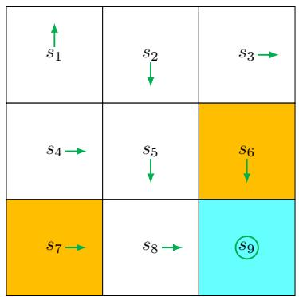  
Figure 5.3: An example for illustrating the MC Basic algorithm.

We next use an example to demonstrate the implementation details of the MC Basic algorithm. The reward settings are $r_{\mathrm{boundary}} = r_{\mathrm{forbidden}} = -1$ and $r_{\mathrm{target}} = 1$ . The discount rate is $\gamma = 0.9$ . The initial policy $\pi_0$ is shown in Figure 5.3. This initial policy is not optimal for $s_1$ or $s_3$ .

While all the action values should be calculated, we merely present those of $s_1$ due to space limitations. At $s_1$ , there are five possible actions. For each action, we need to collect many episodes that are sufficiently long to effectively approximate the action value. However, since this example is deterministic in terms of both the policy and model, running multiple times would generate the same trajectory. As a result, the estimation of each action value merely requires a single episode.

Following $\pi_0$ , we can obtain the following episodes by respectively starting from $(s_1, a_1)$ , $(s_1, a_2)$ , ..., $(s_1, a_5)$ .

Starting from $(s_1, a_1)$ , the episode is $s_1 \xrightarrow{a_1} s_1 \xrightarrow{a_1} s_1 \xrightarrow{a_1} \ldots$ . The action value equals the discounted return of the episode:

$$
q _ {\pi_ {0}} (s _ {1}, a _ {1}) = - 1 + \gamma (- 1) + \gamma^ {2} (- 1) + \dots = \frac {- 1}{1 - \gamma}.
$$

Starting from $(s_1, a_2)$ , the episode is $s_1 \xrightarrow{a_2} s_2 \xrightarrow{a_3} s_5 \xrightarrow{a_3} \ldots$ . The action value equals the discounted return of the episode:

$$
q _ {\pi_ {0}} (s _ {1}, a _ {2}) = 0 + \gamma 0 + \gamma^ {2} 0 + \gamma^ {3} (1) + \gamma^ {4} (1) + \dots = \frac {\gamma^ {3}}{1 - \gamma}.
$$

Starting from $(s_1, a_3)$ , the episode is $s_1 \xrightarrow{a_3} s_4 \xrightarrow{a_2} s_5 \xrightarrow{a_3} \ldots$ . The action value equals

the discounted return of the episode:

$$
q _ {\pi_ {0}} (s _ {1}, a _ {3}) = 0 + \gamma 0 + \gamma^ {2} 0 + \gamma^ {3} (1) + \gamma^ {4} (1) + \dots = \frac {\gamma^ {3}}{1 - \gamma}.
$$

Starting from $(s_1, a_4)$ , the episode is $s_1 \xrightarrow{a_4} s_1 \xrightarrow{a_1} s_1 \xrightarrow{a_1} \ldots$ . The action value equals the discounted return of the episode:

$$
q _ {\pi_ {0}} (s _ {1}, a _ {4}) = - 1 + \gamma (- 1) + \gamma^ {2} (- 1) + \dots = \frac {- 1}{1 - \gamma}.
$$

Starting from $(s_1, a_5)$ , the episode is $s_1 \xrightarrow{a_5} s_1 \xrightarrow{a_1} s_1 \xrightarrow{a_1} \ldots$ . The action value equals the discounted return of the episode:

$$
q _ {\pi_ {0}} (s _ {1}, a _ {5}) = 0 + \gamma (- 1) + \gamma^ {2} (- 1) + \dots = \frac {- \gamma}{1 - \gamma}.
$$

By comparing the five action values, we see that

$$
q _ {\pi_ {0}} (s _ {1}, a _ {2}) = q _ {\pi_ {0}} (s _ {1}, a _ {3}) = \frac {\gamma^ {3}}{1 - \gamma} > 0
$$

are the maximum values. As a result, the new policy can be obtained as

$$
\pi_ {1} (a _ {2} | s _ {1}) = 1 \quad \text {o r} \quad \pi_ {1} (a _ {3} | s _ {1}) = 1.
$$

It is intuitive that the improved policy, which takes either $a_2$ or $a_3$ at $s_1$ , is optimal. Therefore, we can successfully obtain an optimal policy by using merely one iteration for this simple example. In this simple example, the initial policy is already optimal for all the states except $s_1$ and $s_3$ . Therefore, the policy can become optimal after merely a single iteration. When the policy is nonoptimal for other states, more iterations are needed.

# A comprehensive example: Episode length and sparse rewards

We next discuss some interesting properties of the MC Basic algorithm by examining a more comprehensive example. The example is a 5-by-5 grid world (Figure 5.4). The reward settings are $r_{\mathrm{boundary}} = -1$ , $r_{\mathrm{forbidden}} = -10$ , and $r_{\mathrm{target}} = 1$ . The discount rate is $\gamma = 0.9$ .

First, we demonstrate that the episode length greatly impacts the final optimal policies. In particular, Figure 5.4 shows the final results generated by the MC Basic algorithm with different episode lengths. When the length of each episode is too short, neither the policy nor the value estimate is optimal (see Figures 5.4(a)-(d)). In the extreme case where the episode length is one, only the states that are adjacent to the target have

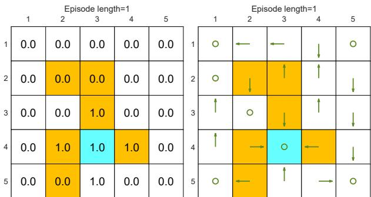  
(a) Final value and policy with episode length $= 1$

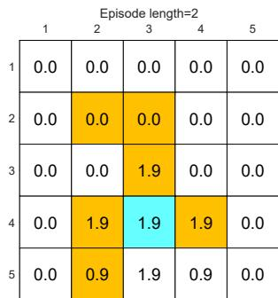  
(b) Final value and policy with episode length $= 2$

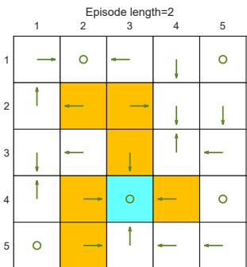

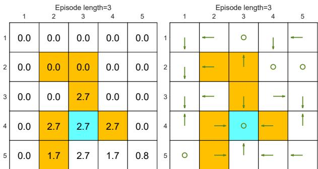  
(c) Final value and policy with episode length $= 3$

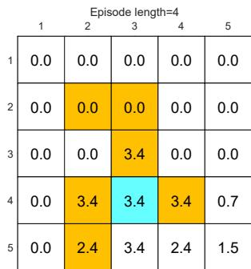  
(d) Final value and policy with episode length $= 4$

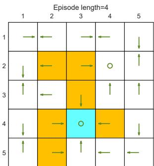

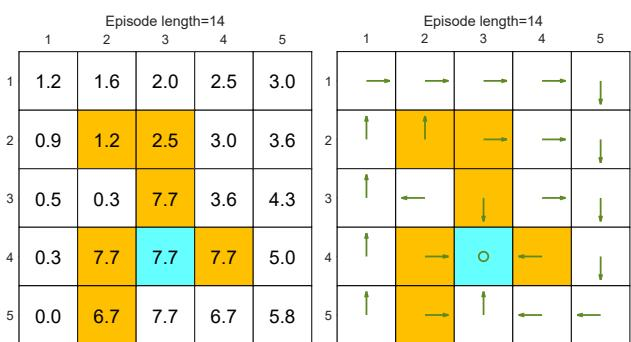  
(e) Final value and policy with episode length $= 14$

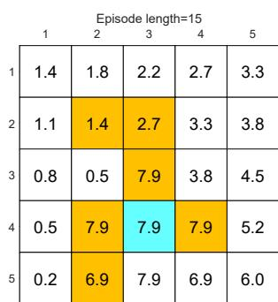  
(f) Final value and policy with episode length $= 15$

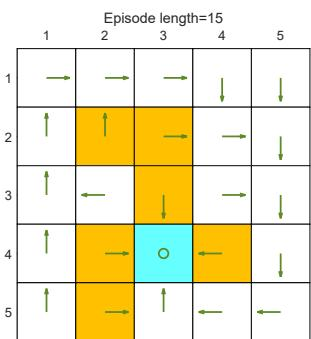

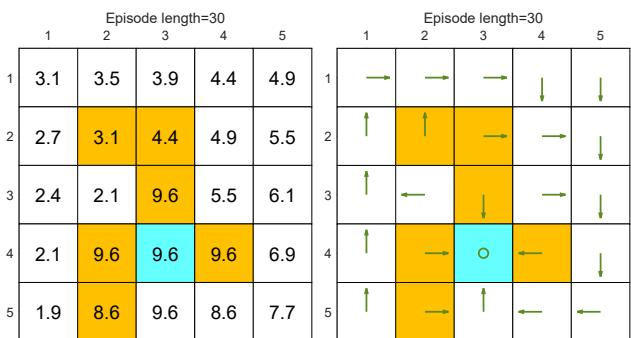  
(g) Final value and policy with episode length $= 30$

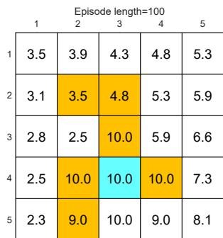  
(h) Final value and policy with episode length $= 100$   
Figure 5.4: The policies and state values obtained by the MC Basic algorithm when given different episode lengths. Only if the length of each episode is sufficiently long, can the state values be accurately estimated.

nonzero values, and all the other states have zero values since each episode is too short to reach the target or get positive rewards (see Figure 5.4(a)). As the episode length increases, the policy and value estimates gradually approach the optimal ones (see Figure 5.4(h)).

As the episode length increases, an interesting spatial pattern emerges. That is, the states that are closer to the target possess nonzero values earlier than those that are farther away. The reason for this phenomenon is as follows. Starting from a state, the agent must travel at least a certain number of steps to reach the target state and then receive positive rewards. If the length of an episode is less than the minimum desired number of steps, it is certain that the return is zero, and so is the estimated state value. In this example, the episode length must be no less than 15, which is the minimum number of steps required to reach the target when starting from the bottom-left state.

While the above analysis suggests that each episode must be sufficiently long, the episodes are not necessarily infinitely long. As shown in Figure 5.4(g), when the length is 30, the algorithm can find an optimal policy, although the value estimate is not yet optimal.

The above analysis is related to an important reward design problem, *sparse reward*, which refers to the scenario in which no positive rewards can be obtained unless the target is reached. The sparse reward setting requires long episodes that can reach the target. This requirement is challenging to satisfy when the state space is large. As a result, the sparse reward problem downgrades the learning efficiency. One simple technique for solving this problem is to design *nonsparse rewards*. For instance, in the above grid world example, we can redesign the reward setting so that the agent can obtain a small positive reward when reaching the states near the target. In this way, an "attractive field" can be formed around the target so that the agent can find the target more easily. More information about sparse reward problems can be found in [17-19].
