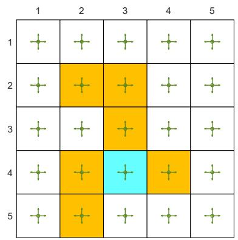

# 5.4 MC $\epsilon$ -Greedy: Learning without exploring starts

We next extend the MC Exploring Starts algorithm by removing the exploring starts condition. This condition actually requires that every state-action pair can be visited sufficiently many times, which can also be achieved based on soft policies.

# 5.4.1 $\epsilon$ -greedy policies

A policy is soft if it has a positive probability of taking any action at any state. Consider an extreme case in which we only have a single episode. With a soft policy, a single episode that is sufficiently long can visit every state-action pair many times (see the examples in Figure 5.8). Thus, we do not need to generate a large number of episodes starting from different state-action pairs, and then the exploring starts requirement can be removed.

One type of common soft policies is $\epsilon$ -greedy policies. An $\epsilon$ -greedy policy is a stochastic policy that has a higher chance of choosing the greedy action and the same nonzero probability of taking any other action. Here, the greedy action refers to the action with the greatest action value. In particular, suppose that $\epsilon \in [0,1]$ . The corresponding $\epsilon$ -greedy policy has the following form:

$$
\pi (a | s) = \left\{ \begin{array}{l l} 1 - \frac {\epsilon}{| \mathcal {A} (s) |} (| \mathcal {A} (s) | - 1), & \mathrm {f o r t h e g r e e d y a c t i o n ,} \\ \frac {\epsilon}{| \mathcal {A} (s) |}, & \mathrm {f o r t h e o t h e r | \mathcal {A} (s) | - 1 a c t i o n s ,} \end{array} \right.
$$

where $|\mathcal{A}(s)|$ denotes the number of actions associated with $s$ .

When $\epsilon = 0$ , $\epsilon$ -greedy becomes greedy. When $\epsilon = 1$ , the probability of taking any action equals $\frac{\epsilon}{|\mathcal{A}(s)|}$ .

The probability of taking the greedy action is always greater than that of taking any

other action because

$$
1 - \frac {\epsilon}{| \mathcal {A} (s) |} (| \mathcal {A} (s) | - 1) = 1 - \epsilon + \frac {\epsilon}{| \mathcal {A} (s) |} \geq \frac {\epsilon}{| \mathcal {A} (s) |}
$$

for any $\epsilon \in [0,1]$ .

While an $\epsilon$ -greedy policy is stochastic, how can we select an action by following such a policy? We can first generate a random number $x$ in $[0,1]$ by following a uniform distribution. If $x \geq \epsilon$ , then we select the greedy action. If $x < \epsilon$ , then we randomly select an action in $\mathcal{A}(s)$ with the probability of $\frac{1}{|\mathcal{A}(s)|}$ (we may select the greedy action again). In this way, the total probability of selecting the greedy action is $1 - \epsilon + \frac{\epsilon}{|\mathcal{A}(s)|}$ , and the probability of selecting any other action is $\frac{\epsilon}{|\mathcal{A}(s)|}$ .

# 5.4.2 Algorithm description

To integrate $\epsilon$ -greedy policies into MC learning, we only need to change the policy improvement step from greedy to $\epsilon$ -greedy.

In particular, the policy improvement step in MC Basic or MC Exploring Starts aims to solve

$$
\pi_ {k + 1} (s) = \arg \max _ {\pi \in \Pi} \sum_ {a} \pi (a | s) q _ {\pi_ {k}} (s, a), \tag {5.4}
$$

where $\Pi$ denotes the set of all possible policies. We know that the solution of (5.4) is a greedy policy:

$$
\pi_ {k + 1} (a | s) = \left\{ \begin{array}{l l} 1, & a = a _ {k} ^ {*}, \\ 0, & a \neq a _ {k} ^ {*}, \end{array} \right.
$$

where $a_{k}^{*} = \arg \max_{a}q_{\pi_{k}}(s,a)$

Now, the policy improvement step is changed to solve

$$
\pi_ {k + 1} (s) = \arg \max  _ {\pi \in \Pi_ {\epsilon}} \sum_ {a} \pi (a | s) q _ {\pi_ {k}} (s, a), \tag {5.5}
$$

where $\Pi_{\epsilon}$ denotes the set of all $\epsilon$ -greedy policies with a given value of $\epsilon$ . In this way, we force the policy to be $\epsilon$ -greedy. The solution of (5.5) is

$$
\pi_ {k + 1} (a | s) = \left\{ \begin{array}{l l} 1 - \frac {| \mathcal {A} (s) | - 1}{| \mathcal {A} (s) |} \epsilon , & a = a _ {k} ^ {*}, \\ \frac {1}{| \mathcal {A} (s) |} \epsilon , & a \neq a _ {k} ^ {*}, \end{array} \right.
$$

where $a_{k}^{*} = \arg \max_{a} q_{\pi_{k}}(s, a)$ . With the above change, we obtain another algorithm called $MC \epsilon-Greedy$ . The details of this algorithm are given in Algorithm 5.3. Here, the every-visit strategy is employed to better utilize the samples.

# Algorithm 5.3: MC $\epsilon$ -Greedy (a variant of MC Exploring Starts)

Initialization: Initial policy $\pi_0(a|s)$ and initial value $q(s,a)$ for all $(s,a)$ . Returns $(s,a) = 0$ and $\mathrm{Num}(s,a) = 0$ for all $(s,a)$ . $\epsilon \in (0,1]$

Goal: Search for an optimal policy.

For each episode, do

Episode generation: Select a starting state-action pair $(s_0, a_0)$ (the exploring starts condition is not required). Following the current policy, generate an episode of length

T: $s_0, a_0, r_1, \ldots, s_{T-1}, a_{T-1}, r_T$ .

Initialization for each episode: $g \gets 0$

For each step of the episode, $t = T - 1, T - 2, \ldots, 0$ , do

$$
g \leftarrow \gamma g + r _ {t + 1}
$$

$\mathsf{Returns}(s_t,a_t)\gets \mathsf{Returns}(s_t,a_t) + g$

$\mathsf{Num}(s_t,a_t)\gets \mathsf{Num}(s_t,a_t) + 1$

Policy evaluation:

$q(s_{t},a_{t})\gets \mathsf{Returns}(s_{t},a_{t}) / \mathsf{Num}(s_{t},a_{t})$

Policy improvement:

Let $a^* = \arg \max_a q(s_t, a)$ and

$$
\pi (a | s _ {t}) = \left\{ \begin{array}{l l} 1 - \frac {| \mathcal {A} (s _ {t}) | - 1}{| \mathcal {A} (s _ {t}) |} \epsilon , & a = a ^ {*} \\ \frac {1}{| \mathcal {A} (s _ {t}) |} \epsilon , & a \neq a ^ {*} \end{array} \right.
$$

If greedy policies are replaced by $\epsilon$ -greedy policies in the policy improvement step, can we still guarantee to obtain optimal policies? The answer is both yes and no. By yes, we mean that, when given sufficient samples, the algorithm can converge to an $\epsilon$ -greedy policy that is optimal in the set $\Pi_{\epsilon}$ . By no, we mean that the policy is merely optimal in $\Pi_{\epsilon}$ but may not be optimal in $\Pi$ . However, if $\epsilon$ is sufficiently small, the optimal policies in $\Pi_{\epsilon}$ are close to those in $\Pi$ .

# 5.4.3 Illustrative examples

Consider the grid world example shown in Figure 5.5. The aim is to find the optimal policy for every state. A single episode with one million steps is generated in every iteration of the MC $\epsilon$ -Greedy algorithm. Here, we deliberately consider the extreme case with merely one single episode. We set $r_{\mathrm{boundary}} = r_{\mathrm{forbidden}} = -1$ , $r_{\mathrm{target}} = 1$ , and $\gamma = 0.9$ .

The initial policy is a uniform policy that has the same probability 0.2 of taking any action, as shown in Figure 5.5. The optimal $\epsilon$ -greedy policy with $\epsilon = 0.5$ can be obtained after two iterations. Although each iteration merely uses a single episode, the policy gradually improves because all the state-action pairs can be visited and hence their values can be accurately estimated.

  
(a) Initial policy

  
(b) After the first iteration

  
(c) After the second iteration   
Figure 5.5: The evolution process of the MC $\epsilon$ -Greedy algorithm based on single episodes.
