# 5.5 Exploration and exploitation of $\epsilon$ -greedy policies

Exploration and exploitation constitute a fundamental tradeoff in reinforcement learning. Here, exploration means that the policy can possibly take as many actions as possible. In this way, all the actions can be visited and evaluated well. Exploitation means that the improved policy should take the greedy action that has the greatest action value. However, since the action values obtained at the current moment may not be accurate due to insufficient exploration, we should keep exploring while conducting exploitation to avoid missing optimal actions.

$\epsilon$ -greedy policies provide one way to balance exploration and exploitation. On the one hand, an $\epsilon$ -greedy policy has a higher probability of taking the greedy action so that it can exploit the estimated values. On the other hand, the $\epsilon$ -greedy policy also has a chance to take other actions so that it can keep exploring. $\epsilon$ -greedy policies are used not only in MC-based reinforcement learning but also in other reinforcement learning algorithms such as temporal-difference learning as introduced in Chapter 7.

Exploitation is related to optimality because optimal policies should be greedy. The fundamental idea of $\epsilon$ -greedy policies is to enhance exploration by sacrificing optimality/exploitation. If we would like to enhance exploitation and optimality, we need to reduce the value of $\epsilon$ . However, if we would like to enhance exploration, we need to increase the value of $\epsilon$ .

We next discuss this tradeoff based on some interesting examples. The reinforcement learning task here is a 5-by-5 grid world. The reward settings are $r_{\mathrm{boundary}} = -1$ , $r_{\mathrm{forbidden}} = -10$ , and $r_{\mathrm{target}} = 1$ . The discount rate is $\gamma = 0.9$ .

# Optimality of $\epsilon$ -greedy policies

We next show that the optimality of $\epsilon$ -greedy policies becomes worse when $\epsilon$ increases.

$\diamond$ First, a greedy optimal policy and the corresponding optimal state values are shown in Figure 5.6(a). The state values of some consistent $\epsilon$ -greedy policies are shown in

  
(a) A given $\epsilon$ -greedy policy and its state values: $\epsilon = 0$

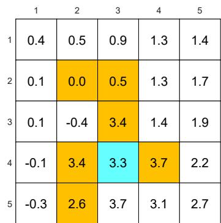  
(b) A given $\epsilon$ -greedy policy and its state values: $\epsilon = 0.1$

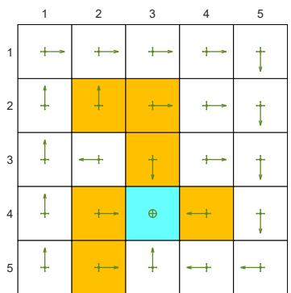

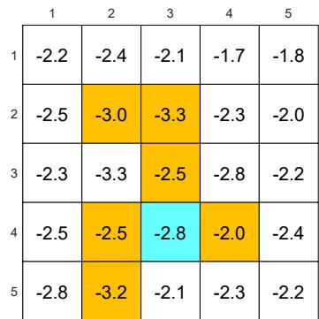  
(c) A given $\epsilon$ -greedy policy and its state values: $\epsilon = 0.2$

  
(d) A given $\epsilon$ -greedy policy and its state values: $\epsilon = 0.5$   
Figure 5.6: The state values of some $\epsilon$ -greedy policies. These $\epsilon$ -greedy policies are consistent with each other in the sense that the actions with the greatest probabilities are the same. It can be seen that, when the value of $\epsilon$ increases, the state values of the $\epsilon$ -greedy policies decrease and hence their optimality becomes worse.

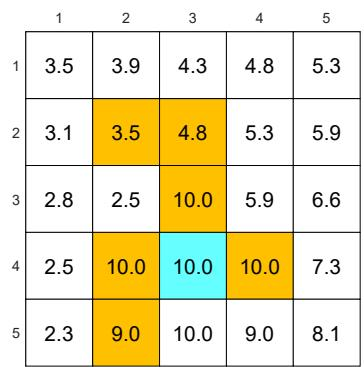  
(a) The optimal $\epsilon$ -greedy policy and its state values: $\epsilon = 0$

  
(b) The optimal $\epsilon$ -greedy policy and its state values: $\epsilon = 0.1$

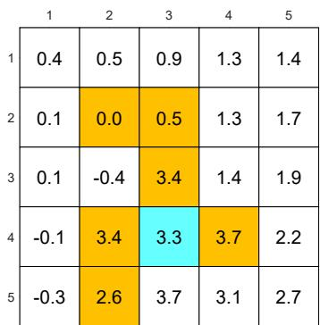

  
(c) The optimal $\epsilon$ -greedy policy and its state values: $\epsilon = 0.2$

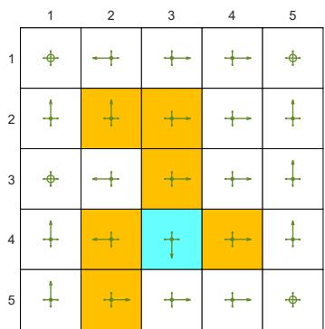  
(d) The optimal $\epsilon$ -greedy policy and its state values: $\epsilon = 0.5$

  
Figure 5.7: The optimal $\epsilon$ -greedy policies and their corresponding state values under different values of $\epsilon$ . Here, these $\epsilon$ -greedy policies are optimal among all $\epsilon$ -greedy ones (with the same value of $\epsilon$ ). It can be seen that, when the value of $\epsilon$ increases, the optimal $\epsilon$ -greedy policies are no longer consistent with the optimal one as in (a).

Figures 5.6(b)-(d). Here, two $\epsilon$ -greedy policies are consistent if the actions with the greatest probabilities in the policies are the same.

As the value of $\epsilon$ increases, the state values of the $\epsilon$ -greedy policies decrease, indicating that the optimality of these $\epsilon$ -greedy policies becomes worse. Notably, the value of the target state becomes the smallest when $\epsilon$ is as large as 0.5. This is because, when $\epsilon$ is large, the agent starting from the target area may enter the surrounding forbidden areas and hence receive negative rewards with a higher probability.

$\diamond$ Second, Figure 5.7 shows the optimal $\epsilon$ -greedy policies (they are optimal in $\Pi_{\epsilon}$ ). When $\epsilon = 0$ , the policy is greedy and optimal among all policies. When $\epsilon$ is as small as 0.1, the optimal $\epsilon$ -greedy policy is consistent with the optimal greedy one. However, when $\epsilon$ increases to, for example, 0.2, the obtained $\epsilon$ -greedy policies are not consistent with the optimal greedy one. Therefore, if we want to obtain $\epsilon$ -greedy policies that are consistent with the optimal greedy ones, the value of $\epsilon$ should be sufficiently small.

Why are the $\epsilon$ -greedy policies inconsistent with the optimal greedy one when $\epsilon$ is large? We can answer this question by considering the target state. In the greedy case, the optimal policy at the target state is to stay unchanged to gain positive rewards. However, when $\epsilon$ is large, there is a high chance of entering the forbidden areas and receiving negative rewards. Therefore, the optimal policy at the target state in this case is to escape instead of staying unchanged.

# Exploration abilities of $\epsilon$ -greedy policies

We next illustrate that the exploration ability of an $\epsilon$ -greedy policy is strong when $\epsilon$ is large.

First, consider an $\epsilon$ -greedy policy with $\epsilon = 1$ (see Figure 5.5(a)). In this case, the exploration ability of the $\epsilon$ -greedy policy is strong since it has a 0.2 probability of taking any action at any state. Starting from $(s_1, a_1)$ , an episode generated by the $\epsilon$ -policy is given in Figures 5.8(a)-(c). It can be seen that this single episode can visit all the state-action pairs many times when the episode is sufficiently long due to the strong exploration ability of the policy. Moreover, the numbers of times that all the state-action pairs are visited are almost even, as shown in Figure 5.8(d).

Second, consider an $\epsilon$ -policy with $\epsilon = 0.5$ (see Figure 5.6(d)). In this case, the $\epsilon$ -greedy policy has a weaker exploration ability than the case of $\epsilon = 1$ . Starting from $(s_1, a_1)$ , an episode generated by the $\epsilon$ -policy is given in Figures 5.8(e)-(g). Although every action can still be visited when the episode is sufficiently long, the distribution of the number of visits may be extremely uneven. For example, given an episode with one million steps, some actions are visited more than 250,000 times, while most actions are visited merely hundreds or even tens of times, as shown in Figure 5.8(h).

The above examples demonstrate that the exploration abilities of $\epsilon$ -greedy policies decrease when $\epsilon$ decreases. One useful technique is to initially set $\epsilon$ to be large to enhance

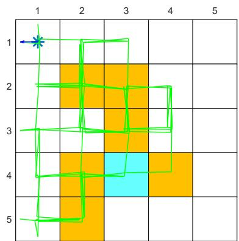  
(a) $\epsilon = 1$ , trajectory of 100 steps

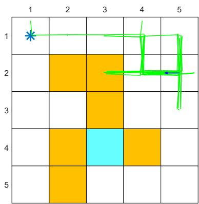  
(e) $\epsilon = 0.5$ , trajectory of 100 steps

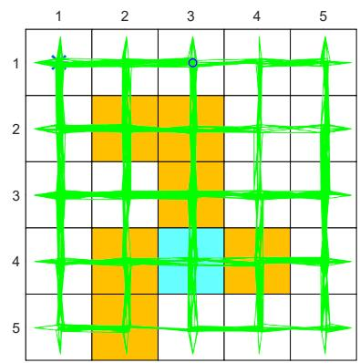  
(b) $\epsilon = 1$ , trajectory of 1,000 steps

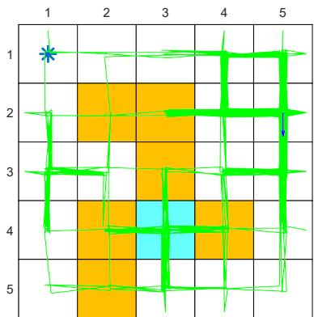  
(f) $\epsilon = 0.5$ , trajectory of 1,000 steps

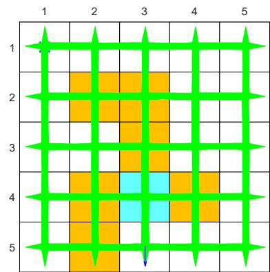  
(c) $\epsilon = 1$ , trajectory of 10,000 steps

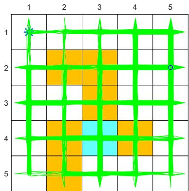  
(g) $\epsilon = 0.5$ , trajectory of 10,000 steps

  
(d) $\epsilon = 1$ , number of times each action is visited within 1 million steps

  
(h) $\epsilon = 0.5$ , number of times each action is visited within 1 million steps   
Figure 5.8: Exploration abilities of $\epsilon$ -greedy policies with different values of $\epsilon$ .

exploration and gradually reduce it to ensure the optimality of the final policy [21-23].
