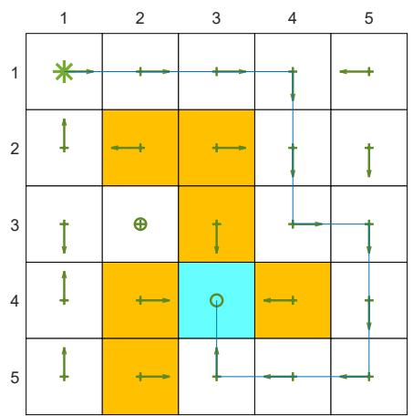
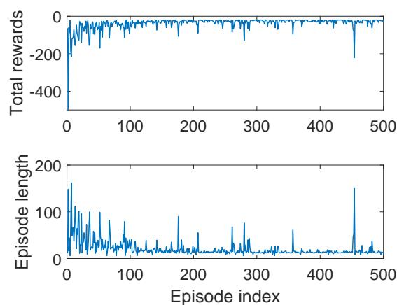

# 7.2 TD learning of action values: Sarsa

The TD algorithm introduced in Section 7.1 can only estimate state values. This section introduces another TD algorithm called Sarsa that can directly estimate action values. Estimating action values is important because it can be combined with a policy improvement step to learn optimal policies.

# 7.2.1 Algorithm description

Given a policy $\pi$ , our goal is to estimate the action values. Suppose that we have some experience samples generated following $\pi$ : $(s_0, a_0, r_1, s_1, a_1, \ldots, s_t, a_t, r_{t+1}, s_{t+1}, a_{t+1}, \ldots)$ . We can use the following Sarsa algorithm to estimate the action values:

$$
q _ {t + 1} \left(s _ {t}, a _ {t}\right) = q _ {t} \left(s _ {t}, a _ {t}\right) - \alpha_ {t} \left(s _ {t}, a _ {t}\right) \left[ q _ {t} \left(s _ {t}, a _ {t}\right) - \left(r _ {t + 1} + \gamma q _ {t} \left(s _ {t + 1}, a _ {t + 1}\right)\right) \right], \tag {7.12}
$$

$$
q _ {t + 1} (s, a) = q _ {t} (s, a), \quad \text {f o r a l l} (s, a) \neq (s _ {t}, a _ {t}),
$$

where $t = 0,1,2,\ldots$ and $\alpha_{t}(s_{t},a_{t})$ is the learning rate. Here, $q_{t}(s_{t},a_{t})$ is the estimate of $q_{\pi}(s_t,a_t)$ . At time $t$ , only the q-value of $(s_t,a_t)$ is updated, whereas the q-values of the others remain the same.

Some important properties of the Sarsa algorithm are discussed as follows.

$\diamond$ Why is this algorithm called "Sarsa"? That is because each iteration of the algorithm requires $(s_t, a_t, r_{t+1}, s_{t+1}, a_{t+1})$ . Sarsa is an abbreviation for state-action-reward-state-action. The Sarsa algorithm was first proposed in [35] and its name was coined by [3].   
$\diamond$ Why is Sarsa designed in this way? One may have noticed that Sarsa is similar to the TD algorithm in (7.1). In fact, Sarsa can be easily obtained from the TD algorithm by replacing state value estimation with action value estimation.   
$\diamond$ What does Sarsa do mathematically? Similar to the TD algorithm in (7.1), Sarsa is a stochastic approximation algorithm for solving the Bellman equation of a given policy:

$$
q _ {\pi} (s, a) = \mathbb {E} \left[ R + \gamma q _ {\pi} \left(S ^ {\prime}, A ^ {\prime}\right) | s, a \right], \quad \text {f o r a l l} (s, a). \tag {7.13}
$$

Equation (7.13) is the Bellman equation expressed in terms of action values. A proof is given in Box 7.3.

Box 7.3: Showing that (7.13) is the Bellman equation

As introduced in Section 2.8.2, the Bellman equation expressed in terms of action values is

$$
\begin{array}{l} q _ {\pi} (s, a) = \sum_ {r} r p (r | s, a) + \gamma \sum_ {s ^ {\prime}} \sum_ {a ^ {\prime}} q _ {\pi} \left(s ^ {\prime}, a ^ {\prime}\right) p \left(s ^ {\prime} | s, a\right) \pi \left(a ^ {\prime} | s ^ {\prime}\right) \\ = \sum_ {r} r p (r | s, a) + \gamma \sum_ {s ^ {\prime}} p \left(s ^ {\prime} \mid s, a\right) \sum_ {a ^ {\prime}} q _ {\pi} \left(s ^ {\prime}, a ^ {\prime}\right) \pi \left(a ^ {\prime} \mid s ^ {\prime}\right). \tag {7.14} \\ \end{array}
$$

This equation establishes the relationships among the action values. Since

$$
\begin{array}{l} p (s ^ {\prime}, a ^ {\prime} | s, a) = p (s ^ {\prime} | s, a) p (a ^ {\prime} | s ^ {\prime}, s, a) \\ = p (s ^ {\prime} | s, a) p (a ^ {\prime} | s ^ {\prime}) \quad (\mathrm {d u e t o c o n d i t i o n a l i n d e p e n d e n c e}) \\ \dot {=} p \left(s ^ {\prime} \mid s, a\right) \pi \left(a ^ {\prime} \mid s ^ {\prime}\right), \\ \end{array}
$$

(7.14) can be rewritten as

$$
q _ {\pi} (s, a) = \sum_ {r} r p (r | s, a) + \gamma \sum_ {s ^ {\prime}} \sum_ {a ^ {\prime}} q _ {\pi} (s ^ {\prime}, a ^ {\prime}) p (s ^ {\prime}, a ^ {\prime} | s, a).
$$

By the definition of the expected value, the above equation is equivalent to (7.13). Hence, (7.13) is the Bellman equation.

Is Sarsa convergent? Since Sarsa is the action-value version of the TD algorithm in (7.1), the convergence result is similar to Theorem 7.1 and given below.

Theorem 7.2 (Convergence of Sarsa). Given a policy $\pi$ , by the Sarsa algorithm in (7.12), $q_{t}(s,a)$ converges almost surely to the action value $q_{\pi}(s,a)$ as $t \to \infty$ for all $(s,a)$ if $\sum_{t} \alpha_{t}(s,a) = \infty$ and $\sum_{t} \alpha_{t}^{2}(s,a) < \infty$ for all $(s,a)$ .

The proof is similar to that of Theorem 7.1 and is omitted here. The condition of $\sum_{t}\alpha_{t}(s,a) = \infty$ and $\sum_{t}\alpha_{t}^{2}(s,a) < \infty$ should be valid for all $(s,a)$ . In particular, $\sum_{t}\alpha_{t}(s,a) = \infty$ requires that every state-action pair must be visited an infinite (or sufficiently many) number of times. At time $t$ , if $(s,a) = (s_t,a_t)$ , then $\alpha_{t}(s,a) > 0$ ; otherwise, $\alpha_{t}(s,a) = 0$ .

# 7.2.2 Optimal policy learning via Sarsa

The Sarsa algorithm in (7.12) can only estimate the action values of a given policy. To find optimal policies, we can combine it with a policy improvement step. The combination is also often called Sarsa, and its implementation procedure is given in Algorithm 7.1.

As shown in Algorithm 7.1, each iteration has two steps. The first step is to update the q-value of the visited state-action pair. The second step is to update the policy to an $\epsilon$ -greedy one. The q-value update step only updates the single state-action pair visited

# Algorithm 7.1: Optimal policy learning by Sarsa

Initialization: $\alpha_{t}(s,a) = \alpha >0$ for all $(s,a)$ and all $t$ . $\epsilon \in (0,1)$ . Initial $q_{0}(s,a)$ for all $(s,a)$ . Initial $\epsilon$ -greedy policy $\pi_0$ derived from $q_{0}$ .

Goal: Learn an optimal policy that can lead the agent to the target state from an initial state $s_0$ .

For each episode, do

Generate $a_0$ at $s_0$ following $\pi_0(s_0)$

If $s_t$ ( $t = 0, 1, 2, \ldots$ ) is not the target state, do

Collect an experience sample $(r_{t+1}, s_{t+1}, a_{t+1})$ given $(s_t, a_t)$ : generate $r_{t+1}, s_{t+1}$ by interacting with the environment; generate $a_{t+1}$ following $\pi_t(s_{t+1})$ .

Update $q$ -value for $(s_t, a_t)$ :

$$
q _ {t + 1} \left(s _ {t}, a _ {t}\right) = q _ {t} \left(s _ {t}, a _ {t}\right) - \alpha_ {t} \left(s _ {t}, a _ {t}\right) \left[ q _ {t} \left(s _ {t}, a _ {t}\right) - \left(r _ {t + 1} + \gamma q _ {t} \left(s _ {t + 1}, a _ {t + 1}\right)\right) \right]
$$

Update policy for $s_t$ :

$$
\begin{array}{l} \pi_ {t + 1} (a | s _ {t}) = 1 - \frac {\epsilon}{| \mathcal {A} (s _ {t}) |} (| \mathcal {A} (s _ {t}) | - 1) \mathrm {i f} a = \arg \max _ {a} q _ {t + 1} (s _ {t}, a) \\ \pi_ {t + 1} (a | s _ {t}) = \frac {\epsilon}{| \mathcal {A} (s _ {t}) |} o t h e r w i s e \\ s _ {t} \leftarrow s _ {t + 1}, a _ {t} \leftarrow a _ {t + 1} \\ \end{array}
$$

at time $t$ . Afterward, the policy of $s_t$ is immediately updated. Therefore, we do not evaluate a given policy sufficiently well before updating the policy. This is based on the idea of generalized policy iteration. Moreover, after the policy is updated, the policy is immediately used to generate the next experience sample. The policy here is $\epsilon$ -greedy so that it is exploratory.

A simulation example is shown in Figure 7.2 to demonstrate the Sarsa algorithm. Unlike all the tasks we have seen in this book, the task here aims to find an optimal path from a specific starting state to a target state. It does not aim to find the optimal policies for all states. This task is often encountered in practice where the starting state (e.g., home) and the target state (e.g., workplace) are fixed, and we only need to find an optimal path connecting them. This task is relatively simple because we only need to explore the states that are close to the path and do not need to explore all the states. However, if we do not explore all the states, the final path may be locally optimal rather than globally optimal.

The simulation setup and simulation results are discussed below.

$\diamond$ Simulation setup: In this example, all the episodes start from the top-left state and terminate at the target state. The reward settings are $r_{\mathrm{target}} = 0$ , $r_{\mathrm{forbidden}} = r_{\mathrm{boundary}} = -10$ , and $r_{\mathrm{other}} = -1$ . Moreover, $\alpha_{t}(s,a) = 0.1$ for all $t$ and $\epsilon = 0.1$ . The initial guesses of the action values are $q_0(s,a) = 0$ for all $(s,a)$ . The initial policy has a uniform distribution: $\pi_0(a|s) = 0.2$ for all $s,a$ .   
$\diamond$ Learned policy: The left figure in Figure 7.2 shows the final policy learned by Sarsa. As can be seen, this policy can successfully lead to the target state from the starting

  
Figure 7.2: An example for demonstrating Sarsa. All the episodes start from the top-left state and terminate when reaching the target state (the blue cell). The goal is to find an optimal path from the starting state to the target state. The reward settings are $r_{\mathrm{target}} = 0$ , $r_{\mathrm{forbidden}} = r_{\mathrm{boundary}} = -10$ , and $r_{\mathrm{other}} = -1$ . The learning rate is $\alpha = 0.1$ and the value of $\epsilon$ is 0.1. The left figure shows the final policy obtained by the algorithm. The right figures show the total reward and length of every episode.

state. However, the policies of some other states may not be optimal. That is because the other states are not well explored.

$\diamond$ Total reward of each episode: The top-right subfigure in Figure 7.2 shows the total reward of each episode. Here, the total reward is the non-discounted sum of all immediate rewards. As can be seen, the total reward of each episode increases gradually. That is because the initial policy is not good and hence negative rewards are frequently obtained. As the policy becomes better, the total reward increases.   
$\diamond$ Length of each episode: The bottom-right subfigure in Figure 7.2 shows that the length of each episode drops gradually. That is because the initial policy is not good and may take many detours before reaching the target. As the policy becomes better, the length of the trajectory becomes shorter. Notably, the length of an episode may increase abruptly (e.g., the 460th episode) and the corresponding total reward also drops sharply. That is because the policy is $\epsilon$ -greedy, and there is a chance for it to take non-optimal actions. One way to resolve this problem is to use decaying $\epsilon$ whose value converges to zero gradually.

Finally, Sarsa also has some variants such as Expected Sarsa. Interested readers may check Box 7.4.

# Box 7.4: Expected Sarna

Given a policy $\pi$ , its action values can be evaluated by Expected Sarsa, which is a variant of Sarsa. The Expected Sarsa algorithm is

$$
q _ {t + 1} (s _ {t}, a _ {t}) = q _ {t} (s _ {t}, a _ {t}) - \alpha_ {t} (s _ {t}, a _ {t}) \Big [ q _ {t} (s _ {t}, a _ {t}) - (r _ {t + 1} + \gamma \mathbb {E} [ q _ {t} (s _ {t + 1}, A) ]) \Big ],
$$

$$
q _ {t + 1} (s, a) = q _ {t} (s, a), \quad \mathrm {f o r a l l} (s, a) \neq (s _ {t}, a _ {t}),
$$

where

$$
\mathbb {E} [ q _ {t} (s _ {t + 1}, A) ] = \sum_ {a} \pi_ {t} (a | s _ {t + 1}) q _ {t} (s _ {t + 1}, a) \doteq v _ {t} (s _ {t + 1})
$$

is the expected value of $q_{t}(s_{t + 1},a)$ under policy $\pi_t$ . The expression of the Expected Sarsa algorithm is very similar to that of Sarsa. They are different only in terms of their TD targets. In particular, the TD target in Expected Sarsa is $r_{t + 1} + \gamma \mathbb{E}[q_t(s_{t + 1},A)]$ , while that of Sarsa is $r_{t + 1} + \gamma q_t(s_{t + 1},a_{t + 1})$ . Since the algorithm involves an expected value, it is called Expected Sarsa. Although calculating the expected value may increase the computational complexity slightly, it is beneficial in the sense that it reduces the estimation variances because it reduces the random variables in Sarsa from $\{s_t,a_t,r_{t + 1},s_{t + 1},a_{t + 1}\}$ to $\{s_t,a_t,r_{t + 1},s_{t + 1}\}$ .

Similar to the TD learning algorithm in (7.1), Expected Sarsa can be viewed as a stochastic approximation algorithm for solving the following equation:

$$
q _ {\pi} (s, a) = \mathbb {E} \Big [ R _ {t + 1} + \gamma \mathbb {E} [ q _ {\pi} (S _ {t + 1}, A _ {t + 1}) | S _ {t + 1} ] \Big | S _ {t} = s, A _ {t} = a \Big ], \quad \mathrm {f o r a l l} s, a. \quad (7. 1 5)
$$

The above equation may look strange at first glance. In fact, it is another expression of the Bellman equation. To see that, substituting

$$
\mathbb {E} \left[ q _ {\pi} \left(S _ {t + 1}, A _ {t + 1}\right) \mid S _ {t + 1} \right] = \sum_ {A ^ {\prime}} q _ {\pi} \left(S _ {t + 1}, A ^ {\prime}\right) \pi \left(A ^ {\prime} \mid S _ {t + 1}\right) = v _ {\pi} \left(S _ {t + 1}\right)
$$

into (7.15) gives

$$
q _ {\pi} (s, a) = \mathbb {E} \Big [ R _ {t + 1} + \gamma v _ {\pi} (S _ {t + 1}) | S _ {t} = s, A _ {t} = a \Big ],
$$

which is clearly the Bellman equation.

The implementation of Expected Sarsa is similar to that of Sarsa. More details can be found in [3, 36, 37].
