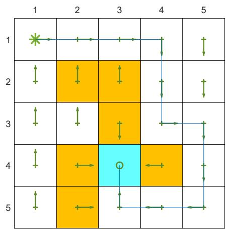
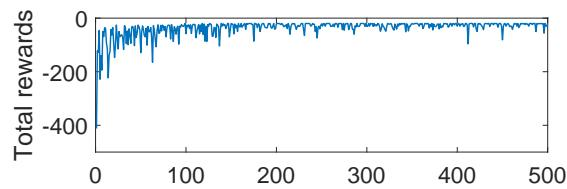
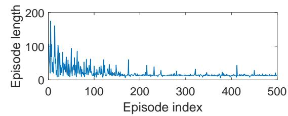

# 7.4 TD learning of optimal action values: Q-learning

In this section, we introduce the Q-learning algorithm, one of the most classic reinforcement learning algorithms [38,39]. Recall that Sarsa can only estimate the action values of a given policy, and it must be combined with a policy improvement step to find optimal policies. By contrast, Q-learning can directly estimate optimal action values and find optimal policies.

# 7.4.1 Algorithm description

The Q-learning algorithm is

$$
q _ {t + 1} (s _ {t}, a _ {t}) = q _ {t} (s _ {t}, a _ {t}) - \alpha_ {t} (s _ {t}, a _ {t}) \left[ q _ {t} (s _ {t}, a _ {t}) - \left(r _ {t + 1} + \gamma \max  _ {a \in \mathcal {A} (s _ {t + 1})} q _ {t} (s _ {t + 1}, a)\right) \right], \tag {7.18}
$$

$$
q _ {t + 1} (s, a) = q _ {t} (s, a), \quad \mathrm {f o r a l l} (s, a) \neq (s _ {t}, a _ {t}),
$$

where $t = 0,1,2,\ldots$ . Here, $q_{t}(s_{t},a_{t})$ is the estimate of the optimal action value of $(s_t,a_t)$ and $\alpha_{t}(s_{t},a_{t})$ is the learning rate for $(s_t,a_t)$ .

The expression of Q-learning is similar to that of Sarsa. They are different only in terms of their TD targets: the TD target of Q-learning is $r_{t+1} + \gamma \max_a q_t(s_{t+1}, a)$ , whereas that of Sarsa is $r_{t+1} + \gamma q_t(s_{t+1}, a_{t+1})$ . Moreover, given $(s_t, a_t)$ , Sarsa requires $(r_{t+1}, s_{t+1}, a_{t+1})$ in every iteration, whereas Q-learning merely requires $(r_{t+1}, s_{t+1})$ .

Why is Q-learning designed as the expression in (7.18), and what does it do mathematically? Q-learning is a stochastic approximation algorithm for solving the following equation:

$$
q (s, a) = \mathbb {E} \left[ R _ {t + 1} + \gamma \max  _ {a} q \left(S _ {t + 1}, a\right) \mid S _ {t} = s, A _ {t} = a \right]. \tag {7.19}
$$

This is the Bellman optimality equation expressed in terms of action values. The proof is given in Box 7.5. The convergence analysis of Q-learning is similar to Theorem 7.1 and omitted here. More information can be found in [32, 39].

# Box 7.5: Showing that (7.19) is the Bellman optimality equation

By the definition of expectation, (7.19) can be rewritten as

$$
q (s, a) = \sum_ {r} p (r | s, a) r + \gamma \sum_ {s ^ {\prime}} p (s ^ {\prime} | s, a) \max _ {a \in \mathcal {A} (s ^ {\prime})} q (s ^ {\prime}, a).
$$

Taking the maximum of both sides of the equation gives

$$
\max _ {a \in \mathcal {A} (s)} q (s, a) = \max _ {a \in \mathcal {A} (s)} \left[ \sum_ {r} p (r | s, a) r + \gamma \sum_ {s ^ {\prime}} p (s ^ {\prime} | s, a) \max _ {a \in \mathcal {A} (s ^ {\prime})} q (s ^ {\prime}, a) \right].
$$

By denoting $v(s) \doteq \max_{a \in \mathcal{A}(s)} q(s, a)$ , we can rewrite the above equation as

$$
\begin{array}{l} v (s) = \max _ {a \in \mathcal {A} (s)} \left[ \sum_ {r} p (r | s, a) r + \gamma \sum_ {s ^ {\prime}} p (s ^ {\prime} | s, a) v (s ^ {\prime}) \right] \\ = \max _ {\pi} \sum_ {a \in \mathcal {A} (s)} \pi (a | s) \left[ \sum_ {r} p (r | s, a) r + \gamma \sum_ {s ^ {\prime}} p (s ^ {\prime} | s, a) v (s ^ {\prime}) \right], \\ \end{array}
$$

which is clearly the Bellman optimality equation in terms of state values as introduced in Chapter 3.

# 7.4.2 Off-policy vs on-policy

We next introduce two important concepts: on-policy learning and off-policy learning. What makes Q-learning slightly special compared to the other TD algorithms is that Q-learning is off-policy while the others are on-policy.

Two policies exist in any reinforcement learning task: a behavior policy and a target policy. The behavior policy is the one used to generate experience samples. The target policy is the one that is constantly updated to converge to an optimal policy. When the behavior policy is the same as the target policy, such a learning process is called on-policy. Otherwise, when they are different, the learning process is called off-policy.

The advantage of off-policy learning is that it can learn optimal policies based on the experience samples generated by other policies, which may be, for example, a policy executed by a human operator. As an important case, the behavior policy can be selected to be exploratory. For example, if we would like to estimate the action values of all state-action pairs, we must generate episodes visiting every state-action pair sufficiently many times. Although Sarsa uses $\epsilon$ -greedy policies to maintain certain exploration abilities, the value of $\epsilon$ is usually small and hence the exploration ability is limited. By contrast, if we can use a policy with a strong exploration ability to generate episodes and then use off-policy learning to learn optimal policies, the learning efficiency would be significantly increased.

To determine if an algorithm is on-policy or off-policy, we can examine two aspects. The first is the mathematical problem that the algorithm aims to solve. The second is the experience samples required by the algorithm.

Sarsa is on-policy.

The reason is as follows. Sarsa has two steps in every iteration. The first step is to evaluate a policy $\pi$ by solving its Bellman equation. To do that, we need samples generated by $\pi$ . Therefore, $\pi$ is the behavior policy. The second step is to obtain an improved policy based on the estimated values of $\pi$ . As a result, $\pi$ is the target policy that is constantly updated and eventually converges to an optimal policy. Therefore, the behavior policy and the target policy are the same.

From another point of view, we can examine the samples required by the algorithm. The samples required by Sarsa in every iteration include $(s_t, a_t, r_{t+1}, s_{t+1}, a_{t+1})$ . How these samples are generated is illustrated below:

$$
s _ {t} \xrightarrow {\pi_ {b}} a _ {t} \xrightarrow {\mathrm {m o d e l}} r _ {t + 1}, s _ {t + 1} \xrightarrow {\pi_ {b}} a _ {t + 1}
$$

As can be seen, the behavior policy $\pi_{b}$ is the one that generates $a_{t}$ at $s_t$ and $a_{t + 1}$ at $s_{t + 1}$ . The Sarsa algorithm aims to estimate the action value of $(s_t,a_t)$ of a policy denoted as $\pi_T$ , which is the target policy because it is improved in every iteration based on the estimated values. In fact, $\pi_T$ is the same as $\pi_{b}$ because the evaluation of $\pi_T$ relies on the samples $(r_{t + 1},s_{t + 1},a_{t + 1})$ , where $a_{t + 1}$ is generated following $\pi_{b}$ . In other words, the policy that Sarsa evaluates is the policy used to generate samples.

Q-learning is off-policy.

The fundamental reason is that Q-learning is an algorithm for solving the Bellman optimality equation, whereas Sarsa is for solving the Bellman equation of a given policy. While solving the Bellman equation can evaluate the associated policy, solving the Bellman optimality equation can directly generate the optimal values and optimal policies.

In particular, the samples required by Q-learning in every iteration is $(s_t, a_t, r_{t+1}, s_{t+1})$ . How these samples are generated is illustrated below:

$$
s _ {t} \xrightarrow {\pi_ {b}} a _ {t} \xrightarrow {\mathrm {m o d e l}} r _ {t + 1}, s _ {t + 1}
$$

As can be seen, the behavior policy $\pi_{b}$ is the one that generates $a_{t}$ at $s_t$ . The Q-learning algorithm aims to estimate the optimal action value of $(s_t,a_t)$ . This estimation process relies on the samples $(r_{t + 1},s_{t + 1})$ . The process of generating $(r_{t + 1},s_{t + 1})$ does not involve $\pi_{b}$ because it is governed by the system model (or by interacting with the environment). Therefore, the estimation of the optimal action value of $(s_t,a_t)$ does not involve $\pi_{b}$ and we can use any $\pi_{b}$ to generate $a_{t}$ at $s_t$ . Moreover, the target policy $\pi_T$ here is the greedy policy obtained based on the estimated optimal values (Algorithm 7.3). The behavior policy does not have to be the same as $\pi_T$ .

MC learning is on-policy. The reason is similar to that of Sarsa. The target policy to be evaluated and improved is the same as the behavior policy that generates samples.

Another concept that may be confused with on-policy/off-policy is online/offline learning. Online learning refers to the case where the value and the policy are updated once an experience sample is obtained. Offline learning refers to the case where the update can only be done after all experience samples have been collected. For example, TD learning is online, whereas MC learning is offline. An on-policy learning algorithm like Sarsa must work online because the updated policy must be used to generate new experience samples. An off-policy learning algorithm like Q-learning can work either online or offline. It can either update the value and policy once receiving an experience sample or after collecting all experience samples.

# Algorithm 7.2: Optimal policy learning via Q-learning (on-policy version)

Initialization: $\alpha_{t}(s,a) = \alpha >0$ for all $(s,a)$ and all $t$ . $\epsilon \in (0,1)$ . Initial $q_{0}(s,a)$ for all $(s,a)$ . Initial $\epsilon$ -greedy policy $\pi_0$ derived from $q_{0}$ .

Goal: Learn an optimal path that can lead the agent to the target state from an initial state $s_0$ .

For each episode, do

If $s_t$ ( $t = 0, 1, 2, \ldots$ ) is not the target state, do

Collect the experience sample $(a_{t}, r_{t+1}, s_{t+1})$ given $s_{t}$ : generate $a_{t}$ following $\pi_{t}(s_{t})$ ; generate $r_{t+1}, s_{t+1}$ by interacting with the environment.

Update $q$ -value for $(s_t, a_t)$ :

$$
q _ {t + 1} (s _ {t}, a _ {t}) = q _ {t} (s _ {t}, a _ {t}) - \alpha_ {t} (s _ {t}, a _ {t}) \left[ q _ {t} (s _ {t}, a _ {t}) - \left(r _ {t + 1} + \gamma \max _ {a} q _ {t} (s _ {t + 1}, a)\right) \right]
$$

Update policy for $s_t$ :

$$
\pi_ {t + 1} (a | s _ {t}) = 1 - \frac {\epsilon}{| \mathcal {A} (s _ {t}) |} (| \mathcal {A} (s _ {t}) | - 1) \mathrm {i f} a = \arg \max _ {a} q _ {t + 1} (s _ {t}, a)
$$

$$
\pi_ {t + 1} (a | s _ {t}) = \frac {\epsilon}{| \mathcal {A} (s _ {t}) |} o t h e r w i s e
$$

# Algorithm 7.3: Optimal policy learning via Q-learning (off-policy version)

Initialization: Initial guess $q_0(s, a)$ for all $(s, a)$ . Behavior policy $\pi_b(a|s)$ for all $(s, a)$ . $\alpha_t(s, a) = \alpha > 0$ for all $(s, a)$ and all $t$ .

Goal: Learn an optimal target policy $\pi_T$ for all states from the experience samples generated by $\pi_b$ .

For each episode $\{s_0, a_0, r_1, s_1, a_1, r_2, \ldots\}$ generated by $\pi_b$ , do

For each step $t = 0,1,2,\ldots$ of the episode, do

Update $q$ -value for $(s_t, a_t)$ :

$$
q _ {t + 1} \left(s _ {t}, a _ {t}\right) = q _ {t} \left(s _ {t}, a _ {t}\right) - \alpha_ {t} \left(s _ {t}, a _ {t}\right) \left[ q \left(s _ {t}, a _ {t}\right) - \left(r _ {t + 1} + \gamma \max  _ {a} q _ {t} \left(s _ {t + 1}, a\right)\right) \right]
$$

Update target policy for $s_t$ :

$$
\pi_ {T, t + 1} (a | s _ {t}) = 1 \text {i f} a = \arg \max  _ {a} q _ {t + 1} (s _ {t}, a)
$$

$$
\pi_ {T, t + 1} (a | s _ {t}) = 0 \text {o t h e r w i s e}
$$

  
Figure 7.3: An example for demonstrating Q-learning. All the episodes start from the top-left state and terminate after reaching the target state. The aim is to find an optimal path from the starting state to the target state. The reward settings are $r_{\mathrm{target}} = 0$ , $r_{\mathrm{forbidden}} = r_{\mathrm{boundary}} = -10$ , and $r_{\mathrm{other}} = -1$ . The learning rate is $\alpha = 0.1$ and the value of $\epsilon$ is 0.1. The left figure shows the final policy obtained by the algorithm. The right figure shows the total reward and length of every episode.

# 7.4.3 Implementation

Since Q-learning is off-policy, it can be implemented in either an on-policy or off-policy fashion.

The on-policy version of Q-learning is shown in Algorithm 7.2. This implementation is similar to the Sarsa one in Algorithm 7.1. Here, the behavior policy is the same as the target policy, which is an $\epsilon$ -greedy policy.

The off-policy version is shown in Algorithm 7.3. The behavior policy $\pi_{b}$ can be any policy as long as it can generate sufficient experience samples. It is usually favorable when $\pi_{b}$ is exploratory. Here, the target policy $\pi_{T}$ is greedy rather than $\epsilon$ -greedy since it is not used to generate samples and hence is not required to be exploratory. Moreover, the off-policy version of Q-learning presented here is implemented offline: all the experience samples are collected first and then processed. It can be modified to become online: the value and policy can be updated immediately once a sample is received.

# 7.4.4 Illustrative examples

We next present examples to demonstrate Q-learning.

The first example is shown in Figure 7.3. It demonstrates on-policy Q-learning. The goal here is to find an optimal path from a starting state to the target state. The setup is given in the caption of Figure 7.3. As can be seen, Q-learning can eventually find an optimal path. During the learning process, the length of each episode decreases, whereas the total reward of each episode increases.

The second set of examples is shown in Figure 7.4 and Figure 7.5. They demonstrate off-policy Q-learning. The goal here is to find an optimal policy for all the states. The reward setting is $r_{\mathrm{boundary}} = r_{\mathrm{forbidden}} = -1$ , and $r_{\mathrm{target}} = 1$ . The discount rate is $\gamma = 0.9$ .

The learning rate is $\alpha = 0.1$ .

$\diamond$ Ground truth: To verify the effectiveness of Q-learning, we first need to know the ground truth of the optimal policies and optimal state values. Here, the ground truth is obtained by the model-based policy iteration algorithm. The ground truth is given in Figures 7.4(a) and (b).   
$\diamond$ Experience samples: The behavior policy has a uniform distribution: the probability of taking any action at any state is 0.2 (Figure 7.4(c)). A single episode with 100,000 steps is generated (Figure 7.4(d)). Due to the good exploration ability of the behavior policy, the episode visits every state-action pair many times.   
$\diamond$ Learned results: Based on the episode generated by the behavior policy, the final target policy learned by Q-learning is shown in Figure 7.4(e). This policy is optimal because the estimated state value error (root-mean-square error) converges to zero as shown in Figure 7.4(f). In addition, one may notice that the learned optimal policy is not exactly the same as that in Figure 7.4(a). In fact, there exist multiple optimal policies that have the same optimal state values.   
$\diamond$ Different initial values: Since Q-learning bootstraps, the performance of the algorithm depends on the initial guess for the action values. As shown in Figure 7.4(g), when the initial guess is close to the true value, the estimate converges within approximately 10,000 steps. Otherwise, the convergence requires more steps (Figure 7.4(h)). Nevertheless, these figures demonstrate that Q-learning can still converge rapidly even though the initial value is not accurate.   
$\diamond$ Different behavior policies: When the behavior policy is not exploratory, the learning performance drops significantly. For example, consider the behavior policies shown in Figure 7.5. They are $\epsilon$ -greedy policies with $\epsilon = 0.5$ or 0.1 (the uniform policy in Figure 7.4(c) can be viewed as $\epsilon$ -greedy with $\epsilon = 1$ ). It is shown that, when $\epsilon$ decreases from 1 to 0.5 and then to 0.1, the learning speed drops significantly. That is because the exploration ability of the policy is weak and hence the experience samples are insufficient.
