# 7.5 A unified viewpoint

Up to now, we have introduced different TD algorithms such as Sarsa, $n$ -step Sarsa, and Q-learning. In this section, we introduce a unified framework to accommodate all these algorithms and MC learning.

In particular, the TD algorithms (for action value estimation) can be expressed in a unified expression:

$$
q _ {t + 1} \left(s _ {t}, a _ {t}\right) = q _ {t} \left(s _ {t}, a _ {t}\right) - \alpha_ {t} \left(s _ {t}, a _ {t}\right) \left[ q _ {t} \left(s _ {t}, a _ {t}\right) - \bar {q} _ {t} \right], \tag {7.20}
$$

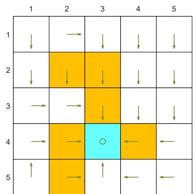  
(a) Optimal policy

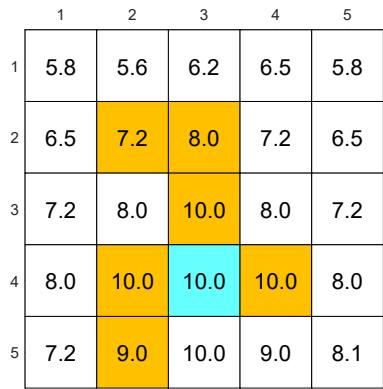  
(b) Optimal state value

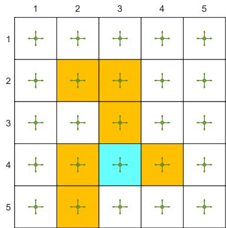  
(c) Behavior policy

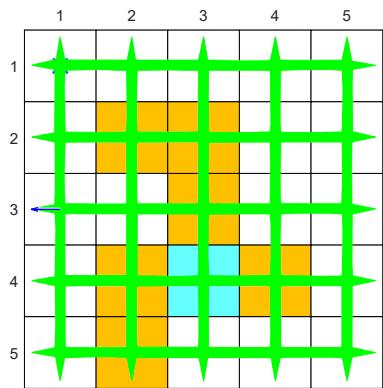  
(d) Generated episode

  
(e) Learned policy

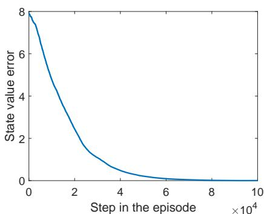  
(f) State value error when $q_0(s, a) = 0$

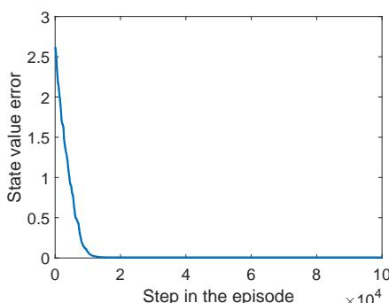  
(g) State value error when $q_0(s, a) = 10$

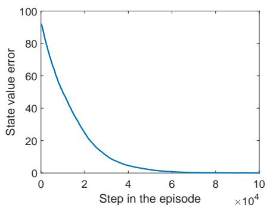  
(h) State value error when $q_0(s, a) = 100$   
Figure 7.4: Examples for demonstrating off-policy learning via Q-learning. The optimal policy and optimal state values are shown in (a) and (b), respectively. The behavior policy and the generated episode are shown in (c) and (d), respectively. The estimated policy and the estimation error evolution are shown in (e) and (f), respectively. The cases with different initial values are shown in (g) and (h).

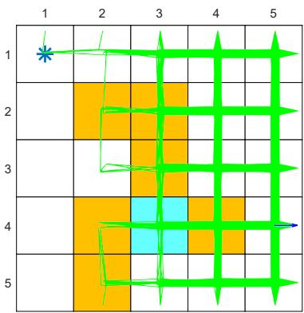

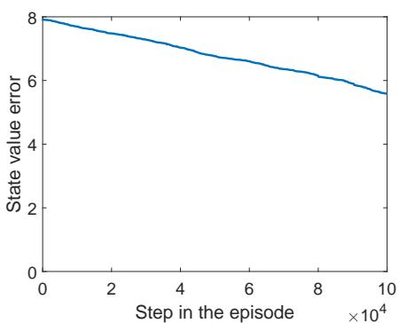  
(a) $\epsilon = 0.5$

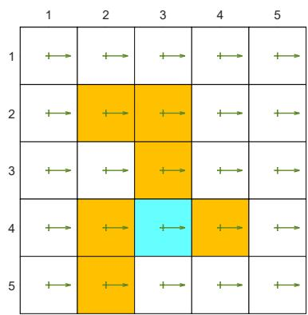

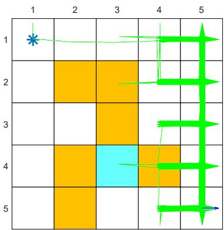

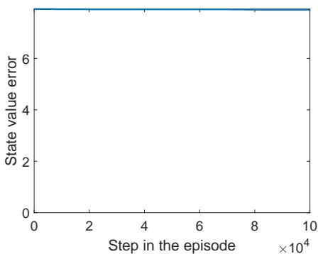  
(b) $\epsilon = 0.1$

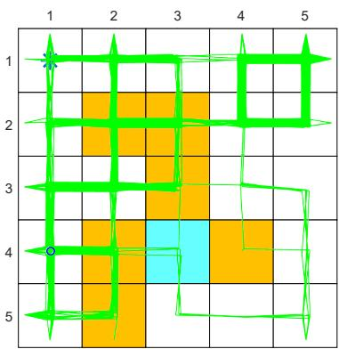

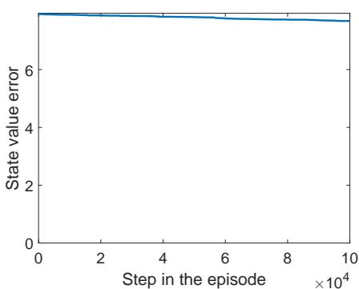  
(c) $\epsilon = 0.1$   
Figure 7.5: The performance of Q-learning drops when the behavior policy is not exploratory. The figures in the left column show the behavior policies. The figures in the middle column show the generated episodes following the corresponding behavior policies. The episode in each example has 100,000 steps. The figures in the right column show the evolution of the root-mean-square error of the estimated state values.

<table><tr><td>Algorithm</td><td>Expression of the TD target q̅t in (7.20)</td></tr><tr><td>Sarsa</td><td>q̅t = rt+1 + γqt(st+1, at+1)</td></tr><tr><td>n-step Sarsa</td><td>q̅t = rt+1 + γrt+2 + ··· + γnqt(st+n, at+n)</td></tr><tr><td>Q-learning</td><td>q̅t = rt+1 + γmaxaqt(st+1, a)</td></tr><tr><td>Monte Carlo</td><td>q̅t = rt+1 + γrt+2 + γ2rt+3 + ···</td></tr></table>

Table 7.2: A unified point of view of TD algorithms. Here, BE and BOE denote the Bellman equation and Bellman optimality equation, respectively.   

<table><tr><td>Algorithm</td><td>Equation to be solved</td></tr><tr><td>Sarsa</td><td>BE: qπ(s, a) = E[ Rt+1 + γqπ(St+1, At+1)|St = s, At = a]</td></tr><tr><td>n-step Sarsa</td><td>BE: qπ(s, a) = E[ Rt+1 + γRt+2 + ··· + γnqπ(St+n, At+n)|St = s, At = a]</td></tr><tr><td>Q-learning</td><td>BOE: q(s, a) = E[ Rt+1 + maxa q(St+1, a)|St = s, At = a]</td></tr><tr><td>Monte Carlo</td><td>BE: qπ(s, a) = E[ Rt+1 + γRt+2 + γ2Rt+3 + ··· |St = s, At = a]</td></tr></table>

where $\bar{q}_t$ is the $TD$ target. Different TD algorithms have different $\bar{q}_t$ . See Table 7.2 for a summary. The MC learning algorithm can be viewed as a special case of (7.20): we can set $\alpha_t(s_t, a_t) = 1$ and then (7.20) becomes $q_{t+1}(s_t, a_t) = \bar{q}_t$ .

Algorithm (7.20) can be viewed as a stochastic approximation algorithm for solving a unified equation: $q(s, a) = \mathbb{E}[\bar{q}_t | s, a]$ . This equation has different expressions with different $\bar{q}_t$ . These expressions are summarized in Table 7.2. As can be seen, all of the algorithms aim to solve the Bellman equation except Q-learning, which aims to solve the Bellman optimality equation.
