# 8.2 TD learning of state values based on function approximation

In this section, we show how to integrate the function approximation method into TD learning to estimate the state values of a given policy. This algorithm will be extended to learn action values and optimal policies in Section 8.3.

This section contains quite a few subsections and many coherent contents. It is better for us to review the contents first before diving into the details.

The function approximation method is formulated as an optimization problem. The objective function of this problem is introduced in Section 8.2.1. The TD learning algorithm for optimizing this objective function is introduced in Section 8.2.2.

To apply the TD learning algorithm, we need to select appropriate feature vectors. Section 8.2.3 discusses this problem.   
Examples are given in Section 8.2.4 to demonstrate the TD algorithm and the impacts of different feature vectors.   
A theoretical analysis of the TD algorithm is given in Section 8.2.5. This subsection is mathematically intensive. Readers may read it selectively based on their interests.

# 8.2.1 Objective function

Let $v_{\pi}(s)$ and $\hat{v}(s, w)$ be the true state value and approximated state value of $s \in S$ , respectively. The problem to be solved is to find an optimal $w$ so that $\hat{v}(s, w)$ can best approximate $v_{\pi}(s)$ for every $s$ . In particular, the objective function is

$$
J (w) = \mathbb {E} \left[ \left(v _ {\pi} (S) - \hat {v} (S, w)\right) ^ {2} \right], \tag {8.3}
$$

where the expectation is calculated with respect to the random variable $S \in S$ . While $S$ is a random variable, what is its probability distribution? This question is important for understanding this objective function. There are several ways to define the probability distribution of $S$ .

The first way is to use a uniform distribution. That is to treat all the states as equally important by setting the probability of each state to $1/n$ . In this case, the objective function in (8.3) becomes

$$
J (w) = \frac {1}{n} \sum_ {s \in \mathcal {S}} \left(v _ {\pi} (s) - \hat {v} (s, w)\right) ^ {2}, \tag {8.4}
$$

which is the average value of the approximation errors of all the states. However, this way does not consider the real dynamics of the Markov process under the given policy. Since some states may be rarely visited by a policy, it may be unreasonable to treat all the states as equally important.

The second way, which is the focus of this chapter, is to use the stationary distribution. The stationary distribution describes the long-term behavior of a Markov decision process. More specifically, after the agent executes a given policy for a sufficiently long period, the probability of the agent being located at any state can be described by this stationary distribution. Interested readers may see the details in Box 8.1.

Let $\{d_{\pi}(s)\}_{s\in S}$ denote the stationary distribution of the Markov process under policy $\pi$ . That is, the probability for the agent visiting $s$ after a long period of time is $d_{\pi}(s)$ . By definition, $\sum_{s\in S}d_{\pi}(s) = 1$ . Then, the objective function in (8.3) can be rewritten

as

$$
J (w) = \sum_ {s \in \mathcal {S}} d _ {\pi} (s) (v _ {\pi} (s) - \hat {v} (s, w)) ^ {2}, \tag {8.5}
$$

which is a weighted average of the approximation errors. The states that have higher probabilities of being visited are given greater weights.

It is notable that the value of $d_{\pi}(s)$ is nontrivial to obtain because it requires knowing the state transition probability matrix $P_{\pi}$ (see Box 8.1). Fortunately, we do not need to calculate the specific value of $d_{\pi}(s)$ to minimize this objective function as shown in the next subsection. In addition, it was assumed that the number of states was finite when we introduced (8.4) and (8.5). When the state space is continuous, we can replace the summations with integrals.

# Box 8.1: Stationary distribution of a Markov decision process

The key tool for analyzing stationary distribution is $P_{\pi} \in \mathbb{R}^{n \times n}$ , which is the probability transition matrix under the given policy $\pi$ . If the states are indexed as $s_1, \ldots, s_n$ , then $[P_{\pi}]_{ij}$ is defined as the probability for the agent moving from $s_i$ to $s_j$ . The definition of $P_{\pi}$ can be found in Section 2.6.

$\diamond$ Interpretation of $P_{\pi}^{k}$ ( $k = 1,2,3,\ldots$ ).

First of all, it is necessary to examine the interpretation of the entries in $P_{\pi}^{k}$ . The probability of the agent transitioning from $s_i$ to $s_j$ using exactly $k$ steps is denoted as

$$
p _ {i j} ^ {(k)} = \operatorname * {P r} (S _ {t _ {k}} = j | S _ {t _ {0}} = i),
$$

where $t_0$ and $t_k$ are the initial and $k$ th time steps, respectively. First, by the definition of $P_{\pi}$ , we have

$$
[ P _ {\pi} ] _ {i j} = p _ {i j} ^ {(1)},
$$

which means that $[P_{\pi}]_{ij}$ is the probability of transitioning from $s_i$ to $s_j$ using a single step. Second, consider $P_{\pi}^{2}$ . It can be verified that

$$
[ P _ {\pi} ^ {2} ] _ {i j} = [ P _ {\pi} P _ {\pi} ] _ {i j} = \sum_ {q = 1} ^ {n} [ P _ {\pi} ] _ {i q} [ P _ {\pi} ] _ {q j}.
$$

Since $[P_{\pi}]_{iq}[P_{\pi}]_{qj}$ is the joint probability of transitioning from $s_i$ to $s_q$ and then from $s_q$ to $s_j$ , we know that $[P_{\pi}^2]_{ij}$ is the probability of transitioning from $s_i$ to $s_j$

using exactly two steps. That is

$$
[ P _ {\pi} ^ {2} ] _ {i j} = p _ {i j} ^ {(2)}.
$$

Similarly, we know that

$$
[ P _ {\pi} ^ {k} ] _ {i j} = p _ {i j} ^ {(k)},
$$

which means that $[P_{\pi}^{k}]_{ij}$ is the probability of transitioning from $s_i$ to $s_j$ using exactly $k$ steps.

Definition of stationary distributions.

Let $d_0 \in \mathbb{R}^n$ be a vector representing the probability distribution of the states at the initial time step. For example, if $s$ is always selected as the starting state, then $d_0(s) = 1$ and the other entries of $d_0$ are 0. Let $d_k \in \mathbb{R}^n$ be the vector representing the probability distribution obtained after exactly $k$ steps starting from $d_0$ . Then, we have

$$
d _ {k} (s _ {i}) = \sum_ {j = 1} ^ {n} d _ {0} (s _ {j}) [ P _ {\pi} ^ {k} ] _ {j i}, \quad i = 1, 2, \dots . \tag {8.6}
$$

This equation indicates that the probability of the agent visiting $s_i$ at step $k$ equals the sum of the probabilities of the agent transitioning from $\{s_j\}_{j=1}^n$ to $s_i$ using exactly $k$ steps. The matrix-vector form of (8.6) is

$$
d _ {k} ^ {T} = d _ {0} ^ {T} P _ {\pi} ^ {k}. \tag {8.7}
$$

When we consider the long-term behavior of the Markov process, it holds under certain conditions that

$$
\lim _ {k \to \infty} P _ {\pi} ^ {k} = \mathbf {1} _ {n} d _ {\pi} ^ {T}, \tag {8.8}
$$

where $\mathbf{1}_n = [1,\dots ,1]^T\in \mathbb{R}^n$ and $\mathbf{1}_nd_{\pi}^{T}$ is a constant matrix with all its rows equal to $d_{\pi}^{T}$ . The conditions under which (8.8) is valid will be discussed later. Substituting (8.8) into (8.7) yields

$$
\lim  _ {k \rightarrow \infty} d _ {k} ^ {T} = d _ {0} ^ {T} \lim  _ {k \rightarrow \infty} P _ {\pi} ^ {k} = d _ {0} ^ {T} \mathbf {1} _ {n} d _ {\pi} ^ {T} = d _ {\pi} ^ {T}, \tag {8.9}
$$

where the last equality is valid because $d_0^T\mathbf{1}_n = 1$

Equation (8.9) means that the state distribution $d_{k}$ converges to a constant value $d_{\pi}$ , which is called the limiting distribution. The limiting distribution depends

on the system model and the policy $\pi$ . Interestingly, it is independent of the initial distribution $d_0$ . That is, regardless of which state the agent starts from, the probability distribution of the agent after a sufficiently long period can always be described by the limiting distribution.

The value of $d_{\pi}$ can be calculated in the following way. Taking the limit of both sides of $d_k^T = d_{k - 1}^T P_\pi$ gives $\lim_{k\to \infty}d_k^T = \lim_{k\to \infty}d_{k - 1}^T P_\pi$ and hence

$$
d _ {\pi} ^ {T} = d _ {\pi} ^ {T} P _ {\pi}. \tag {8.10}
$$

As a result, $d_{\pi}$ is the left eigenvector of $P_{\pi}$ associated with the eigenvalue 1. The solution of (8.10) is called the stationary distribution. It holds that $\sum_{s \in S} d_{\pi}(s) = 1$ and $d_{\pi}(s) > 0$ for all $s \in S$ . The reason why $d_{\pi}(s) > 0$ (not $d_{\pi}(s) \geq 0$ ) will be explained later.

$\diamond$ Conditions for the uniqueness of stationary distributions.

The solution $d_{\pi}$ of (8.10) is usually called a stationary distribution, whereas the distribution $d_{\pi}$ in (8.9) is usually called the limiting distribution. Note that (8.9) implies (8.10), but the converse may not be true. A general class of Markov processes that have unique stationary (or limiting) distributions is irreducible (or regular) Markov processes. Some necessary definitions are given below. More details can be found in [49, Chapter IV].

- State $s_j$ is said to be accessible from state $s_i$ if there exists a finite integer $k$ so that $[P_{\pi}]_{ij}^k > 0$ , which means that the agent starting from $s_i$ can always reach $s_j$ after a finite number of transitions.   
- If two states $s_i$ and $s_j$ are mutually accessible, then the two states are said to communicate.   
- A Markov process is called irreducible if all of its states communicate with each other. In other words, the agent starting from an arbitrary state can always reach any other state within a finite number of steps. Mathematically, it indicates that, for any $s_i$ and $s_j$ , there exists $k \geq 1$ such that $[P_{\pi}^k]_{ij} > 0$ (the value of $k$ may vary for different $i,j$ ).   
- A Markov process is called regular if there exists $k \geq 1$ such that $[P_{\pi}^{k}]_{ij} > 0$ for all $i, j$ . Equivalently, there exists $k \geq 1$ such that $P_{\pi}^{k} > 0$ , where $>$ is elementwise. As a result, every state is reachable from any other state within at most $k$ steps. A regular Markov process is also irreducible, but the converse is not true. However, if a Markov process is irreducible and there exists $i$ such that $[P_{\pi}]_{ii} > 0$ , then it is also regular. Moreover, if $P_{\pi}^{k} > 0$ , then $P_{\pi}^{k'} > 0$ for any $k' \geq k$ since $P_{\pi} \geq 0$ . It then follows from (8.9) that $d_{\pi}(s) > 0$ for every $s$ .

Policies that may lead to unique stationary distributions.

Once the policy is given, a Markov decision process becomes a Markov process, whose long-term behavior is jointly determined by the given policy and the system model. Then, an important question is what kind of policies can lead to regular Markov processes? In general, the answer is exploratory policies such as $\epsilon$ -greedy policies. That is because an exploratory policy has a positive probability of taking any action at any state. As a result, the states can communicate with each other when the system model allows them to do so.

An example is given in Figure 8.5 to illustrate stationary distributions. The policy in this example is $\epsilon$ -greedy with $\epsilon = 0.5$ . The states are indexed as $s_1, s_2, s_3, s_4$ , which correspond to the top-left, top-right, bottom-left, and bottom-right cells in the grid, respectively.

We compare two methods to calculate the stationary distributions. The first method is to solve (8.10) to get the theoretical value of $d_{\pi}$ . The second method is to estimate $d_{\pi}$ numerically: we start from an arbitrary initial state and generate a sufficiently long episode by following the given policy. Then, $d_{\pi}$ can be estimated by the ratio between the number of times each state is visited in the episode and the total length of the episode. The estimation result is more accurate when the episode is longer. We next compare the theoretical and estimated results.

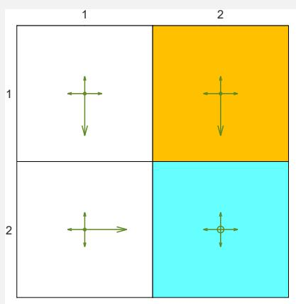

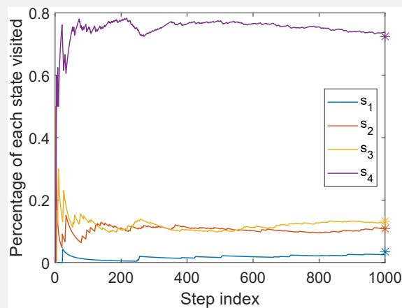  
Figure 8.5: Long-term behavior of an $\epsilon$ -greedy policy with $\epsilon = 0.5$ . The asterisks in the right figure represent the theoretical values of the elements of $d_{\pi}$ .

- Theoretical value of $d_{\pi}$ : It can be verified that the Markov process induced by the policy is both irreducible and regular. That is due to the following reasons. First, since all the states communicate, the resulting Markov process is irreducible. Second, since every state can transition to itself, the resulting

Markov process is regular. It can be seen from Figure 8.5 that

$$
P _ {\pi} ^ {T} = \left[ \begin{array}{c c c c} 0. 3 & 0. 1 & 0. 1 & 0 \\ 0. 1 & 0. 3 & 0 & 0. 1 \\ 0. 6 & 0 & 0. 3 & 0. 1 \\ 0 & 0. 6 & 0. 6 & 0. 8 \end{array} \right].
$$

The eigenvalues of $P_{\pi}^{T}$ can be calculated as $\{-0.0449, 0.3, 0.4449, 1\}$ . The unit-length (right) eigenvector of $P_{\pi}^{T}$ corresponding to the eigenvalue 1 is $[0.0463, 0.1455, 0.1785, 0.9720]^{T}$ . After scaling this vector so that the sum of all its elements is equal to 1, we obtain the theoretical value of $d_{\pi}$ as follows:

$$
d _ {\pi} = \left[ \begin{array}{l} 0. 0 3 4 5 \\ 0. 1 0 8 4 \\ 0. 1 3 3 0 \\ 0. 7 2 4 1 \end{array} \right].
$$

The $i$ th element of $d_{\pi}$ corresponds to the probability of the agent visiting $s_i$ in the long run.

- Estimated value of $d_{\pi}$ : We next verify the above theoretical value of $d_{\pi}$ by executing the policy for sufficiently many steps in the simulation. Specifically, we select $s_1$ as the starting state and run 1,000 steps by following the policy. The proportion of the visits of each state during the process is shown in Figure 8.5. It can be seen that the proportions converge to the theoretical value of $d_{\pi}$ after hundreds of steps.

# 8.2.2 Optimization algorithms

To minimize the objective function $J(w)$ in (8.3), we can use the gradient descent algorithm:

$$
w _ {k + 1} = w _ {k} - \alpha_ {k} \nabla_ {w} J (w _ {k}),
$$

where

$$
\begin{array}{l} \nabla_ {w} J (w _ {k}) = \nabla_ {w} \mathbb {E} [ (v _ {\pi} (S) - \hat {v} (S, w _ {k})) ^ {2} ], \\ = \mathbb {E} \left[ \nabla_ {w} \left(v _ {\pi} (S) - \hat {v} (S, w _ {k})\right) ^ {2} \right] \\ = 2 \mathbb {E} \left[ \left(v _ {\pi} (S) - \hat {v} (S, w _ {k})\right) \left(- \nabla_ {w} \hat {v} (S, w _ {k})\right) \right] \\ = - 2 \mathbb {E} \left[ \left(v _ {\pi} (S) - \hat {v} (S, w _ {k})\right) \nabla_ {w} \hat {v} (S, w _ {k}) \right]. \\ \end{array}
$$

Therefore, the gradient descent algorithm is

$$
w _ {k + 1} = w _ {k} + 2 \alpha_ {k} \mathbb {E} [ (v _ {\pi} (S) - \hat {v} (S, w _ {k})) \nabla_ {w} \hat {v} (S, w _ {k}) ], \tag {8.11}
$$

where the coefficient 2 before $\alpha_{k}$ can be merged into $\alpha_{k}$ without loss of generality. The algorithm in (8.11) requires calculating the expectation. In the spirit of stochastic gradient descent, we can replace the true gradient with a stochastic gradient. Then, (8.11) becomes

$$
w _ {t + 1} = w _ {t} + \alpha_ {t} \left(v _ {\pi} (s _ {t}) - \hat {v} \left(s _ {t}, w _ {t}\right)\right) \nabla_ {w} \hat {v} \left(s _ {t}, w _ {t}\right), \tag {8.12}
$$

where $s_t$ is a sample of $S$ at time $t$ .

Notably, (8.12) is not implementable because it requires the true state value $v_{\pi}$ , which is unknown and must be estimated. We can replace $v_{\pi}(s_t)$ with an approximation to make the algorithm implementable. The following two methods can be used to do so.

$\diamond$ Monte Carlo method: Suppose that we have an episode $(s_0, r_1, s_1, r_2, \ldots)$ . Let $g_t$ be the discounted return starting from $s_t$ . Then, $g_t$ can be used as an approximation of $v_\pi(s_t)$ . The algorithm in (8.12) becomes

$$
w _ {t + 1} = w _ {t} + \alpha_ {t} \big (g _ {t} - \hat {v} (s _ {t}, w _ {t}) \big) \nabla_ {w} \hat {v} (s _ {t}, w _ {t}).
$$

This is the algorithm of Monte Carlo learning with function approximation.

Temporal-difference method: In the spirit of TD learning, $r_{t + 1} + \gamma \hat{v} (s_{t + 1},w_t)$ can be used as an approximation of $v_{\pi}(s_t)$ . The algorithm in (8.12) becomes

$$
w _ {t + 1} = w _ {t} + \alpha_ {t} \left[ r _ {t + 1} + \gamma \hat {v} \left(s _ {t + 1}, w _ {t}\right) - \hat {v} \left(s _ {t}, w _ {t}\right) \right] \nabla_ {w} \hat {v} \left(s _ {t}, w _ {t}\right). \tag {8.13}
$$

This is the algorithm of TD learning with function approximation. This algorithm is summarized in Algorithm 8.1.

Understanding the TD algorithm in (8.13) is important for studying the other algorithms in this chapter. Notably, (8.13) can only learn the state values of a given policy. It will be extended to algorithms that can learn action values in Sections 8.3.1 and 8.3.2.

# 8.2.3 Selection of function approximators

To apply the TD algorithm in (8.13), we need to select appropriate $\hat{v}(s, w)$ . There are two ways to do that. The first is to use an artificial neural network as a nonlinear function approximator. The input of the neural network is the state, the output is $\hat{v}(s, w)$ , and the network parameter is $w$ . The second is to simply use a linear function:

$$
\hat {v} (s, w) = \phi^ {T} (s) w,
$$

# Algorithm 8.1: TD learning of state values with function approximation

Initialization: A function $\hat{v}(s, w)$ that is a differentiable in $w$ . Initial parameter $w_0$ . Goal: Learn the true state values of a given policy $\pi$ .

For each episode $\{(s_t,r_{t + 1},s_{t + 1})\}_{t}$ generated by $\pi$ ,do For each sample $(s_{t},r_{t + 1},s_{t + 1})$ , do In the general case, $w_{t + 1} = w_{t} + \alpha_{t}\left[r_{t + 1} + \gamma \hat{v} (s_{t + 1},w_{t}) - \hat{v} (s_{t},w_{t})\right]\nabla_{w}\hat{v} (s_{t},w_{t})$ In the linear case, $w_{t + 1} = w_{t} + \alpha_{t}\bigl [r_{t + 1} + \gamma \phi^{T}(s_{t + 1})w_{t} - \phi^{T}(s_{t})w_{t}\bigr ]\phi (s_{t})$

where $\phi(s) \in \mathbb{R}^m$ is the feature vector of $s$ . The lengths of $\phi(s)$ and $w$ are equal to $m$ , which is usually much smaller than the number of states. In the linear case, the gradient is

$$
\nabla_ {w} \hat {v} (s, w) = \phi (s),
$$

Substituting which into (8.13) yields

$$
w _ {t + 1} = w _ {t} + \alpha_ {t} \left[ r _ {t + 1} + \gamma \phi^ {T} \left(s _ {t + 1}\right) w _ {t} - \phi^ {T} \left(s _ {t}\right) w _ {t} \right] \phi \left(s _ {t}\right). \tag {8.14}
$$

This is the algorithm of TD learning with linear function approximation. We call it TD-Linear for short.

The linear case is much better understood in theory than the nonlinear case. However, its approximation ability is limited. It is also nontrivial to select appropriate feature vectors for complex tasks. By contrast, artificial neural networks can approximate values as black-box universal nonlinear approximators, which are more friendly to use.

Nevertheless, it is still meaningful to study the linear case. A better understanding of the linear case can help readers better grasp the idea of the function approximation method. Moreover, the linear case is sufficient for solving the simple grid world tasks considered in this book. More importantly, the linear case is still powerful in the sense that the tabular method can be viewed as a special linear case. More information can be found in Box 8.2.

# Box 8.2: Tabular TD learning is a special case of TD-Linear

We next show that the tabular TD algorithm in (7.1) in Chapter 7 is a special case of the TD-Linear algorithm in (8.14).

Consider the following special feature vector for any $s \in S$ :

$$
\phi (s) = e _ {s} \in \mathbb {R} ^ {n},
$$

where $e_s$ is the vector with the entry corresponding to $s$ equal to 1 and the other

entries equal to 0. In this case,

$$
\hat {v} (s, w) = e _ {s} ^ {T} w = w (s),
$$

where $w(s)$ is the entry in $w$ that corresponds to $s$ . Substituting the above equation into (8.14) yields

$$
w _ {t + 1} = w _ {t} + \alpha_ {t} \big (r _ {t + 1} + \gamma w _ {t} (s _ {t + 1}) - w _ {t} (s _ {t}) \big) e _ {s _ {t}}.
$$

The above equation merely updates the entry $w_{t}(s_{t})$ due to the definition of $e_{s_t}$ . Motivated by this, multiplying $e_{s_t}^T$ on both sides of the equation yields

$$
w _ {t + 1} (s _ {t}) = w _ {t} (s _ {t}) + \alpha_ {t} \big (r _ {t + 1} + \gamma w _ {t} (s _ {t + 1}) - w _ {t} (s _ {t}) \big),
$$

which is exactly the tabular TD algorithm in (7.1).

In summary, by selecting the feature vector as $\phi(s) = e_s$ , the TD-Linear algorithm becomes the tabular TD algorithm.

# 8.2.4 Illustrative examples

We next present some examples for demonstrating how to use the TD-Linear algorithm in (8.14) to estimate the state values of a given policy. In the meantime, we demonstrate how to select feature vectors.

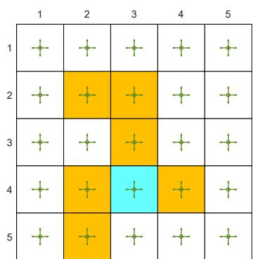  
(a)

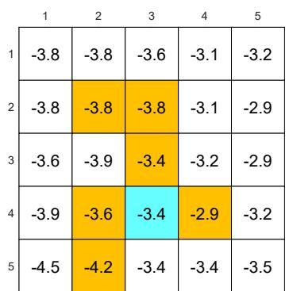  
(b)

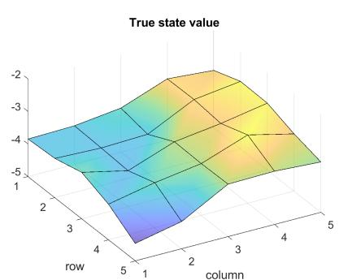  
(c)   
Figure 8.6: (a) The policy to be evaluated. (b) The true state values are represented as a table. (c) The true state values are represented as a 3D surface.

The grid world example is shown in Figure 8.6. The given policy takes any action at a state with a probability of 0.2. Our goal is to estimate the state values under this policy. There are 25 state values in total. The true state values are shown in Figure 8.6(b). The true state values are visualized as a three-dimensional surface in Figure 8.6(c).

We next show that we can use fewer than 25 parameters to approximate these state values. The simulation setup is as follows. Five hundred episodes are generated by the given policy. Each episode has 500 steps and starts from a randomly selected state-action pair following a uniform distribution. In addition, in each simulation trial, the parameter vector $w$ is randomly initialized such that each element is drawn from a standard normal distribution with a zero mean and a standard deviation of 1. We set $r_{\text{forbidden}} = r_{\text{boundary}} = -1$ , $r_{\text{target}} = 1$ , and $\gamma = 0.9$ .

To implement the TD-Linear algorithm, we need to select the feature vector $\phi(s)$ first. There are different ways to do that as shown below.

The first type of feature vector is based on polynomials. In the grid world example, a state $s$ corresponds to a 2D location. Let $x$ and $y$ denote the column and row indexes of $s$ , respectively. To avoid numerical issues, we normalize $x$ and $y$ so that their values are within the interval of $[-1, +1]$ . With a slight abuse of notation, the normalized values are also represented by $x$ and $y$ . Then, the simplest feature vector is

$$
\phi (s) = \left[ \begin{array}{l} x \\ y \end{array} \right] \in \mathbb {R} ^ {2}.
$$

In this case, we have

$$
\hat {v} (s, w) = \phi^ {T} (s) w = [ x, y ] \left[ \begin{array}{l} w _ {1} \\ w _ {2} \end{array} \right] = w _ {1} x + w _ {2} y.
$$

When $w$ is given, $\hat{v}(s, w) = w_1 x + w_2 y$ represents a 2D plane that passes through the origin. Since the surface of the state values may not pass through the origin, we need to introduce a bias to the 2D plane to better approximate the state values. To do that, we consider the following 3D feature vector:

$$
\phi (s) = \left[ \begin{array}{l} 1 \\ x \\ y \end{array} \right] \in \mathbb {R} ^ {3}. \tag {8.15}
$$

In this case, the approximated state value is

$$
\hat {v} (s, w) = \phi^ {T} (s) w = [ 1, x, y ] \left[ \begin{array}{l} w _ {1} \\ w _ {2} \\ w _ {3} \end{array} \right] = w _ {1} + w _ {2} x + w _ {3} y.
$$

When $w$ is given, $\hat{v}(s, w)$ corresponds to a plane that may not pass through the origin. Notably, $\phi(s)$ can also be defined as $\phi(s) = [x, y, 1]^T$ , where the order of the elements does not matter.

The estimation result when we use the feature vector in (8.15) is shown in Fig-

ure 8.7(a). It can be seen that the estimated state values form a 2D plane. Although the estimation error converges as more episodes are used, the error cannot decrease to zero due to the limited approximation ability of a 2D plane.

To enhance the approximation ability, we can increase the dimension of the feature vector. To that end, consider

$$
\phi (s) = \left[ 1, x, y, x ^ {2}, y ^ {2}, x y \right] ^ {T} \in \mathbb {R} ^ {6}. \tag {8.16}
$$

In this case, $\hat{v}(s, w) = \phi^T(s)w = w_1 + w_2x + w_3y + w_4x^2 + w_5y^2 + w_6xy$ , which corresponds to a quadratic 3D surface. We can further increase the dimension of the feature vector:

$$
\phi (s) = \left[ 1, x, y, x ^ {2}, y ^ {2}, x y, x ^ {3}, y ^ {3}, x ^ {2} y, x y ^ {2} \right] ^ {T} \in \mathbb {R} ^ {1 0}. \tag {8.17}
$$

The estimation results when we use the feature vectors in (8.16) and (8.17) are shown in Figures 8.7(b)-(c). As can be seen, the longer the feature vector is, the more accurately the state values can be approximated. However, in all three cases, the estimation error cannot converge to zero because these linear approximators still have limited approximation abilities.

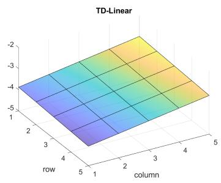

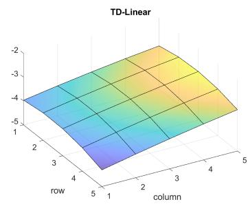

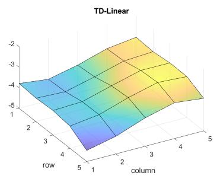

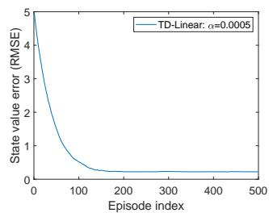  
(a) $\phi (s)\in \mathbb{R}^3$

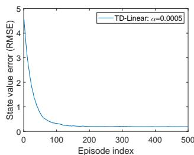  
(b) $\phi (s)\in \mathbb{R}^6$

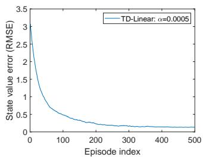  
(c) $\phi (s)\in \mathbb{R}^{10}$   
Figure 8.7: TD-Linear estimation results obtained with the polynomial features in (8.15), (8.16), and (8.17).

In addition to polynomial feature vectors, many other types of features are available such as Fourier basis and tile coding [3, Chapter 9]. First, the values of $x$ and $y$ of

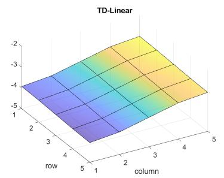

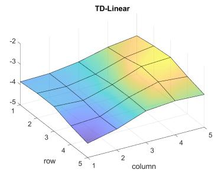

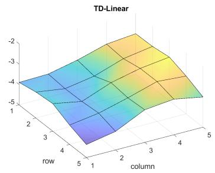

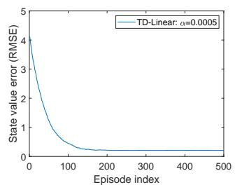  
(a) $q = 1$ and $\phi (s)\in \mathbb{R}^4$

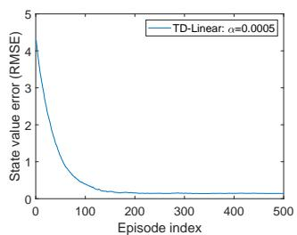  
(b) $q = 2$ and $\phi (s)\in \mathbb{R}^9$

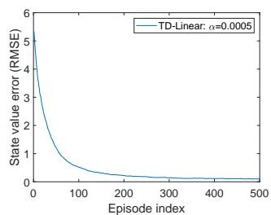  
(c) $q = 3$ and $\phi (s)\in \mathbb{R}^{16}$   
Figure 8.8: TD-Linear estimation results obtained with the Fourier features in (8.18).

each state are normalized to the interval of $[0,1]$ . The resulting feature vector is

$$
\phi (s) = \left[ \begin{array}{c} \vdots \\ \cos (\pi (c _ {1} x + c _ {2} y)) \\ \vdots \end{array} \right] \in \mathbb {R} ^ {(q + 1) ^ {2}}, \tag {8.18}
$$

where $\pi$ denotes the circumference ratio, which is 3.1415... , instead of a policy. Here, $c_{1}$ or $c_{2}$ can be set as any integers in $\{0,1,\dots ,q\}$ , where $q$ is a user-specified integer. As a result, there are $(q + 1)^2$ possible values for the pair $(c_{1},c_{2})$ to take. Hence, the dimension of $\phi (s)$ is $(q + 1)^2$ . For example, in the case of $q = 1$ , the feature vector is

$$
\phi (s) = \left[ \begin{array}{c} \cos (\pi (0 x + 0 y)) \\ \cos (\pi (0 x + 1 y)) \\ \cos (\pi (1 x + 0 y)) \\ \cos (\pi (1 x + 1 y)) \end{array} \right] = \left[ \begin{array}{c} 1 \\ \cos (\pi y) \\ \cos (\pi x) \\ \cos (\pi (x + y)) \end{array} \right] \in \mathbb {R} ^ {4}.
$$

The estimation results obtained when we use the Fourier features with $q = 1,2,3$ are shown in Figure 8.8. The dimensions of the feature vectors in the three cases are 4,9,16, respectively. As can be seen, the higher the dimension of the feature vector is, the more accurately the state values can be approximated.

# 8.2.5 Theoretical analysis

Thus far, we have finished describing the story of TD learning with function approximation. This story started from the objective function in (8.3). To optimize this objective

function, we introduced the stochastic algorithm in (8.12). Later, the true value function in the algorithm, which was unknown, was replaced by an approximation, leading to the TD algorithm in (8.13). Although this story is helpful for understanding the basic idea of value function approximation, it is not mathematically rigorous. For example, the algorithm in (8.13) actually does not minimize the objective function in (8.3).

We next present a theoretical analysis of the TD algorithm in (8.13) to reveal why the algorithm works effectively and what mathematical problems it solves. Since general nonlinear approximators are difficult to analyze, this part only considers the linear case. Readers are advised to read selectively based on their interests since this part is mathematically intensive.

# Convergence analysis

To study the convergence property of (8.13), we first consider the following deterministic algorithm:

$$
w _ {t + 1} = w _ {t} + \alpha_ {t} \mathbb {E} \left[ \left(r _ {t + 1} + \gamma \phi^ {T} \left(s _ {t + 1}\right) w _ {t} - \phi^ {T} \left(s _ {t}\right) w _ {t}\right) \phi \left(s _ {t}\right) \right], \tag {8.19}
$$

where the expectation is calculated with respect to the random variables $s_t, s_{t+1}, r_{t+1}$ . The distribution of $s_t$ is assumed to be the stationary distribution $d_\pi$ . The algorithm in (8.19) is deterministic because the random variables $s_t, s_{t+1}, r_{t+1}$ all disappear after calculating the expectation.

Why would we consider this deterministic algorithm? First, the convergence of this deterministic algorithm is easier (though nontrivial) to analyze. Second and more importantly, the convergence of this deterministic algorithm implies the convergence of the stochastic TD algorithm in (8.13). That is because (8.13) can be viewed as a stochastic gradient descent (SGD) implementation of (8.19). Therefore, we only need to study the convergence property of the deterministic algorithm.

Although the expression of (8.19) may look complex at first glance, it can be greatly simplified. To do that, define

$$
\Phi = \left[ \begin{array}{c} \vdots \\ \phi^ {T} (s) \\ \vdots \end{array} \right] \in \mathbb {R} ^ {n \times m}, \quad D = \left[ \begin{array}{c c c} \ddots & & \\ & d _ {\pi} (s) & \\ & & \ddots \end{array} \right] \in \mathbb {R} ^ {n \times n}, \tag {8.20}
$$

where $\Phi$ is the matrix containing all the feature vectors, and $D$ is a diagonal matrix with the stationary distribution in its diagonal entries. The two matrices will be frequently used.

Lemma 8.1. The expectation in (8.19) can be rewritten as

$$
\mathbb {E} \left[ \left(r _ {t + 1} + \gamma \phi^ {T} (s _ {t + 1}) w _ {t} - \phi^ {T} (s _ {t}) w _ {t}\right) \phi (s _ {t}) \right] = b - A w _ {t},
$$

where

$$
A \doteq \Phi^ {T} D (I - \gamma P _ {\pi}) \Phi \in \mathbb {R} ^ {m \times m},
$$

$$
b \doteq \Phi^ {T} D r _ {\pi} \in \mathbb {R} ^ {m}. \tag {8.21}
$$

Here, $P_{\pi}, r_{\pi}$ are the two terms in the Bellman equation $v_{\pi} = r_{\pi} + \gamma P_{\pi}v_{\pi}$ , and $I$ is the identity matrix with appropriate dimensions.

The proof is given in Box 8.3. With the expression in Lemma 8.1, the deterministic algorithm in (8.19) can be rewritten as

$$
w _ {t + 1} = w _ {t} + \alpha_ {t} (b - A w _ {t}), \tag {8.22}
$$

which is a simple deterministic process. Its convergence is analyzed below.

First, what is the converged value of $w_{t}$ ? Hypothetically, if $w_{t}$ converges to a constant value $w^{*}$ as $t \to \infty$ , then (8.22) implies $w^{*} = w^{*} + \alpha_{\infty}(b - Aw^{*})$ , which suggests that $b - Aw^{*} = 0$ and hence

$$
w ^ {*} = A ^ {- 1} b.
$$

Several remarks about this converged value are given below.

$\diamond$ Is $A$ invertible? The answer is yes. In fact, $A$ is not only invertible but also positive definite. That is, for any nonzero vector $x$ with appropriate dimensions, $x^T A x > 0$ . The proof is given in Box 8.4.   
$\diamond$ What is the interpretation of $w^{*} = A^{-1}b$ ? It is actually the optimal solution for minimizing the projected Bellman error. The details will be introduced in Section 8.2.5.   
$\diamond$ The tabular method is a special case. One interesting result is that, when the dimensionality of $w$ equals $n = |\mathcal{S}|$ and $\phi(s) = [0, \ldots, 1, \ldots, 0]^T$ , where the entry corresponding to $s$ is 1, we have

$$
w ^ {*} = A ^ {- 1} b = v _ {\pi}. \tag {8.23}
$$

This equation indicates that the parameter vector to be learned is actually the true state value. This conclusion is consistent with the fact that the tabular TD algorithm is a special case of the TD-Linear algorithm, as introduced in Box 8.2. The proof of (8.23) is given below. It can be verified that $\Phi = I$ in this case and hence $A = \Phi^T D(I - \gamma P_\pi)\Phi = D(I - \gamma P_\pi)$ and $b = \Phi^T Dr_\pi = Dr_\pi$ . Thus, $w^* = A^{-1}b = (I - \gamma P_\pi)^{-1}D^{-1}Dr_\pi = (I - \gamma P_\pi)^{-1}r_\pi = v_\pi$ .

Second, we prove that $w_{t}$ in (8.22) converges to $w^{*} = A^{-1}b$ as $t \to \infty$ . Since (8.22) is a simple deterministic process, it can be proven in many ways. We present two proofs as follows.

Proof 1: Define the convergence error as $\delta_t \doteq w_t - w^*$ . We only need to show that $\delta_t$ converges to zero. To do that, substituting $w_t = \delta_t + w^*$ into (8.22) gives

$$
\delta_ {t + 1} = \delta_ {t} - \alpha_ {t} A \delta_ {t} = (I - \alpha_ {t} A) \delta_ {t}.
$$

It then follows that

$$
\delta_ {t + 1} = (I - \alpha_ {t} A) \dots (I - \alpha_ {0} A) \delta_ {0}.
$$

Consider the simple case where $\alpha_{t} = \alpha$ for all $t$ . Then, we have

$$
\left\| \delta_ {t + 1} \right\| _ {2} \leq \left\| I - \alpha A \right\| _ {2} ^ {t + 1} \left\| \delta_ {0} \right\| _ {2}.
$$

When $\alpha > 0$ is sufficiently small, we have that $\|I - \alpha A\|_2 < 1$ and hence $\delta_t \to 0$ as $t \to \infty$ . The reason why $\|I - \alpha A\|_2 < 1$ holds is that $A$ is positive definite and hence $x^T (I - \alpha A)x < 1$ for any $x$ .

Proof 2: Consider $g(w) \doteq b - Aw$ . Since $w^*$ is the root of $g(w) = 0$ , the task is actually a root-finding problem. The algorithm in (8.22) is actually a Robbins-Monro (RM) algorithm. Although the original RM algorithm was designed for stochastic processes, it can also be applied to deterministic cases. The convergence of RM algorithms can shed light on the convergence of $w_{t+1} = w_t + \alpha_t(b - Aw_t)$ . That is, $w_t$ converges to $w^*$ when $\sum_t \alpha_t = \infty$ and $\sum_t \alpha_t^2 < \infty$ .

# Box 8.3: Proof of Lemma 8.1

By using the law of total expectation, we have

$$
\begin{array}{l} \mathbb {E} \left[ r _ {t + 1} \phi (s _ {t}) + \phi (s _ {t}) \left(\gamma \phi^ {T} (s _ {t + 1}) - \phi^ {T} (s _ {t})\right) w _ {t} \right] \\ = \sum_ {s \in \mathcal {S}} d _ {\pi} (s) \mathbb {E} \left[ r _ {t + 1} \phi \left(s _ {t}\right) + \phi \left(s _ {t}\right) \left(\gamma \phi^ {T} \left(s _ {t + 1}\right) - \phi^ {T} \left(s _ {t}\right)\right) w _ {t} \mid s _ {t} = s \right] \\ = \sum_ {s \in \mathcal {S}} d _ {\pi} (s) \mathbb {E} \left[ r _ {t + 1} \phi \left(s _ {t}\right) \mid s _ {t} = s \right] + \sum_ {s \in \mathcal {S}} d _ {\pi} (s) \mathbb {E} \left[ \phi \left(s _ {t}\right) \left(\gamma \phi^ {T} \left(s _ {t + 1}\right) - \phi^ {T} \left(s _ {t}\right)\right) w _ {t} \mid s _ {t} = s \right]. \tag {8.24} \\ \end{array}
$$

Here, $s_t$ is assumed to obey the stationary distribution $d_{\pi}$ .

First, consider the first term in (8.24). Note that

$$
\mathbb {E} \left[ r _ {t + 1} \phi \left(s _ {t}\right) \mid s _ {t} = s \right] = \phi (s) \mathbb {E} \left[ r _ {t + 1} \mid s _ {t} = s \right] = \phi (s) r _ {\pi} (s),
$$

where $r_{\pi}(s) = \sum_{a}\pi (a|s)\sum_{r}rp(r|s,a)$ . Then, the first term in (8.24) can be rewritten

as

$$
\sum_ {s \in \mathcal {S}} d _ {\pi} (s) \mathbb {E} \left[ r _ {t + 1} \phi \left(s _ {t}\right) \mid s _ {t} = s \right] = \sum_ {s \in \mathcal {S}} d _ {\pi} (s) \phi (s) r _ {\pi} (s) = \Phi^ {T} D r _ {\pi}, \tag {8.25}
$$

where $r_{\pi} = [\dots ,r_{\pi}(s),\dots ]^{T}\in \mathbb{R}^{n}$

Second, consider the second term in (8.24). Since

$$
\begin{array}{l} \mathbb {E} \left[ \phi (s _ {t}) \left(\gamma \phi^ {T} (s _ {t + 1}) - \phi^ {T} (s _ {t})\right) w _ {t} \mid s _ {t} = s \right] \\ = - \mathbb {E} \left[ \phi (s _ {t}) \phi^ {T} (s _ {t}) w _ {t} \mid s _ {t} = s \right] + \mathbb {E} \left[ \gamma \phi (s _ {t}) \phi^ {T} (s _ {t + 1}) w _ {t} \mid s _ {t} = s \right] \\ = - \phi (s) \phi^ {T} (s) w _ {t} + \gamma \phi (s) \mathbb {E} \left[ \phi^ {T} \left(s _ {t + 1}\right) \mid s _ {t} = s \right] w _ {t} \\ = - \phi (s) \phi^ {T} (s) w _ {t} + \gamma \phi (s) \sum_ {s ^ {\prime} \in \mathcal {S}} p (s ^ {\prime} | s) \phi^ {T} (s ^ {\prime}) w _ {t}, \\ \end{array}
$$

the second term in (8.24) becomes

$$
\begin{array}{l} \sum_ {s \in \mathcal {S}} d _ {\pi} (s) \mathbb {E} \left[ \phi \left(s _ {t}\right) \left(\gamma \phi^ {T} \left(s _ {t + 1}\right) - \phi^ {T} \left(s _ {t}\right)\right) w _ {t} \mid s _ {t} = s \right] \\ = \sum_ {s \in \mathcal {S}} d _ {\pi} (s) \left[ - \phi (s) \phi^ {T} (s) w _ {t} + \gamma \phi (s) \sum_ {s ^ {\prime} \in \mathcal {S}} p (s ^ {\prime} | s) \phi^ {T} (s ^ {\prime}) w _ {t} \right] \\ = \sum_ {s \in \mathcal {S}} d _ {\pi} (s) \phi (s) \left[ - \phi (s) + \gamma \sum_ {s ^ {\prime} \in \mathcal {S}} p \left(s ^ {\prime} | s\right) \phi \left(s ^ {\prime}\right) \right] ^ {T} w _ {t} \\ = \Phi^ {T} D (- \Phi + \gamma P _ {\pi} \Phi) w _ {t} \\ = - \Phi^ {T} D (I - \gamma P _ {\pi}) \Phi w _ {t}. \tag {8.26} \\ \end{array}
$$

Combining (8.25) and (8.26) gives

$$
\begin{array}{l} \mathbb {E} \left[ \left(r _ {t + 1} + \gamma \phi^ {T} (s _ {t + 1}) w _ {t} - \phi^ {T} (s _ {t}) w _ {t}\right) \phi (s _ {t}) \right] = \Phi^ {T} D r _ {\pi} - \Phi^ {T} D (I - \gamma P _ {\pi}) \Phi w _ {t} \\ \dot {=} b - A w _ {t}, \tag {8.27} \\ \end{array}
$$

where $b\dot{=} \Phi^T D r_{\pi}$ and $A\dot{=} \Phi^T D(I - \gamma P_{\pi})\Phi$

Box 8.4: Proving that $A = \Phi^T D(I - \gamma P_\pi) \Phi$ is invertible and positive definite.

The matrix $A$ is positive definite if $x^T A x > 0$ for any nonzero vector $x$ with appropriate dimensions. If $A$ is positive (or negative) definite, it is denoted as $A \succ 0$ (or $A \prec 0$ ). Here, $\succ$ and $\prec$ should be differentiated from $\succ$ and $\prec$ , which indicate elementwise comparisons. Note that $A$ may not be symmetric. Although positive

definite matrices often refer to symmetric matrices, nonsymmetric ones can also be positive definite.

We next prove that $A \succ 0$ and hence $A$ is invertible. The idea for proving $A \succ 0$ is to show that

$$
D (I - \gamma P _ {\pi}) \doteq M \succ 0. \tag {8.28}
$$

It is clear that $M \succ 0$ implies $A = \Phi^T M\phi \succ 0$ since $\Phi$ is a tall matrix with full column rank (suppose that the feature vectors are selected to be linearly independent). Note that

$$
M = \frac {M + M ^ {T}}{2} + \frac {M - M ^ {T}}{2}.
$$

Since $M - M^T$ is skew-symmetric and hence $x^{T}(M - M^{T})x = 0$ for any $x$ , we know that $M\succ 0$ if and only if $M + M^T\succ 0$ . To show $M + M^T\succ 0$ , we apply the fact that strictly diagonal dominant matrices are positive definite [4].

First, it holds that

$$
(M + M ^ {T}) \mathbf {1} _ {n} > 0, \tag {8.29}
$$

where $\mathbf{1}_n = [1,\dots ,1]^T\in \mathbb{R}^n$ . The proof of (8.29) is given below. Since $P_{\pi}\mathbf{1}_n = \mathbf{1}_n$ we have $M\mathbf{1}_n = D(I - \gamma P_\pi)\mathbf{1}_n = D(\mathbf{1}_n - \gamma \mathbf{1}_n) = (1 - \gamma)d_\pi$ . Moreover, $M^{T}\mathbf{1}_{n} = (I - \gamma P_{\pi}^{T})D\mathbf{1}_{n} = (I - \gamma P_{\pi}^{T})d_{\pi} = (1 - \gamma)d_{\pi}$ , where the last equality is valid because $P_{\pi}^{T}d_{\pi} = d_{\pi}$ . In summary, we have

$$
(M + M ^ {T}) \mathbf {1} _ {n} = 2 (1 - \gamma) d _ {\pi}.
$$

Since all the entries of $d_{\pi}$ are positive (see Box 8.1), we have $(M + M^T)\mathbf{1}_n > 0$ . Second, the elementwise form of (8.29) is

$$
\sum_ {j = 1} ^ {n} [ M + M ^ {T} ] _ {i j} > 0, \qquad i = 1, \dots , n,
$$

which can be further written as

$$
[ M + M ^ {T} ] _ {i i} + \sum_ {j \neq i} [ M + M ^ {T} ] _ {i j} > 0.
$$

It can be verified according to (8.28) that the diagonal entries of $M$ are positive and the off-diagonal entries of $M$ are nonpositive. Therefore, the above inequality can be

rewritten as

$$
\left| \left[ M + M ^ {T} \right] _ {i i} \right| > \sum_ {j \neq i} \left| \left[ M + M ^ {T} \right] _ {i j} \right|.
$$

The above inequality indicates that the absolute value of the $i$ th diagonal entry in $M + M^T$ is greater than the sum of the absolute values of the off-diagonal entries in the same row. Thus, $M + M^T$ is strictly diagonal dominant and the proof is complete.

# TD learning minimizes the projected Bellman error

While we have shown that the TD-Linear algorithm converges to $w^{*} = A^{-1}b$ , we next show that $w^{*}$ is the optimal solution that minimizes the projected Bellman error. To do that, we review three objective functions.

The first objective function is

$$
J _ {E} (w) = \mathbb {E} [ (v _ {\pi} (S) - \hat {v} (S, w)) ^ {2} ],
$$

which has been introduced in (8.3). By the definition of expectation, $J_{E}(w)$ can be reexpressed in a matrix-vector form as

$$
J _ {E} (w) = \| \hat {v} (w) - v _ {\pi} \| _ {D} ^ {2},
$$

where $v_{\pi}$ is the true state value vector and $\hat{v}(w)$ is the approximated one. Here, $\| \cdot \|_D^2$ is a weighted norm: $\| x \|_D^2 = x^T Dx = \| D^{1/2}x \|_2^2$ , where $D$ is given in (8.20).

This is the simplest objective function that we can imagine when talking about function approximation. However, it relies on the true state, which is unknown. To obtain an implementable algorithm, we must consider other objective functions such as the Bellman error and projected Bellman error [50-54].

$\diamond$ The second objective function is the Bellman error. In particular, since $v_{\pi}$ satisfies the Bellman equation $v_{\pi} = r_{\pi} + \gamma P_{\pi} v_{\pi}$ , it is expected that the estimated value $\hat{v}(w)$ should also satisfy this equation to the greatest extent possible. Thus, the Bellman error is

$$
J _ {B E} (w) = \| \hat {v} (w) - \left(r _ {\pi} + \gamma P _ {\pi} \hat {v} (w)\right) \| _ {D} ^ {2} \doteq \| \hat {v} (w) - T _ {\pi} (\hat {v} (w)) \| _ {D} ^ {2}. \tag {8.30}
$$

Here, $T_{\pi}(\cdot)$ is the Bellman operator. In particular, for any vector $x \in \mathbb{R}^n$ , the Bellman operator is defined as

$$
T _ {\pi} (x) \dot {=} r _ {\pi} + \gamma P _ {\pi} x.
$$

Minimizing the Bellman error is a standard least-squares problem. The details of the solution are omitted here.

$\diamond$ Third, it is notable that $J_{BE}(w)$ in (8.30) may not be minimized to zero due to the limited approximation ability of the approximator. By contrast, an objective function that can be minimized to zero is the projected Bellman error:

$$
J _ {P B E} (w) = \| \hat {v} (w) - M T _ {\pi} (\hat {v} (w)) \| _ {D} ^ {2},
$$

where $M \in \mathbb{R}^{n \times n}$ is the orthogonal projection matrix that geometrically projects any vector onto the space of all approximations.

In fact, the TD learning algorithm in (8.13) aims to minimize the projected Bellman error $J_{PBE}$ rather than $J_{E}$ or $J_{BE}$ . The reason is as follows. For the sake of simplicity, consider the linear case where $\hat{v}(w) = \Phi w$ . Here, $\Phi$ is defined in (8.20). The range space of $\Phi$ is the set of all possible linear approximations. Then,

$$
M = \Phi \left(\Phi^ {T} D \Phi\right) ^ {- 1} \Phi^ {T} D \in \mathbb {R} ^ {n \times n}
$$

is the projection matrix that geometrically projects any vector onto the range space $\Phi$ . Since $\hat{v}(w)$ is in the range space of $\Phi$ , we can always find a value of $w$ that can minimize $J_{PBE}(w)$ to zero. It can be proven that the solution minimizing $J_{PBE}(w)$ is $w^{*} = A^{-1}b$ . That is

$$
w ^ {*} = A ^ {- 1} b = \arg \min _ {w} J _ {P B E} (w),
$$

The proof is given in Box 8.5.

# Box 8.5: Showing that $w^{*} = A^{-1}b$ minimizes $J_{PBE}(w)$

We next show that $w^{*} = A^{-1}b$ is the optimal solution that minimizes $J_{PBE}(w)$ . Since $J_{PBE}(w) = 0 \Leftrightarrow \hat{v}(w) - MT_{\pi}(\hat{v}(w)) = 0$ , we only need to study the root of

$$
\hat {v} (w) = M T _ {\pi} (\hat {v} (w)).
$$

In the linear case, substituting $\hat{v}(w) = \Phi w$ and the expression of $M$ in (8.28) into the above equation gives

$$
\Phi w = \Phi \left(\Phi^ {T} D \Phi\right) ^ {- 1} \Phi^ {T} D \left(r _ {\pi} + \gamma P _ {\pi} \Phi w\right). \tag {8.31}
$$

Since $\Phi$ has full column rank, we have $\Phi x = \Phi y \Leftrightarrow x = y$ for any $x, y$ . Therefore, (8.31) implies

$$
\begin{array}{l} w = \left(\Phi^ {T} D \Phi\right) ^ {- 1} \Phi^ {T} D \left(r _ {\pi} + \gamma P _ {\pi} \Phi w\right) \\ \Longleftrightarrow \Phi^ {T} D (r _ {\pi} + \gamma P _ {\pi} \Phi w) = (\Phi^ {T} D \Phi) w \\ \Longleftrightarrow \Phi^ {T} D r _ {\pi} + \gamma \Phi^ {T} D P _ {\pi} \Phi w = (\Phi^ {T} D \Phi) w \\ \Longleftrightarrow \Phi^ {T} D r _ {\pi} = \Phi^ {T} D (I - \gamma P _ {\pi}) \Phi w \\ \Longleftrightarrow w = \left(\Phi^ {T} D (I - \gamma P _ {\pi}) \Phi\right) ^ {- 1} \Phi^ {T} D r _ {\pi} = A ^ {- 1} b, \\ \end{array}
$$

where $A, b$ are given in (8.21). Therefore, $w^{*} = A^{-1}b$ is the optimal solution that minimizes $J_{PBE}(w)$ .

Since the TD algorithm aims to minimize $J_{PBE}$ rather than $J_{E}$ , it is natural to ask how close the estimated value $\hat{v}(w)$ is to the true state value $v_{\pi}$ . In the linear case, the estimated value that minimizes the projected Bellman error is $\hat{v}(w) = \Phi w^{*}$ . Its deviation from the true state value $v_{\pi}$ satisfies

$$
\| \Phi w ^ {*} - v _ {\pi} \| _ {D} \leq \frac {1}{1 - \gamma} \min _ {w} \| \hat {v} (w) - v _ {\pi} \| _ {D} = \frac {1}{1 - \gamma} \min _ {w} \sqrt {J _ {E} (w)}. \tag {8.32}
$$

The proof of this inequality is given in Box 8.6. Inequality (8.32) indicates that the discrepancy between $\Phi w^{*}$ and $v_{\pi}$ is bounded from above by the minimum value of $J_{E}(w)$ . However, this bound is loose, especially when $\gamma$ is close to one. It is thus mainly of theoretical value.

# Box 8.6: Proof of the error bound in (8.32)

Note that

$$
\begin{array}{l} \left\| \Phi w ^ {*} - v _ {\pi} \right\| _ {D} = \left\| \Phi w ^ {*} - M v _ {\pi} + M v _ {\pi} - v _ {\pi} \right\| _ {D} \\ \leq \left\| \Phi w ^ {*} - M v _ {\pi} \right\| _ {D} + \left\| M v _ {\pi} - v _ {\pi} \right\| _ {D} \\ = \left\| M T _ {\pi} \left(\Phi w ^ {*}\right) - M T _ {\pi} \left(v _ {\pi}\right) \right\| _ {D} + \left\| M v _ {\pi} - v _ {\pi} \right\| _ {D}, \tag {8.33} \\ \end{array}
$$

where the last equality is due to $\Phi w^{*} = MT_{\pi}(\Phi w^{*})$ and $v_{\pi} = T_{\pi}(v_{\pi})$ . Substituting

$$
M T _ {\pi} (\Phi w ^ {*}) - M T _ {\pi} (v _ {\pi}) = M (r _ {\pi} + \gamma P _ {\pi} \Phi w ^ {*}) - M (r _ {\pi} + \gamma P _ {\pi} v _ {\pi}) = \gamma M P _ {\pi} (\Phi w ^ {*} - v _ {\pi})
$$

into (8.33) yields

$$
\begin{array}{l} \left\| \Phi w ^ {*} - v _ {\pi} \right\| _ {D} \leq \left\| \gamma M P _ {\pi} \left(\Phi w ^ {*} - v _ {\pi}\right) \right\| _ {D} + \left\| M v _ {\pi} - v _ {\pi} \right\| _ {D} \\ \leq \gamma \| M \| _ {D} \| P _ {\pi} \left(\Phi w ^ {*} - v _ {\pi}\right) \| _ {D} + \| M v _ {\pi} - v _ {\pi} \| _ {D} \\ = \gamma \| P _ {\pi} \left(\Phi w ^ {*} - v _ {\pi}\right) \| _ {D} + \| M v _ {\pi} - v _ {\pi} \| _ {D} \quad \mathrm {(b e c a u s e} \| M \| _ {D} = 1) \\ \leq \gamma \| \Phi w ^ {*} - v _ {\pi} \| _ {D} + \| M v _ {\pi} - v _ {\pi} \| _ {D}. \quad \mathrm {(b e c a u s e} \| P _ {\pi} x \| _ {D} \leq \| x \| _ {D} \mathrm {f o r a l l} x) \\ \end{array}
$$

The proof of $\| M\| _D = 1$ and $\| P_{\pi}x\| _D\leq \| x\| _D$ are postponed to the end of the box. Recognizing the above inequality gives

$$
\begin{array}{l} \left\| \Phi w ^ {*} - v _ {\pi} \right\| _ {D} \leq \frac {1}{1 - \gamma} \left\| M v _ {\pi} - v _ {\pi} \right\| _ {D} \\ = \frac {1}{1 - \gamma} \min _ {w} \| \hat {v} (w) - v _ {\pi} \| _ {D}, \\ \end{array}
$$

where the last equality is because $\| M v_{\pi} - v_{\pi} \|_D$ is the error between $v_{\pi}$ and its orthogonal projection into the space of all possible approximations. Therefore, it is the minimum value of the error between $v_{\pi}$ and any $\hat{v}(w)$ .

We next prove some useful facts, which have already been used in the above proof.

Properties of matrix weighted norms. By definition, $\| x\| _D = \sqrt{x^T D x} = \| D^{1 / 2}x\| _2$ The induced matrix norm is $\| A\| _D = \max_{x\neq 0}\| Ax\| _D / \| x\| _D = \| D^{1 / 2}AD^{-1 / 2}\| _2$ . For matrices $A,B$ with appropriate dimensions, we have $\| ABx\| _D\leq \| A\| _D\| B\| _D\| x\| _D$ To see that, $\| ABx\| _D = \| D^{1 / 2}ABx\| _2 = \| D^{1 / 2}AD^{-1 / 2}D^{1 / 2}BD^{-1 / 2}D^{1 / 2}x\| _2\leq$ $\| D^{1 / 2}AD^{-1 / 2}\| _2\| D^{1 / 2}BD^{-1 / 2}\| _2\| D^{1 / 2}x\| _2 = \| A\| _D\| B\| _D\| x\| _D.$   
Proof of $\| M\| _D = 1$ . This is valid because $\| M\| _D = \| \Phi (\Phi^T D\Phi)^{-1}\Phi^T D\| _D =$ $\| D^{1 / 2}\Phi (\Phi^T D\Phi)^{-1}\Phi^T DD^{-1 / 2}\| _2 = 1$ , where the last equality is valid due to the fact that the matrix in the $L_{2}$ -norm is an orthogonal projection matrix and the $L_{2}$ -norm of any orthogonal projection matrix is equal to one.   
Proof of $\| P_{\pi}x\| _D\leq \| x\| _D$ for any $x\in \mathbb{R}^n$ .First,

$$
\| P _ {\pi} x \| _ {D} ^ {2} = x ^ {T} P _ {\pi} ^ {T} D P _ {\pi} x = \sum_ {i, j} x _ {i} [ P _ {\pi} ^ {T} D P _ {\pi} ] _ {i j} x _ {j} = \sum_ {i, j} x _ {i} \left(\sum_ {k} [ P _ {\pi} ^ {T} ] _ {i k} [ D ] _ {k k} [ P _ {\pi} ] _ {k j}\right) x _ {j}.
$$

Reorganizing the above equation gives

$$
\begin{array}{l} \| P _ {\pi} x \| _ {D} ^ {2} = \sum_ {k} [ D ] _ {k k} \Big (\sum_ {i} [ P _ {\pi} ] _ {k i} x _ {i} \Big) ^ {2} \\ \leq \sum_ {k} [ D ] _ {k k} \left(\sum_ {i} \left[ P _ {\pi} \right] _ {k i} x _ {i} ^ {2}\right) \quad (\text {d u e t o J e s s e n ' s i n e q u a l i t y [ 5 5 , 5 6 ]}) \\ = \sum_ {i} \left(\sum_ {k} [ D ] _ {k k} [ P _ {\pi} ] _ {k i}\right) x _ {i} ^ {2} \\ = \sum_ {i} [ D ] _ {i i} x _ {i} ^ {2} \quad \left(\text {d u e t o} d _ {\pi} ^ {T} P _ {\pi} = d _ {\pi} ^ {T}\right) \\ = \left\| x \right\| _ {D} ^ {2}. \\ \end{array}
$$

# Least-squares TD

We next introduce an algorithm called least-squares TD (LSTD) [57]. Like the TD-Linear algorithm, LSTD aims to minimize the projected Bellman error. However, it has some advantages over the TD-Linear algorithm.

Recall that the optimal parameter for minimizing the projected Bellman error is $w^{*} = A^{-1}b$ , where $A = \Phi^T D(I - \gamma P_{\pi})\Phi$ and $b = \Phi^T Dr_{\pi}$ . In fact, it follows from (8.27) that $A$ and $b$ can also be written as

$$
A = \mathbb {E} \left[ \phi (s _ {t}) \left(\phi (s _ {t}) - \gamma \phi (s _ {t + 1})\right) ^ {T} \right],
$$

$$
b = \mathbb {E} \Big [ r _ {t + 1} \phi (s _ {t}) \Big ].
$$

The above two equations show that $A$ and $b$ are expectations of $s_t, s_{t+1}, r_{t+1}$ . The idea of LSTD is simple: if we can use random samples to directly obtain the estimates of $A$ and $b$ , which are denoted as $\hat{A}$ and $\hat{b}$ , then the optimal parameter can be directly estimated as $w^* \approx \hat{A}^{-1}\hat{b}$ .

In particular, suppose that $(s_0, r_1, s_1, \ldots, s_t, r_{t+1}, s_{t+1}, \ldots)$ is a trajectory obtained by following a given policy $\pi$ . Let $\hat{A}_t$ and $\hat{b}_t$ be the estimates of $A$ and $b$ at time $t$ , respectively. They are calculated as the averages of the samples:

$$
\hat {A} _ {t} = \sum_ {k = 0} ^ {t - 1} \phi (s _ {k}) \left(\phi (s _ {k}) - \gamma \phi (s _ {k + 1})\right) ^ {T},
$$

$$
\hat {b} _ {t} = \sum_ {k = 0} ^ {t - 1} r _ {k + 1} \phi \left(s _ {k}\right). \tag {8.34}
$$

Then, the estimated parameter is

$$
w _ {t} = \hat {A} _ {t} ^ {- 1} \hat {b} _ {t}.
$$

The reader may wonder if a coefficient of $1 / t$ is missing on the right-hand side of (8.34). In fact, it is omitted for the sake of simplicity since the value of $w_{t}$ remains the same when it is omitted. Since $\hat{A}_t$ may not be invertible especially when $t$ is small, $\hat{A}_t$ is usually biased by a small constant matrix $\sigma I$ , where $I$ is the identity matrix and $\sigma$ is a small positive number.

The advantage of LSTD is that it uses experience samples more efficiently and converges faster than the TD method. That is because this algorithm is specifically designed based on the knowledge of the optimal solution's expression. The better we understand a problem, the better algorithms we can design.

The disadvantages of LSTD are as follows. First, it can only estimate state values. By contrast, the TD algorithm can be extended to estimate action values as shown in the next section. Moreover, while the TD algorithm allows nonlinear approximators, LSTD does not. That is because this algorithm is specifically designed based on the expression of $w^{*}$ . Second, the computational cost of LSTD is higher than that of TD since LSTD updates an $m \times m$ matrix in each update step, whereas TD updates an $m$ -dimensional vector. More importantly, in every step, LSTD needs to compute the inverse of $\hat{A}_t$ , whose computational complexity is $O(m^3)$ . The common method for resolving this problem is to directly update the inverse of $\hat{A}_t$ rather than updating $\hat{A}_t$ . In particular, $\hat{A}_{t + 1}$ can be calculated recursively as follows:

$$
\begin{array}{l} \hat {A} _ {t + 1} = \sum_ {k = 0} ^ {t} \phi (s _ {k}) \left(\phi (s _ {k}) - \gamma \phi (s _ {k + 1})\right) ^ {T} \\ = \sum_ {k = 0} ^ {t - 1} \phi (s _ {k}) \left(\phi (s _ {k}) - \gamma \phi (s _ {k + 1})\right) ^ {T} + \phi (s _ {t}) \left(\phi (s _ {t}) - \gamma \phi (s _ {t + 1})\right) ^ {T} \\ = \hat {A} _ {t} + \phi (s _ {t}) \big (\phi (s _ {t}) - \gamma \phi (s _ {t + 1}) \big) ^ {T}. \\ \end{array}
$$

The above expression decomposes $\hat{A}_{t + 1}$ into the sum of two matrices. Its inverse can be calculated as [58]

$$
\begin{array}{l} \hat {A} _ {t + 1} ^ {- 1} = \left(\hat {A} _ {t} + \phi (s _ {t}) \big (\phi (s _ {t}) - \gamma \phi (s _ {t + 1}) \big) ^ {T}\right) ^ {- 1} \\ = \hat {A} _ {t} ^ {- 1} + \frac {\hat {A} _ {t} ^ {- 1} \phi (s _ {t}) (\phi (s _ {t}) - \gamma \phi (s _ {t + 1})) ^ {T} \hat {A} _ {t} ^ {- 1}}{1 + (\phi (s _ {t}) - \gamma \phi (s _ {t + 1})) ^ {T} \hat {A} _ {t} ^ {- 1} \phi (s _ {t})}. \\ \end{array}
$$

Therefore, we can directly store and update $\hat{A}_t^{-1}$ to avoid the need to calculate the matrix inverse. This recursive algorithm does not require a step size. However, it requires setting the initial value of $\hat{A}_0^{-1}$ . The initial value of such a recursive algorithm can be selected as $\hat{A}_0^{-1} = \sigma I$ , where $\sigma$ is a positive number. A good tutorial on the recursive least-squares approach can be found in [59].
