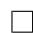

# 9.3 Gradients of the metrics

Given the metrics introduced in the last section, we can use gradient-based methods to maximize them. To do that, we need to first calculate the gradients of these metrics. The most important theoretical result in this chapter is the following theorem.

Theorem 9.1 (Policy gradient theorem). The gradient of $J(\theta)$ is

$$
\nabla_ {\theta} J (\theta) = \sum_ {s \in \mathcal {S}} \eta (s) \sum_ {a \in \mathcal {A}} \nabla_ {\theta} \pi (a | s, \theta) q _ {\pi} (s, a), \tag {9.8}
$$

where $\eta$ is a state distribution and $\nabla_{\theta}\pi$ is the gradient of $\pi$ with respect to $\theta$ . Moreover, (9.8) has a compact form expressed in terms of expectation:

$$
\nabla_ {\theta} J (\theta) = \mathbb {E} _ {S \sim \eta , A \sim \pi (S, \theta)} \Big [ \nabla_ {\theta} \ln \pi (A | S, \theta) q _ {\pi} (S, A) \Big ], \tag {9.9}
$$

where $\ln$ is the natural logarithm.

Some important remarks about Theorem 9.1 are given below.

$\diamond$ It should be noted that Theorem 9.1 is a summary of the results in Theorem 9.2, Theorem 9.3, and Theorem 9.5. These three theorems address different scenarios involving different metrics and discounted/undiscounted cases. The gradients in these scenarios all have similar expressions and hence are summarized in Theorem 9.1. The specific expressions of $J(\theta)$ and $\eta$ are not given in Theorem 9.1 and can be found in Theorem 9.2, Theorem 9.3, and Theorem 9.5. In particular, $J(\theta)$ could be $\bar{v}_{\pi}^{0}$ , $\bar{v}_{\pi}$ , or $\bar{r}_{\pi}$ . The equality in (9.8) may become a strict equality or an approximation. The distribution $\eta$ also varies in different scenarios.

The derivation of the gradients is the most complicated part of the policy gradient method. For many readers, it is sufficient to be familiar with the result in Theorem 9.1 without knowing the proof. The derivation details presented in the rest of this section are mathematically intensive. Readers are suggested to study selectively based on their interests.

$\diamond$ The expression in (9.9) is more favorable than (9.8) because it is expressed as an expectation. We will show in Section 9.4 that this true gradient can be approximated by a stochastic gradient.

Why can (9.8) be expressed as (9.9)? The proof is given below. By the definition of expectation, (9.8) can be rewritten as

$$
\begin{array}{l} \nabla_ {\theta} J (\theta) = \sum_ {s \in \mathcal {S}} \eta (s) \sum_ {a \in \mathcal {A}} \nabla_ {\theta} \pi (a | s, \theta) q _ {\pi} (s, a) \\ = \mathbb {E} _ {S \sim \eta} \left[ \sum_ {a \in \mathcal {A}} \nabla_ {\theta} \pi (a | S, \theta) q _ {\pi} (S, a) \right]. \tag {9.10} \\ \end{array}
$$

Furthermore, the gradient of $\ln \pi (a|s,\theta)$ is

$$
\nabla_ {\theta} \ln \pi (a | s, \theta) = \frac {\nabla_ {\theta} \pi (a | s , \theta)}{\pi (a | s , \theta)}.
$$

It follows that

$$
\nabla_ {\theta} \pi (a | s, \theta) = \pi (a | s, \theta) \nabla_ {\theta} \ln \pi (a | s, \theta). \tag {9.11}
$$

Substituting (9.11) into (9.10) gives

$$
\begin{array}{l} \nabla_ {\theta} J (\theta) = \mathbb {E} \left[ \sum_ {a \in \mathcal {A}} \pi (a | S, \theta) \nabla_ {\theta} \ln \pi (a | S, \theta) q _ {\pi} (S, a) \right] \\ = \mathbb {E} _ {S \sim \eta , A \sim \pi (S, \theta)} \left[ \nabla_ {\theta} \ln \pi (A | S, \theta) q _ {\pi} (S, A) \right]. \\ \end{array}
$$

It is notable that $\pi(a|s,\theta)$ must be positive for all $(s,a)$ to ensure that $\ln \pi(a|s,\theta)$ is valid. This can be achieved by using softmax functions:

$$
\pi (a | s, \theta) = \frac {e ^ {h (s , a , \theta)}}{\sum_ {a ^ {\prime} \in \mathcal {A}} e ^ {h (s , a ^ {\prime} , \theta)}}, \quad a \in \mathcal {A}, \tag {9.12}
$$

where $h(s, a, \theta)$ is a function indicating the preference for selecting $a$ at $s$ . The policy in (9.12) satisfies $\pi(a|s, \theta) \in [0, 1]$ and $\sum_{a \in \mathcal{A}} \pi(a|s, \theta) = 1$ for any $s \in S$ . This policy can be realized by a neural network. The input of the network is $s$ . The output layer is a softmax layer so that the network outputs $\pi(a|s, \theta)$ for all $a$ and the sum of the outputs is equal to 1. See Figure 9.2(b) for an illustration.

Since $\pi(a|s, \theta) > 0$ for all $a$ , the policy is stochastic and hence exploratory. The policy does not directly tell which action to take. Instead, the action should be generated according to the probability distribution of the policy.

# 9.3.1 Derivation of the gradients in the discounted case

We next derive the gradients of the metrics in the discounted case where $\gamma \in (0,1)$ . The state value and action value in the discounted case are defined as

$$
v _ {\pi} (s) = \mathbb {E} \left[ R _ {t + 1} + \gamma R _ {t + 2} + \gamma^ {2} R _ {t + 3} + \dots | S _ {t} = s \right],
$$

$$
q _ {\pi} (s, a) = \mathbb {E} \left[ R _ {t + 1} + \gamma R _ {t + 2} + \gamma^ {2} R _ {t + 3} + \dots \mid S _ {t} = s, A _ {t} = a \right].
$$

It holds that $v_{\pi}(s) = \sum_{a \in \mathcal{A}} \pi(a|s, \theta) q_{\pi}(s, a)$ and the state value satisfies the Bellman equation.

First, we show that $\bar{v}_{\pi}(\theta)$ and $\bar{r}_{\pi}(\theta)$ are equivalent metrics.

Lemma 9.1 (Equivalence between $\bar{v}_{\pi}(\theta)$ and $\bar{r}_{\pi}(\theta)$ ). In the discounted case where $\gamma \in (0,1)$ , it holds that

$$
\bar {r} _ {\pi} = (1 - \gamma) \bar {v} _ {\pi}. \tag {9.13}
$$

Proof. Note that $\bar{v}_{\pi}(\theta) = d_{\pi}^{T}v_{\pi}$ and $\bar{r}_{\pi}(\theta) = d_{\pi}^{T}r_{\pi}$ , where $v_{\pi}$ and $r_{\pi}$ satisfy the Bellman equation $v_{\pi} = r_{\pi} + \gamma P_{\pi}v_{\pi}$ . Multiplying $d_{\pi}^{T}$ on both sides of the Bellman equation yields

$$
\bar {v} _ {\pi} = \bar {r} _ {\pi} + \gamma d _ {\pi} ^ {T} P _ {\pi} v _ {\pi} = \bar {r} _ {\pi} + \gamma d _ {\pi} ^ {T} v _ {\pi} = \bar {r} _ {\pi} + \gamma \bar {v} _ {\pi},
$$

which implies (9.13).

Second, the following lemma gives the gradient of $v_{\pi}(s)$ for any $s$ .

Lemma 9.2 (Gradient of $v_{\pi}(s)$ ). In the discounted case, it holds for any $s \in S$ that

$$
\nabla_ {\theta} v _ {\pi} (s) = \sum_ {s ^ {\prime} \in \mathcal {S}} \Pr_ {\pi} \left(s ^ {\prime} \mid s\right) \sum_ {a \in \mathcal {A}} \nabla_ {\theta} \pi \left(a \mid s ^ {\prime}, \theta\right) q _ {\pi} \left(s ^ {\prime}, a\right), \tag {9.14}
$$

where

$$
\Pr_ {\pi} (s ^ {\prime} | s) \doteq \sum_ {k = 0} ^ {\infty} \gamma^ {k} [ P _ {\pi} ^ {k} ] _ {s s ^ {\prime}} = \left[ (I _ {n} - \gamma P _ {\pi}) ^ {- 1} \right] _ {s s ^ {\prime}}
$$

is the discounted total probability of transitioning from $s$ to $s'$ under policy $\pi$ . Here, $[\cdot]_{ss'}$ denotes the entry in the $s$ th row and $s'$ th column, and $[P_{\pi}]_{ss'}$ is the probability of transitioning from $s$ to $s'$ using exactly $k$ steps under $\pi$ .

Box 9.2: Proof of Lemma 9.2

First, for any $s \in S$ , it holds that

$$
\begin{array}{l} \nabla_ {\theta} v _ {\pi} (s) = \nabla_ {\theta} \left[ \sum_ {a \in \mathcal {A}} \pi (a | s, \theta) q _ {\pi} (s, a) \right] \\ = \sum_ {a \in \mathcal {A}} \left[ \nabla_ {\theta} \pi (a | s, \theta) q _ {\pi} (s, a) + \pi (a | s, \theta) \nabla_ {\theta} q _ {\pi} (s, a) \right], \tag {9.15} \\ \end{array}
$$

where $q_{\pi}(s,a)$ is the action value given by

$$
q _ {\pi} (s, a) = r (s, a) + \gamma \sum_ {s ^ {\prime} \in \mathcal {S}} p (s ^ {\prime} | s, a) v _ {\pi} (s ^ {\prime}).
$$

Since $r(s,a) = \sum_{r}rp(r|s,a)$ is independent of $\theta$ , we have

$$
\nabla_ {\theta} q _ {\pi} (s, a) = 0 + \gamma \sum_ {s ^ {\prime} \in \mathcal {S}} p (s ^ {\prime} | s, a) \nabla_ {\theta} v _ {\pi} (s ^ {\prime}).
$$

Substituting this result into (9.15) yields

$$
\begin{array}{l} \nabla_ {\theta} v _ {\pi} (s) = \sum_ {a \in \mathcal {A}} \left[ \nabla_ {\theta} \pi (a | s, \theta) q _ {\pi} (s, a) + \pi (a | s, \theta) \gamma \sum_ {s ^ {\prime} \in \mathcal {S}} p (s ^ {\prime} | s, a) \nabla_ {\theta} v _ {\pi} (s ^ {\prime}) \right] \\ = \sum_ {a \in \mathcal {A}} \nabla_ {\theta} \pi (a | s, \theta) q _ {\pi} (s, a) + \gamma \sum_ {a \in \mathcal {A}} \pi (a | s, \theta) \sum_ {s ^ {\prime} \in \mathcal {S}} p \left(s ^ {\prime} \mid s, a\right) \nabla_ {\theta} v _ {\pi} \left(s ^ {\prime}\right). \tag {9.16} \\ \end{array}
$$

It is notable that $\nabla_{\theta}v_{\pi}$ appears on both sides of the above equation. One way to calculate it is to use the unrolling technique [64]. Here, we use another way based on the matrix-vector form, which we believe is more straightforward to understand. In particular, let

$$
u (s) \doteq \sum_ {a \in \mathcal {A}} \nabla_ {\theta} \pi (a | s, \theta) q _ {\pi} (s, a).
$$

Since

$$
\sum_ {a \in \mathcal {A}} \pi (a | s, \theta) \sum_ {s ^ {\prime} \in \mathcal {S}} p (s ^ {\prime} | s, a) \nabla_ {\theta} v _ {\pi} (s ^ {\prime}) = \sum_ {s ^ {\prime} \in \mathcal {S}} p (s ^ {\prime} | s) \nabla_ {\theta} v _ {\pi} (s ^ {\prime}) = \sum_ {s ^ {\prime} \in \mathcal {S}} [ P _ {\pi} ] _ {s s ^ {\prime}} \nabla_ {\theta} v _ {\pi} (s ^ {\prime}),
$$

equation (9.16) can be written in matrix-vector form as

$$
\underbrace {\left[ \begin{array}{c} \vdots \\ \nabla_ {\theta} v _ {\pi} (s) \\ \vdots \end{array} \right]} _ {\nabla_ {\theta} v _ {\pi} \in \mathbb {R} ^ {m n}} = \underbrace {\left[ \begin{array}{c} \vdots \\ u (s) \\ \vdots \end{array} \right]} _ {u \in \mathbb {R} ^ {m n}} + \gamma (P _ {\pi} \otimes I _ {m}) \underbrace {\left[ \begin{array}{c} \vdots \\ \nabla_ {\theta} v _ {\pi} (s ^ {\prime}) \\ \vdots \end{array} \right]} _ {\nabla_ {\theta} v _ {\pi} \in \mathbb {R} ^ {m n}},
$$

which can be written concisely as

$$
\nabla_ {\theta} v _ {\pi} = u + \gamma (P _ {\pi} \otimes I _ {m}) \nabla_ {\theta} v _ {\pi}.
$$

Here, $n = |\mathcal{S}|$ , and $m$ is the dimension of the parameter vector $\theta$ . The reason that the Kronecker product $\otimes$ emerges in the equation is that $\nabla_{\theta}v_{\pi}(s)$ is a vector. The above equation is a linear equation of $\nabla_{\theta}v_{\pi}$ , which can be solved as

$$
\begin{array}{l} \nabla_ {\theta} v _ {\pi} = \left(I _ {n m} - \gamma P _ {\pi} \otimes I _ {m}\right) ^ {- 1} u \\ = \left(I _ {n} \otimes I _ {m} - \gamma P _ {\pi} \otimes I _ {m}\right) ^ {- 1} u \\ = \left[ \left(I _ {n} - \gamma P _ {\pi}\right) ^ {- 1} \otimes I _ {m} \right] u. \tag {9.17} \\ \end{array}
$$

For any state $s$ , it follows from (9.17) that

$$
\begin{array}{l} \nabla_ {\theta} v _ {\pi} (s) = \sum_ {s ^ {\prime} \in \mathcal {S}} \left[ \left(I _ {n} - \gamma P _ {\pi}\right) ^ {- 1} \right] _ {s s ^ {\prime}} u (s ^ {\prime}) \\ = \sum_ {s ^ {\prime} \in \mathcal {S}} \left[ \left(I _ {n} - \gamma P _ {\pi}\right) ^ {- 1} \right] _ {s s ^ {\prime}} \sum_ {a \in \mathcal {A}} \nabla_ {\theta} \pi (a | s ^ {\prime}, \theta) q _ {\pi} \left(s ^ {\prime}, a\right). \tag {9.18} \\ \end{array}
$$

The quantity $[(I_n - \gamma P_\pi)^{-1}]_{ss'}$ has a clear probabilistic interpretation. In particular, since $(I_n - \gamma P_\pi)^{-1} = I + \gamma P_\pi + \gamma^2 P_\pi^2 + \dots$ , we have

$$
\left[ \left(I _ {n} - \gamma P _ {\pi}\right) ^ {- 1} \right] _ {s s ^ {\prime}} = \left[ I \right] _ {s s ^ {\prime}} + \gamma [ P _ {\pi} ] _ {s s ^ {\prime}} + \gamma^ {2} [ P _ {\pi} ^ {2} ] _ {s s ^ {\prime}} + \dots = \sum_ {k = 0} ^ {\infty} \gamma^ {k} [ P _ {\pi} ^ {k} ] _ {s s ^ {\prime}}.
$$

Note that $[P_{\pi}^{k}]_{ss'}$ is the probability of transitioning from $s$ to $s'$ using exactly $k$ steps (see Box 8.1). Therefore, $\left[(I_n - \gamma P_{\pi})^{-1}\right]_{ss'}$ is the discounted total probability of transitioning from $s$ to $s'$ using any number of steps. By denoting $\left[(I_n - \gamma P_{\pi})^{-1}\right]_{ss'} \doteq \operatorname{Pr}_{\pi}(s'|s)$ , equation (9.18) becomes (9.14).

With the results in Lemma 9.2, we are ready to derive the gradient of $\bar{v}_{\pi}^{0}$ .

Theorem 9.2 (Gradient of $\bar{v}_{\pi}^{0}$ in the discounted case). In the discounted case where $\gamma \in (0,1)$ , the gradient of $\bar{v}_{\pi}^{0} = d_{0}^{T}v_{\pi}$ is

$$
\nabla_ {\theta} \bar {v} _ {\pi} ^ {0} = \mathbb {E} \left[ \nabla_ {\theta} \ln \pi (A | S, \theta) q _ {\pi} (S, A) \right],
$$

where $S \sim \rho_{\pi}$ and $A \sim \pi(S, \theta)$ . Here, the state distribution $\rho_{\pi}$ is

$$
\rho_ {\pi} (s) = \sum_ {s ^ {\prime} \in \mathcal {S}} d _ {0} \left(s ^ {\prime}\right) \Pr_ {\pi} \left(s \mid s ^ {\prime}\right), \quad s \in \mathcal {S}, \tag {9.19}
$$

where $\operatorname*{Pr}_{\pi}(s|s') = \sum_{k=0}^{\infty} \gamma^{k}[P_{\pi}^{k}]_{s's} = [(I - \gamma P_{\pi})^{-1}]_{s's}$ is the discounted total probability of

transitioning from $s'$ to $s$ under policy $\pi$ .

# Box 9.3: Proof of Theorem 9.2

Since $d_0(s)$ is independent of $\pi$ , we have

$$
\nabla_ {\theta} \bar {v} _ {\pi} ^ {0} = \nabla_ {\theta} \sum_ {s \in \mathcal {S}} d _ {0} (s) v _ {\pi} (s) = \sum_ {s \in \mathcal {S}} d _ {0} (s) \nabla_ {\theta} v _ {\pi} (s).
$$

Substituting the expression of $\nabla_{\theta}v_{\pi}(s)$ given in Lemma 9.2 into the above equation yields

$$
\begin{array}{l} \nabla_ {\theta} \bar {v} _ {\pi} ^ {0} = \sum_ {s \in \mathcal {S}} d _ {0} (s) \nabla_ {\theta} v _ {\pi} (s) = \sum_ {s \in \mathcal {S}} d _ {0} (s) \sum_ {s ^ {\prime} \in \mathcal {S}} \operatorname * {P r} _ {\pi} (s ^ {\prime} | s) \sum_ {a \in \mathcal {A}} \nabla_ {\theta} \pi (a | s ^ {\prime}, \theta) q _ {\pi} (s ^ {\prime}, a) \\ = \sum_ {s ^ {\prime} \in \mathcal {S}} \left(\sum_ {s \in \mathcal {S}} d _ {0} (s) \Pr_ {\pi} \left(s ^ {\prime} \mid s\right)\right) \sum_ {a \in \mathcal {A}} \nabla_ {\theta} \pi (a \mid s ^ {\prime}, \theta) q _ {\pi} \left(s ^ {\prime}, a\right) \\ \dot {=} \sum_ {s ^ {\prime} \in \mathcal {S}} \rho_ {\pi} (s ^ {\prime}) \sum_ {a \in \mathcal {A}} \nabla_ {\theta} \pi (a | s ^ {\prime}, \theta) q _ {\pi} (s ^ {\prime}, a) \\ = \sum_ {s \in \mathcal {S}} \rho_ {\pi} (s) \sum_ {a \in \mathcal {A}} \nabla_ {\theta} \pi (a | s, \theta) q _ {\pi} (s, a) \qquad (\text {c h a n g e} s ^ {\prime} \text {t o} s) \\ = \sum_ {s \in \mathcal {S}} \rho_ {\pi} (s) \sum_ {a \in \mathcal {A}} \pi (a | s, \theta) \nabla_ {\theta} \ln \pi (a | s, \theta) q _ {\pi} (s, a) \\ = \mathbb {E} \left[ \nabla_ {\theta} \ln \pi (A | S, \theta) q _ {\pi} (S, A) \right], \\ \end{array}
$$

where $S \sim \rho_{\pi}$ and $A \sim \pi(S, \theta)$ . The proof is complete.

With Lemma 9.1 and Lemma 9.2, we can derive the gradients of $\bar{r}_{\pi}$ and $\bar{v}_{\pi}$ .

Theorem 9.3 (Gradients of $\bar{r}_{\pi}$ and $\bar{v}_{\pi}$ in the discounted case). In the discounted case where $\gamma \in (0,1)$ , the gradients of $\bar{r}_{\pi}$ and $\bar{v}_{\pi}$ are

$$
\begin{array}{l} \nabla_ {\theta} \bar {r} _ {\pi} = (1 - \gamma) \nabla_ {\theta} \bar {v} _ {\pi} \approx \sum_ {s \in \mathcal {S}} d _ {\pi} (s) \sum_ {a \in \mathcal {A}} \nabla_ {\theta} \pi (a | s, \theta) q _ {\pi} (s, a) \\ = \mathbb {E} \left[ \nabla_ {\theta} \ln \pi (A | S, \theta) q _ {\pi} (S, A) \right], \\ \end{array}
$$

where $S \sim d_{\pi}$ and $A \sim \pi(S, \theta)$ . Here, the approximation is more accurate when $\gamma$ is closer to 1.

# Box 9.4: Proof of Theorem 9.3

It follows from the definition of $\bar{v}_{\pi}$ that

$$
\begin{array}{l} \nabla_ {\theta} \bar {v} _ {\pi} = \nabla_ {\theta} \sum_ {s \in \mathcal {S}} d _ {\pi} (s) v _ {\pi} (s) \\ = \sum_ {s \in S} \nabla_ {\theta} d _ {\pi} (s) v _ {\pi} (s) + \sum_ {s \in S} d _ {\pi} (s) \nabla_ {\theta} v _ {\pi} (s). \tag {9.20} \\ \end{array}
$$

This equation contains two terms. On the one hand, substituting the expression of $\nabla_{\theta}v_{\pi}$ given in (9.17) into the second term gives

$$
\begin{array}{l} \sum_ {s \in \mathcal {S}} d _ {\pi} (s) \nabla_ {\theta} v _ {\pi} (s) = (d _ {\pi} ^ {T} \otimes I _ {m}) \nabla_ {\theta} v _ {\pi} \\ = \left(d _ {\pi} ^ {T} \otimes I _ {m}\right) \left[ \left(I _ {n} - \gamma P _ {\pi}\right) ^ {- 1} \otimes I _ {m} \right] u \\ = \left[ d _ {\pi} ^ {T} \left(I _ {n} - \gamma P _ {\pi}\right) ^ {- 1} \right] \otimes I _ {m} u. \tag {9.21} \\ \end{array}
$$

It is noted that

$$
d _ {\pi} ^ {T} (I _ {n} - \gamma P _ {\pi}) ^ {- 1} = \frac {1}{1 - \gamma} d _ {\pi} ^ {T},
$$

which can be easily verified by multiplying $(I_n - \gamma P_{\pi})$ on both sides of the equation. Therefore, (9.21) becomes

$$
\begin{array}{l} \sum_ {s \in \mathcal {S}} d _ {\pi} (s) \nabla_ {\theta} v _ {\pi} (s) = \frac {1}{1 - \gamma} d _ {\pi} ^ {T} \otimes I _ {m} u \\ = \frac {1}{1 - \gamma} \sum_ {s \in \mathcal {S}} d _ {\pi} (s) \sum_ {a \in \mathcal {A}} \nabla_ {\theta} \pi (a | s, \theta) q _ {\pi} (s, a). \\ \end{array}
$$

On the other hand, the first term of (9.20) involves $\nabla_{\theta}d_{\pi}$ . However, since the second term contains $\frac{1}{1 - \gamma}$ , the second term becomes dominant, and the first term becomes negligible when $\gamma \to 1$ . Therefore,

$$
\nabla_ {\theta} \bar {v} _ {\pi} \approx \frac {1}{1 - \gamma} \sum_ {s \in \mathcal {S}} d _ {\pi} (s) \sum_ {a \in \mathcal {A}} \nabla_ {\theta} \pi (a | s, \theta) q _ {\pi} (s, a).
$$

Furthermore, it follows from $\bar{r}_{\pi} = (1 - \gamma)\bar{v}_{\pi}$ that

$$
\begin{array}{l} \nabla_ {\theta} \bar {r} _ {\pi} = (1 - \gamma) \nabla_ {\theta} \bar {v} _ {\pi} \approx \sum_ {s \in \mathcal {S}} d _ {\pi} (s) \sum_ {a \in \mathcal {A}} \nabla_ {\theta} \pi (a | s, \theta) q _ {\pi} (s, a) \\ = \sum_ {s \in \mathcal {S}} d _ {\pi} (s) \sum_ {a \in \mathcal {A}} \pi (a | s, \theta) \nabla_ {\theta} \ln \pi (a | s, \theta) q _ {\pi} (s, a) \\ = \mathbb {E} \left[ \nabla_ {\theta} \ln \pi (A | S, \theta) q _ {\pi} (S, A) \right]. \\ \end{array}
$$

The approximation in the above equation requires that the first term does not go to infinity when $\gamma \to 1$ . More information can be found in [66, Section 4].

# 9.3.2 Derivation of the gradients in the undiscounted case

We next show how to calculate the gradients of the metrics in the undiscounted case where $\gamma = 1$ . Readers may wonder why we suddenly start considering the undiscounted case while we have only considered the discounted case so far in this book. The reasons are as follows. First, for continuing tasks, it may be inappropriate to introduce the discount rate and we need to consider the undiscounted case. Second, the definition of the average reward $\bar{r}_{\pi}$ is valid for both discounted and undiscounted cases. While the gradient of $\bar{r}_{\pi}$ in the discounted case is an approximation, we will see that its gradient in the undiscounted case is more elegant.

# State values and the Poisson equation

In the undiscounted case, it is necessary to redefine state and action values. Since the undiscounted sum of the rewards, $\mathbb{E}[R_{t + 1} + R_{t + 2} + R_{t + 3} + \ldots |S_t = s]$ , may diverge, the state and action values are defined in a special way [64]:

$$
\begin{array}{l} v _ {\pi} (s) \doteq \mathbb {E} \left[ \left(R _ {t + 1} - \bar {r} _ {\pi}\right) + \left(R _ {t + 2} - \bar {r} _ {\pi}\right) + \left(R _ {t + 3} - \bar {r} _ {\pi}\right) + \dots \mid S _ {t} = s \right], \\ q _ {\pi} (s, a) \doteq \mathbb {E} \left[ \left(R _ {t + 1} - \bar {r} _ {\pi}\right) + \left(R _ {t + 2} - \bar {r} _ {\pi}\right) + \left(R _ {t + 3} - \bar {r} _ {\pi}\right) + \dots \mid S _ {t} = s, A _ {t} = a \right], \\ \end{array}
$$

where $\bar{r}_{\pi}$ is the average reward, which is determined when $\pi$ is given. There are different names for $v_{\pi}(s)$ in the literature such as the differential reward [65] or bias [2, Section 8.2.1]. It can be verified that the state value defined above satisfies the following Bellman-like equation:

$$
v _ {\pi} (s) = \sum_ {a} \pi (a | s, \theta) \left[ \sum_ {r} p (r | s, a) (r - \bar {r} _ {\pi}) + \sum_ {s ^ {\prime}} p (s ^ {\prime} | s, a) v _ {\pi} (s ^ {\prime}) \right]. \tag {9.22}
$$

Since $v_{\pi}(s) = \sum_{a \in \mathcal{A}} \pi(a|s, \theta) q_{\pi}(s, a)$ , it holds that $q_{\pi}(s, a) = \sum_{r} p(r|s, a)(r - \bar{r}_{\pi}) + \sum_{s'} p(s'|s, a) v_{\pi}(s')$ . The matrix-vector form of (9.22) is

$$
v _ {\pi} = r _ {\pi} - \bar {r} _ {\pi} \mathbf {1} _ {n} + P _ {\pi} v _ {\pi}, \tag {9.23}
$$

where $\mathbf{1}_n = [1,\dots ,1]^T\in \mathbb{R}^n$ . Equation (9.23) is similar to the Bellman equation and it has a specific name called the Poisson equation [65, 67].

How to solve $v_{\pi}$ from the Poisson equation? The answer is given in the following theorem.

Theorem 9.4 (Solution of the Poisson equation). Let

$$
v _ {\pi} ^ {*} = \left(I _ {n} - P _ {\pi} + \mathbf {1} _ {n} d _ {\pi} ^ {T}\right) ^ {- 1} r _ {\pi}. \tag {9.24}
$$

Then, $v_{\pi}^{*}$ is a solution of the Poisson equation in (9.23). Moreover, any solution of the Poisson equation has the following form:

$$
v _ {\pi} = v _ {\pi} ^ {*} + c \mathbf {1} _ {n},
$$

where $c\in \mathbb{R}$

This theorem indicates that the solution of the Poisson equation may not be unique.

# Box 9.5: Proof of Theorem 9.4

We prove using three steps.

$\diamond$ Step 1: Show that $v_{\pi}^{*}$ in (9.24) is a solution of (9.25).

For the sake of simplicity, let

$$
A \doteq I _ {n} - P _ {\pi} + \mathbf {1} _ {n} d _ {\pi} ^ {T}.
$$

Then, $v_{\pi}^{*} = A^{-1}r_{\pi}$ . The fact that $A$ is invertible will be proven in Step 3. Substituting $v_{\pi}^{*} = A^{-1}r_{\pi}$ into (9.25) gives

$$
A ^ {- 1} r _ {\pi} = r _ {\pi} - \mathbf {1} _ {n} d _ {\pi} ^ {T} r _ {\pi} + P _ {\pi} A ^ {- 1} r _ {\pi}.
$$

This equation is valid as proven below. Recognizing this equation gives $(-A^{-1} + I_n - \mathbf{1}_n d_\pi^T + P_\pi A^{-1})r_\pi = 0$ , and consequently,

$$
\left(- I _ {n} + A - \mathbf {1} _ {n} d _ {\pi} ^ {T} A + P _ {\pi}\right) A ^ {- 1} r _ {\pi} = 0.
$$

The term in the brackets in the above equation is zero because $-I_{n} + A - \mathbf{1}_{n}d_{\pi}^{T}A + P_{\pi} = -I_{n} + (I_{n} - P_{\pi} + \mathbf{1}_{n}d_{\pi}^{T}) - \mathbf{1}_{n}d_{\pi}^{T}(I_{n} - P_{\pi} + \mathbf{1}_{n}d_{\pi}^{T}) + P_{\pi} = 0$ . Therefore, $v_{\pi}^{*}$ in (9.24) is a solution.

$\diamond$ Step 2: General expression of the solutions.

Substituting $\bar{r}_{\pi} = d_{\pi}^{T}r_{\pi}$ into (9.23) gives

$$
v _ {\pi} = r _ {\pi} - \mathbf {1} _ {n} d _ {\pi} ^ {T} r _ {\pi} + P _ {\pi} v _ {\pi} \tag {9.25}
$$

and consequently

$$
\left(I _ {n} - P _ {\pi}\right) v _ {\pi} = \left(I _ {n} - \mathbf {1} _ {n} d _ {\pi} ^ {T}\right) r _ {\pi}. \tag {9.26}
$$

It is noted that $I_{n} - P_{\pi}$ is singular because $(I_{n} - P_{\pi})\mathbf{1}_{n} = 0$ for any $\pi$ . Therefore, the solution of (9.26) is not unique: if $v_{\pi}^{*}$ is a solution, then $v_{\pi}^{*} + x$ is also a solution for any $x \in \mathrm{Null}(I_n - P_\pi)$ . When $P_{\pi}$ is irreducible, $\mathrm{Null}(I_n - P_{\pi}) = \mathrm{span}\{\mathbf{1}_n\}$ . Then, any solution of the Poisson equation has the expression $v_{\pi}^{*} + c\mathbf{1}_{n}$ where $c \in \mathbb{R}$ .

$\diamond$ Step 3: Show that $A = I_{n} - P_{\pi} + \mathbf{1}_{n}d_{\pi}^{T}$ invertible.

Since $\upsilon_{\pi}^{*}$ involves $A^{-1}$ , it is necessary to show that $A$ is invertible. The analysis is summarized in the following lemma.

Lemma 9.3. The matrix $I_{n} - P_{\pi} + \mathbf{1}_{n}d_{\pi}^{T}$ is invertible and its inverse is

$$
\left[ I _ {n} - \left(P _ {\pi} - \mathbf {1} _ {n} d _ {\pi} ^ {T}\right) \right] ^ {- 1} = \sum_ {k = 1} ^ {\infty} \left(P _ {\pi} ^ {k} - \mathbf {1} _ {n} d _ {\pi} ^ {T}\right) + I _ {n}.
$$

Proof. First of all, we state some preliminary facts without proof. Let $\rho(M)$ be the spectral radius of a matrix $M$ . Then, $I - M$ is invertible if $\rho(M) < 1$ . Moreover, $\rho(M) < 1$ if and only if $\lim_{k \to \infty} M^k = 0$ .

Based on the above facts, we next show that $\lim_{k\to \infty}(P_{\pi} - \mathbf{1}_{n}d_{\pi}^{T})^{k}\to 0$ , and then the invertibility of $I_{n} - (P_{\pi} - \mathbf{1}_{n}d_{\pi}^{T})$ immediately follows. To do that, we notice that

$$
\left(P _ {\pi} - \mathbf {1} _ {n} d _ {\pi} ^ {T}\right) ^ {k} = P _ {\pi} ^ {k} - \mathbf {1} _ {n} d _ {\pi} ^ {T}, \quad k \geq 1, \tag {9.27}
$$

which can be proven by induction. For instance, when $k = 1$ , the equation is valid. When $k = 2$ , we have

$$
\begin{array}{l} \left(P _ {\pi} - \mathbf {1} _ {n} d _ {\pi} ^ {T}\right) ^ {2} = \left(P _ {\pi} - \mathbf {1} _ {n} d _ {\pi} ^ {T}\right) \left(P _ {\pi} - \mathbf {1} _ {n} d _ {\pi} ^ {T}\right) \\ = P _ {\pi} ^ {2} - P _ {\pi} \mathbf {1} _ {n} d _ {\pi} ^ {T} - \mathbf {1} _ {n} d _ {\pi} ^ {T} P _ {\pi} + \mathbf {1} _ {n} d _ {\pi} ^ {T} \mathbf {1} _ {n} d _ {\pi} ^ {T} \\ \mathbf {\Sigma} = P _ {\pi} ^ {2} - \mathbf {1} _ {n} d _ {\pi} ^ {T}, \\ \end{array}
$$

where the last equality is due to $P_{\pi}\mathbf{1}_n = \mathbf{1}_n$ , $d_{\pi}^{T}P_{\pi} = d_{\pi}^{T}$ , and $d_{\pi}^{T}\mathbf{1}_{n} = 1$ . The case of $k \geq 3$ can be proven similarly.

Since $d_{\pi}$ is the stationary distribution of the state, it holds that $\lim_{k \to \infty} P_{\pi}^{k} = d_{\pi}^{T} \mathbf{1}_{n}$ (see Box 8.1). Therefore, (9.27) implies that

$$
\lim _ {k \to \infty} \left(P _ {\pi} - \mathbf {1} _ {n} d _ {\pi} ^ {T}\right) ^ {k} = \lim _ {k \to \infty} P _ {\pi} ^ {k} - d _ {\pi} ^ {T} \mathbf {1} _ {n} = 0.
$$

As a result, $\rho(P_{\pi} - \mathbf{1}_n d_{\pi}^T) < 1$ and hence $I_n - (P_{\pi} - \mathbf{1}_n d_{\pi}^T)$ is invertible. Furthermore,

the inverse of this matrix is given by

$$
\begin{array}{l} \left(I _ {n} - \left(P _ {\pi} - \mathbf {1} _ {n} d _ {\pi} ^ {T}\right)\right) ^ {- 1} = \sum_ {k = 0} ^ {\infty} \left(P _ {\pi} - \mathbf {1} _ {n} d _ {\pi} ^ {T}\right) ^ {k} \\ = I _ {n} + \sum_ {k = 1} ^ {\infty} \left(P _ {\pi} - \mathbf {1} _ {n} d _ {\pi} ^ {T}\right) ^ {k} \\ = I _ {n} + \sum_ {k = 1} ^ {\infty} (P _ {\pi} ^ {k} - \mathbf {1} _ {n} d _ {\pi} ^ {T}) \\ = \sum_ {k = 0} ^ {\infty} \left(P _ {\pi} ^ {k} - \mathbf {1} _ {n} d _ {\pi} ^ {T}\right) + \mathbf {1} _ {n} d _ {\pi} ^ {T}. \\ \end{array}
$$

The proof is complete.

The proof of Lemma 9.3 is inspired by [66]. However, the result $(I_n - P_{\pi} + \mathbf{1}_nd_\pi^T)^{-1} = \sum_{k=0}^\infty (P_\pi^k - \mathbf{1}_nd_\pi^T)$ given in [66] (the statement above equation (16) in [66]) is inaccurate because $\sum_{k=0}^\infty (P_\pi^k - \mathbf{1}_nd_\pi^T)$ is singular since $\sum_{k=0}^\infty (P_\pi^k - \mathbf{1}_nd_\pi^T)\mathbf{1}_n = 0$ . Lemma 9.3 corrects this inaccuracy.

# Derivation of gradients

Although the value of $v_{\pi}$ is not unique in the undiscounted case, as shown in Theorem 9.4, the value of $\bar{r}_{\pi}$ is unique. In particular, it follows from the Poisson equation that

$$
\begin{array}{l} \bar {r} _ {\pi} \mathbf {1} _ {n} = r _ {\pi} + (P _ {\pi} - I _ {n}) v _ {\pi} \\ = r _ {\pi} + \left(P _ {\pi} - I _ {n}\right) \left(v _ {\pi} ^ {*} + c \mathbf {1} _ {n}\right) \\ = r _ {\pi} + \left(P _ {\pi} - I _ {n}\right) v _ {\pi} ^ {*}. \\ \end{array}
$$

Notably, the undetermined value $c$ is canceled and hence $\bar{r}_{\pi}$ is unique. Therefore, we can calculate the gradient of $\bar{r}_{\pi}$ in the undiscounted case. In addition, since $v_{\pi}$ is not unique, $\bar{v}_{\pi}$ is not unique either. We do not study the gradient of $\bar{v}_{\pi}$ in the undiscounted case. For interested readers, it is worth mentioning that we can add more constraints to uniquely solve $v_{\pi}$ from the Poisson equation. For example, by assuming that a recurrent state exists, the state value of this recurrent state is zero [65, Section II], and hence, $c$ can be determined. There are also other ways to uniquely determine $v_{\pi}$ . See, for example, equations (8.6.5)-(8.6.7) in [2].

The gradient of $\bar{r}_{\pi}$ in the undiscounted case is given below.

Theorem 9.5 (Gradient of $\bar{r}_{\pi}$ in the undiscounted case). In the undiscounted case, the

gradient of the average reward $\bar{r}_{\pi}$ is

$$
\begin{array}{l} \nabla_ {\theta} \bar {r} _ {\pi} = \sum_ {s \in \mathcal {S}} d _ {\pi} (s) \sum_ {a \in \mathcal {A}} \nabla_ {\theta} \pi (a | s, \theta) q _ {\pi} (s, a) \\ = \mathbb {E} \left[ \nabla_ {\theta} \ln \pi (A | S, \theta) q _ {\pi} (S, A) \right], \tag {9.28} \\ \end{array}
$$

where $S\sim d_{\pi}$ and $A\sim \pi (S,\theta)$

Compared to the discounted case shown in Theorem 9.3, the gradient of $\bar{r}_{\pi}$ in the undiscounted case is more elegant in the sense that (9.28) is strictly valid and $S$ obeys the stationary distribution.

# Box 9.6: Proof of Theorem 9.5

First of all, it follows from $v_{\pi}(s) = \sum_{a\in \mathcal{A}}\pi (a|s,\theta)q_{\pi}(s,a)$ that

$$
\begin{array}{l} \nabla_ {\theta} v _ {\pi} (s) = \nabla_ {\theta} \left[ \sum_ {a \in \mathcal {A}} \pi (a | s, \theta) q _ {\pi} (s, a) \right] \\ = \sum_ {a \in \mathcal {A}} \left[ \nabla_ {\theta} \pi (a | s, \theta) q _ {\pi} (s, a) + \pi (a | s, \theta) \nabla_ {\theta} q _ {\pi} (s, a) \right], \tag {9.29} \\ \end{array}
$$

where $q_{\pi}(s,a)$ is the action value satisfying

$$
\begin{array}{l} q _ {\pi} (s, a) = \sum_ {r} p (r | s, a) (r - \bar {r} _ {\pi}) + \sum_ {s ^ {\prime}} p (s ^ {\prime} | s, a) v _ {\pi} (s ^ {\prime}) \\ = r (s, a) - \bar {r} _ {\pi} + \sum_ {s ^ {\prime}} p (s ^ {\prime} | s, a) v _ {\pi} (s ^ {\prime}). \\ \end{array}
$$

Since $r(s,a) = \sum_{r}rp(r|s,a)$ is independent of $\theta$ , we have

$$
\nabla_ {\theta} q _ {\pi} (s, a) = 0 - \nabla_ {\theta} \bar {r} _ {\pi} + \sum_ {s ^ {\prime} \in \mathcal {S}} p (s ^ {\prime} | s, a) \nabla_ {\theta} v _ {\pi} (s ^ {\prime}).
$$

Substituting this result into (9.29) yields

$$
\begin{array}{l} \nabla_ {\theta} v _ {\pi} (s) = \sum_ {a \in \mathcal {A}} \left[ \nabla_ {\theta} \pi (a | s, \theta) q _ {\pi} (s, a) + \pi (a | s, \theta) \left(- \nabla_ {\theta} \bar {r} _ {\pi} + \sum_ {s ^ {\prime} \in \mathcal {S}} p (s ^ {\prime} | s, a) \nabla_ {\theta} v _ {\pi} (s ^ {\prime})\right) \right] \\ = \sum_ {a \in \mathcal {A}} \nabla_ {\theta} \pi (a | s, \theta) q _ {\pi} (s, a) - \nabla_ {\theta} \bar {r} _ {\pi} + \sum_ {a \in \mathcal {A}} \pi (a | s, \theta) \sum_ {s ^ {\prime} \in \mathcal {S}} p \left(s ^ {\prime} \mid s, a\right) \nabla_ {\theta} v _ {\pi} \left(s ^ {\prime}\right). \tag {9.30} \\ \end{array}
$$

Let

$$
u (s) \doteq \sum_ {a \in \mathcal {A}} \nabla_ {\theta} \pi (a | s, \theta) q _ {\pi} (s, a).
$$

Since $\sum_{a\in \mathcal{A}}\pi (a|s,\theta)\sum_{s'\in \mathcal{S}}p(s'|s,a)\nabla_{\theta}v_{\pi}(s') = \sum_{s'\in \mathcal{S}}p(s'|s)\nabla_{\theta}v_{\pi}(s')$ , equation (9.30) can be written in matrix-vector form as

$$
\underbrace {\left[ \begin{array}{c} \vdots \\ \nabla_ {\theta} v _ {\pi} (s) \\ \vdots \end{array} \right]} _ {\nabla_ {\theta} v _ {\pi} \in \mathbb {R} ^ {m n}} = \underbrace {\left[ \begin{array}{c} \vdots \\ u (s) \\ \vdots \end{array} \right]} _ {u \in \mathbb {R} ^ {m n}} - \mathbf {1} _ {n} \otimes \nabla_ {\theta} \bar {r} _ {\pi} + (P _ {\pi} \otimes I _ {m}) \underbrace {\left[ \begin{array}{c} \vdots \\ \nabla_ {\theta} v _ {\pi} (s ^ {\prime}) \\ \vdots \end{array} \right]} _ {\nabla_ {\theta} v _ {\pi} \in \mathbb {R} ^ {m n}},
$$

where $n = |\mathcal{S}|$ , $m$ is the dimension of $\theta$ , and $\otimes$ is the Kronecker product. The above equation can be written concisely as

$$
\nabla_ {\theta} v _ {\pi} = u - \mathbf {1} _ {n} \otimes \nabla_ {\theta} \bar {r} _ {\pi} + (P _ {\pi} \otimes I _ {m}) \nabla_ {\theta} v _ {\pi},
$$

and hence

$$
\mathbf {1} _ {n} \otimes \nabla_ {\theta} \bar {r} _ {\pi} = u + (P _ {\pi} \otimes I _ {m}) \nabla_ {\theta} v _ {\pi} - \nabla_ {\theta} v _ {\pi}.
$$

Multiplying $d_{\pi}^{T} \otimes I_{m}$ on both sides of the above equation gives

$$
\begin{array}{l} \left(d _ {\pi} ^ {T} \mathbf {1} _ {n}\right) \otimes \nabla_ {\theta} \bar {r} _ {\pi} = d _ {\pi} ^ {T} \otimes I _ {m} u + \left(d _ {\pi} ^ {T} P _ {\pi}\right) \otimes I _ {m} \nabla_ {\theta} v _ {\pi} - d _ {\pi} ^ {T} \otimes I _ {m} \nabla_ {\theta} v _ {\pi} \\ = d _ {\pi} ^ {T} \otimes I _ {m} u, \\ \end{array}
$$

which implies

$$
\begin{array}{l} \nabla_ {\theta} \bar {r} _ {\pi} = d _ {\pi} ^ {T} \otimes I _ {m} u \\ = \sum_ {s \in \mathcal {S}} d _ {\pi} (s) u (s) \\ = \sum_ {s \in \mathcal {S}} d _ {\pi} (s) \sum_ {a \in \mathcal {A}} \nabla_ {\theta} \pi (a | s, \theta) q _ {\pi} (s, a). \\ \end{array}
$$
