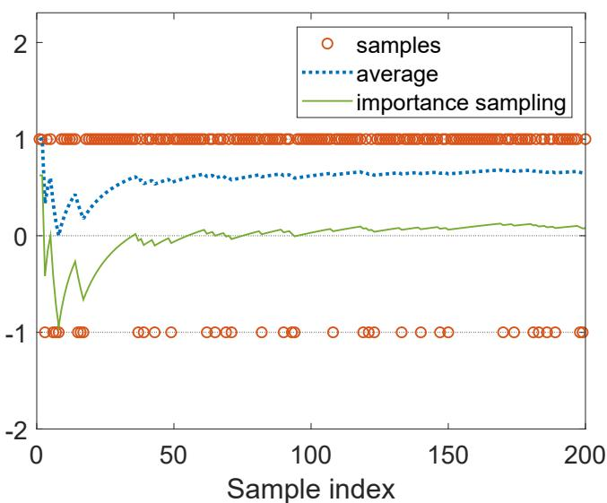

# 10.3 Off-policy actor-critic

The policy gradient methods that we have studied so far, including REINFORCE, QAC, and A2C, are all on-policy. The reason for this can be seen from the expression of the true gradient:

$$
\nabla_ {\theta} J (\theta) = \mathbb {E} _ {S \sim \eta , A \sim \pi} \Big [ \nabla_ {\theta} \ln \pi (A | S, \theta_ {t}) (q _ {\pi} (S, A) - v _ {\pi} (S)) \Big ].
$$

To use samples to approximate this true gradient, we must generate the action samples by following $\pi (\theta)$ . Hence, $\pi (\theta)$ is the behavior policy. Since $\pi (\theta)$ is also the target policy that we aim to improve, the policy gradient methods are on-policy.

In the case that we already have some samples generated by a given behavior policy, the policy gradient methods can still be applied to utilize these samples. To do that, we can employ a technique called importance sampling. It is worth mentioning that the importance sampling technique is not restricted to the field of reinforcement learning. It is a general technique for estimating expected values defined over one probability distribution using some samples drawn from another distribution.

# 10.3.1 Importance sampling

We next introduce the importance sampling technique. Consider a random variable $X \in \mathcal{X}$ . Suppose that $p_0(X)$ is a probability distribution. Our goal is to estimate $\mathbb{E}_{X \sim p_0}[X]$ . Suppose that we have some i.i.d. samples $\{x_i\}_{i=1}^n$ .

$\diamond$ First, if the samples $\{x_{i}\}_{i = 1}^{n}$ are generated by following $p_0$ , then the average value $\bar{x} = \frac{1}{n}\sum_{i = 1}^{n}x_{i}$ can be used to approximate $\mathbb{E}_{X\sim p_0}[X]$ because $\bar{x}$ is an unbiased estimate of $\mathbb{E}_{X\sim p_0}[X]$ and the estimation variance converges to zero as $n\to \infty$ (see the law of large numbers in Box 5.1 for more information).   
$\diamond$ Second, consider a new scenario where the samples $\{x_{i}\}_{i = 1}^{n}$ are not generated by $p_0$ . Instead, they are generated by another distribution $p_1$ . Can we still use these samples to approximate $\mathbb{E}_{X\sim p_0}[X]$ ? The answer is yes. However, we can no longer use $\bar{x} = \frac{1}{n}\sum_{i = 1}^{n}x_{i}$ to approximate $\mathbb{E}_{X\sim p_0}[X]$ since $\bar{x}\approx \mathbb{E}_{X\sim p_1}[X]$ rather than $\mathbb{E}_{X\sim p_0}[X]$ .

In the second scenario, $\mathbb{E}_{X\sim p_0}[X]$ can be approximated based on the importance sampling technique. In particular, $\mathbb{E}_{X\sim p_0}[X]$ satisfies

$$
\mathbb {E} _ {X \sim p _ {0}} [ X ] = \sum_ {x \in \mathcal {X}} p _ {0} (x) x = \sum_ {x \in \mathcal {X}} p _ {1} (x) \underbrace {\frac {p _ {0} (x)}{p _ {1} (x)}} _ {f (x)} x = \mathbb {E} _ {X \sim p _ {1}} [ f (X) ]. \tag {10.9}
$$

Thus, estimating $\mathbb{E}_{X\sim p_0}[X]$ becomes the problem of estimating $\mathbb{E}_{X\sim p_1}[f(X)]$ . Let

$$
\bar {f} \doteq \frac {1}{n} \sum_ {i = 1} ^ {n} f (x _ {i}).
$$

Since $\bar{f}$ can effectively approximate $\mathbb{E}_{X\sim p_1}[f(X)]$ , it then follows from (10.9) that

$$
\mathbb {E} _ {X \sim p _ {0}} [ X ] = \mathbb {E} _ {X \sim p _ {1}} [ f (X) ] \approx \bar {f} = \frac {1}{n} \sum_ {i = 1} ^ {n} f \left(x _ {i}\right) = \frac {1}{n} \sum_ {i = 1} ^ {n} \underbrace {\frac {p _ {0} \left(x _ {i}\right)}{p _ {1} \left(x _ {i}\right)}} _ {\text {i m p o r t a n c e}} x _ {i}. \tag {10.10}
$$

Equation (10.10) suggests that $\mathbb{E}_{X\sim p_0}[X]$ can be approximated by a weighted average of $x_{i}$ . Here, $\frac{p_0(x_i)}{p_1(x_i)}$ is called the importance weight. When $p_1 = p_0$ , the importance weight is 1 and $\bar{f}$ becomes $\bar{x}$ . When $p_0(x_i)\geq p_1(x_i)$ , $x_{i}$ can be sampled more frequently by $p_0$ but less frequently by $p_1$ . In this case, the importance weight, which is greater than one, emphasizes the importance of this sample.

Some readers may ask the following question: while $p_0(x)$ is required in (10.10), why do we not directly calculate $\mathbb{E}_{X \sim p_0}[X]$ using its definition $\mathbb{E}_{X \sim p_0}[X] = \sum_{x \in \mathcal{X}} p_0(x)x$ ? The answer is as follows. To use the definition, we need to know either the analytical expression of $p_0$ or the value of $p_0(x)$ for every $x \in \mathcal{X}$ . However, it is difficult to obtain the analytical expression of $p_0$ when the distribution is represented by, for example, a neural network. It is also difficult to obtain the value of $p_0(x)$ for every $x \in \mathcal{X}$ when $\mathcal{X}$ is large. By contrast, (10.10) merely requires the values of $p_0(x_i)$ for some samples and is much easier to implement in practice.

# An illustrative example

We next present an example to demonstrate the importance sampling technique. Consider $X \in \mathcal{X} \doteq \{+1, -1\}$ . Suppose that $p_0$ is a probability distribution satisfying

$$
p _ {0} (X = + 1) = 0. 5, \quad p _ {0} (X = - 1) = 0. 5.
$$

The expectation of $X$ over $p_0$ is

$$
\mathbb {E} _ {X \sim p _ {0}} [ X ] = (+ 1) \cdot 0. 5 + (- 1) \cdot 0. 5 = 0.
$$

Suppose that $p_1$ is another distribution satisfying

$$
p _ {1} (X = + 1) = 0. 8, \quad p _ {1} (X = - 1) = 0. 2.
$$

The expectation of $X$ over $p_1$ is

$$
\mathbb {E} _ {X \sim p _ {1}} [ X ] = (+ 1) \cdot 0. 8 + (- 1) \cdot 0. 2 = 0. 6.
$$

Suppose that we have some samples $\{x_{i}\}$ drawn over $p_1$ . Our goal is to estimate $\mathbb{E}_{X \sim p_0}[X]$ using these samples. As shown in Figure 10.2, there are more samples of $+1$ than $-1$ . That is because $p_1(X = +1) = 0.8 > p_1(X = -1) = 0.2$ . If we directly calculate the average value $\sum_{i=1}^{n} x_i / n$ of the samples, this value converges to $\mathbb{E}_{X \sim p_1}[X] = 0.6$ (see the dotted line in Figure 10.2). By contrast, if we calculate the weighted average value as in (10.10), this value can successfully converge to $\mathbb{E}_{X \sim p_0}[X] = 0$ (see the solid line in Figure 10.2).

  
Figure 10.2: An example for demonstrating the importance sampling technique. Here, $X \in \{+1, -1\}$ and $p_0(X = +1) = p_0(X = -1) = 0.5$ . The samples are generated according to $p_1$ where $p_1(X = +1) = 0.8$ and $p_1(X = -1) = 0.2$ . The average of the samples converges to $E_{X \sim p_1}[X] = 0.6$ , but the weighted average calculated by the importance sampling technique in (10.10) converges to $E_{X \sim p_0}[X] = 0$ .

Finally, the distribution $p_1$ , which is used to generate samples, must satisfy that $p_1(x) \neq 0$ when $p_0(x) \neq 0$ . If $p_1(x) = 0$ while $p_0(x) \neq 0$ , the estimation result may be problematic. For example, if

$$
p _ {1} (X = + 1) = 1, \quad p _ {1} (X = - 1) = 0,
$$

then the samples generated by $p_1$ are all positive: $\{x_i\} = \{+1, +1, \ldots, +1\}$ . These samples cannot be used to correctly estimate $\mathbb{E}_{X \sim p_0}[X] = 0$ because

$$
\frac {1}{n} \sum_ {i = 1} ^ {n} \frac {p _ {0} (x _ {i})}{p _ {1} (x _ {i})} x _ {i} = \frac {1}{n} \sum_ {i = 1} ^ {n} \frac {p _ {0} (+ 1)}{p _ {1} (+ 1)} 1 = \frac {1}{n} \sum_ {i = 1} ^ {n} \frac {0 . 5}{1} 1 \equiv 0. 5,
$$

no matter how large $n$ is.

# 10.3.2 The off-policy policy gradient theorem

With the importance sampling technique, we are ready to present the off-policy policy gradient theorem. Suppose that $\beta$ is a behavior policy. Our goal is to use the samples generated by $\beta$ to learn a target policy $\pi$ that can maximize the following metric:

$$
J (\theta) = \sum_ {s \in \mathcal {S}} d _ {\beta} (s) v _ {\pi} (s) = \mathbb {E} _ {S \sim d _ {\beta}} [ v _ {\pi} (S) ],
$$

where $d_{\beta}$ is the stationary distribution under policy $\beta$ and $v_{\pi}$ is the state value under policy $\pi$ . The gradient of this metric is given in the following theorem.

Theorem 10.1 (Off-policy policy gradient theorem). In the discounted case where $\gamma \in (0,1)$ , the gradient of $J(\theta)$ is

$$
\nabla_ {\theta} J (\theta) = \mathbb {E} _ {S \sim \rho , A \sim \beta} \left[ \underbrace {\frac {\pi (A | S , \theta)}{\beta (A | S)}} _ {\text {i m p o r t a n c e}} \nabla_ {\theta} \ln \pi (A | S, \theta) q _ {\pi} (S, A) \right], \tag {10.11}
$$

where the state distribution $\rho$ is

$$
\rho (s) \doteq \sum_ {s ^ {\prime} \in \mathcal {S}} d _ {\beta} (s ^ {\prime}) \mathrm {P r} _ {\pi} (s | s ^ {\prime}), \qquad s \in \mathcal {S},
$$

where $\operatorname{Pr}_{\pi}(s|s') = \sum_{k=0}^{\infty} \gamma^{k}[P_{\pi}^{k}]_{s's} = [(I - \gamma P_{\pi})^{-1}]_{s's}$ is the discounted total probability of transitioning from $s'$ to $s$ under policy $\pi$ .

The gradient in (10.11) is similar to that in the on-policy case in Theorem 9.1, but there are two differences. The first difference is the importance weight. The second difference is that $A \sim \beta$ instead of $A \sim \pi$ . Therefore, we can use the action samples

generated by following $\beta$ to approximate the true gradient. The proof of the theorem is given in Box 10.2.

# Box 10.2: Proof of Theorem 10.1

Since $d_{\beta}$ is independent of $\theta$ , the gradient of $J(\theta)$ satisfies

$$
\nabla_ {\theta} J (\theta) = \nabla_ {\theta} \sum_ {s \in \mathcal {S}} d _ {\beta} (s) v _ {\pi} (s) = \sum_ {s \in \mathcal {S}} d _ {\beta} (s) \nabla_ {\theta} v _ {\pi} (s). \tag {10.12}
$$

According to Lemma 9.2, the expression of $\nabla_{\theta}v_{\pi}(s)$ is

$$
\nabla_ {\theta} v _ {\pi} (s) = \sum_ {s ^ {\prime} \in \mathcal {S}} \Pr_ {\pi} \left(s ^ {\prime} \mid s\right) \sum_ {a \in \mathcal {A}} \nabla_ {\theta} \pi \left(a \mid s ^ {\prime}, \theta\right) q _ {\pi} \left(s ^ {\prime}, a\right), \tag {10.13}
$$

where $\operatorname{Pr}_{\pi}(s'|s) \doteq \sum_{k=0}^{\infty} \gamma^{k}[P_{\pi}^{k}]_{ss'} = [(I_{n} - \gamma P_{\pi})^{-1}]_{ss'}$ . Substituting (10.13) into (10.12) yields

$$
\begin{array}{l} \nabla_ {\theta} J (\theta) = \sum_ {s \in \mathcal {S}} d _ {\beta} (s) \nabla_ {\theta} v _ {\pi} (s) = \sum_ {s \in \mathcal {S}} d _ {\beta} (s) \sum_ {s ^ {\prime} \in \mathcal {S}} \Pr_ {\pi} (s ^ {\prime} | s) \sum_ {a \in \mathcal {A}} \nabla_ {\theta} \pi (a | s ^ {\prime}, \theta) q _ {\pi} (s ^ {\prime}, a) \\ = \sum_ {s ^ {\prime} \in \mathcal {S}} \left(\sum_ {s \in \mathcal {S}} d _ {\beta} (s) \Pr_ {\pi} \left(s ^ {\prime} \mid s\right)\right) \sum_ {a \in \mathcal {A}} \nabla_ {\theta} \pi (a \mid s ^ {\prime}, \theta) q _ {\pi} \left(s ^ {\prime}, a\right) \\ \dot {=} \sum_ {s ^ {\prime} \in \mathcal {S}} \rho (s ^ {\prime}) \sum_ {a \in \mathcal {A}} \nabla_ {\theta} \pi (a | s ^ {\prime}, \theta) q _ {\pi} (s ^ {\prime}, a) \\ = \sum_ {s \in \mathcal {S}} \rho (s) \sum_ {a \in \mathcal {A}} \nabla_ {\theta} \pi (a | s, \theta) q _ {\pi} (s, a) \quad (\text {c h a n g e} s ^ {\prime} \text {t o} s) \\ = \mathbb {E} _ {S \sim \rho} \left[ \sum_ {a \in \mathcal {A}} \nabla_ {\theta} \pi (a | S, \theta) q _ {\pi} (S, a) \right]. \\ \end{array}
$$

By using the importance sampling technique, the above equation can be further rewritten as

$$
\begin{array}{l} \mathbb {E} _ {S \sim \rho} \left[ \sum_ {a \in \mathcal {A}} \nabla_ {\theta} \pi (a | S, \theta) q _ {\pi} (S, a) \right] = \mathbb {E} _ {S \sim \rho} \left[ \sum_ {a \in \mathcal {A}} \beta (a | S) \frac {\pi (a | S , \theta)}{\beta (a | S)} \frac {\nabla_ {\theta} \pi (a | S , \theta)}{\pi (a | S , \theta)} q _ {\pi} (S, a) \right] \\ = \mathbb {E} _ {S \sim \rho} \left[ \sum_ {a \in \mathcal {A}} \beta (a | S) \frac {\pi (a | S , \theta)}{\beta (a | S)} \nabla_ {\theta} \ln \pi (a | S, \theta) q _ {\pi} (S, a) \right] \\ = \mathbb {E} _ {S \sim \rho , A \sim \beta} \left[ \frac {\pi (A | S , \theta)}{\beta (A | S)} \nabla_ {\theta} \ln \pi (A | S, \theta) q _ {\pi} (S, A) \right]. \\ \end{array}
$$

The proof is complete. The above proof is similar to that of Theorem 9.1.

# 10.3.3 Algorithm description

Based on the off-policy policy gradient theorem, we are ready to present the off-policy actor-critic algorithm. Since the off-policy case is very similar to the on-policy case, we merely present some key steps.

First, the off-policy policy gradient is invariant to any additional baseline $b(s)$ . In particular, we have

$$
\nabla_ {\theta} J (\theta) = \mathbb {E} _ {S \sim \rho , A \sim \beta} \left[ \frac {\pi (A | S , \theta)}{\beta (A | S)} \nabla_ {\theta} \ln \pi (A | S, \theta) \big (q _ {\pi} (S, A) - b (S) \big) \right],
$$

because $\mathbb{E}\left[\frac{\pi(A|S,\theta)}{\beta(A|S)}\nabla_{\theta}\ln \pi (A|S,\theta)b(S)\right] = 0$ . To reduce the estimation variance, we can select the baseline as $b(S) = v_{\pi}(S)$ and obtain

$$
\nabla_ {\theta} J (\theta) = \mathbb {E} \left[ \frac {\pi (A | S , \theta)}{\beta (A | S)} \nabla_ {\theta} \ln \pi (A | S, \theta) \big (q _ {\pi} (S, A) - v _ {\pi} (S) \big) \right].
$$

The corresponding stochastic gradient-ascent algorithm is

$$
\theta_ {t + 1} = \theta_ {t} + \alpha_ {\theta} \frac {\pi (a _ {t} | s _ {t} , \theta_ {t})}{\beta (a _ {t} | s _ {t})} \nabla_ {\theta} \ln \pi (a _ {t} | s _ {t}, \theta_ {t}) \big (q _ {t} (s _ {t}, a _ {t}) - v _ {t} (s _ {t}) \big),
$$

where $\alpha_{\theta} > 0$ . Similar to the on-policy case, the advantage function $q_{t}(s,a) - v_{t}(s)$ can be replaced by the TD error. That is

$$
q _ {t} (s _ {t}, a _ {t}) - v _ {t} (s _ {t}) \approx r _ {t + 1} + \gamma v _ {t} (s _ {t + 1}) - v _ {t} (s _ {t}) \doteq \delta_ {t} (s _ {t}, a _ {t}).
$$

Then, the algorithm becomes

$$
\theta_ {t + 1} = \theta_ {t} + \alpha_ {\theta} \frac {\pi (a _ {t} | s _ {t} , \theta)}{\beta (a _ {t} | s _ {t})} \nabla_ {\theta} \ln \pi (a _ {t} | s _ {t}, \theta) \delta_ {t} (s _ {t}, a _ {t}).
$$

The implementation of the off-policy actor-critic algorithm is summarized in Algorithm 10.3. As can be seen, the algorithm is the same as the advantage actor-critic algorithm except that an additional importance weight is included in both the critic and the actor. It must be noted that, in addition to the actor, the critic is also converted from on-policy to off-policy by the importance sampling technique. In fact, importance sampling is a general technique that can be applied to both policy-based and value-based algorithms. Finally, Algorithm 10.3 can be extended in various ways to incorporate more techniques such as eligibility traces [73].

# Algorithm 10.3: Off-policy actor-critic based on importance sampling

Initialization: A given behavior policy $\beta (a|s)$ . A target policy $\pi (a|s,\theta_0)$ where $\theta_0$ is the initial parameter. A value function $v(s,w_0)$ where $w_{0}$ is the initial parameter. $\alpha_w,\alpha_\theta >0$

Goal: Learn an optimal policy to maximize $J(\theta)$ .

At time step $t$ in each episode, do

Generate $a_t$ following $\beta(s_t)$ and then observe $r_{t+1}, s_{t+1}$ .

Advantage (TD error):

$$
\delta_ {t} = r _ {t + 1} + \gamma v \left(s _ {t + 1}, w _ {t}\right) - v \left(s _ {t}, w _ {t}\right)
$$

Actor (policy update):

$$
\theta_ {t + 1} = \theta_ {t} + \alpha_ {\theta} \frac {\pi (a _ {t} | s _ {t} , \theta_ {t})}{\beta (a _ {t} | s _ {t})} \delta_ {t} \nabla_ {\theta} \ln \pi (a _ {t} | s _ {t}, \theta_ {t})
$$

Critic(valueupdate):

$$
w _ {t + 1} = w _ {t} + \alpha_ {w} \frac {\pi (a _ {t} | s _ {t} , \theta_ {t})}{\beta (a _ {t} | s _ {t})} \delta_ {t} \nabla_ {w} v (s _ {t}, w _ {t})
$$
