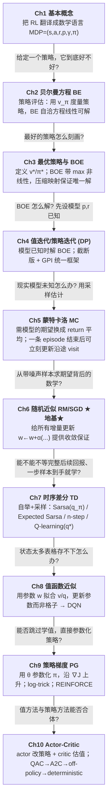
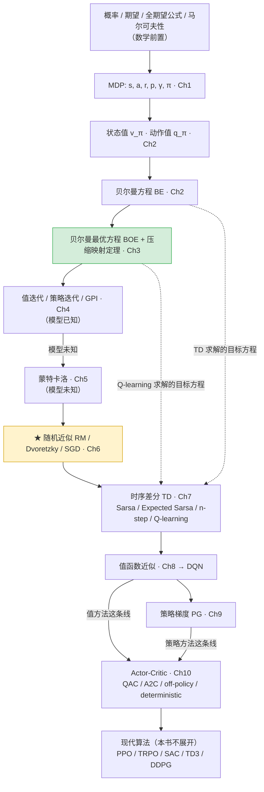

# 00 · 全书地图与问题链（全局综合层）

> 这是**全局层**：把 10 章串成一条线。要看某一章内部怎么展开，点下面的「章节地图」下钻。
> 配套：[01 概念对比表](./01_概念对比表.md) · [02 证明推导索引](./02_证明推导索引.md) · [03 易错点与统一符号表](./03_易错点与统一符号表.md) · [04 二刷问题清单](./04_二刷问题清单.md)

## 章节地图（下钻：每章一张内部结构图）

| 章 | 主题 | 章节地图 | 章笔记 |
|---|---|---|---|
| 1 | 基本概念 / MDP | [ch01 地图](./章节地图/ch01.html) | [笔记](../notes/01_chapter1-basic-concepts.md) |
| 2 | 贝尔曼方程 | [ch02 地图](./章节地图/ch02.html) | [笔记](../notes/02_chapter2-bellman-equation.md) |
| 3 | 最优策略与 BOE | [ch03 地图](./章节地图/ch03.html) | [笔记](../notes/03_chapter3-Optimal%20Policies%20and%20the%20Bellman%20Optimality%20Equation%EF%BC%89.md) |
| 4 | 值迭代 / 策略迭代 | [ch04 地图](./章节地图/ch04.html) | [笔记](../notes/04_chapter4-value-iteration-and-policy-iteration.md) |
| 5 | 蒙特卡洛 | [ch05 地图](./章节地图/ch05.html) | [笔记](../notes/05_chapter5-monte-carlo-methods.md) |
| 6 | 随机近似 ★ | [ch06 地图](./章节地图/ch06.html) | [笔记](../notes/06_chapter6-stochastic-approximation.md) |
| 7 | 时序差分 TD | [ch07 地图](./章节地图/ch07.html) | [笔记](../notes/07_chapter7-temporal-difference-methods.md) |
| 8 | 值函数近似 | [ch08 地图](./章节地图/ch08.html) | [笔记](../notes/08_chapter8-value-function-approximation.md) |
| 9 | 策略梯度 | [ch09 地图](./章节地图/ch09.html) | [笔记](../notes/09_chapter9-policy-gradient-methods.md) |
| 10 | Actor-Critic | [ch10 地图](./章节地图/ch10.html) | [笔记](../notes/10_chapter10-actor-critic-methods.md) |

> 建议读法：先扫这一页的「问题链」建立全局骨架 → 复习某章时点开它的「章节地图」看内部脉络 → 仍卡住再进「章笔记」抠细节。

---

## 一句话主线（全书在做什么）

> **整本书只在解一个问题——求解贝尔曼最优方程 (BOE)，从而拿到最优策略 $\pi^*$。**
> 后面九章都是在「逐步放松假设」，让这个解法能用在越来越现实的场景里。

放松假设的四个维度：

| 维度 | 从 | 到 | 在哪几章 |
|---|---|---|---|
| 模型 | 模型已知 | 模型未知（靠数据） | ch4 → ch5 |
| 数据 | 等该 visit 的完整后续回报 $G_t$ | 一步样本到手就自举更新 | ch5 → ch7 |
| 状态规模 | 表格逐格存 | 函数近似 | ch7 → ch8 |
| 学什么 | 学值再贪心 | 直接参数化策略 → 值与策略合体 | ch8 → ch9 → ch10 |

记住这句话，比记住任何一章的摘要都值钱。

---

## 问题链（为什么章节是这个顺序）

每一章都在回答「上一章遗留的问题」（箭头上的文字 = 上一章留下、本章要回答的问题）。

> **如果某一章学不懂，往上游找。** 例：Q-learning 不懂，问题往往不在 Q-learning 本身，而在 BOE（ch3）或 TD 是随机近似（ch6/ch7）没真懂。

---

## 依赖图（什么是基础、什么是工具、什么是结果）

**★ 地基章提示**：第 6 章随机近似最容易被跳过，但它是 ch7（TD 是 RM 的具体化）、ch8（TD-Linear 收敛）、ch9/ch10（SGD 式参数更新）所有「增量更新公式为什么会收敛」的统一答案。读不顺 ch7 之后的收敛性论证，回头补 ch6。

---

## 两条贯穿全书的暗线

1. **「表格 → 条件概率 → 函数」的三连升级**：转移/奖励/策略先用表格（只能表达确定性），升级成条件概率（覆盖随机性，ch1），最后升级成参数化函数（覆盖大规模，ch8 值、ch9 策略）。
2. **「即时奖励 ≠ 长期回报」**：全书追求的是折扣回报 $G_t$ 的期望，不是单步 $r$。这是 RL 区别于「贪心选最大奖励」的根本（ch1.5/1.6 起反复强调）。

> 各章笔记与章节地图的链接见本页顶部「章节地图」表。
