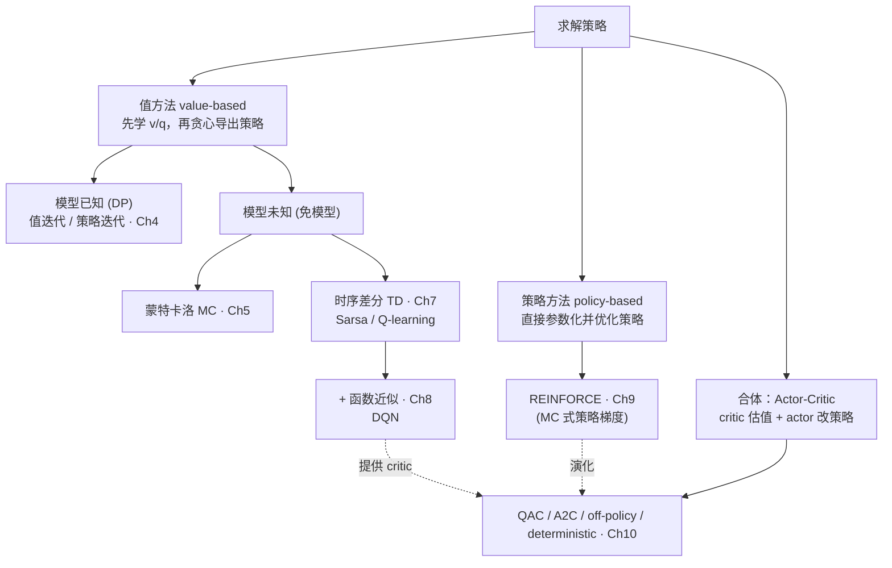

# 01 · 概念对比表

> 全书最容易混淆的概念，集中辨析。每张表统一用：**共同点 / 核心区别 / 适用 / 优缺点 / 典型算法 / 一句话记忆**。
> 入口见 [00 全书地图](./00_全书地图与问题链.md)。

## 算法家族全景（先看这张图定位）

---

## 1. 贝尔曼方程 BE vs 贝尔曼最优方程 BOE （ch2 vs ch3）

| 维度 | 贝尔曼方程 BE | 贝尔曼最优方程 BOE |
|---|---|---|
| 共同点 | 都把价值写成「即时奖励 + 折扣的未来价值」的自洽方程 | 同左 |
| 针对对象 | **给定**一个策略 $\pi$，求它的值 $v_\pi$ | 求**最优**值 $v^*$ 与最优策略 $\pi^*$ |
| 有无 max | 无，对动作按 $\pi$ 求期望 | **有 $\max_a$**，对动作取最优 |
| 线性性 | 线性方程，$(I-\gamma P_\pi)v_\pi=r_\pi$ 可直接求逆 | **非线性**，不能求逆 |
| 解的保证 | 唯一解（$I-\gamma P_\pi$ 可逆） | 压缩映射定理保证唯一解 + 迭代收敛 |
| 解法 | 闭式求逆 / 迭代 | 只能迭代（值迭代就是反复套 BOE 右侧） |
| 一句话记忆 | **评估**一个已知策略 | **寻找**最优策略 |

---

## 2. 值迭代 VI vs 策略迭代 PI vs 截断策略迭代 （ch4 + [04_supplement](../notes/04_supplement-value-iteration-vs-policy-iteration.md)）

| 维度 | 值迭代 VI | 策略迭代 PI | 截断策略迭代 |
|---|---|---|---|
| 共同点 | 都在「评估 ↔ 改进」之间循环求最优策略（GPI 框架） | 同左 | 同左 |
| 策略评估 | 只做**一步** Bellman 更新 | 评估到**收敛**（内层迭代到底） | 评估**有限 j 步**（介于两者间） |
| 是两端点 | GPI 的一个端点（评估走 1 步） | GPI 另一个端点（评估走 ∞ 步） | 中间地带，最实用 |
| 每轮代价 | 低 | 高（内层要跑到收敛） | 可调 |
| 收敛保证 | 压缩映射 → 收敛到 $v^*$ | Lemma 4.1 策略单调改进 → 收敛 | Proposition 4.1 价值仍改进 |
| 一句话记忆 | 评估「浅尝一步」 | 评估「一评到底」 | 评估「评 j 步够用就走」 |

---

## 3. model-based vs model-free （ch4 / ch5）

| 维度 | model-based | model-free |
|---|---|---|
| 共同点 | 目标都是求最优策略 | 同左 |
| 是否需要 $p,r$ | **需要**已知环境模型（转移概率、奖励） | **不需要**，靠与环境交互采样 |
| 核心手段 | 直接算期望（动态规划） | 用样本平均/自举**估计**期望 |
| 代表 | 值迭代、策略迭代（ch4） | MC（ch5）、TD（ch7） |
| 一句话记忆 | 有地图，直接规划 | 没地图，靠试错 |

> ⚠️ 别和 on-policy/off-policy 混（见表 6）：model-based/free 问「要不要模型」，on/off-policy 问「采样策略 = 目标策略吗」。

---

## 4. 蒙特卡洛 MC vs 时序差分 TD vs n-step （ch7 7.5 / 7.3）

target 的「看几步」是一条连续轴：one-step TD → n-step → MC。

| 维度 | 蒙特卡洛 MC | 时序差分 TD（一步） | n-step（中间） |
|---|---|---|---|
| 共同点 | 都从经验样本学，都是同一更新壳 `新=旧+α(target−旧)` | 同左 | 同左 |
| target | 完整回报 $r_{t+1}+\gamma r_{t+2}+\cdots$ | $r_{t+1}+\gamma q_t(s_{t+1},a_{t+1})$ | n 步真实奖励 + 自举 |
| 是否自举 | 否（纯采样） | **是**（用当前估计） | 部分 |
| 何时能更新 | 必须等 episode 结束 | 每步即可，可在线/连续任务 | 等 n 步 |
| 偏差/方差 | 无自举偏差，**方差大** | 有自举偏差，**方差小** | 居中（偏差-方差权衡） |
| 一句话记忆 | 等到终局再算总账 | 走一步就用估计修正 | 折中：看 n 步 |

---

## 5. Sarsa vs Expected Sarsa vs Q-learning （ch7 7.5）

差别**不在看几步**，而在 target 最后一步「下一动作」怎么处理。

| 维度 | Sarsa | Expected Sarsa | Q-learning |
|---|---|---|---|
| 下一动作处理 | 用实际采样动作 $a_{t+1}$ | 按 $\pi(a'\mid s_{t+1})$ 求**期望** | 取 $\max_{a'}$ |
| 学到什么 | 当前策略值 $q_\pi$ | 当前策略值 $q_\pi$ | 最优动作值 $q^*$ |
| 求解的方程 | Bellman equation | Bellman equation | **Bellman optimality equation** |
| on/off-policy | on-policy | on-policy（方差更低） | **off-policy** |
| 同一例数值* | $1+0.9\times2=2.8$ | $1+0.9(0.25\times2+0.75\times8)=6.85$ | $1+0.9\max\{2,8\}=8.2$ |
| 一句话记忆 | 跟着实际走 | 把策略随机性平均掉 | 假设之后都走最优 |

\* 例：$r=1,\gamma=0.9,s'=B$，$q(B,\text{Left})=2,q(B,\text{Right})=8$，$\pi=(0.25,0.75)$，实采到 Left。

---

## 6. on-policy vs off-policy （ch7 + [07_supplement](../notes/07_supplement-on-policy-off-policy.md)）

| 维度 | on-policy | off-policy |
|---|---|---|
| 共同点 | 都有 behavior policy（生成数据）和 target policy（被优化/评估） | 同左 |
| 两策略关系 | behavior = target（边用边学同一个） | behavior ≠ target（用别人/旧数据学目标策略） |
| 探索 | 目标策略本身得探索（如 ε-greedy） | 行为策略负责探索，目标策略可纯贪心 |
| 代表 | Sarsa、MC（ε-greedy） | Q-learning、off-policy AC |
| 数据复用 | 差（策略一变旧数据失效） | 好（可用经验回放、历史数据） |
| 一句话记忆 | 自己下棋自己学 | 看别人下棋也能学 |

> ⚠️ on/off-policy ≠ online/offline。前者问「采样策略是否等于目标策略」，后者问「是否边交互边更新」。Q-learning 是 off-policy，但通常 online 运行。

---

## 7. 表格 vs 函数近似 （ch8 8.6）

| 维度 | 表格表示 | 函数近似 |
|---|---|---|
| 存储 | 每个 $s$（或 $s,a$）一个格子 | 一组参数 $w$，价值 = 函数 $\hat v(s,w)$ |
| 读取价值 | 查表 | 算函数 |
| 更新 | 改一个格子（互不影响） | 改参数（**一改全改**，有泛化） |
| 状态规模 | 只适合小、离散 | 适合大规模 / 连续 |
| 泛化能力 | 无（没见过的状态不会） | 有（相似状态共享参数） |
| 关系 | 是函数近似的**特例**（one-hot 线性近似，见 Box 8.2） | 一般化 |
| 一句话记忆 | 死记每格 | 拟合一条曲线 |

---

## 8. value-based vs policy-based vs actor-critic （ch8 / ch9 / ch10）

| 维度 | value-based | policy-based | actor-critic |
|---|---|---|---|
| 学什么 | 学 $v$/$q$，策略由贪心**导出** | 直接参数化并优化策略 $\pi(\cdot\mid s,\theta)$ | 同时学策略(actor) + 值(critic) |
| 连续动作 | 难（$\max_a$ 不好做） | 自然支持 | 自然支持 |
| 策略形式 | 隐式（贪心于 q） | 显式（可随机/确定） | 显式 actor |
| 代表 | Q-learning、DQN | REINFORCE | QAC、A2C、DDPG |
| 痛点 | 连续动作、策略不平滑 | 方差大、样本效率低 | 两个近似器同时更新的稳定性 |
| 一句话记忆 | 学值再贪心 | 直接调策略 | 一边调策略一边给它打分 |

---

## 9. 随机策略梯度 vs 确定性策略梯度 （ch10 10.4 + [supplement](../notes/10_supplement-policy-gradient-formula-origins.md)）

| 维度 | 随机策略梯度 | 确定性策略梯度 |
|---|---|---|
| 策略形式 | $\pi(a\mid s,\theta)$ 输出概率分布 | $a=\mu(s,\theta)$ 直接输出动作 |
| 给定状态后 | 还要采样 $A\sim\pi$ | 动作已确定 $A=\mu(S)$ |
| 参数改变的是 | 动作的**概率** | 动作**本身** |
| 求导工具 | **log-trick**（score function） | **chain rule**（链式法则） |
| 梯度 | $\mathbb E_{S,A}[\nabla_\theta\ln\pi(A\mid S,\theta)\,q_\pi(S,A)]$ | $\mathbb E_S[\nabla_\theta\mu(S)\,\nabla_a q_\mu(S,a)\rvert_{a=\mu(S)}]$ |
| 关键区别 | 公式里有 $A$（采样动作） | **不能**把随机公式里的 $A$ 直接换成 $\mu(S)$——$\ln\pi$ 项根本不存在 |
| 一句话记忆 | 改「动作被采到的概率」 | 改「输出的动作值」 |

---

## 10. 四种 Actor-Critic 对照 （ch10 10.5）

| 小节 | 算法 | actor 类型 | critic 学什么 | actor 用什么信号 |
|---|---|---|---|---|
| 10.1 | QAC | 随机 $\pi(a\mid s,\theta)$ | $q(s,a,w)$ | 动作价值 $q(s_t,a_t,w_t)$ |
| 10.2 | A2C | 随机 $\pi(a\mid s,\theta)$ | $v(s,w)$ | TD error / advantage $\delta_t$ |
| 10.3 | Off-policy AC | 目标 $\pi$ + 行为 $\beta$ | $v(s,w)$ | $c_t\delta_t$（重要性权重 × TD error） |
| 10.4 | Deterministic AC | 确定性 $\mu(s,\theta)$ | $q(s,a,w)$ | 动作梯度 $\nabla_a q(s,a,w)$ |

> 一句话：**QAC 用价值，A2C 用优势，off-policy AC 加重要性权重，deterministic AC 直接沿动作价值梯度推动作。**
> 现代算法定位：PPO/TRPO（限制策略更新幅度，从随机 PG 出发）、SAC（AC + 熵最大化）、TD3/DDPG（确定性 AC 路线，缓解 critic 过估计）。
